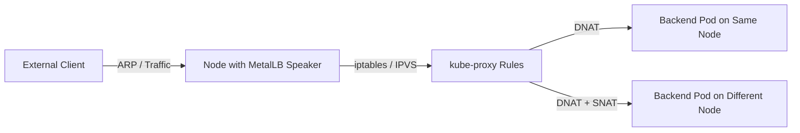
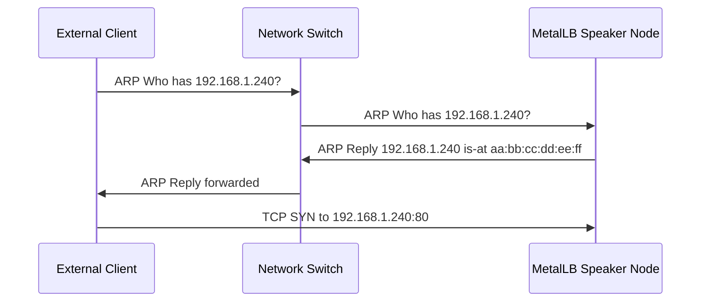
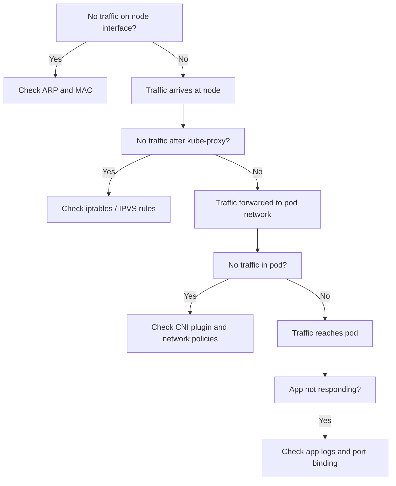

# How to Use tcpdump to Debug MetalLB Traffic Not Reaching Pods

Author: [nawazdhandala](https://www.github.com/nawazdhandala)

Tags: Kubernetes, MetalLB, tcpdump, Debugging, Networking

Description: Learn how to use tcpdump to trace traffic from MetalLB through kube-proxy to backend pods when services are not responding.

---

When a MetalLB LoadBalancer service is not responding, the problem could be anywhere in the packet path. Traffic flows from the external client through the node running the MetalLB speaker, into kube-proxy or IPVS rules, and finally to the backend pod. Using tcpdump at each hop lets you pinpoint exactly where packets are being dropped.

This guide walks you through a systematic approach to tracing packets with tcpdump so you can isolate whether the issue is at the MetalLB layer, the kube-proxy layer, or the pod itself.

## Understanding the Traffic Flow

Before diving into tcpdump commands, it helps to understand the full packet path for MetalLB in Layer 2 mode.



In Layer 2 mode, the MetalLB speaker on one node responds to ARP requests for the LoadBalancer IP. All traffic for that IP arrives at that node. kube-proxy then uses iptables or IPVS rules to forward traffic to one of the backend pods, which might be on a different node entirely.

## Step 1: Identify the Active MetalLB Speaker Node

First, figure out which node is currently handling the LoadBalancer IP. MetalLB assigns one speaker as the leader for each service in Layer 2 mode.

```bash
# List all MetalLB speaker pods and their node assignments
# This helps identify which node is answering ARP for your LB IP
kubectl get pods -n metallb-system \
  -l app=metallb,component=speaker \
  -o wide
```

You can also check the MetalLB speaker logs to see which node won the election:

```bash
# Search speaker logs for the service assignment
# Replace "my-service" with your actual service name
kubectl logs -n metallb-system \
  -l app=metallb,component=speaker \
  --all-containers \
  | grep "my-service"
```

Look for a log line like `"announcing from node"` which tells you which node is the active speaker.

## Step 2: Capture Traffic on the Node Interface

SSH into the node that is the active speaker and run tcpdump on the main network interface. You need to capture traffic destined for the LoadBalancer IP.

```bash
# Capture all traffic to/from the LoadBalancer IP on the main interface
# Replace 192.168.1.240 with your actual LoadBalancer IP
# Replace eth0 with your node's network interface name
sudo tcpdump -i eth0 host 192.168.1.240 -nn -vv

# Explanation of flags:
# -i eth0    : Listen on the specified interface
# -nn        : Do not resolve hostnames or port names
# -vv        : Extra verbose output for detailed packet info
```

If you see incoming SYN packets but no SYN-ACK replies, the problem is downstream of the node interface. If you see no packets at all, the issue is likely at the network or ARP level.

## Step 3: Check ARP Resolution

If no packets are arriving, the upstream router or client might not know the MAC address for the LoadBalancer IP. Verify ARP is working:

```bash
# Check the ARP table on the node for the LoadBalancer IP
# This shows whether the node is correctly advertising its MAC
arp -an | grep "192.168.1.240"

# Capture ARP traffic specifically to see if requests and replies are flowing
sudo tcpdump -i eth0 arp -nn \
  | grep "192.168.1.240"
```



## Step 4: Trace Through kube-proxy with iptables

Once you confirm packets are arriving at the node, check whether kube-proxy iptables rules are processing them correctly.

```bash
# List the iptables NAT rules for the service
# This shows how kube-proxy routes traffic to backend pods
sudo iptables -t nat -L KUBE-SERVICES -n \
  | grep "192.168.1.240"

# Follow the chain to see the actual DNAT targets
# Replace KUBE-SVC-XXXXX with the chain name from the previous command
sudo iptables -t nat -L KUBE-SVC-XXXXX -n -v
```

If you are using IPVS mode instead of iptables, check the virtual server table:

```bash
# List IPVS virtual servers and their real server backends
# This is the equivalent of iptables chains for IPVS mode
sudo ipvsadm -Ln | grep -A 5 "192.168.1.240"
```

## Step 5: Capture Traffic on the Pod Network

Now capture traffic on the pod's virtual ethernet interface to see if packets are reaching the pod.

```bash
# Find the pod's IP address first
# This gives you the target IP to filter on in tcpdump
kubectl get pod my-app-pod -o wide

# Capture traffic on the cbr0 or cni0 bridge interface
# This bridge connects pod veth interfaces to the node network
sudo tcpdump -i cni0 host 10.244.1.15 -nn

# Alternatively capture on all interfaces to find where packets appear
# The -e flag shows link-layer (MAC) addresses which helps trace the path
sudo tcpdump -i any host 10.244.1.15 -nn -e
```

## Step 6: Capture Inside the Pod

If packets are reaching the pod network but the application is not responding, capture traffic inside the pod itself using an ephemeral debug container:

```bash
# Attach an ephemeral container with tcpdump to the target pod
# The --target flag shares the network namespace with the app container
kubectl debug -it my-app-pod \
  --image=nicolaka/netshoot \
  --target=my-app-container \
  -- tcpdump -i eth0 port 80 -nn -vv
```



## Step 7: Write Packets to a File for Analysis

Sometimes you need to capture packets for offline analysis in Wireshark. Write the capture to a pcap file:

```bash
# Capture 1000 packets to a file for later analysis
# The -w flag writes raw packets instead of printing them
# The -c flag limits the capture to 1000 packets
sudo tcpdump -i eth0 host 192.168.1.240 \
  -nn -w /tmp/metallb-debug.pcap -c 1000

# Copy the pcap file to your local machine for Wireshark analysis
# Use scp or kubectl cp depending on where you ran the capture
scp node1:/tmp/metallb-debug.pcap ./metallb-debug.pcap
```

## Step 8: Check for Conntrack Issues

Sometimes the Linux connection tracking table causes problems, especially with UDP or when conntrack entries become stale.

```bash
# List conntrack entries for the LoadBalancer IP
# Stale entries can cause traffic to be sent to pods that no longer exist
sudo conntrack -L -d 192.168.1.240

# Flush conntrack entries for the LoadBalancer IP to force new connections
# WARNING: This will briefly interrupt existing connections
sudo conntrack -D -d 192.168.1.240
```

## Common Pitfalls

Here are the most frequent causes of MetalLB traffic not reaching pods:

1. **Firewall rules** on the node blocking traffic on the service port. Check with `iptables -L INPUT -n`.
2. **NetworkPolicy** resources in Kubernetes blocking ingress to the pod. Check with `kubectl get networkpolicy -A`.
3. **Wrong externalTrafficPolicy** setting. When set to `Local`, traffic only goes to pods on the same node as the speaker.
4. **CNI plugin issues** where the pod network overlay is not routing correctly between nodes.
5. **MTU mismatches** between the node interface and the pod network causing large packets to be silently dropped.

```bash
# Quick health check script for MetalLB traffic debugging
# Run this on the active speaker node to verify each layer

# Check 1: Verify the LoadBalancer IP is assigned
echo "=== LoadBalancer IP Assignment ==="
kubectl get svc -A | grep LoadBalancer

# Check 2: Verify endpoints exist for the service
echo "=== Service Endpoints ==="
kubectl get endpoints my-service

# Check 3: Verify the speaker pod is running on this node
echo "=== Speaker Pod Status ==="
kubectl get pods -n metallb-system -l component=speaker -o wide

# Check 4: Check for network policies that might block traffic
echo "=== Network Policies ==="
kubectl get networkpolicy -A
```

## Conclusion

Debugging MetalLB traffic issues requires a systematic approach. Start at the node interface and work your way inward through kube-proxy rules to the pod network. tcpdump is an invaluable tool at each layer because it shows you exactly what packets are present and what is missing.

The key insight is to capture at multiple points simultaneously. Run tcpdump on the node interface in one terminal and on the pod network in another. If packets appear on the node but not on the pod network, you know the problem is in kube-proxy rules or network policy enforcement.

If you are running MetalLB in production, consider using [OneUptime](https://oneuptime.com) to monitor your Kubernetes services and get alerted when LoadBalancer endpoints stop responding. OneUptime can probe your services from external locations, giving you the same perspective as your end users, and alert you before traffic issues escalate.
