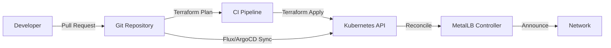
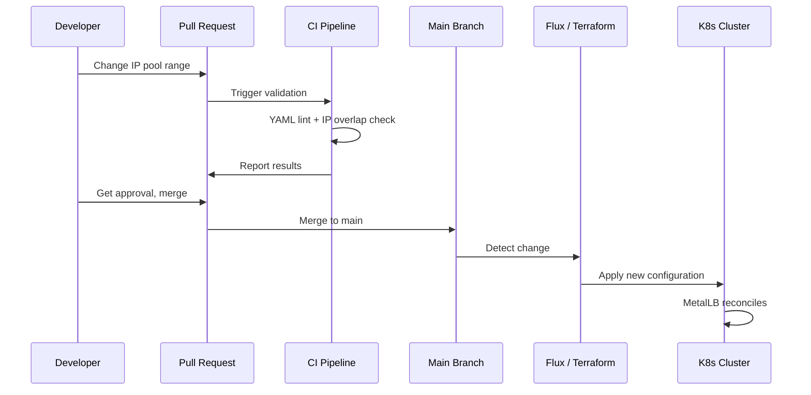

# How to Manage MetalLB Configuration with Terraform and GitOps

Author: [nawazdhandala](https://www.github.com/nawazdhandala)

Tags: Kubernetes, MetalLB, Terraform, GitOps, Infrastructure as Code

Description: Learn how to manage MetalLB IP pools, peers, and advertisements using Terraform and GitOps workflows for reproducible infrastructure.

---

## Why Infrastructure as Code for MetalLB?

Manually applying MetalLB YAML files with kubectl works for small setups, but it does not scale. When you manage MetalLB across multiple clusters, environments (dev, staging, production), and teams, you need:

- Version-controlled configuration
- Peer review for IP pool changes
- Automated drift detection
- Reproducible deployments
- Audit trails for compliance

Terraform and GitOps (via Flux or ArgoCD) provide these capabilities. This post shows how to use both.

## Architecture Overview



## Part 1: Managing MetalLB with Terraform

### Provider Setup

Use the Kubernetes provider to manage MetalLB CRDs as native Terraform resources:

```hcl
# providers.tf
# Configure the Kubernetes provider to talk to your cluster
terraform {
  required_version = ">= 1.5.0"

  required_providers {
    kubernetes = {
      source  = "hashicorp/kubernetes"
      version = "~> 2.30"
    }
    helm = {
      source  = "hashicorp/helm"
      version = "~> 2.14"
    }
  }

  # Store state remotely for team collaboration
  backend "s3" {
    bucket = "infra-terraform-state"
    key    = "metallb/terraform.tfstate"
    region = "us-east-1"
  }
}

provider "kubernetes" {
  # Uses kubeconfig from environment or explicit path
  config_path = var.kubeconfig_path
}

provider "helm" {
  kubernetes {
    config_path = var.kubeconfig_path
  }
}
```

### Install MetalLB via Helm

```hcl
# metallb-install.tf
# Install MetalLB using the official Helm chart
resource "helm_release" "metallb" {
  name       = "metallb"
  repository = "https://metallb.github.io/metallb"
  chart      = "metallb"
  version    = "0.14.9"
  namespace  = "metallb-system"

  # Create the namespace if it does not exist
  create_namespace = true

  # Wait for all pods to be ready before continuing
  wait = true
  timeout = 300

  set {
    name  = "speaker.frr.enabled"
    value = "true"
  }
}
```

### Define IP Address Pools

```hcl
# ip-pools.tf
# Define MetalLB IP pools as Terraform resources
# This gives us state tracking and drift detection

resource "kubernetes_manifest" "web_pool" {
  manifest = {
    apiVersion = "metallb.io/v1beta1"
    kind       = "IPAddressPool"
    metadata = {
      name      = "web-pool"
      namespace = "metallb-system"
      labels = {
        "managed-by" = "terraform"
        "tier"       = "web"
      }
    }
    spec = {
      addresses = var.web_pool_addresses
      autoAssign = false
    }
  }

  # Ensure MetalLB is installed before creating pools
  depends_on = [helm_release.metallb]
}

resource "kubernetes_manifest" "internal_pool" {
  manifest = {
    apiVersion = "metallb.io/v1beta1"
    kind       = "IPAddressPool"
    metadata = {
      name      = "internal-pool"
      namespace = "metallb-system"
      labels = {
        "managed-by" = "terraform"
        "tier"       = "internal"
      }
    }
    spec = {
      addresses = var.internal_pool_addresses
      autoAssign = true
    }
  }

  depends_on = [helm_release.metallb]
}
```

### Define Variables for Per-Environment Configuration

```hcl
# variables.tf
# Variables allow different IP ranges per environment

variable "kubeconfig_path" {
  description = "Path to the kubeconfig file"
  type        = string
  default     = "~/.kube/config"
}

variable "web_pool_addresses" {
  description = "IP ranges for the web-facing pool"
  type        = list(string)
}

variable "internal_pool_addresses" {
  description = "IP ranges for the internal services pool"
  type        = list(string)
}

variable "bgp_peer_address" {
  description = "IP address of the upstream BGP router"
  type        = string
  default     = ""
}

variable "bgp_my_asn" {
  description = "ASN for the MetalLB speakers"
  type        = number
  default     = 64501
}

variable "bgp_peer_asn" {
  description = "ASN of the upstream router"
  type        = number
  default     = 64500
}
```

### Environment-Specific tfvars

```hcl
# envs/production.tfvars
# Production environment IP allocations
web_pool_addresses      = ["203.0.113.10-203.0.113.50"]
internal_pool_addresses = ["10.100.0.1-10.100.0.200"]
bgp_peer_address        = "10.0.0.1"
bgp_my_asn              = 64501
bgp_peer_asn            = 64500
```

```hcl
# envs/staging.tfvars
# Staging environment - smaller ranges, different subnet
web_pool_addresses      = ["10.200.1.10-10.200.1.30"]
internal_pool_addresses = ["10.200.2.1-10.200.2.50"]
bgp_peer_address        = "10.200.0.1"
bgp_my_asn              = 64502
bgp_peer_asn            = 64500
```

### Configure BGP Peers with Terraform

```hcl
# bgp.tf
# Configure BGP peering when a peer address is provided

resource "kubernetes_manifest" "bgp_peer" {
  count = var.bgp_peer_address != "" ? 1 : 0

  manifest = {
    apiVersion = "metallb.io/v1beta2"
    kind       = "BGPPeer"
    metadata = {
      name      = "upstream-router"
      namespace = "metallb-system"
    }
    spec = {
      myASN       = var.bgp_my_asn
      peerASN     = var.bgp_peer_asn
      peerAddress = var.bgp_peer_address
      holdTime    = "90s"
      keepaliveTime = "30s"
    }
  }

  depends_on = [helm_release.metallb]
}

resource "kubernetes_manifest" "bgp_advertisement" {
  count = var.bgp_peer_address != "" ? 1 : 0

  manifest = {
    apiVersion = "metallb.io/v1beta1"
    kind       = "BGPAdvertisement"
    metadata = {
      name      = "default-bgp"
      namespace = "metallb-system"
    }
    spec = {
      ipAddressPools = [
        "web-pool",
        "internal-pool"
      ]
    }
  }

  depends_on = [
    kubernetes_manifest.web_pool,
    kubernetes_manifest.internal_pool,
  ]
}
```

### Apply with Terraform

```bash
# Initialize Terraform with backend configuration
terraform init

# Plan changes for production
terraform plan -var-file=envs/production.tfvars -out=plan.out

# Review the plan, then apply
terraform apply plan.out
```

## Part 2: Managing MetalLB with GitOps (Flux)

### Repository Structure

```
infrastructure/
  clusters/
    production/
      metallb/
        kustomization.yaml
        namespace.yaml
        helmrelease.yaml
        ip-pools.yaml
        bgp-peers.yaml
    staging/
      metallb/
        kustomization.yaml
        namespace.yaml
        helmrelease.yaml
        ip-pools.yaml
```

### Flux HelmRelease

```yaml
# clusters/production/metallb/helmrelease.yaml
# Flux will install and reconcile MetalLB automatically
apiVersion: helm.toolkit.fluxcd.io/v2
kind: HelmRelease
metadata:
  name: metallb
  namespace: metallb-system
spec:
  interval: 10m
  chart:
    spec:
      chart: metallb
      version: "0.14.9"
      sourceRef:
        kind: HelmRepository
        name: metallb
        namespace: flux-system
  values:
    speaker:
      frr:
        enabled: true
```

### Flux Kustomization

```yaml
# clusters/production/metallb/kustomization.yaml
# Ensures resources are applied in the correct order
apiVersion: kustomize.toolkit.fluxcd.io/v1
kind: Kustomization
metadata:
  name: metallb-config
  namespace: flux-system
spec:
  interval: 5m
  path: ./clusters/production/metallb
  prune: true
  sourceRef:
    kind: GitRepository
    name: infrastructure
  # Wait for MetalLB CRDs to be available
  dependsOn:
    - name: metallb
  healthChecks:
    - apiVersion: apps/v1
      kind: DaemonSet
      name: metallb-speaker
      namespace: metallb-system
```

## CI Pipeline for Validation

```yaml
# .github/workflows/metallb-validate.yaml
# Validates MetalLB configuration on every pull request
name: Validate MetalLB Config
on:
  pull_request:
    paths:
      - "clusters/**/metallb/**"
      - "envs/*.tfvars"

jobs:
  validate:
    runs-on: ubuntu-latest
    steps:
      - uses: actions/checkout@v4

      - name: Validate YAML syntax
        run: |
          # Check all MetalLB YAML files for syntax errors
          find clusters/ -name "*.yaml" -exec yamllint -d relaxed {} \;

      - name: Check for IP range overlaps
        run: |
          # Run the overlap detection script
          python3 scripts/validate_ip_ranges.py

      - name: Terraform Plan
        run: |
          terraform init
          terraform plan -var-file=envs/production.tfvars -no-color
```

## Workflow Diagram



## Summary

Managing MetalLB with Terraform gives you state tracking, plan/apply workflows, and per-environment variable files. Managing it with GitOps (Flux or ArgoCD) gives you continuous reconciliation, drift detection, and Git-based audit trails. You can even combine both: use Terraform for the initial setup and Flux for ongoing reconciliation.

To monitor your MetalLB-managed services and get alerted when IPs become unreachable or pools run low, [OneUptime](https://oneuptime.com) integrates with Kubernetes and provides infrastructure monitoring, incident management, and status pages out of the box.
