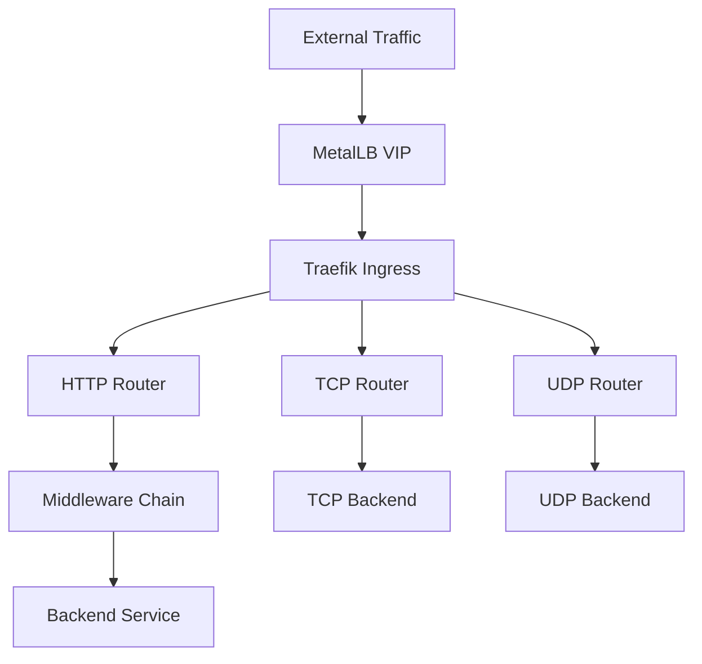
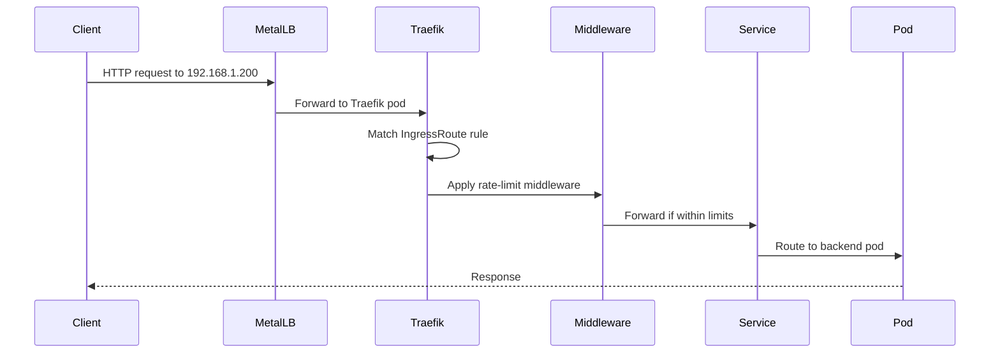

# How to Use MetalLB with Traefik Ingress Controller

Author: [nawazdhandala](https://www.github.com/nawazdhandala)

Tags: Kubernetes, MetalLB, Traefik, Ingress, Load Balancing

Description: Learn how to deploy MetalLB with Traefik Ingress Controller for a lightweight bare-metal ingress solution.

---

Traefik is a popular cloud-native ingress controller known for its automatic service discovery, middleware support, and lightweight footprint. On bare-metal Kubernetes, Traefik needs MetalLB to provide an external IP for its LoadBalancer service.

This guide walks you through deploying MetalLB with Traefik for a production-ready bare-metal ingress stack.

## Why Traefik with MetalLB

Traefik offers several advantages as an ingress controller:

- Automatic Let's Encrypt certificate management built in
- Rich middleware ecosystem (rate limiting, circuit breakers, headers)
- Dashboard for visualizing routes and services
- Support for TCP, UDP, and gRPC in addition to HTTP
- Native integration with Kubernetes Ingress and its own IngressRoute CRD



## Prerequisites

- A Kubernetes cluster (bare metal)
- MetalLB installed and configured with an IP address pool
- Helm 3 installed
- kubectl configured for your cluster

## Step 1: Install MetalLB

If MetalLB is not already installed, set it up:

```bash
# Install MetalLB
kubectl apply -f https://raw.githubusercontent.com/metallb/metallb/v0.14.9/config/manifests/metallb-native.yaml

# Wait for readiness
kubectl wait --namespace metallb-system \
  --for=condition=ready pod \
  --selector=app=metallb \
  --timeout=120s
```

Configure an IP pool:

```yaml
# metallb-pool.yaml
# Define the IP range MetalLB can assign to LoadBalancer services.
apiVersion: metallb.io/v1beta1
kind: IPAddressPool
metadata:
  name: traefik-pool
  namespace: metallb-system
spec:
  addresses:
    - 192.168.1.200-192.168.1.210
---
apiVersion: metallb.io/v1beta1
kind: L2Advertisement
metadata:
  name: traefik-l2
  namespace: metallb-system
spec:
  ipAddressPools:
    - traefik-pool
```

```bash
kubectl apply -f metallb-pool.yaml
```

## Step 2: Install Traefik via Helm

```bash
# Add the Traefik Helm repository
helm repo add traefik https://traefik.github.io/charts
helm repo update

# Install Traefik with MetalLB-compatible settings
helm install traefik traefik/traefik \
  --namespace traefik \
  --create-namespace \
  --set service.type=LoadBalancer \
  --set service.spec.externalTrafficPolicy=Local \
  --set ports.web.port=8000 \
  --set ports.web.exposedPort=80 \
  --set ports.websecure.port=8443 \
  --set ports.websecure.exposedPort=443 \
  --set metrics.prometheus.enabled=true \
  --set dashboard.enabled=true
```

## Step 3: Verify Traefik Received a MetalLB IP

```bash
# Check that MetalLB assigned an external IP
kubectl get svc -n traefik

# Expected output:
# NAME      TYPE           CLUSTER-IP     EXTERNAL-IP     PORT(S)
# traefik   LoadBalancer   10.43.50.100   192.168.1.200   80:30080/TCP,443:30443/TCP

# Test connectivity
curl -v http://192.168.1.200
```

## Step 4: Deploy an Application with IngressRoute

Traefik supports the standard Kubernetes Ingress resource, but its own IngressRoute CRD provides more flexibility:

```yaml
# app-deployment.yaml
# Deploy a sample application behind Traefik.
apiVersion: apps/v1
kind: Deployment
metadata:
  name: whoami
  namespace: default
spec:
  replicas: 3
  selector:
    matchLabels:
      app: whoami
  template:
    metadata:
      labels:
        app: whoami
    spec:
      containers:
        - name: whoami
          # This container responds with request details
          image: traefik/whoami
          ports:
            - containerPort: 80
---
apiVersion: v1
kind: Service
metadata:
  name: whoami
  namespace: default
spec:
  selector:
    app: whoami
  ports:
    - port: 80
      targetPort: 80
---
# Traefik IngressRoute with middleware
apiVersion: traefik.io/v1alpha1
kind: IngressRoute
metadata:
  name: whoami-route
  namespace: default
spec:
  entryPoints:
    # Listen on the web (HTTP) entrypoint
    - web
  routes:
    - match: Host(`whoami.example.com`)
      kind: Rule
      services:
        - name: whoami
          port: 80
      middlewares:
        # Apply rate limiting middleware
        - name: rate-limit
```

## Step 5: Add Middleware

Traefik middlewares let you add processing to requests before they reach your backend:

```yaml
# middleware.yaml
# Rate limiting middleware to protect backend services.
apiVersion: traefik.io/v1alpha1
kind: Middleware
metadata:
  name: rate-limit
  namespace: default
spec:
  rateLimit:
    # Allow an average of 100 requests per second
    average: 100
    # Allow bursts of up to 200 requests
    burst: 200
---
# Headers middleware for security headers
apiVersion: traefik.io/v1alpha1
kind: Middleware
metadata:
  name: security-headers
  namespace: default
spec:
  headers:
    # Add security headers to all responses
    frameDeny: true
    contentTypeNosniff: true
    browserXssFilter: true
    stsSeconds: 31536000
    stsIncludeSubdomains: true
```

Apply the resources:

```bash
# Deploy the application and middleware
kubectl apply -f app-deployment.yaml
kubectl apply -f middleware.yaml

# Test the route
curl -H "Host: whoami.example.com" http://192.168.1.200
```

## Traffic Flow



## TLS with Traefik's Built-in ACME

Traefik has built-in support for Let's Encrypt. You can configure it without needing cert-manager:

```yaml
# traefik-values.yaml
# Helm values to enable automatic TLS with Let's Encrypt.
additionalArguments:
  # Enable ACME (Let's Encrypt) certificate resolver
  - "--certificatesresolvers.letsencrypt.acme.email=admin@example.com"
  - "--certificatesresolvers.letsencrypt.acme.storage=/data/acme.json"
  - "--certificatesresolvers.letsencrypt.acme.httpchallenge.entrypoint=web"

persistence:
  # Enable persistence for storing ACME certificates
  enabled: true
  size: 128Mi
  path: /data
```

Then reference the resolver in your IngressRoute:

```yaml
# ingressroute-tls.yaml
# IngressRoute with automatic TLS certificate provisioning.
apiVersion: traefik.io/v1alpha1
kind: IngressRoute
metadata:
  name: whoami-secure
  namespace: default
spec:
  entryPoints:
    - websecure
  routes:
    - match: Host(`whoami.example.com`)
      kind: Rule
      services:
        - name: whoami
          port: 80
  tls:
    # Use the Let's Encrypt certificate resolver
    certResolver: letsencrypt
```

## Accessing the Traefik Dashboard

Traefik includes a built-in dashboard for visualizing your routes and services:

```bash
# Port-forward to the Traefik dashboard
kubectl port-forward -n traefik svc/traefik 9000:9000

# Open http://localhost:9000/dashboard/ in your browser
```

The dashboard shows:

- Active routers and their match rules
- Services and their health status
- Middleware chains applied to each route
- Entry points and their listeners

## Monitoring Traefik Metrics

Traefik exposes Prometheus metrics that you can scrape:

```yaml
# servicemonitor-traefik.yaml
# Scrape Traefik metrics with Prometheus.
apiVersion: monitoring.coreos.com/v1
kind: ServiceMonitor
metadata:
  name: traefik
  namespace: traefik
spec:
  selector:
    matchLabels:
      app.kubernetes.io/name: traefik
  endpoints:
    - port: metrics
      interval: 15s
      path: /metrics
```

Key metrics to watch:

- `traefik_entrypoint_requests_total` - Total requests per entrypoint
- `traefik_service_request_duration_seconds` - Backend response time
- `traefik_entrypoint_open_connections` - Current open connections

## Troubleshooting

1. **No external IP assigned** - Verify MetalLB is running and the IP pool has available addresses
2. **404 on all requests** - Check that IngressRoute rules match the Host header you are sending
3. **TLS certificate errors** - Ensure port 80 is reachable for HTTP-01 challenges
4. **Dashboard not accessible** - Verify the dashboard is enabled in the Helm values

## Summary

MetalLB and Traefik together provide a lightweight, feature-rich ingress stack for bare-metal Kubernetes. Traefik's automatic service discovery, middleware system, and built-in Let's Encrypt support make it an excellent choice when you want minimal configuration overhead.

To monitor the availability and performance of services exposed through your MetalLB and Traefik stack, use [OneUptime](https://oneuptime.com). OneUptime provides HTTP monitoring, TLS certificate tracking, and incident management in a single platform, giving you full visibility into your bare-metal ingress layer.
