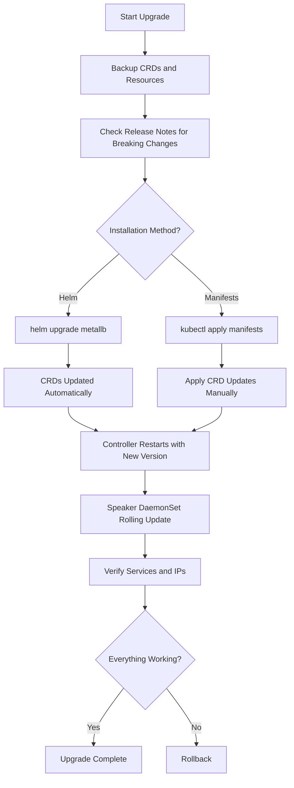
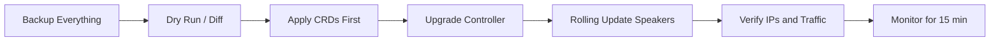

# How to Upgrade MetalLB to a New Version Without Downtime

Author: [nawazdhandala](https://www.github.com/nawazdhandala)

Tags: Kubernetes, MetalLB, Upgrade, Zero Downtime, Load Balancing

Description: A practical guide to upgrading MetalLB to a new version without disrupting active services. Learn the upgrade process for Helm and manifest-based installations, pre-upgrade checks, and rollback strategies.

---

MetalLB is one of those things that just sits quietly in your cluster doing its job. You configure it once, forget about it, and it keeps handing out IPs to your LoadBalancer services. But eventually you need to upgrade it - maybe for a bug fix, a new feature, or just to stay current. The tricky part is doing that without knocking out services that are actively receiving traffic.

This guide walks through the full upgrade process for MetalLB, covering both Helm-based and manifest-based installations. We will go step by step - from pre-upgrade checks to verification and rollback if things go sideways.

## How MetalLB Handles Upgrades Internally

Before diving into the commands, it helps to understand what actually happens during an upgrade. MetalLB runs as a DaemonSet (the speaker component) and a Deployment (the controller). When you apply a new version, Kubernetes rolls out new pods gradually. The key insight is that MetalLB's IP allocations are stored in Custom Resources (IPAddressPool, L2Advertisement, etc.), not in the pods themselves. So even when pods restart, the configuration persists.

Here is a simplified view of the upgrade flow:



The speaker pods are the ones that actually announce IP addresses via ARP (in Layer 2 mode) or BGP. During a rolling update, only one speaker pod restarts at a time. Since ARP/BGP announcements from other nodes continue, traffic keeps flowing. There might be a brief failover on the specific node being updated, but clients generally do not notice.

## Pre-Upgrade Checklist

Do not skip this part. A few minutes of preparation can save you hours of debugging.

### 1. Check Your Current MetalLB Version

First, figure out what you are running right now.

```bash
# Check the current MetalLB controller version
kubectl get deployment -n metallb-system controller -o jsonpath='{.spec.template.spec.containers[0].image}'
```

```bash
# Check the speaker DaemonSet version as well
kubectl get daemonset -n metallb-system speaker -o jsonpath='{.spec.template.spec.containers[0].image}'
```

Both should show the same version. If they do not, something went wrong in a previous upgrade and you should fix that first.

### 2. Read the Release Notes

This sounds obvious, but people skip it all the time. Go to the [MetalLB releases page](https://github.com/metallb/metallb/releases) and read through every release between your current version and the target version. Look specifically for:

- Breaking changes in CRD schemas
- Deprecated fields that got removed
- Changes to default behavior
- Required manual migration steps

### 3. Backup Your MetalLB Resources

Back up everything. CRDs, custom resources, the whole thing.

```bash
# Export all MetalLB CRDs
kubectl get crds | grep metallb | awk '{print $1}' | xargs -I {} kubectl get crd {} -o yaml > metallb-crds-backup.yaml

# Export all MetalLB custom resources (IPAddressPool, L2Advertisement, BGPPeer, etc.)
kubectl get ipaddresspools.metallb.io -n metallb-system -o yaml > ipaddresspools-backup.yaml
kubectl get l2advertisements.metallb.io -n metallb-system -o yaml > l2advertisements-backup.yaml
kubectl get bgppeers.metallb.io -n metallb-system -o yaml > bgppeers-backup.yaml 2>/dev/null || echo "No BGP peers found"
kubectl get bgpadvertisements.metallb.io -n metallb-system -o yaml > bgpadvertisements-backup.yaml 2>/dev/null || echo "No BGP advertisements found"
kubectl get communities.metallb.io -n metallb-system -o yaml > communities-backup.yaml 2>/dev/null || echo "No communities found"
```

### 4. Record Current Service IPs

You will need this to verify nothing changed after the upgrade.

```bash
# Save the current state of all LoadBalancer services and their external IPs
kubectl get svc --all-namespaces -o wide | grep LoadBalancer > lb-services-before-upgrade.txt

# Take a look at what you captured
cat lb-services-before-upgrade.txt
```

### 5. Verify Cluster Health

Make sure your cluster is in a good state before you start making changes.

```bash
# All nodes should be Ready
kubectl get nodes

# All MetalLB pods should be Running
kubectl get pods -n metallb-system

# Check for any existing issues with MetalLB
kubectl logs -n metallb-system deployment/controller --tail=20
```

## Upgrading via Helm

If you installed MetalLB with Helm, this is the cleanest upgrade path. Helm handles CRD updates (depending on your version) and manages the rollout for you.

### Update the Helm Repository

```bash
# Pull the latest chart information from the MetalLB repo
helm repo update
```

### Check Available Versions

```bash
# See what versions are available
helm search repo metallb/metallb --versions | head -20
```

### Dry Run First

Always do a dry run before the real upgrade. This shows you exactly what will change without touching anything.

```bash
# Preview what the upgrade will do - no changes applied
helm upgrade metallb metallb/metallb \
  --namespace metallb-system \
  --dry-run \
  --debug \
  2>&1 | head -100
```

Look through the output carefully. Pay attention to any resource changes, especially around CRDs and RBAC rules.

### Perform the Upgrade

```bash
# Upgrade MetalLB to the latest version
# --wait ensures Helm waits for all pods to be ready before reporting success
# --timeout gives pods enough time to start up
helm upgrade metallb metallb/metallb \
  --namespace metallb-system \
  --wait \
  --timeout 5m
```

If you want a specific version instead of latest:

```bash
# Pin to a specific version for reproducibility
helm upgrade metallb metallb/metallb \
  --namespace metallb-system \
  --version 0.14.9 \
  --wait \
  --timeout 5m
```

### Helm and CRDs - the Gotcha

Here is something that trips people up: Helm does not upgrade CRDs by default after the initial install. Starting with Helm 3, CRDs in the `crds/` directory of a chart are only installed, never upgraded or deleted. If the new MetalLB version ships updated CRDs, you may need to apply them manually.

```bash
# Download the chart to inspect CRD changes
helm pull metallb/metallb --version 0.14.9 --untar

# Apply the updated CRDs manually
kubectl apply -f metallb/crds/
```

After applying CRD updates, re-run the Helm upgrade command so the controller picks up the changes.

## Upgrading via Manifests

If you installed MetalLB using raw manifests (the `kubectl apply` approach), the upgrade process is a bit more hands-on.

### Download the New Manifests

```bash
# Set your target version
export METALLB_VERSION="v0.14.9"

# Download the manifest for the target version
curl -sL "https://raw.githubusercontent.com/metallb/metallb/${METALLB_VERSION}/config/manifests/metallb-native.yaml" -o metallb-native-${METALLB_VERSION}.yaml
```

### Compare Old and New Manifests

Before applying anything, see what changed.

```bash
# Diff the new manifest against what is currently running
# This helps you spot any namespace changes, new RBAC rules, or removed resources
diff <(kubectl get -n metallb-system deploy,daemonset,sa,clusterrole,clusterrolebinding -o yaml) \
     metallb-native-${METALLB_VERSION}.yaml || true
```

### Apply CRDs First

When upgrading via manifests, always apply CRDs before the main resources. The controller needs the new CRD definitions to start properly.

```bash
# Download and apply CRDs separately
curl -sL "https://raw.githubusercontent.com/metallb/metallb/${METALLB_VERSION}/config/crd/bases/" -o /dev/null

# Or extract CRDs from the manifest and apply them
# The CRD manifest is usually separate
kubectl apply -f "https://raw.githubusercontent.com/metallb/metallb/${METALLB_VERSION}/config/manifests/metallb-native.yaml" \
  --server-side \
  --force-conflicts
```

The `--server-side` flag with `--force-conflicts` is important here. It tells Kubernetes to use server-side apply, which handles field ownership conflicts that can pop up when CRD schemas change between versions.

### Apply the Full Manifest

```bash
# Apply the complete MetalLB manifest
kubectl apply -f metallb-native-${METALLB_VERSION}.yaml
```

### Watch the Rollout

```bash
# Watch the controller deployment roll out
kubectl rollout status deployment/controller -n metallb-system --timeout=120s

# Watch the speaker DaemonSet roll out
kubectl rollout status daemonset/speaker -n metallb-system --timeout=120s
```

## Post-Upgrade Verification

This is the most important step. Do not walk away until you have confirmed everything is working.

### Verify Pod Versions

```bash
# Confirm all MetalLB pods are running the new version
kubectl get pods -n metallb-system -o custom-columns=\
"NAME:.metadata.name,IMAGE:.spec.containers[0].image,STATUS:.status.phase,RESTARTS:.status.containerStatuses[0].restartCount"
```

### Verify Service IPs Are Unchanged

```bash
# Get current LoadBalancer service IPs
kubectl get svc --all-namespaces -o wide | grep LoadBalancer > lb-services-after-upgrade.txt

# Compare with the pre-upgrade snapshot
diff lb-services-before-upgrade.txt lb-services-after-upgrade.txt
```

If the diff shows no changes, your IPs survived the upgrade. If something changed, check the controller logs immediately.

### Check MetalLB Custom Resources

```bash
# Make sure all your IP pools are still there
kubectl get ipaddresspools.metallb.io -n metallb-system

# Verify L2 advertisements are intact
kubectl get l2advertisements.metallb.io -n metallb-system

# Check BGP peers if you use BGP mode
kubectl get bgppeers.metallb.io -n metallb-system 2>/dev/null
```

### Test Connectivity

Do not just look at the resources - actually test that traffic flows.

```bash
# Pick one of your LoadBalancer services and curl it
# Replace with your actual service IP and port
export SVC_IP=$(kubectl get svc my-service -n my-namespace -o jsonpath='{.status.loadBalancer.ingress[0].ip}')
curl -s -o /dev/null -w "HTTP Status: %{http_code}\n" http://${SVC_IP}
```

### Check Controller Logs

```bash
# Look for errors or warnings in the controller logs
kubectl logs -n metallb-system deployment/controller --since=10m | grep -i -E "error|warn|fail"

# Check speaker logs on each node
kubectl logs -n metallb-system daemonset/speaker --since=10m | grep -i -E "error|warn|fail"
```

## Rollback Procedure

If something goes wrong, do not panic. Here is how to get back to a working state.

### Rollback with Helm

Helm keeps a history of releases, which makes rollback straightforward.

```bash
# See the release history
helm history metallb -n metallb-system

# Roll back to the previous revision
helm rollback metallb -n metallb-system

# Or roll back to a specific revision number
helm rollback metallb 3 -n metallb-system
```

### Rollback with Manifests

For manifest-based installs, you need to reapply the old version manually.

```bash
# Set your previous working version
export METALLB_OLD_VERSION="v0.14.8"

# Download and apply the old manifest
curl -sL "https://raw.githubusercontent.com/metallb/metallb/${METALLB_OLD_VERSION}/config/manifests/metallb-native.yaml" \
  | kubectl apply -f -
```

### Restore CRDs If Needed

If CRD changes caused issues and rollback did not fix them, restore from your backup.

```bash
# Restore the CRDs from backup (use with caution)
kubectl apply -f metallb-crds-backup.yaml --server-side --force-conflicts

# Restore custom resources
kubectl apply -f ipaddresspools-backup.yaml
kubectl apply -f l2advertisements-backup.yaml
```

### Nuclear Option - Full Reinstall

If nothing else works, you can do a clean reinstall. This will cause a brief outage, but it gets you to a known good state.

```bash
# Delete MetalLB completely
kubectl delete -f metallb-native-${METALLB_VERSION}.yaml

# Wait for all pods to terminate
kubectl wait --for=delete pod --all -n metallb-system --timeout=60s

# Reinstall the known-good version
curl -sL "https://raw.githubusercontent.com/metallb/metallb/${METALLB_OLD_VERSION}/config/manifests/metallb-native.yaml" \
  | kubectl apply -f -

# Reapply your custom resources
kubectl apply -f ipaddresspools-backup.yaml
kubectl apply -f l2advertisements-backup.yaml
```

The services should pick up their IPs again within a few seconds once MetalLB is back up.

## Tips for Zero-Downtime Upgrades

Here is a quick summary of the things that matter most:



- **Always back up CRDs and custom resources** before starting. It takes 30 seconds and can save your day.
- **Read release notes** for every version between your current and target. Do not skip versions blindly.
- **Use `--server-side --force-conflicts`** when applying CRD updates to avoid field ownership issues.
- **Test in staging first** if you have a staging cluster. Run the full upgrade there before touching production.
- **Keep your old manifests or Helm revision** around until you are confident the new version is stable.
- **Monitor your services** during and after the upgrade. Watch for any dropped connections or IP changes.

## Monitoring Your Upgrade with OneUptime

Upgrading infrastructure components like MetalLB is exactly the kind of operation where monitoring matters. With [OneUptime](https://oneuptime.com), you can set up monitors on your LoadBalancer service endpoints and get alerted the moment something stops responding during an upgrade. You can also track uptime metrics over time to confirm that your zero-downtime upgrade really was zero-downtime. It is open source, so you can run it right alongside MetalLB in your bare-metal cluster.
