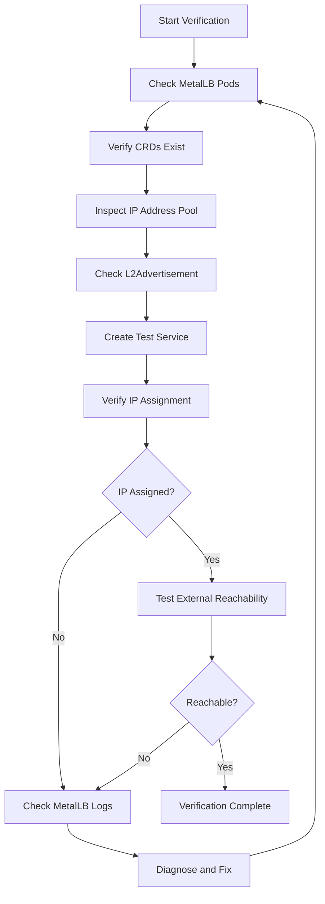
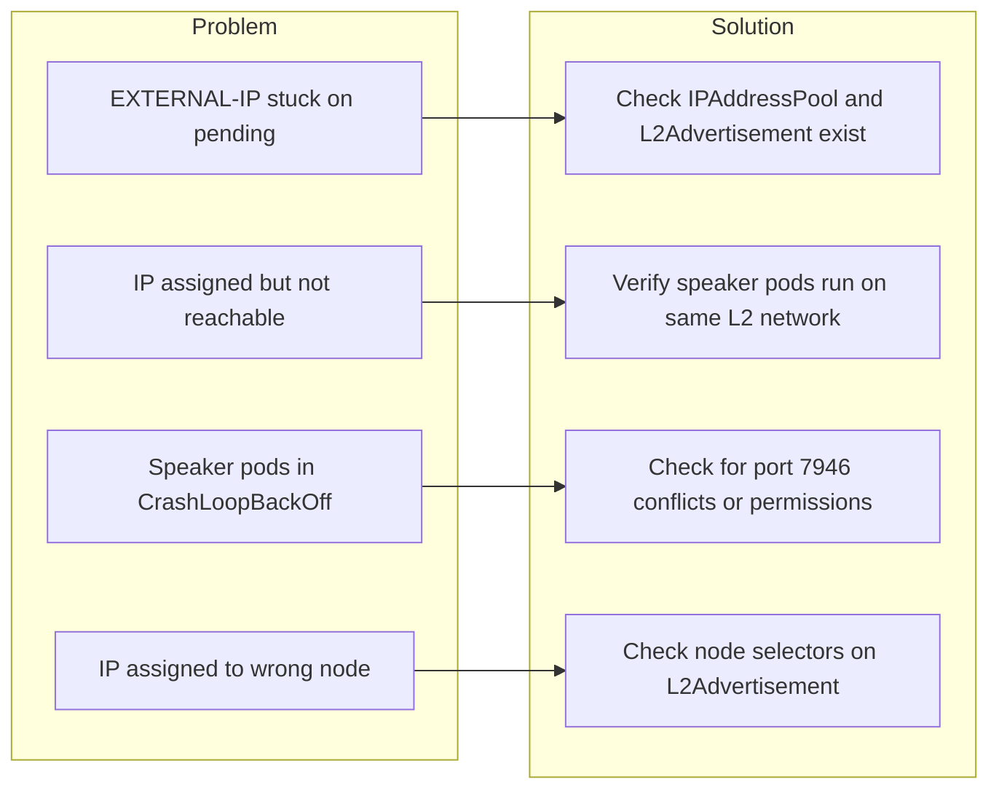

# How to Verify MetalLB Installation Is Working Correctly

Author: [nawazdhandala](https://www.github.com/nawazdhandala)

Tags: Kubernetes, MetalLB, Verification, Testing, Troubleshooting

Description: A comprehensive checklist for verifying that your MetalLB installation is working correctly. Learn how to check pods, configurations, IP assignments, and network reachability.

---

You installed MetalLB on your Kubernetes cluster. Everything seemed to go smoothly. But how do you know it is actually working? A silent misconfiguration can leave your LoadBalancer services stuck in a pending state for hours before anyone notices.

This guide walks you through a step-by-step verification process to confirm that MetalLB is fully operational. We will check every layer, from pods to network reachability.

### Verification Flow Overview

Here is the full verification flow we will follow:



### Step 1: Check That MetalLB Pods Are Running

The first thing to verify is that all MetalLB components are up and healthy. MetalLB runs a controller deployment and a speaker daemonset.

```bash
# List all pods in the metallb-system namespace
# You should see one controller pod and one speaker pod per node
kubectl get pods -n metallb-system -o wide
```

You should see output similar to this:

```
NAME                          READY   STATUS    RESTARTS   AGE   NODE
controller-7f5b8d6c4d-x9k2l  1/1     Running   0          2d    node-1
speaker-abc12                 1/1     Running   0          2d    node-1
speaker-def34                 1/1     Running   0          2d    node-2
speaker-ghi56                 1/1     Running   0          2d    node-3
```

Key things to look for:

- The **controller** pod must show `Running` with `1/1` ready.
- There should be one **speaker** pod per node in your cluster, all `Running`.
- No pods should be in `CrashLoopBackOff`, `Error`, or `Pending` state.

If any pod is not running, use `kubectl describe pod <pod-name> -n metallb-system` to find the root cause.

### Step 2: Verify That MetalLB CRDs Exist

MetalLB uses Custom Resource Definitions (CRDs) to manage its configuration. Without these CRDs, you cannot create IP pools or advertisements.

```bash
# List all CRDs related to MetalLB
# You should see at least IPAddressPool, L2Advertisement, and BGPAdvertisement
kubectl get crds | grep metallb
```

You should see several CRDs including `ipaddresspools.metallb.io` and `l2advertisements.metallb.io`. These two are the most important. If they are missing, MetalLB was not installed correctly and you need to reinstall it.

### Step 3: Inspect the IP Address Pool Configuration

An IP address pool tells MetalLB which IP addresses it is allowed to hand out. Without a valid pool, no service will ever receive an external IP.

```bash
# List all configured IP address pools and inspect a specific one
# At least one pool must exist for MetalLB to assign IPs
kubectl get ipaddresspools -n metallb-system
kubectl get ipaddresspool <pool-name> -n metallb-system -o yaml
```

A healthy IP address pool looks like this:

```yaml
# Example of a correctly configured IP address pool
apiVersion: metallb.io/v1beta1
kind: IPAddressPool
metadata:
  name: production-pool
  namespace: metallb-system
spec:
  addresses:
    # A range of IPs available for MetalLB to assign
    # Make sure these IPs are not used by DHCP or other services on your network
    - 192.168.1.200-192.168.1.250
```

Watch for these mistakes: IP range overlapping with DHCP, IPs on a different subnet than your nodes, or the pool created in a namespace other than `metallb-system`.

### Step 4: Verify L2Advertisement Exists

In Layer 2 mode, MetalLB needs an L2Advertisement resource to announce IPs on the network. Without it, MetalLB will assign IPs but no traffic will reach them.

```bash
# List all L2 advertisements
# At least one must exist and reference your IP address pool
kubectl get l2advertisements -n metallb-system
```

If you do not have one, create it:

```yaml
# L2Advertisement tells MetalLB to respond to ARP requests for assigned IPs
# This is required for Layer 2 mode to work
apiVersion: metallb.io/v1beta1
kind: L2Advertisement
metadata:
  name: default-l2-advertisement
  namespace: metallb-system
spec:
  # Referencing specific pools is optional
  # If omitted, this advertisement applies to all pools
  ipAddressPools:
    - production-pool
```

### Step 5: Create a Test Service

Now that the configuration looks correct, let us verify end-to-end by deploying a test workload.

```yaml
# A minimal nginx deployment and LoadBalancer service for testing MetalLB
# Save this as metallb-test.yaml
apiVersion: apps/v1
kind: Deployment
metadata:
  name: metallb-test
  namespace: default
spec:
  replicas: 1
  selector:
    matchLabels:
      app: metallb-test
  template:
    metadata:
      labels:
        app: metallb-test
    spec:
      containers:
        - name: nginx
          # Using a lightweight nginx image for the test
          image: nginx:alpine
          ports:
            - containerPort: 80
---
apiVersion: v1
kind: Service
metadata:
  name: metallb-test-svc
  namespace: default
spec:
  # LoadBalancer type triggers MetalLB to assign an external IP
  type: LoadBalancer
  selector:
    app: metallb-test
  ports:
    - protocol: TCP
      port: 80
      targetPort: 80
```

Apply it:

```bash
# Deploy the test workload and service
kubectl apply -f metallb-test.yaml
```

### Step 6: Verify IP Assignment

After creating the service, check that MetalLB assigns an external IP from your pool.

```bash
# Watch the service until an external IP is assigned
# The EXTERNAL-IP column should show an IP from your pool, not <pending>
kubectl get svc metallb-test-svc -w
```

Expected output:

```
NAME               TYPE           CLUSTER-IP     EXTERNAL-IP     PORT(S)        AGE
metallb-test-svc   LoadBalancer   10.152.183.5   192.168.1.200   80:31234/TCP   10s
```

If the `EXTERNAL-IP` stays as `<pending>`, something is wrong. The most common causes are:

- No IPAddressPool is configured.
- The IP pool is exhausted (all IPs are already assigned).
- The L2Advertisement is missing.
- MetalLB controller is not running.

### Step 7: Test External Reachability

An assigned IP does not guarantee that traffic can reach your service. You need to test actual connectivity.

```bash
# Test HTTP connectivity to the assigned IP
# Replace 192.168.1.200 with the actual IP from Step 6
# You should get the default nginx welcome page
curl -s -o /dev/null -w "HTTP Status: %{http_code}\n" http://192.168.1.200
```

Expected output:

```
HTTP Status: 200
```

You can also run `ping -c 3 192.168.1.200` to verify Layer 2 reachability. If the ping works but curl does not, the issue is likely with the pod or service, not with MetalLB itself.

### Step 8: Check MetalLB Logs

When things go wrong, the MetalLB logs are your best friend. Check both the controller and speaker logs.

```bash
# Check controller logs for IP allocation events and errors
# The controller handles IP assignment logic
kubectl logs -n metallb-system -l app=metallb,component=controller --tail=50
```

```bash
# Check speaker logs for ARP/NDP announcement events
# The speaker handles Layer 2 announcements on each node
kubectl logs -n metallb-system -l app=metallb,component=speaker --tail=50
```

In healthy logs, look for `"event":"ipAllocated"` in the controller and `"event":"serviceAnnounced"` in the speaker output. These confirm that IPs are being allocated and announced correctly.

### Common Failure Scenarios

Here is a quick reference of failures and their fixes:



**Pending external IP.** This almost always means MetalLB cannot find an available IP. Check that your IPAddressPool exists, has available addresses, and is in the `metallb-system` namespace.

**IP assigned but unreachable.** The speaker pod must run on a node that shares the same Layer 2 network as the clients trying to reach the IP. If your nodes are on different subnets, L2 mode will not work across them.

**Speaker pods crashing.** The speaker needs to bind to port 7946 for memberlist communication. If another process uses that port, the speaker will fail. Check with `ss -tlnp | grep 7946` on the affected node.

**Services stealing IPs from each other.** If your IP pool is too small, new services will not get an IP while existing ones hold theirs. Monitor pool usage with:

```bash
# Count how many LoadBalancer services currently have an external IP
# Compare this number against the size of your IP pool
kubectl get svc --all-namespaces -o jsonpath='{range .items[?(@.spec.type=="LoadBalancer")]}{.metadata.name}{"\t"}{.status.loadBalancer.ingress[0].ip}{"\n"}{end}'
```

After verification, clean up with `kubectl delete -f metallb-test.yaml` to free the IP back to the pool.

### Conclusion

Verifying MetalLB is not just about checking if the pods are running. A proper verification walks through every layer: pods, CRDs, IP pools, advertisements, IP assignment, and network reachability. Skipping any of these steps can leave you with a false sense of confidence.

If you are running MetalLB in production, consider setting up monitoring for your LoadBalancer services. [OneUptime](https://oneuptime.com) can monitor the health and availability of your Kubernetes services, alerting you the moment a LoadBalancer IP becomes unreachable or a MetalLB component goes down. With built-in support for uptime checks, incident management, and on-call alerts, it keeps your bare-metal infrastructure as reliable as any cloud setup.
