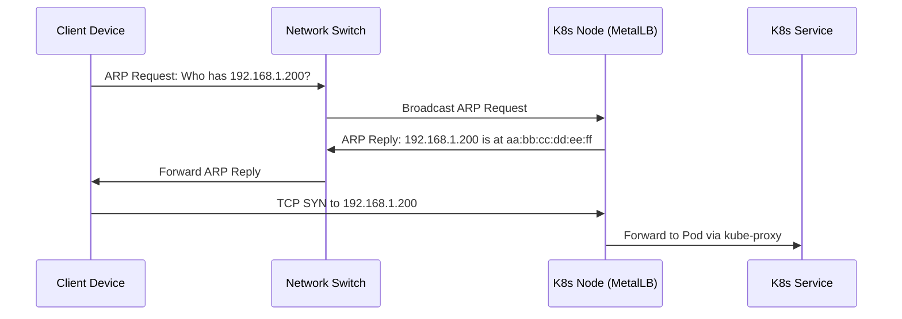
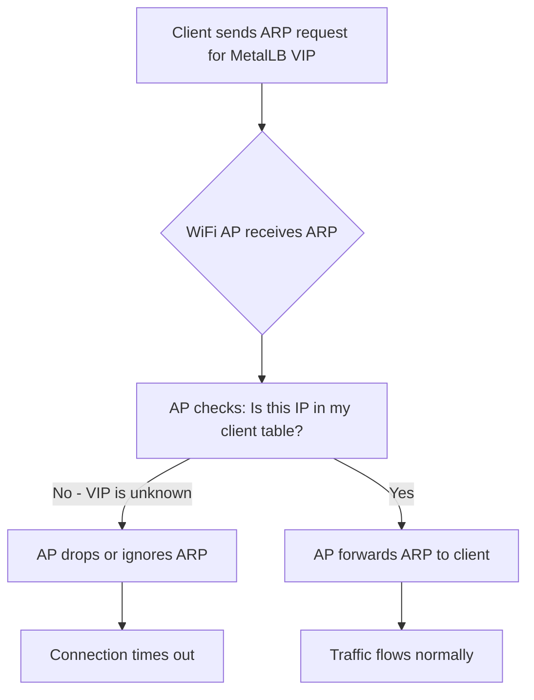
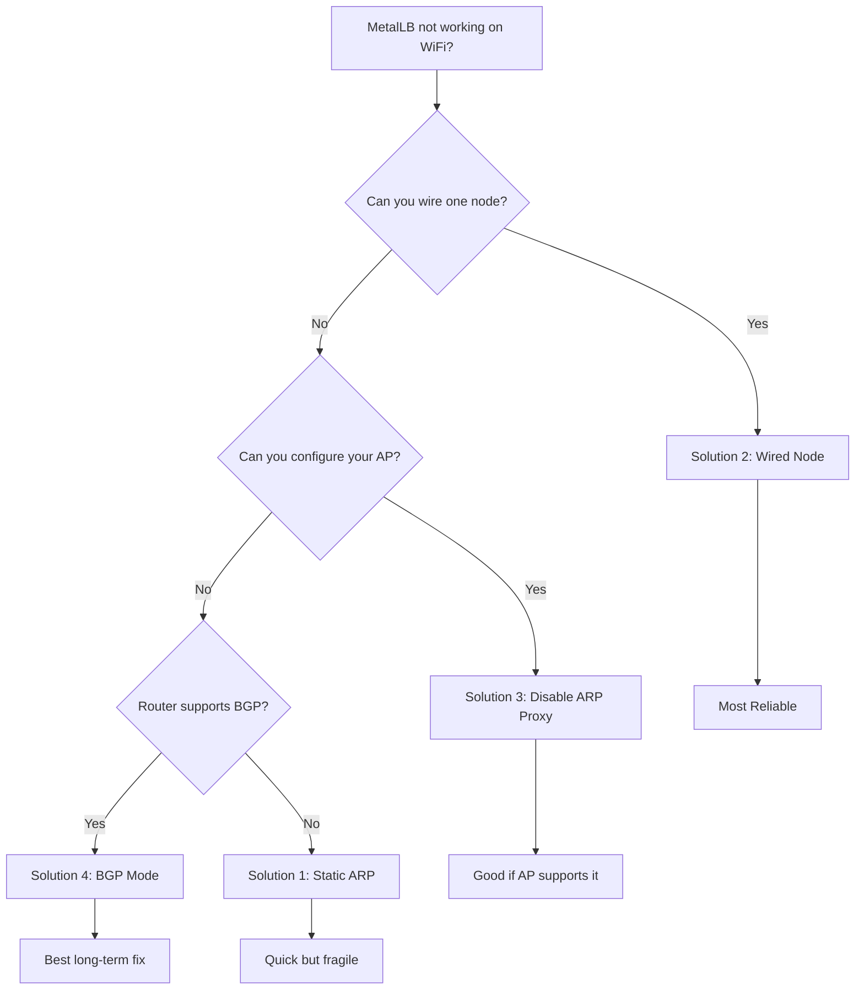

# How to Fix MetalLB WiFi ARP Issues on Raspberry Pi Clusters

Author: [nawazdhandala](https://www.github.com/nawazdhandala)

Tags: Kubernetes, MetalLB, Raspberry Pi, WiFi, ARP, Home Lab

Description: Troubleshooting guide for MetalLB ARP issues on WiFi-connected Raspberry Pi Kubernetes clusters. Learn why WiFi networks cause problems with ARP-based load balancing and how to work around them.

---

If you have set up a Kubernetes cluster on Raspberry Pi nodes connected over WiFi, you have likely hit this: MetalLB assigns an external IP, but nothing can reach it. The root cause is almost always ARP (Address Resolution Protocol) and how WiFi handles it differently from Ethernet.

## How MetalLB L2 Mode Works

Most home lab setups use MetalLB's Layer 2 mode because it requires no special router configuration. In L2 mode, MetalLB relies on ARP to advertise virtual IPs assigned to LoadBalancer services.



On Ethernet this works perfectly. But WiFi access points behave differently.

## Why WiFi Breaks ARP

WiFi access points bridge wireless clients to the wired network, and most have **ARP proxy** or **client isolation** features that interfere with MetalLB.



The core issues:

1. **ARP suppression** - APs suppress ARP broadcasts to reduce airtime. They only forward requests for known clients.
2. **Proxy ARP** - The AP answers ARP on behalf of clients but ignores IPs it does not recognize, like MetalLB VIPs.
3. **Client isolation** - Some APs block direct communication between wireless clients, breaking ARP between nodes.
4. **MAC filtering** - APs reject gratuitous ARP announcements that claim a new IP on an existing MAC.

## Diagnosing the Issue

SSH into your Raspberry Pi node and confirm ARP is the problem:

```bash
# Check if MetalLB assigned an IP (EXTERNAL-IP should not be <pending>)
kubectl get svc -A | grep LoadBalancer

# Check MetalLB speaker logs for ARP activity
kubectl logs -n metallb-system -l app=metallb,component=speaker --tail=50

# Listen for ARP traffic on the WiFi interface
sudo tcpdump -i wlan0 arp -n -c 20

# From another machine, test ARP resolution
sudo arping -I eth0 192.168.1.200

# If arping times out but the node's real IP is reachable, WiFi ARP is the problem
ping 192.168.1.100  # Node IP - should work
ping 192.168.1.200  # MetalLB VIP - will timeout if ARP is broken
```

## Solution 1: Static ARP Entries

Bypass ARP by adding static entries on machines that need to reach your services:

```bash
# Find the MAC address of your Raspberry Pi node
ip link show wlan0 | grep ether
# Output: link/ether dc:a6:32:xx:xx:xx brd ff:ff:ff:ff:ff:ff

# Add static ARP entry on your client machine
sudo arp -s 192.168.1.200 dc:a6:32:xx:xx:xx
```

This is quick but fragile. If MetalLB fails over to another node, the static entry breaks.

## Solution 2: Wire One Node (Recommended)

Connect at least one Raspberry Pi via Ethernet and pin MetalLB's L2 announcements to it:

```yaml
# metallb-config.yaml - L2 mode with node selectors
apiVersion: metallb.io/v1beta1
kind: IPAddressPool
metadata:
  name: home-lab-pool
  namespace: metallb-system
spec:
  addresses:
    # IP range within your subnet, outside DHCP range
    - 192.168.1.200-192.168.1.210
---
apiVersion: metallb.io/v1beta1
kind: L2Advertisement
metadata:
  name: home-lab-l2
  namespace: metallb-system
spec:
  ipAddressPools:
    - home-lab-pool
  # Only Ethernet-connected nodes handle ARP announcements
  nodeSelectors:
    - matchLabels:
        network: ethernet
```

```bash
# Label the wired node so MetalLB selects it as the speaker
kubectl label node rpi-node-01 network=ethernet
```

This is the most reliable approach. Ethernet handles ARP correctly, and you only need one wired node.

## Solution 3: Disable ARP Proxy on Your AP

Some access points let you turn off ARP suppression directly.

For **UniFi** APs:

```bash
# Check if proxy ARP is enabled (1 = enabled, 0 = disabled)
cat /proc/sys/net/ipv4/conf/br0/proxy_arp

# Disable it (resets on AP reboot)
echo 0 > /proc/sys/net/ipv4/conf/br0/proxy_arp
```

For **OpenWrt** routers:

```bash
# Disable ARP-related filtering
uci set network.lan.igmp_snooping='0'
uci set wireless.default_radio0.isolate='0'

# Apply changes
uci commit network && uci commit wireless
/etc/init.d/network restart
```

## Solution 4: Use BGP Mode

If your router supports BGP (OpenWrt, DD-WRT, or similar), you can skip ARP entirely:

```yaml
# metallb-bgp-config.yaml - Layer 3 routing, no ARP needed
apiVersion: metallb.io/v1beta2
kind: BGPPeer
metadata:
  name: home-router
  namespace: metallb-system
spec:
  myASN: 64500
  peerASN: 64501
  peerAddress: 192.168.1.1
---
apiVersion: metallb.io/v1beta1
kind: IPAddressPool
metadata:
  name: bgp-pool
  namespace: metallb-system
spec:
  addresses:
    - 192.168.1.200-192.168.1.210
---
apiVersion: metallb.io/v1beta1
kind: BGPAdvertisement
metadata:
  name: bgp-advertisement
  namespace: metallb-system
spec:
  ipAddressPools:
    - bgp-pool
```

## Which Solution to Pick



## Verifying Your Fix

```bash
# Test that the MetalLB VIP is reachable
curl -v http://192.168.1.200

# Verify ARP resolution shows a valid MAC address
arp -a | grep 192.168.1.200

# Watch MetalLB speaker logs for announcements
kubectl logs -n metallb-system -l component=speaker -f | grep -i "arp\|announce"
```

## Conclusion

WiFi and MetalLB L2 mode do not mix well because WiFi access points filter ARP traffic. The most reliable fix is to connect one node via Ethernet and pin MetalLB to it. If that is not possible, BGP mode avoids ARP entirely.

For home lab Raspberry Pi clusters, this issue can waste hours of debugging if you do not know where to look. Hopefully this guide saves you that time.

If you are running a Kubernetes cluster and want to monitor its health, uptime, and performance, check out [OneUptime](https://oneuptime.com). It is an open-source observability platform with monitoring, incident management, status pages, and more.
