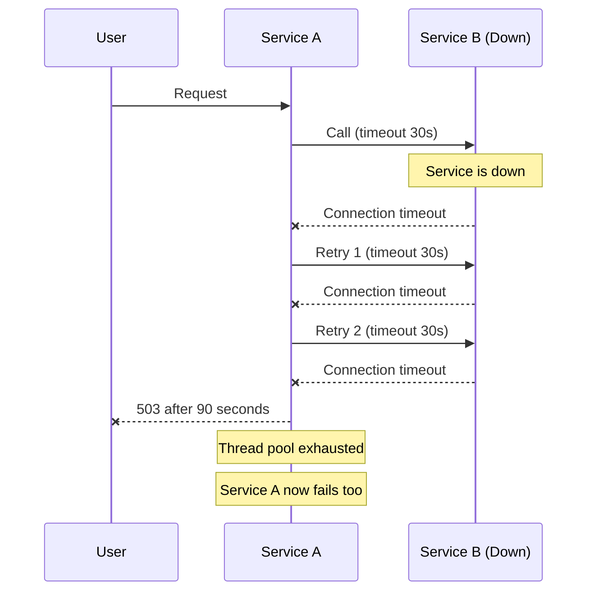
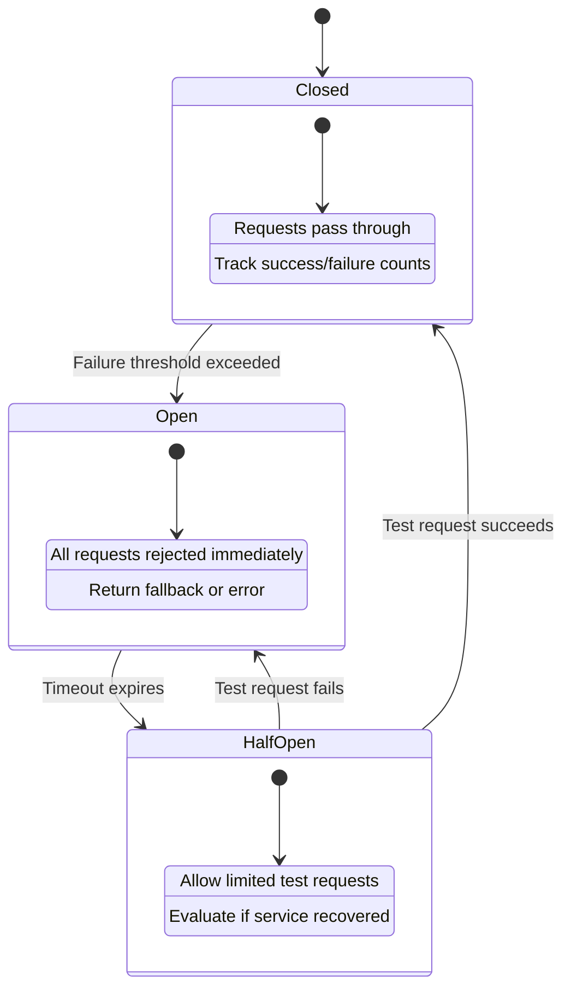
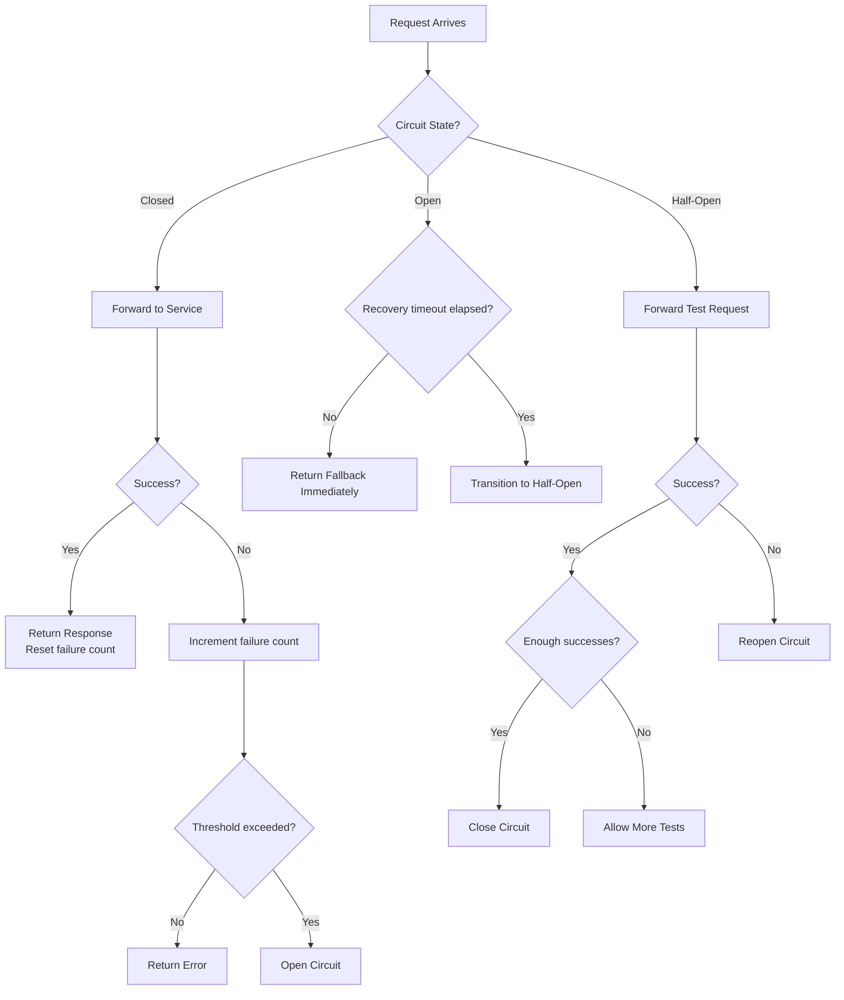
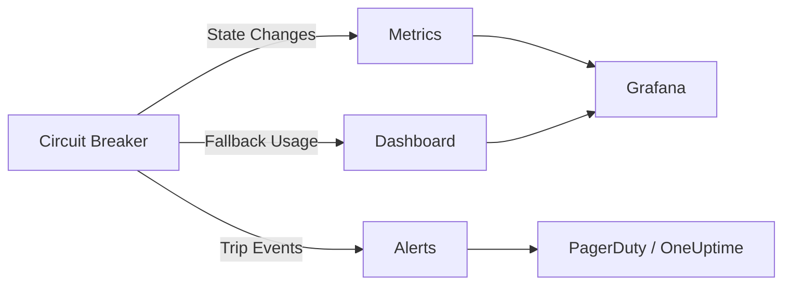

# How to Implement the Circuit Breaker Pattern in Microservices

Author: [nawazdhandala](https://www.github.com/nawazdhandala)

Tags: Microservices, Circuit Breaker, Resilience, Fault Tolerance, Patterns

Description: Learn how to implement the circuit breaker pattern in microservices for graceful degradation and fault tolerance.

---

In a microservices architecture, a single failing service can cascade failures across the entire system. The circuit breaker pattern prevents this by detecting failures and stopping requests to unhealthy services, giving them time to recover. This guide shows you how to implement circuit breakers from scratch and with popular libraries.

## The Problem: Cascading Failures

When Service A calls Service B and Service B is down, Service A keeps retrying. This ties up threads, exhausts connection pools, and eventually causes Service A to fail too.



## How the Circuit Breaker Works

The circuit breaker has three states: Closed (normal), Open (blocking), and Half-Open (testing).



## Implementing a Circuit Breaker in Python

```python
# circuit_breaker.py
# A complete circuit breaker implementation.
# Tracks failures and opens the circuit when a threshold is exceeded.

import time
import threading
from enum import Enum
from typing import Callable, Optional, Any
from dataclasses import dataclass, field


class CircuitState(Enum):
    """The three states of a circuit breaker."""
    CLOSED = "closed"       # Normal operation
    OPEN = "open"           # Blocking all requests
    HALF_OPEN = "half_open" # Testing if service recovered


@dataclass
class CircuitBreakerConfig:
    """Configuration for the circuit breaker."""
    # Number of failures before opening the circuit
    failure_threshold: int = 5
    # How long to wait before testing (seconds)
    recovery_timeout: int = 30
    # Number of test requests allowed in half-open state
    half_open_max_calls: int = 3
    # Sliding window size for tracking failures (seconds)
    window_size: int = 60


class CircuitBreaker:
    """
    Circuit breaker that wraps calls to external services.
    Opens the circuit when failures exceed the threshold,
    preventing cascading failures.
    """

    def __init__(self, name: str, config: Optional[CircuitBreakerConfig] = None):
        self.name = name
        self.config = config or CircuitBreakerConfig()
        self._state = CircuitState.CLOSED
        self._failure_count = 0
        self._success_count = 0
        self._last_failure_time = 0.0
        self._half_open_calls = 0
        self._lock = threading.Lock()

    @property
    def state(self) -> CircuitState:
        """Get the current state, checking for recovery timeout."""
        with self._lock:
            if self._state == CircuitState.OPEN:
                elapsed = time.time() - self._last_failure_time
                if elapsed >= self.config.recovery_timeout:
                    # Transition to half-open to test recovery
                    self._state = CircuitState.HALF_OPEN
                    self._half_open_calls = 0
                    print(f"[{self.name}] Circuit half-open, testing recovery")
            return self._state

    def call(self, func: Callable, *args, **kwargs) -> Any:
        """
        Execute a function through the circuit breaker.
        Raises CircuitOpenError if the circuit is open.
        """
        current_state = self.state

        # If circuit is open, fail fast without calling the service
        if current_state == CircuitState.OPEN:
            raise CircuitOpenError(
                f"Circuit '{self.name}' is open. "
                f"Retry after {self.config.recovery_timeout}s"
            )

        # If half-open, check if we exceeded the test call limit
        if current_state == CircuitState.HALF_OPEN:
            with self._lock:
                if self._half_open_calls >= self.config.half_open_max_calls:
                    raise CircuitOpenError(
                        f"Circuit '{self.name}' half-open call limit reached"
                    )
                self._half_open_calls += 1

        # Attempt the call
        try:
            result = func(*args, **kwargs)
            self._on_success()
            return result
        except Exception as e:
            self._on_failure()
            raise

    def _on_success(self):
        """Handle a successful call."""
        with self._lock:
            if self._state == CircuitState.HALF_OPEN:
                self._success_count += 1
                # If enough test calls succeed, close the circuit
                if self._success_count >= self.config.half_open_max_calls:
                    self._state = CircuitState.CLOSED
                    self._failure_count = 0
                    self._success_count = 0
                    print(f"[{self.name}] Circuit closed, service recovered")
            else:
                # Reset failure count on success in closed state
                self._failure_count = 0

    def _on_failure(self):
        """Handle a failed call."""
        with self._lock:
            self._failure_count += 1
            self._last_failure_time = time.time()

            if self._state == CircuitState.HALF_OPEN:
                # Any failure in half-open state reopens the circuit
                self._state = CircuitState.OPEN
                print(f"[{self.name}] Circuit reopened, service still failing")
            elif self._failure_count >= self.config.failure_threshold:
                # Threshold exceeded, open the circuit
                self._state = CircuitState.OPEN
                print(f"[{self.name}] Circuit opened after "
                      f"{self._failure_count} failures")


class CircuitOpenError(Exception):
    """Raised when a call is attempted on an open circuit."""
    pass
```

## Using the Circuit Breaker

```python
# usage.py
# Wrap external service calls with the circuit breaker.
# When the payment service fails, the circuit opens
# and returns a fallback response instead of hanging.

import requests
from circuit_breaker import CircuitBreaker, CircuitBreakerConfig, CircuitOpenError

# Create a circuit breaker for the payment service
payment_breaker = CircuitBreaker(
    name="payment-service",
    config=CircuitBreakerConfig(
        failure_threshold=3,    # Open after 3 failures
        recovery_timeout=15,    # Wait 15 seconds before testing
        half_open_max_calls=2,  # Allow 2 test requests
    )
)


def call_payment_service(order_id: str, amount: float) -> dict:
    """
    Call the payment service with circuit breaker protection.
    Falls back to a queued payment if the circuit is open.
    """
    def make_request():
        response = requests.post(
            "http://payment-service:8080/charge",
            json={"order_id": order_id, "amount": amount},
            timeout=5
        )
        response.raise_for_status()
        return response.json()

    try:
        # Route the call through the circuit breaker
        return payment_breaker.call(make_request)
    except CircuitOpenError:
        # Fallback: queue the payment for later processing
        print(f"Payment service unavailable, queuing payment for {order_id}")
        return {
            "status": "queued",
            "order_id": order_id,
            "message": "Payment will be processed when the service recovers"
        }
    except requests.exceptions.RequestException as e:
        # The call went through the breaker but failed
        # The breaker has already recorded the failure
        print(f"Payment request failed: {e}")
        return {"status": "failed", "error": str(e)}
```

## Circuit Breaker State Flow



## Circuit Breaker with Fallbacks

Different fallback strategies suit different scenarios.

```python
# fallbacks.py
# Common fallback strategies for circuit breaker patterns.


def cached_fallback(cache: dict, key: str) -> dict:
    """
    Return cached data when the primary service is unavailable.
    Useful for read-heavy services where stale data is acceptable.
    """
    if key in cache:
        return {"data": cache[key], "source": "cache", "stale": True}
    return {"data": None, "source": "cache", "error": "No cached data"}


def default_fallback() -> dict:
    """
    Return a sensible default when no cached data is available.
    Useful for non-critical features like recommendations.
    """
    return {
        "recommendations": [],
        "source": "default",
        "message": "Recommendations temporarily unavailable"
    }


def queue_fallback(queue_client, task: dict) -> dict:
    """
    Queue the operation for later retry when the service recovers.
    Useful for write operations that must eventually complete.
    """
    queue_client.enqueue("deferred_tasks", task)
    return {
        "status": "queued",
        "message": "Your request has been queued and will be processed shortly"
    }
```

## Monitoring Circuit Breakers

Track circuit breaker state changes, trip frequency, and fallback usage to understand service health.



OneUptime (https://oneuptime.com) monitors your services and detects the conditions that trigger circuit breakers. By setting up endpoint monitors and alerting rules, OneUptime can notify your team when a downstream service starts failing - often before the circuit breaker even trips. Combine circuit breaker metrics with OneUptime's status pages to give stakeholders real-time visibility into service health and degraded functionality.
