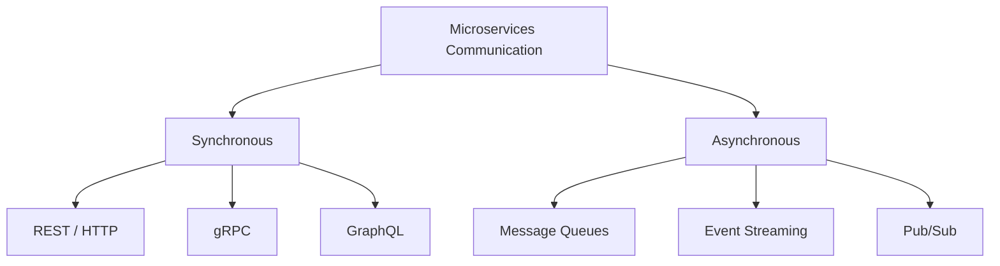
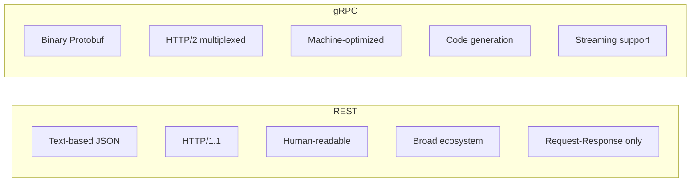
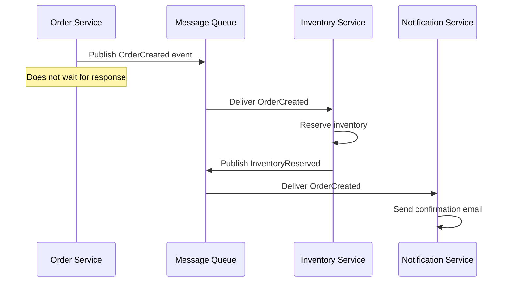
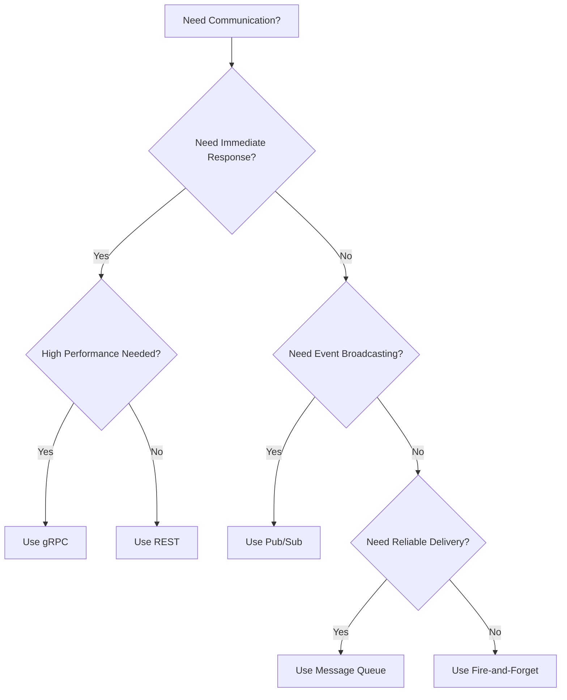

# Understanding Microservices Communication Patterns

Author: [nawazdhandala](https://www.github.com/nawazdhandala)

Tags: Microservices, Communication, REST, gRPC, Event-Driven

Description: A guide to microservices communication patterns including synchronous REST, gRPC, and asynchronous event-driven messaging.

---

Choosing the right communication pattern between microservices is one of the most important architectural decisions you will make. This guide covers synchronous patterns like REST and gRPC, asynchronous patterns like event-driven messaging, and when to use each one.

## Communication Patterns Overview



## Synchronous Communication

In synchronous communication, the caller sends a request and waits for a response. The caller is blocked until the response arrives.

### REST / HTTP

REST is the most common synchronous pattern. It uses HTTP methods and JSON payloads.

```python
# order_service.py
# The order service calls the inventory service synchronously
# to check stock availability before placing an order.

import requests
from fastapi import FastAPI, HTTPException
from pydantic import BaseModel

app = FastAPI(title="Order Service")

# URL of the inventory service
INVENTORY_SERVICE_URL = "http://inventory-service:8080"


class OrderRequest(BaseModel):
    """Incoming order request from the client."""
    product_id: str
    quantity: int
    customer_id: str


@app.post("/orders")
async def create_order(order: OrderRequest):
    """
    Create a new order. First checks inventory availability
    via a synchronous REST call to the inventory service.
    """
    # Step 1: Check inventory (synchronous call)
    try:
        response = requests.get(
            f"{INVENTORY_SERVICE_URL}/products/{order.product_id}/stock",
            timeout=5  # Set a timeout to avoid hanging
        )
        response.raise_for_status()
    except requests.exceptions.Timeout:
        raise HTTPException(503, "Inventory service timed out")
    except requests.exceptions.ConnectionError:
        raise HTTPException(503, "Inventory service unavailable")

    stock = response.json()

    # Step 2: Validate stock availability
    if stock["available"] < order.quantity:
        raise HTTPException(400, "Insufficient stock")

    # Step 3: Reserve inventory (synchronous call)
    reserve_response = requests.post(
        f"{INVENTORY_SERVICE_URL}/products/{order.product_id}/reserve",
        json={"quantity": order.quantity},
        timeout=5
    )

    if reserve_response.status_code != 200:
        raise HTTPException(500, "Failed to reserve inventory")

    # Step 4: Create the order record
    order_id = "ord_" + order.product_id[:8]
    return {"order_id": order_id, "status": "created"}
```

### gRPC

gRPC uses Protocol Buffers for serialization and HTTP/2 for transport. It is faster than REST and supports streaming.

```protobuf
// inventory.proto
// Define the gRPC service contract for the inventory service.
// Protocol Buffers provide strong typing and efficient serialization.

syntax = "proto3";

package inventory;

// The inventory service exposes stock checking and reservation.
service InventoryService {
  // Check available stock for a product
  rpc CheckStock(StockRequest) returns (StockResponse);
  // Reserve inventory for an order
  rpc ReserveStock(ReserveRequest) returns (ReserveResponse);
  // Stream real-time stock updates for multiple products
  rpc WatchStock(WatchRequest) returns (stream StockUpdate);
}

message StockRequest {
  string product_id = 1;
}

message StockResponse {
  string product_id = 1;
  int32 available = 2;
  int32 reserved = 3;
}

message ReserveRequest {
  string product_id = 1;
  int32 quantity = 2;
  string order_id = 3;
}

message ReserveResponse {
  bool success = 1;
  string reservation_id = 2;
}

message WatchRequest {
  repeated string product_ids = 1;
}

message StockUpdate {
  string product_id = 1;
  int32 available = 2;
  string timestamp = 3;
}
```

```python
# grpc_client.py
# gRPC client for the inventory service.
# Uses generated stubs from the proto definition.

import grpc
import inventory_pb2
import inventory_pb2_grpc


def check_stock(product_id: str) -> dict:
    """
    Check stock availability using gRPC.
    gRPC is significantly faster than REST for
    internal service-to-service communication.
    """
    # Create a gRPC channel to the inventory service
    channel = grpc.insecure_channel("inventory-service:50051")
    stub = inventory_pb2_grpc.InventoryServiceStub(channel)

    # Build the request message
    request = inventory_pb2.StockRequest(product_id=product_id)

    try:
        # Make the RPC call with a 5-second deadline
        response = stub.CheckStock(request, timeout=5)
        return {
            "product_id": response.product_id,
            "available": response.available,
            "reserved": response.reserved,
        }
    except grpc.RpcError as e:
        print(f"gRPC error: {e.code()} - {e.details()}")
        raise
```

## REST vs gRPC Comparison



## Asynchronous Communication

In asynchronous communication, the sender publishes a message and does not wait for a response. This decouples services and improves resilience.

### Message Queue Pattern



```python
# event_publisher.py
# Publish domain events to a message broker.
# Services consume events independently and asynchronously.

import json
import pika
from dataclasses import dataclass, asdict
from datetime import datetime


@dataclass
class OrderCreatedEvent:
    """Event published when a new order is created."""
    event_type: str = "order.created"
    order_id: str = ""
    product_id: str = ""
    quantity: int = 0
    customer_id: str = ""
    timestamp: str = ""


def publish_event(event: OrderCreatedEvent):
    """
    Publish an event to RabbitMQ.
    Multiple consumers can process the event independently.
    """
    # Connect to the message broker
    connection = pika.BlockingConnection(
        pika.ConnectionParameters(host="rabbitmq")
    )
    channel = connection.channel()

    # Declare a fanout exchange for broadcasting events
    # All bound queues receive a copy of the message
    channel.exchange_declare(
        exchange="order_events",
        exchange_type="fanout",
        durable=True  # Survive broker restarts
    )

    # Serialize and publish the event
    message = json.dumps(asdict(event))
    channel.basic_publish(
        exchange="order_events",
        routing_key="",
        body=message,
        properties=pika.BasicProperties(
            delivery_mode=2,  # Persist message to disk
            content_type="application/json",
        )
    )

    print(f"Published event: {event.event_type}")
    connection.close()


# Publish an order created event
event = OrderCreatedEvent(
    order_id="ord_12345",
    product_id="prod_abc",
    quantity=2,
    customer_id="cust_789",
    timestamp=datetime.utcnow().isoformat()
)
publish_event(event)
```

### Event Consumer

```python
# event_consumer.py
# Consume events from the message queue.
# Each service has its own queue and processes events independently.

import json
import pika


def process_order_event(ch, method, properties, body):
    """
    Process an incoming order event.
    This handler runs in the inventory service.
    """
    event = json.loads(body)
    print(f"Received event: {event['event_type']}")
    print(f"Order ID: {event['order_id']}")

    # Process the event (e.g., reserve inventory)
    try:
        reserve_inventory(event["product_id"], event["quantity"])
        # Acknowledge the message after successful processing
        ch.basic_ack(delivery_tag=method.delivery_tag)
        print("Event processed successfully")
    except Exception as e:
        # Reject and requeue on failure
        print(f"Processing failed: {e}")
        ch.basic_nack(delivery_tag=method.delivery_tag, requeue=True)


def reserve_inventory(product_id: str, quantity: int):
    """Reserve inventory for the given product."""
    print(f"Reserving {quantity} units of {product_id}")


def start_consumer():
    """Start consuming order events from RabbitMQ."""
    connection = pika.BlockingConnection(
        pika.ConnectionParameters(host="rabbitmq")
    )
    channel = connection.channel()

    # Declare the queue for this consumer
    channel.queue_declare(queue="inventory_queue", durable=True)

    # Bind the queue to the order events exchange
    channel.queue_bind(
        queue="inventory_queue",
        exchange="order_events"
    )

    # Only process one message at a time
    channel.basic_qos(prefetch_count=1)

    # Start consuming messages
    channel.basic_consume(
        queue="inventory_queue",
        on_message_callback=process_order_event
    )

    print("Waiting for events...")
    channel.start_consuming()


if __name__ == "__main__":
    start_consumer()
```

## Choosing the Right Pattern



## Monitoring Communication Patterns

Regardless of the pattern you choose, monitoring is essential. Track latency, error rates, message queue depths, and consumer lag.

OneUptime (https://oneuptime.com) monitors your microservices communication layer end to end. Set up health checks for your REST and gRPC endpoints, monitor message broker availability, and track consumer lag in your event queues. When communication between services breaks down, OneUptime detects it and alerts your team before users are affected.
