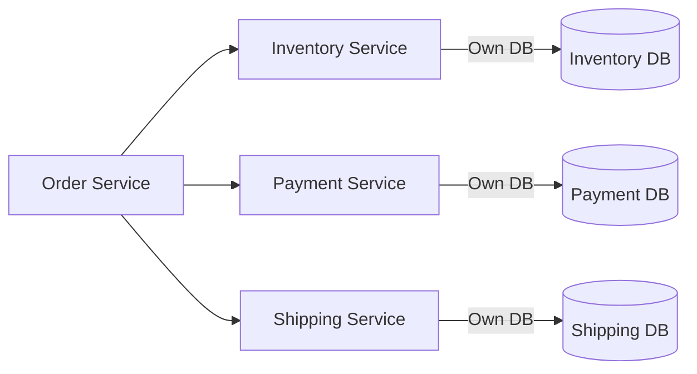
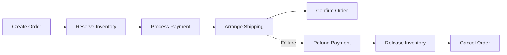
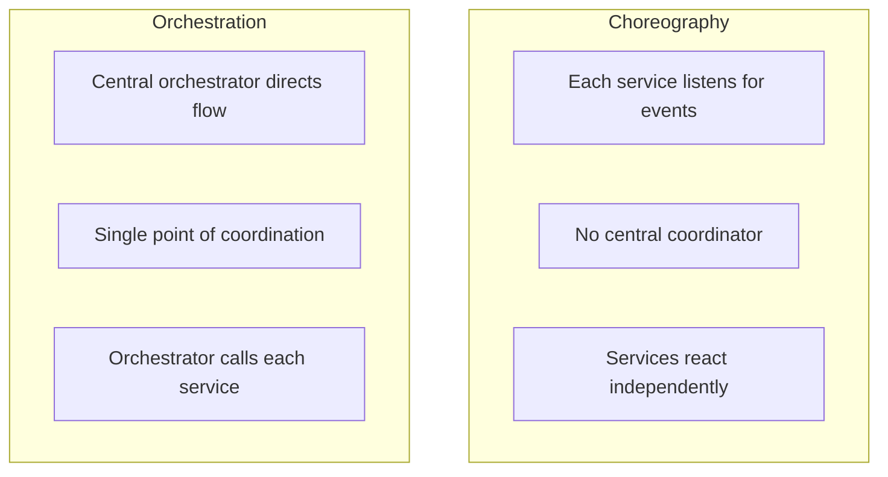
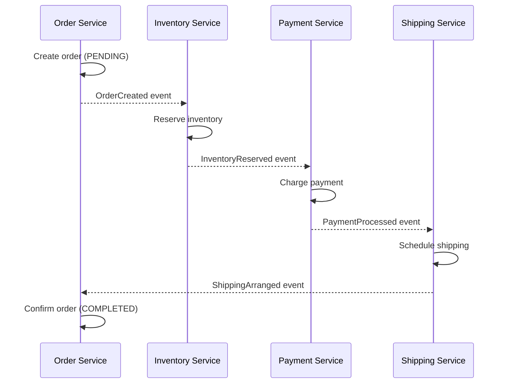
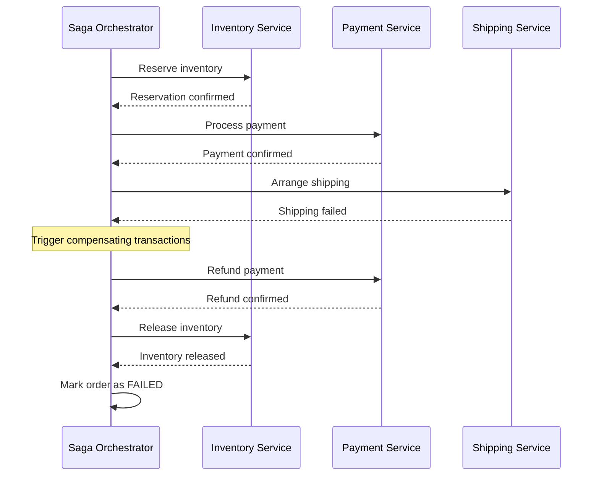
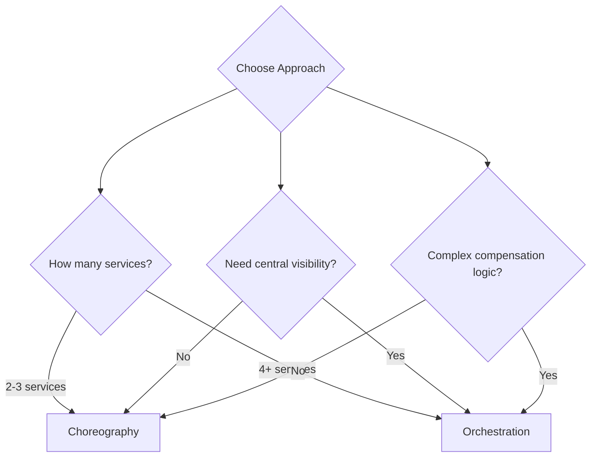
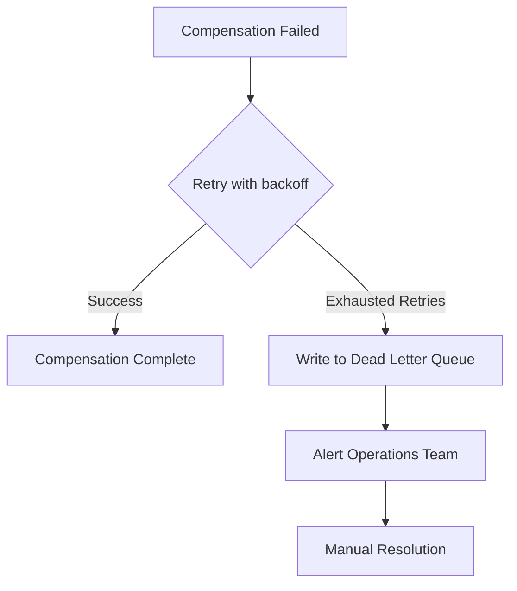

# How to Implement the Saga Pattern for Distributed Transactions

Author: [nawazdhandala](https://www.github.com/nawazdhandala)

Tags: Microservices, Saga Pattern, Distributed Transactions, Choreography, Orchestration

Description: Learn how to implement the Saga pattern for managing distributed transactions across microservices.

---

In a monolithic application, a single database transaction can span multiple operations atomically. In microservices, each service owns its own database, so you cannot use traditional ACID transactions. The Saga pattern solves this by breaking a distributed transaction into a sequence of local transactions, each with a compensating action for rollback.

## The Problem: Distributed Transactions

Consider an e-commerce order that requires coordination across multiple services.



If the payment succeeds but shipping fails, you need to undo the payment and release the reserved inventory. Traditional two-phase commit does not scale in microservices.

## What Is a Saga?

A saga is a sequence of local transactions. Each local transaction updates the database of its service and publishes an event or message to trigger the next step. If any step fails, compensating transactions undo the previous steps.



## Two Saga Approaches

There are two ways to coordinate a saga: choreography and orchestration.



## Choreography-Based Saga

In choreography, each service publishes events and other services react to them. There is no central coordinator.



### Choreography Implementation

```python
# events.py
# Define the domain events used in the choreography saga.
# Each service publishes and subscribes to specific events.

from dataclasses import dataclass, asdict
from datetime import datetime
import json


@dataclass
class OrderCreated:
    """Published by Order Service when a new order is created."""
    event_type: str = "order.created"
    order_id: str = ""
    product_id: str = ""
    quantity: int = 0
    customer_id: str = ""
    amount: float = 0.0
    timestamp: str = ""


@dataclass
class InventoryReserved:
    """Published by Inventory Service after reserving stock."""
    event_type: str = "inventory.reserved"
    order_id: str = ""
    reservation_id: str = ""
    timestamp: str = ""


@dataclass
class InventoryReservationFailed:
    """Published by Inventory Service when reservation fails."""
    event_type: str = "inventory.reservation_failed"
    order_id: str = ""
    reason: str = ""
    timestamp: str = ""


@dataclass
class PaymentProcessed:
    """Published by Payment Service after successful charge."""
    event_type: str = "payment.processed"
    order_id: str = ""
    payment_id: str = ""
    timestamp: str = ""


@dataclass
class PaymentFailed:
    """Published by Payment Service when charge fails."""
    event_type: str = "payment.failed"
    order_id: str = ""
    reason: str = ""
    timestamp: str = ""


def serialize_event(event) -> str:
    """Serialize a domain event to JSON for publishing."""
    return json.dumps(asdict(event))
```

```python
# inventory_handler.py
# Inventory Service event handler for the choreography saga.
# Listens for OrderCreated events and reserves inventory.

import json
from events import InventoryReserved, InventoryReservationFailed, serialize_event


def handle_order_created(event_data: dict, publisher):
    """
    Handle an OrderCreated event.
    Attempts to reserve inventory and publishes the result.
    """
    order_id = event_data["order_id"]
    product_id = event_data["product_id"]
    quantity = event_data["quantity"]

    print(f"Reserving {quantity} units of {product_id} for order {order_id}")

    # Check available stock
    available = get_stock(product_id)

    if available >= quantity:
        # Reserve the inventory
        reservation_id = reserve(product_id, quantity)

        # Publish success event
        event = InventoryReserved(
            order_id=order_id,
            reservation_id=reservation_id,
        )
        publisher.publish("saga_events", serialize_event(event))
        print(f"Inventory reserved: {reservation_id}")
    else:
        # Publish failure event - this triggers compensation
        event = InventoryReservationFailed(
            order_id=order_id,
            reason=f"Insufficient stock. Available: {available}, Requested: {quantity}",
        )
        publisher.publish("saga_events", serialize_event(event))
        print(f"Reservation failed: insufficient stock")


def get_stock(product_id: str) -> int:
    """Query current stock level for a product."""
    # In production, query the inventory database
    return 100


def reserve(product_id: str, quantity: int) -> str:
    """Reserve inventory and return a reservation ID."""
    # In production, update the inventory database
    return f"res_{product_id}_{quantity}"
```

## Orchestration-Based Saga

In orchestration, a central coordinator (the saga orchestrator) tells each service what to do and handles compensation on failures.



### Orchestrator Implementation

```python
# saga_orchestrator.py
# Orchestrates the order creation saga.
# Coordinates steps across services and handles compensation.

from dataclasses import dataclass, field
from enum import Enum
from typing import List, Optional


class SagaStepStatus(Enum):
    """Status of each step in the saga."""
    PENDING = "pending"
    COMPLETED = "completed"
    FAILED = "failed"
    COMPENSATED = "compensated"


@dataclass
class SagaStep:
    """A single step in the saga with its compensation action."""
    name: str
    action: str               # The forward action to execute
    compensation: str          # The compensating action for rollback
    status: SagaStepStatus = SagaStepStatus.PENDING
    result: Optional[dict] = None


@dataclass
class OrderSaga:
    """
    Orchestrates the order creation process across services.
    Each step has a forward action and a compensating action.
    If any step fails, all completed steps are compensated in reverse.
    """
    order_id: str
    steps: List[SagaStep] = field(default_factory=list)
    current_step: int = 0

    def __post_init__(self):
        # Define the saga steps in order
        self.steps = [
            SagaStep(
                name="reserve_inventory",
                action="inventory.reserve",
                compensation="inventory.release",
            ),
            SagaStep(
                name="process_payment",
                action="payment.charge",
                compensation="payment.refund",
            ),
            SagaStep(
                name="arrange_shipping",
                action="shipping.arrange",
                compensation="shipping.cancel",
            ),
        ]


class SagaOrchestrator:
    """
    Executes saga steps and handles compensation on failure.
    This is the central coordinator for the orchestration pattern.
    """

    def __init__(self, service_client):
        self.service_client = service_client

    def execute(self, saga: OrderSaga) -> dict:
        """
        Execute all saga steps in order.
        On failure, compensate all completed steps in reverse.
        """
        print(f"Starting saga for order {saga.order_id}")

        for i, step in enumerate(saga.steps):
            saga.current_step = i
            print(f"  Step {i + 1}: {step.name}")

            try:
                # Execute the forward action
                result = self.service_client.call(step.action, {
                    "order_id": saga.order_id,
                })
                step.status = SagaStepStatus.COMPLETED
                step.result = result
                print(f"    Completed: {step.name}")

            except Exception as e:
                print(f"    Failed: {step.name} - {e}")
                step.status = SagaStepStatus.FAILED

                # Compensate all previously completed steps
                self._compensate(saga, i)

                return {
                    "order_id": saga.order_id,
                    "status": "failed",
                    "failed_step": step.name,
                    "error": str(e),
                }

        return {
            "order_id": saga.order_id,
            "status": "completed",
        }

    def _compensate(self, saga: OrderSaga, failed_step_index: int):
        """
        Compensate all completed steps in reverse order.
        This undoes the work done by previous successful steps.
        """
        print(f"  Compensating saga for order {saga.order_id}")

        # Iterate backwards through completed steps
        for i in range(failed_step_index - 1, -1, -1):
            step = saga.steps[i]
            if step.status == SagaStepStatus.COMPLETED:
                try:
                    print(f"    Compensating: {step.name}")
                    self.service_client.call(step.compensation, {
                        "order_id": saga.order_id,
                        "original_result": step.result,
                    })
                    step.status = SagaStepStatus.COMPENSATED
                    print(f"    Compensated: {step.name}")
                except Exception as e:
                    # Compensation failed - this needs manual intervention
                    print(f"    Compensation FAILED: {step.name} - {e}")
                    # Alert the operations team
                    alert_ops_team(saga.order_id, step.name, str(e))


def alert_ops_team(order_id: str, step: str, error: str):
    """Alert operations when compensation fails and manual intervention is needed."""
    print(f"ALERT: Manual intervention needed for order {order_id}")
    print(f"  Failed compensation step: {step}")
    print(f"  Error: {error}")
```

## Choreography vs Orchestration



| Aspect | Choreography | Orchestration |
|--------|-------------|---------------|
| Coupling | Loose | Tighter to orchestrator |
| Complexity | Grows with services | Centralized |
| Visibility | Distributed | Single point |
| Single point of failure | None | Orchestrator |
| Debugging | Harder | Easier |

## Handling Compensation Failures

When a compensating transaction fails, you have a serious problem. Use these strategies.



## Best Practices

- Design every forward action with a corresponding compensating action
- Make compensating actions idempotent so retries are safe
- Use unique saga IDs to track and correlate all steps
- Log every state transition for debugging and auditing
- Set timeouts for each step to prevent sagas from hanging
- Use a dead letter queue for compensation failures
- Monitor saga completion rates and durations

## Monitoring Distributed Transactions

Sagas span multiple services, making observability critical. Track saga completion rates, step durations, and compensation frequency.

OneUptime (https://oneuptime.com) provides end-to-end monitoring for your microservices architecture. Monitor the health of every service involved in your sagas, track API latency across the transaction chain, and set up alerts for compensation failures. When a saga step times out or a service becomes unavailable, OneUptime notifies your team immediately so you can prevent order failures and revenue loss.
