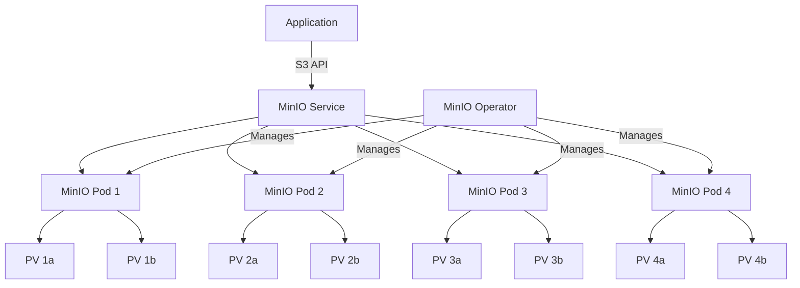

# How to Deploy MinIO Object Storage on Kubernetes

Author: [nawazdhandala](https://www.github.com/nawazdhandala)

Tags: MinIO, Object Storage, Kubernetes, S3, Cloud Native

Description: Learn how to deploy MinIO on Kubernetes for S3-compatible object storage with high availability and erasure coding.

---

## What is MinIO?

MinIO is a high-performance, S3-compatible object storage system. It is designed for large-scale data infrastructure and works natively with Kubernetes. MinIO supports erasure coding, bitrot protection, and encryption out of the box. It is widely used for storing logs, backups, machine learning datasets, and application artifacts.

The key advantage of MinIO is full S3 API compatibility. Any application that works with Amazon S3 can work with MinIO without code changes.

## MinIO Architecture on Kubernetes



MinIO uses erasure coding to distribute data across multiple drives and nodes. With 4 nodes and 2 drives each (8 drives total), MinIO can tolerate up to 4 drive failures while maintaining data availability.

## Installing the MinIO Operator

```bash
# Install the MinIO Operator using kubectl
# The operator manages MinIO tenants on Kubernetes
kubectl apply -k "github.com/minio/operator?ref=v6.0.0"

# Alternatively, install with Helm
helm repo add minio-operator https://operator.min.io
helm repo update

# Install the operator
helm install minio-operator minio-operator/operator \
  --namespace minio-operator \
  --create-namespace

# Verify the operator is running
kubectl get pods -n minio-operator

# Check the CRDs
kubectl get crds | grep minio
```

## Creating a MinIO Tenant

```yaml
# minio-tenant.yaml
# Defines a 4-node MinIO tenant with erasure coding
apiVersion: minio.min.io/v2
kind: Tenant
metadata:
  name: minio-storage
  namespace: minio-tenant
spec:
  image: quay.io/minio/minio:latest
  # Pool configuration defines the node layout
  pools:
    - name: pool-0
      servers: 4                           # 4 MinIO server pods
      volumesPerServer: 2                  # 2 volumes per server (8 total)
      volumeClaimTemplate:
        metadata:
          name: data
        spec:
          accessModes:
            - ReadWriteOnce
          storageClassName: fast-ssd        # Use fast storage
          resources:
            requests:
              storage: 100Gi               # 100 GB per volume
      resources:
        requests:
          cpu: "1"
          memory: 2Gi
        limits:
          cpu: "2"
          memory: 4Gi
  # Root credentials
  credsSecret:
    name: minio-creds
  # Enable Prometheus metrics
  prometheusOperator: true
  # Request automatic TLS certificate generation
  requestAutoCert: true
  # S3 features
  features:
    bucketDNS: false
  # Environment variables for MinIO configuration
  env:
    - name: MINIO_BROWSER
      value: "on"                          # Enable web console
    - name: MINIO_STORAGE_CLASS_STANDARD
      value: "EC:2"                        # Erasure coding with 2 parity blocks
---
# Secret for MinIO root credentials
apiVersion: v1
kind: Secret
metadata:
  name: minio-creds
  namespace: minio-tenant
type: Opaque
stringData:
  accesskey: "minio-admin"                 # Root access key
  secretkey: "change-this-password"        # Root secret key (change this)
```

```bash
# Create the namespace and deploy the tenant
kubectl create namespace minio-tenant
kubectl apply -f minio-tenant.yaml

# Watch the tenant come up
kubectl get pods -n minio-tenant -w

# Check tenant status
kubectl get tenant -n minio-tenant
```

## Accessing MinIO

```bash
# Get the MinIO service endpoint
kubectl get svc -n minio-tenant

# Port-forward for local access to the MinIO console
kubectl port-forward svc/minio-storage-console -n minio-tenant 9090:9090 &

# Port-forward for S3 API access
kubectl port-forward svc/minio-storage-hl -n minio-tenant 9000:9000 &

# Install the MinIO client (mc)
brew install minio/stable/mc              # macOS
# Or download from https://min.io/download

# Configure the MinIO client
mc alias set myminio http://localhost:9000 minio-admin change-this-password

# Test connectivity
mc admin info myminio
```

## Working with Buckets and Objects

```bash
# Create a bucket
mc mb myminio/application-logs

# Create a bucket with object locking enabled (for compliance)
mc mb myminio/audit-logs --with-lock

# Upload a file
mc cp ./backup.tar.gz myminio/application-logs/2026/02/backup.tar.gz

# Upload a directory recursively
mc cp --recursive ./logs/ myminio/application-logs/

# List objects in a bucket
mc ls myminio/application-logs/

# Download an object
mc cp myminio/application-logs/2026/02/backup.tar.gz ./restored-backup.tar.gz

# Get object metadata
mc stat myminio/application-logs/2026/02/backup.tar.gz

# Remove an object
mc rm myminio/application-logs/old-file.log

# Set a bucket policy for public read access
mc anonymous set download myminio/public-assets
```

## Using MinIO from Applications

```python
# Python example using boto3 (the AWS SDK)
# MinIO is fully compatible with the S3 API
import boto3
from botocore.client import Config

# Create an S3 client pointing to MinIO
# Use the Kubernetes service DNS for in-cluster access
s3_client = boto3.client(
    "s3",
    endpoint_url="http://minio-storage-hl.minio-tenant.svc.cluster.local:9000",
    aws_access_key_id="minio-admin",
    aws_secret_access_key="change-this-password",
    config=Config(signature_version="s3v4"),  # Use V4 signature
    region_name="us-east-1",                  # Region is required but arbitrary
)

# Create a bucket
s3_client.create_bucket(Bucket="telemetry-data")

# Upload an object
s3_client.put_object(
    Bucket="telemetry-data",
    Key="metrics/2026/02/20/cpu.json",       # Object key (path-like)
    Body=b'{"cpu_usage": 45.2, "timestamp": "2026-02-20T10:00:00Z"}',
    ContentType="application/json",
)

# Download an object
response = s3_client.get_object(
    Bucket="telemetry-data",
    Key="metrics/2026/02/20/cpu.json",
)
data = response["Body"].read()
print(f"Downloaded: {data.decode()}")

# List objects with a prefix
response = s3_client.list_objects_v2(
    Bucket="telemetry-data",
    Prefix="metrics/2026/02/",               # Filter by prefix
)
for obj in response.get("Contents", []):
    print(f"  {obj['Key']} - {obj['Size']} bytes")
```

## Bucket Lifecycle and Expiration

```yaml
# lifecycle-policy.json
# Automatically expire old objects to manage storage costs
{
    "Rules": [
        {
            "ID": "expire-old-logs",
            "Status": "Enabled",
            "Filter": {
                "Prefix": "logs/"
            },
            "Expiration": {
                "Days": 90
            }
        },
        {
            "ID": "transition-to-archive",
            "Status": "Enabled",
            "Filter": {
                "Prefix": "backups/"
            },
            "Expiration": {
                "Days": 365
            }
        }
    ]
}
```

```bash
# Apply the lifecycle policy to a bucket
mc ilm import myminio/application-logs < lifecycle-policy.json

# View the current lifecycle rules
mc ilm ls myminio/application-logs
```

## Monitoring and Health Checks

```mermaid
graph LR
    A[MinIO Cluster] --> B[/minio/health/live]
    A --> C[/minio/health/ready]
    A --> D[/minio/health/cluster]
    E[Prometheus] -->|Scrape :9000/minio/v2/metrics| A
    F[Kubernetes] -->|Liveness Probe| B
    F -->|Readiness Probe| C
```

```bash
# Check cluster health
mc admin info myminio

# View server disk usage
mc admin info myminio --json | jq '.info.servers[].drives'

# Check healing status (after a drive replacement)
mc admin heal myminio --recursive

# View real-time server logs
mc admin logs myminio

# Check Prometheus metrics
curl -s http://localhost:9000/minio/v2/metrics/cluster | head -30
```

## Production Considerations

- Deploy at least 4 MinIO nodes for erasure coding (tolerates up to N/2 drive failures).
- Use dedicated fast SSDs for MinIO volumes.
- Enable TLS for all client and inter-node communication.
- Set up bucket versioning for critical data to protect against accidental deletion.
- Configure lifecycle policies to automatically manage storage usage.
- Use MinIO's built-in encryption for data at rest.

## Monitoring with OneUptime

Object storage is foundational infrastructure. OneUptime (https://oneuptime.com) monitors your MinIO deployment by tracking disk health, storage capacity, API latency, and error rates. With OneUptime alerts, you can detect disk failures, approaching storage limits, or degraded performance before data availability is impacted. OneUptime dashboards give you visibility into your entire storage infrastructure from a single place.
