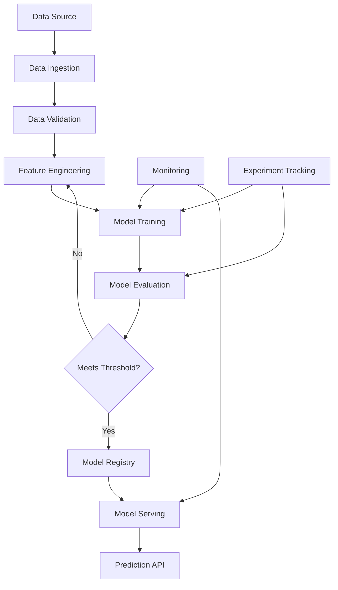
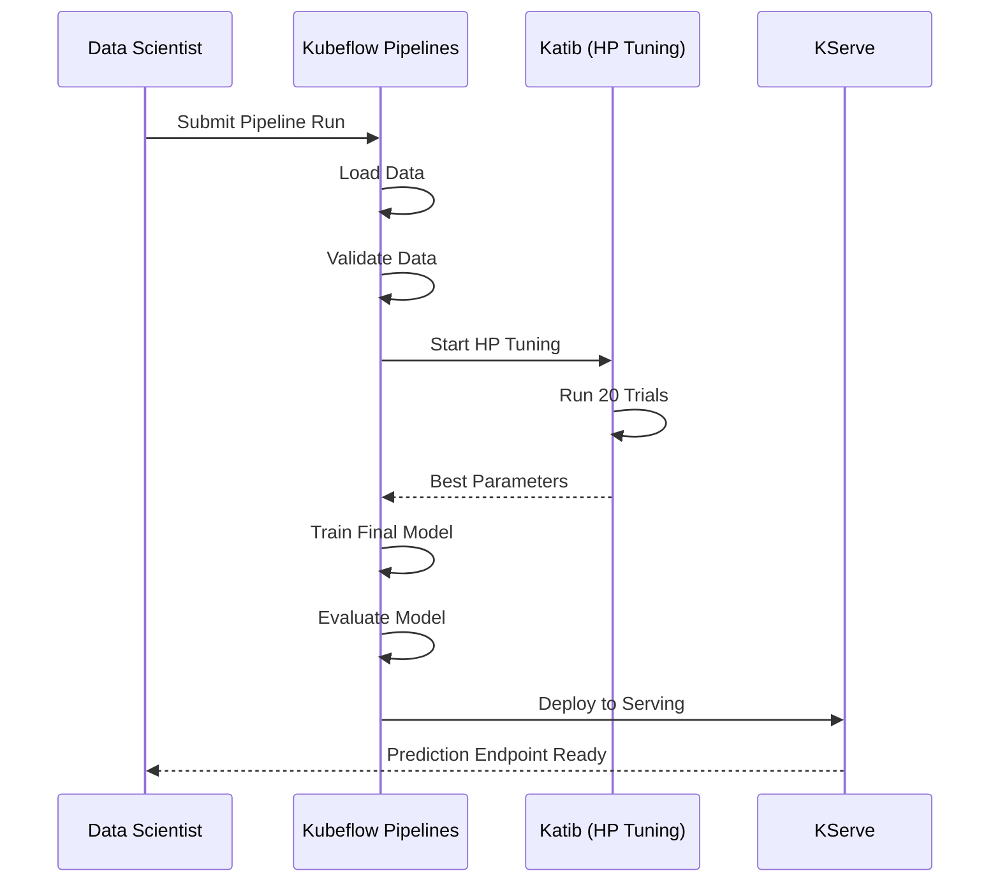

# How to Set Up MLOps Pipelines on Kubernetes with Kubeflow

Author: [nawazdhandala](https://www.github.com/nawazdhandala)

Tags: MLOps, Kubernetes, Kubeflow, Machine Learning, Pipelines

Description: Learn how to set up MLOps pipelines on Kubernetes using Kubeflow for model training, serving, and experiment tracking.

---

Machine learning models need more than just training code. They need reproducible pipelines, experiment tracking, model versioning, and reliable serving infrastructure. Kubeflow provides a complete MLOps platform on top of Kubernetes, giving data science teams the tools to move from experimentation to production with confidence.

This guide covers setting up Kubeflow on Kubernetes and building end-to-end ML pipelines.

## MLOps Pipeline Architecture



## Step 1: Install Kubeflow on Kubernetes

```bash
# Install kustomize (required for Kubeflow installation)
curl -s "https://raw.githubusercontent.com/kubernetes-sigs/kustomize/master/hack/install_kustomize.sh" | bash
sudo mv kustomize /usr/local/bin/

# Clone the Kubeflow manifests repository
git clone https://github.com/kubeflow/manifests.git
cd manifests

# Install Kubeflow with all components
# This includes Pipelines, Katib, KServe, and the dashboard
while ! kustomize build example | kubectl apply -f -; do
  echo "Retrying to apply Kubeflow manifests..."
  sleep 10
done

# Wait for all pods to be ready
kubectl wait --for=condition=Ready pods --all -n kubeflow --timeout=600s

# Access the Kubeflow dashboard
kubectl port-forward svc/istio-ingressgateway -n istio-system 8080:80
```

## Step 2: Create a Kubeflow Pipeline

```python
# pipeline.py
# Defines an end-to-end ML pipeline using the Kubeflow Pipelines SDK
from kfp import dsl, compiler
from kfp.dsl import Input, Output, Dataset, Model, Metrics

@dsl.component(
    base_image="python:3.11-slim",
    packages_to_install=["pandas", "scikit-learn"],
)
def load_data(output_dataset: Output[Dataset]):
    """Load and prepare the training dataset."""
    import pandas as pd
    from sklearn.datasets import load_iris

    # Load the iris dataset as an example
    iris = load_iris(as_frame=True)
    df = iris.frame
    # Save the dataset to the output artifact path
    df.to_csv(output_dataset.path, index=False)
    output_dataset.metadata["num_samples"] = len(df)
    output_dataset.metadata["num_features"] = len(iris.feature_names)

@dsl.component(
    base_image="python:3.11-slim",
    packages_to_install=["pandas", "scikit-learn"],
)
def validate_data(
    input_dataset: Input[Dataset],
    validated_dataset: Output[Dataset],
):
    """Validate data quality before training."""
    import pandas as pd

    df = pd.read_csv(input_dataset.path)

    # Check for missing values
    null_count = df.isnull().sum().sum()
    if null_count > 0:
        raise ValueError(f"Dataset contains {null_count} missing values")

    # Check for minimum number of samples
    if len(df) < 50:
        raise ValueError(f"Dataset too small: {len(df)} samples")

    # Data passes validation, save it
    df.to_csv(validated_dataset.path, index=False)
    validated_dataset.metadata["validation_status"] = "passed"

@dsl.component(
    base_image="python:3.11-slim",
    packages_to_install=["pandas", "scikit-learn", "joblib"],
)
def train_model(
    input_dataset: Input[Dataset],
    model_output: Output[Model],
    metrics_output: Output[Metrics],
    n_estimators: int = 100,
    max_depth: int = 5,
):
    """Train a Random Forest classifier and evaluate it."""
    import pandas as pd
    from sklearn.ensemble import RandomForestClassifier
    from sklearn.model_selection import train_test_split
    from sklearn.metrics import accuracy_score, f1_score
    import joblib

    # Load the validated dataset
    df = pd.read_csv(input_dataset.path)

    # Split features and target
    X = df.drop("target", axis=1)
    y = df["target"]

    # Split into training and test sets
    X_train, X_test, y_train, y_test = train_test_split(
        X, y, test_size=0.2, random_state=42
    )

    # Train the model with the given hyperparameters
    model = RandomForestClassifier(
        n_estimators=n_estimators,
        max_depth=max_depth,
        random_state=42,
    )
    model.fit(X_train, y_train)

    # Evaluate the model on the test set
    predictions = model.predict(X_test)
    accuracy = accuracy_score(y_test, predictions)
    f1 = f1_score(y_test, predictions, average="weighted")

    # Log metrics for experiment tracking
    metrics_output.log_metric("accuracy", accuracy)
    metrics_output.log_metric("f1_score", f1)
    metrics_output.log_metric("n_estimators", n_estimators)
    metrics_output.log_metric("max_depth", max_depth)

    # Save the trained model
    joblib.dump(model, model_output.path)
    model_output.metadata["framework"] = "sklearn"
    model_output.metadata["accuracy"] = accuracy

@dsl.component(
    base_image="python:3.11-slim",
    packages_to_install=["joblib", "scikit-learn"],
)
def evaluate_model(
    model_input: Input[Model],
    accuracy_threshold: float = 0.85,
) -> bool:
    """Check if the model meets the accuracy threshold for deployment."""
    accuracy = model_input.metadata.get("accuracy", 0)
    # Return True if the model is good enough for production
    return accuracy >= accuracy_threshold

# Define the pipeline that chains all components together
@dsl.pipeline(
    name="iris-training-pipeline",
    description="End-to-end ML pipeline for Iris classification",
)
def ml_pipeline(
    n_estimators: int = 100,
    max_depth: int = 5,
    accuracy_threshold: float = 0.85,
):
    # Step 1: Load data
    load_task = load_data()

    # Step 2: Validate data quality
    validate_task = validate_data(
        input_dataset=load_task.outputs["output_dataset"]
    )

    # Step 3: Train the model
    train_task = train_model(
        input_dataset=validate_task.outputs["validated_dataset"],
        n_estimators=n_estimators,
        max_depth=max_depth,
    )

    # Step 4: Evaluate if model is ready for deployment
    evaluate_task = evaluate_model(
        model_input=train_task.outputs["model_output"],
        accuracy_threshold=accuracy_threshold,
    )

# Compile the pipeline to a YAML file
compiler.Compiler().compile(
    pipeline_func=ml_pipeline,
    package_path="iris_pipeline.yaml",
)
```

## Step 3: Deploy Model Serving with KServe

```yaml
# inference-service.yaml
# Deploy a trained model as a scalable prediction API using KServe
apiVersion: serving.kserve.io/v1beta1
kind: InferenceService
metadata:
  name: iris-classifier
  namespace: kubeflow
spec:
  predictor:
    # Use the sklearn server for scikit-learn models
    sklearn:
      storageUri: "gs://my-models/iris/v1"
      resources:
        requests:
          cpu: 100m
          memory: 256Mi
        limits:
          cpu: "1"
          memory: 1Gi
    # Scale to zero when no traffic
    minReplicas: 0
    maxReplicas: 5
    scaleTarget: 10
    scaleMetric: "concurrency"
```

## Step 4: Set Up Hyperparameter Tuning with Katib

```yaml
# katib-experiment.yaml
# Automated hyperparameter search using Bayesian optimization
apiVersion: kubeflow.org/v1beta1
kind: Experiment
metadata:
  name: iris-hp-tuning
  namespace: kubeflow
spec:
  # Maximize accuracy
  objective:
    type: maximize
    goal: 0.98
    objectiveMetricName: accuracy
  algorithm:
    algorithmName: bayesianoptimization
  # Run 20 trials with 3 in parallel
  maxTrialCount: 20
  parallelTrialCount: 3
  maxFailedTrialCount: 3
  parameters:
    - name: n_estimators
      parameterType: int
      feasibleSpace:
        min: "50"
        max: "300"
    - name: max_depth
      parameterType: int
      feasibleSpace:
        min: "3"
        max: "15"
  trialTemplate:
    primaryContainerName: training
    trialParameters:
      - name: n_estimators
        reference: n_estimators
      - name: max_depth
        reference: max_depth
    trialSpec:
      apiVersion: batch/v1
      kind: Job
      spec:
        template:
          spec:
            containers:
              - name: training
                image: my-training-image:latest
                command:
                  - "python"
                  - "/app/train.py"
                  - "--n_estimators=${trialParameters.n_estimators}"
                  - "--max_depth=${trialParameters.max_depth}"
            restartPolicy: Never
```

## Experiment Tracking Flow



## Step 5: Monitor Model Performance

Model monitoring is critical to catch data drift, prediction quality degradation, and infrastructure issues.

```python
# model_monitor.py
# Monitors model prediction quality and data drift
import requests
import numpy as np
from datetime import datetime

# KServe prediction endpoint
PREDICT_URL = "http://iris-classifier.kubeflow.svc.cluster.local/v1/models/iris-classifier:predict"

def check_prediction_latency(samples, threshold_ms=200):
    """Check that prediction latency is within acceptable bounds."""
    import time

    latencies = []
    for sample in samples:
        start = time.time()
        # Send a prediction request
        response = requests.post(
            PREDICT_URL,
            json={"instances": [sample]},
        )
        latency = (time.time() - start) * 1000
        latencies.append(latency)

    avg_latency = np.mean(latencies)
    p99_latency = np.percentile(latencies, 99)

    print(f"Average latency: {avg_latency:.1f}ms")
    print(f"P99 latency: {p99_latency:.1f}ms")

    # Alert if latency exceeds the threshold
    if p99_latency > threshold_ms:
        print(f"WARNING: P99 latency ({p99_latency:.1f}ms) exceeds threshold ({threshold_ms}ms)")
        return False
    return True
```

## Making It Production-Ready

A complete MLOps setup needs more than just pipelines and serving. You need reliability monitoring across the entire stack, from data ingestion to model predictions.

[OneUptime](https://oneuptime.com) helps you monitor your MLOps infrastructure end-to-end. Set up monitors for your Kubeflow dashboard, KServe endpoints, and training job health. Use OpenTelemetry integration to trace requests through your prediction pipeline and identify bottlenecks. When a model serving endpoint goes down or prediction latency spikes, OneUptime alerts your on-call team immediately so you can respond before users are affected.
