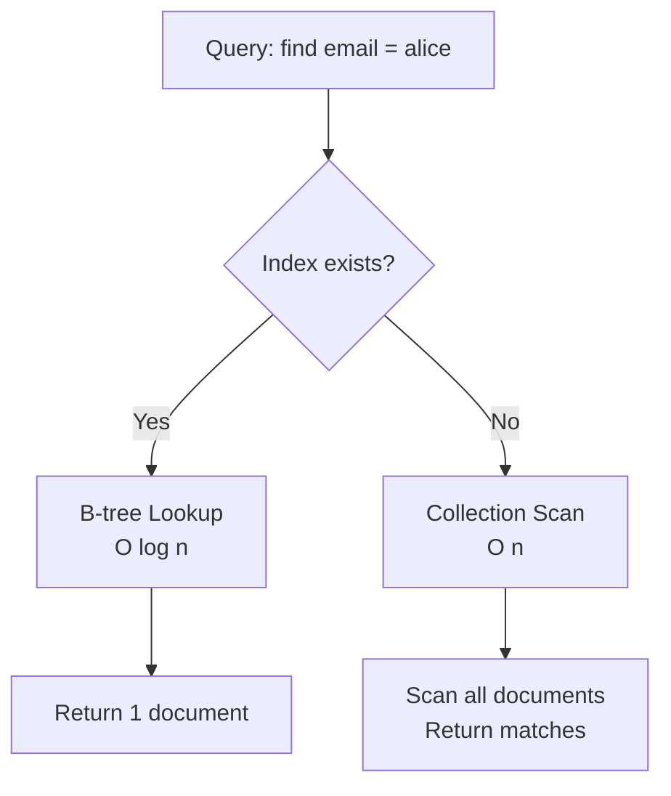
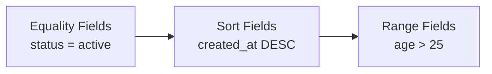
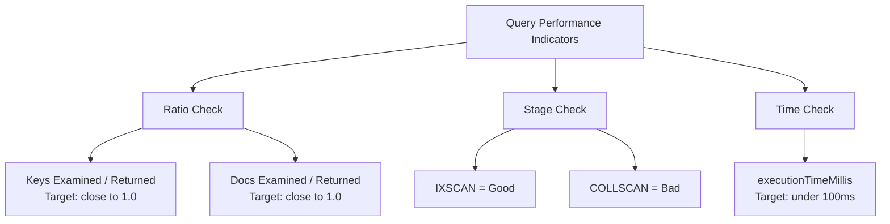

# How to Optimize MongoDB Query Performance with Indexes

Author: [nawazdhandala](https://www.github.com/nawazdhandala)

Tags: MongoDB, Indexes, Performance, Query Optimization, Database

Description: Learn how to create and optimize MongoDB indexes for better query performance including compound, partial, and TTL indexes.

---

Without indexes, MongoDB must scan every document in a collection to find the ones that match your query. This is called a collection scan, and it gets slower as your data grows. Indexes let MongoDB skip directly to the matching documents, turning O(n) lookups into O(log n) operations.

This post covers how to create effective indexes, which types to use, how to analyze query plans, and common indexing mistakes to avoid.

## How Indexes Work in MongoDB

MongoDB indexes are B-tree data structures that store a sorted subset of fields from your documents. When a query uses an indexed field, MongoDB walks the B-tree instead of scanning the entire collection.



## Creating Basic Indexes

```python
from pymongo import MongoClient, ASCENDING, DESCENDING

client = MongoClient("mongodb://localhost:27017")
db = client["myapp"]
collection = db["users"]

# Single field index on email
# This speeds up queries that filter or sort by email
collection.create_index(
    [("email", ASCENDING)],
    unique=True,  # Enforce uniqueness
    name="idx_email_unique"
)

# Single field index on created_at for sorting
collection.create_index(
    [("created_at", DESCENDING)],
    name="idx_created_at_desc"
)

# List all indexes on the collection
for index in collection.list_indexes():
    print(f"Index: {index['name']} - Keys: {index['key']}")
```

## Compound Indexes

Compound indexes cover multiple fields. The order of fields in a compound index matters significantly.

```python
# Compound index on status and created_at
# This supports queries that filter by status AND sort by created_at
collection.create_index(
    [("status", ASCENDING), ("created_at", DESCENDING)],
    name="idx_status_created"
)

# This index supports these queries efficiently:
# 1. db.users.find({"status": "active"}).sort({"created_at": -1})
# 2. db.users.find({"status": "active"})
# 3. db.users.find({"status": "active", "created_at": {"$gte": date}})

# But NOT this query (status is not the prefix):
# db.users.find({"created_at": {"$gte": date}})
```

### The ESR Rule for Compound Indexes

Follow the Equality-Sort-Range (ESR) rule when ordering fields in compound indexes:



```python
# Example query:
# db.orders.find({
#     "status": "shipped",       <-- Equality
#     "total": {"$gte": 100}     <-- Range
# }).sort({"created_at": -1})    <-- Sort

# Optimal index following ESR rule:
db.orders.create_index(
    [
        ("status", ASCENDING),      # E: Equality first
        ("created_at", DESCENDING), # S: Sort second
        ("total", ASCENDING)        # R: Range last
    ],
    name="idx_orders_esr"
)
```

## Partial Indexes

Partial indexes only index documents that match a filter expression. They use less storage and are faster to maintain.

```python
# Index only active users
# This saves space by not indexing inactive accounts
collection.create_index(
    [("email", ASCENDING)],
    partialFilterExpression={"status": "active"},
    name="idx_email_active_only"
)

# Index only orders above $100
# Useful when you only query high-value orders frequently
db.orders.create_index(
    [("customer_id", ASCENDING), ("created_at", DESCENDING)],
    partialFilterExpression={"total": {"$gte": 100}},
    name="idx_high_value_orders"
)

# IMPORTANT: Queries must include the partial filter condition
# to use the partial index. This query uses the index:
db.orders.find({"customer_id": "c1", "total": {"$gte": 100}})

# This query does NOT use the partial index:
db.orders.find({"customer_id": "c1", "total": 50})
```

## TTL Indexes

TTL (Time-To-Live) indexes automatically delete documents after a specified time period. Perfect for session data, logs, and temporary records.

```python
# Automatically delete sessions after 24 hours
db.sessions.create_index(
    [("created_at", ASCENDING)],
    expireAfterSeconds=86400,  # 24 hours in seconds
    name="idx_session_ttl"
)

# Automatically delete logs after 30 days
db.logs.create_index(
    [("timestamp", ASCENDING)],
    expireAfterSeconds=2592000,  # 30 days
    name="idx_log_ttl"
)

# Insert a session - it will be auto-deleted after 24 hours
from datetime import datetime
db.sessions.insert_one({
    "session_id": "abc123",
    "user_id": "u456",
    "created_at": datetime.utcnow()  # TTL is calculated from this field
})
```

## Text Indexes

Text indexes support full-text search on string fields.

```python
# Create a text index on name and description
db.products.create_index(
    [("name", "text"), ("description", "text")],
    weights={"name": 10, "description": 5},  # Name matches rank higher
    name="idx_product_text"
)

# Search for products matching a text query
results = db.products.find(
    {"$text": {"$search": "wireless keyboard bluetooth"}},
    {"score": {"$meta": "textScore"}}  # Include relevance score
).sort(
    [("score", {"$meta": "textScore"})]  # Sort by relevance
)

for product in results:
    print(f"{product['name']} - Score: {product['score']}")
```

## Analyzing Query Performance with explain()

The `explain()` method shows how MongoDB executes a query and whether it uses an index.

```python
def analyze_query(collection, query, sort=None):
    """
    Analyze a query's execution plan using explain().
    Look for COLLSCAN (bad) vs IXSCAN (good) in the plan.
    """
    cursor = collection.find(query)
    if sort:
        cursor = cursor.sort(sort)

    # Get the query execution plan
    plan = cursor.explain()
    winning_plan = plan["queryPlanner"]["winningPlan"]

    # Check if the query uses an index
    stage = winning_plan.get("stage", "")
    input_stage = winning_plan.get("inputStage", {})

    if stage == "COLLSCAN" or input_stage.get("stage") == "COLLSCAN":
        print("WARNING: Collection scan detected! Add an index.")
    elif "IXSCAN" in str(winning_plan):
        index_name = input_stage.get("indexName", "unknown")
        print(f"Using index: {index_name}")

    # Show execution stats
    exec_stats = plan.get("executionStats", {})
    print(f"Documents examined: {exec_stats.get('totalDocsExamined', 'N/A')}")
    print(f"Keys examined: {exec_stats.get('totalKeysExamined', 'N/A')}")
    print(f"Documents returned: {exec_stats.get('nReturned', 'N/A')}")
    print(f"Execution time: {exec_stats.get('executionTimeMillis', 'N/A')}ms")

    return plan


# Analyze a query
analyze_query(
    collection,
    {"status": "active", "created_at": {"$gte": datetime(2026, 1, 1)}},
    sort=[("created_at", -1)]
)
```

## Index Performance Metrics



```python
def find_missing_indexes(db):
    """
    Check all collections for queries that are not using indexes.
    Uses the profiler to find slow queries.
    """
    # Enable the profiler to capture slow queries (> 100ms)
    db.command("profile", 1, slowms=100)

    # After running your application for a while, check the profile
    slow_queries = db.system.profile.find(
        {"op": {"$in": ["query", "find"]}},
    ).sort("millis", -1).limit(20)

    for query in slow_queries:
        print(f"Collection: {query.get('ns', 'unknown')}")
        print(f"  Query: {query.get('command', {}).get('filter', {})}")
        print(f"  Time: {query.get('millis', 0)}ms")
        print(f"  Docs Examined: {query.get('docsExamined', 0)}")
        plan = query.get("planSummary", "")
        if "COLLSCAN" in plan:
            print(f"  WARNING: No index used!")
        print()
```

## Common Indexing Mistakes

1. **Too many indexes**: Each index slows down writes. A collection should rarely have more than 10 indexes.

2. **Indexing low-cardinality fields alone**: An index on a boolean field like `is_active` has only two distinct values. Pair it with another field in a compound index.

3. **Wrong field order in compound indexes**: The ESR rule (Equality, Sort, Range) gives the best performance.

4. **Not using covered queries**: If all fields you need are in the index, MongoDB never reads the document.

```python
# Covered query example
# The index contains both the filter and projection fields
collection.create_index(
    [("status", ASCENDING), ("email", ASCENDING)],
    name="idx_status_email_covered"
)

# This query is "covered" - it reads only from the index
# No document fetch is needed
result = collection.find(
    {"status": "active"},
    {"email": 1, "_id": 0}  # Only return email, exclude _id
)
```

5. **Ignoring index size**: Indexes must fit in RAM for best performance. Check index sizes:

```python
def check_index_sizes(db, collection_name: str):
    """Report the size of each index on a collection."""
    stats = db.command("collStats", collection_name)
    print(f"Collection: {collection_name}")
    print(f"  Data size: {stats['size'] / 1024 / 1024:.2f} MB")
    print(f"  Total index size: {stats['totalIndexSize'] / 1024 / 1024:.2f} MB")
    for name, size in stats["indexSizes"].items():
        print(f"  Index '{name}': {size / 1024 / 1024:.2f} MB")
```

## Conclusion

Indexes are the single most important factor in MongoDB query performance. Use compound indexes following the ESR rule, create partial indexes to save space, and always verify your queries with `explain()`. Monitor index sizes and avoid over-indexing, which slows down writes.

To monitor your MongoDB query performance, track slow queries, and get alerted on degraded database performance, [OneUptime](https://oneuptime.com) provides comprehensive database observability. With custom metrics, log aggregation, and automated alerting, OneUptime helps you keep your MongoDB instances running at peak performance.
