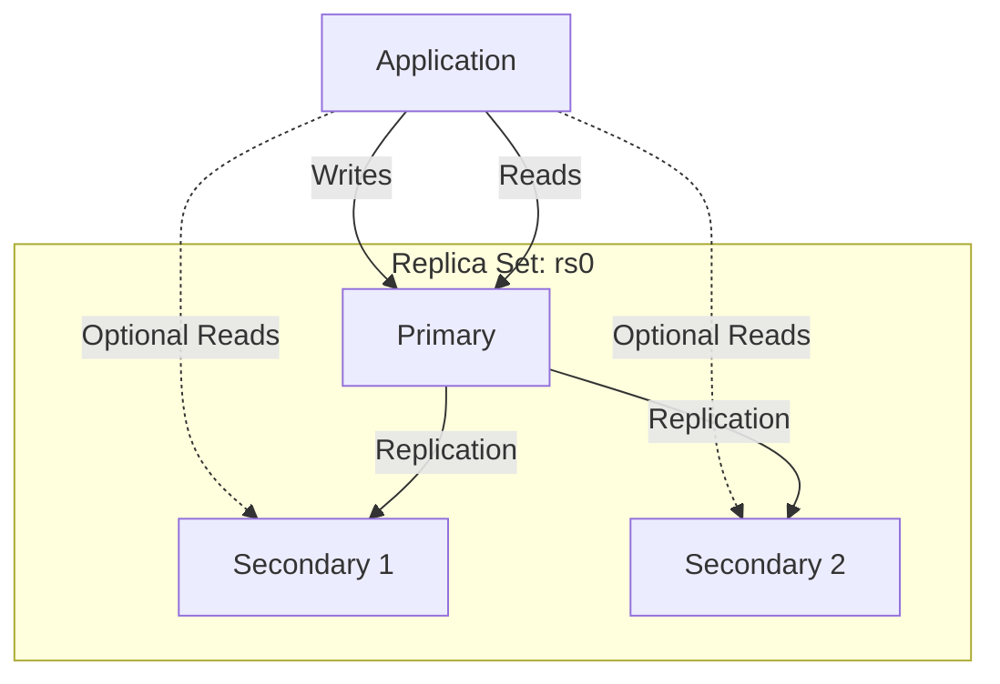
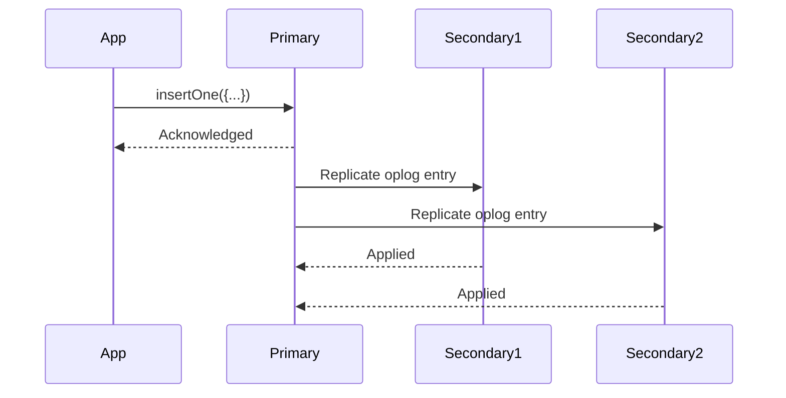
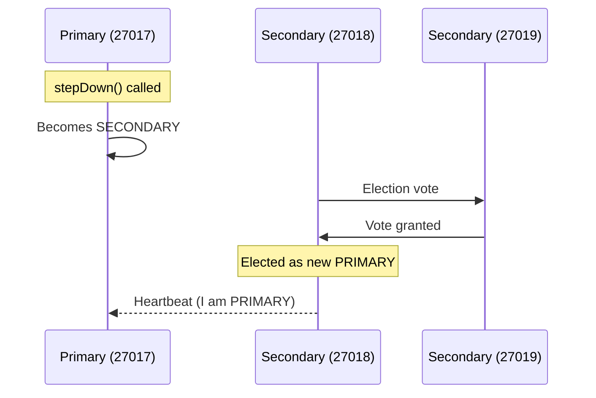

# How to Set Up MongoDB Replica Sets for High Availability

Author: [nawazdhandala](https://www.github.com/nawazdhandala)

Tags: MongoDB, Replica Sets, High Availability, Replication, Database

Description: Step-by-step guide to setting up MongoDB replica sets for high availability, automatic failover, and read scaling.

---

A single MongoDB instance is a single point of failure. If it crashes, your application goes down. MongoDB replica sets solve this by maintaining multiple copies of your data across different servers. If the primary fails, a secondary is automatically elected as the new primary within seconds.

This post walks through setting up a production-ready MongoDB replica set, configuring read preferences, and handling failover.

## How Replica Sets Work

A replica set is a group of MongoDB instances that maintain the same data. One node is the primary (handles all writes), and the others are secondaries (replicate data from the primary).



When the primary goes down, the remaining secondaries hold an election and promote one of themselves to primary. This happens automatically in a few seconds.

## Step 1: Prepare the Configuration

Create configuration files for each member. In production, each member should run on a separate server. For this guide, we use different ports on the same machine.

```bash
# Create data directories for each member
mkdir -p /data/rs0-0 /data/rs0-1 /data/rs0-2
```

```yaml
# mongod-0.conf - Primary candidate
storage:
  dbPath: /data/rs0-0
  # Enable the WiredTiger storage engine
  engine: wiredTiger
  wiredTiger:
    engineConfig:
      # Cache size - set to 50% of available RAM on dedicated servers
      cacheSizeGB: 1

net:
  port: 27017
  bindIp: 0.0.0.0

replication:
  # All members must use the same replica set name
  replSetName: rs0
  # Oplog size in MB - larger means more time to recover
  oplogSizeMB: 2048

systemLog:
  destination: file
  path: /var/log/mongodb/mongod-0.log
  logAppend: true

security:
  # Enable authentication in production
  # keyFile: /etc/mongodb/keyfile
```

```yaml
# mongod-1.conf - Secondary
storage:
  dbPath: /data/rs0-1
  engine: wiredTiger
  wiredTiger:
    engineConfig:
      cacheSizeGB: 1

net:
  port: 27018
  bindIp: 0.0.0.0

replication:
  replSetName: rs0
  oplogSizeMB: 2048

systemLog:
  destination: file
  path: /var/log/mongodb/mongod-1.log
  logAppend: true
```

```yaml
# mongod-2.conf - Secondary
storage:
  dbPath: /data/rs0-2
  engine: wiredTiger
  wiredTiger:
    engineConfig:
      cacheSizeGB: 1

net:
  port: 27019
  bindIp: 0.0.0.0

replication:
  replSetName: rs0
  oplogSizeMB: 2048

systemLog:
  destination: file
  path: /var/log/mongodb/mongod-2.log
  logAppend: true
```

## Step 2: Start All Instances

```bash
# Start each MongoDB instance with its configuration
mongod --config /etc/mongodb/mongod-0.conf --fork
mongod --config /etc/mongodb/mongod-1.conf --fork
mongod --config /etc/mongodb/mongod-2.conf --fork

# Verify all instances are running
mongosh --port 27017 --eval "db.runCommand({ping: 1})"
mongosh --port 27018 --eval "db.runCommand({ping: 1})"
mongosh --port 27019 --eval "db.runCommand({ping: 1})"
```

## Step 3: Initialize the Replica Set

Connect to one of the instances and initialize the replica set.

```javascript
// Connect to the first instance
// mongosh --port 27017

// Initialize the replica set with all three members
rs.initiate({
    _id: "rs0",
    members: [
        {
            _id: 0,
            host: "mongo-0.example.com:27017",
            // Higher priority means more likely to be elected primary
            priority: 2
        },
        {
            _id: 1,
            host: "mongo-1.example.com:27018",
            priority: 1
        },
        {
            _id: 2,
            host: "mongo-2.example.com:27019",
            priority: 1
        }
    ]
})

// Check the replica set status
rs.status()

// You should see one PRIMARY and two SECONDARY members
```

## Step 4: Verify Replication

```javascript
// On the PRIMARY, insert a test document
db.test.insertOne({ message: "hello from primary", ts: new Date() })

// On a SECONDARY, verify the document was replicated
// First, allow reads on the secondary
db.getMongo().setReadPref("secondary")
db.test.find()
// Should return: { message: "hello from primary", ts: ... }
```



## Step 5: Configure Write Concern

Write concern controls how many replica set members must acknowledge a write before it is considered successful.

```python
from pymongo import MongoClient, WriteConcern

# Connect to the replica set
client = MongoClient(
    "mongodb://mongo-0:27017,mongo-1:27018,mongo-2:27019",
    replicaSet="rs0"
)

db = client["myapp"]

# Default write concern: acknowledged by primary only (w=1)
# Fast but data could be lost if primary crashes before replication
db_default = db.with_options(
    write_concern=WriteConcern(w=1)
)

# Majority write concern: acknowledged by majority of members
# Slower but guarantees data survives a primary failure
db_majority = db.with_options(
    write_concern=WriteConcern(w="majority", wtimeout=5000)
)

# Use majority for critical data
db_majority.users.insert_one({
    "name": "Alice",
    "email": "alice@example.com"
})

# Use w=1 for less critical data (e.g., logs)
db_default.logs.insert_one({
    "level": "info",
    "message": "User logged in",
    "timestamp": "2026-02-20T10:00:00Z"
})
```

## Step 6: Configure Read Preferences

Read preferences control which members handle read operations.

```python
from pymongo import ReadPreference

# Primary: All reads go to the primary (default)
# Strongest consistency but no read scaling
coll_primary = db.users.with_options(
    read_preference=ReadPreference.PRIMARY
)

# Secondary Preferred: Read from secondaries when available
# Good for read scaling, but data may be slightly behind
coll_secondary = db.users.with_options(
    read_preference=ReadPreference.SECONDARY_PREFERRED
)

# Nearest: Read from the member with the lowest network latency
# Best for geographically distributed replica sets
coll_nearest = db.users.with_options(
    read_preference=ReadPreference.NEAREST
)

# Example: Use secondary reads for analytics queries
def get_user_stats():
    """
    Run analytics on a secondary to avoid impacting
    the primary's write performance.
    """
    pipeline = [
        {"$group": {
            "_id": "$country",
            "count": {"$sum": 1}
        }},
        {"$sort": {"count": -1}}
    ]
    # This query runs on a secondary
    return list(coll_secondary.aggregate(pipeline))
```

## Step 7: Test Failover

```bash
# Connect to the primary and step it down
mongosh --port 27017 --eval "rs.stepDown(60)"

# Watch the election happen
mongosh --port 27018 --eval "rs.status().members.forEach(m => print(m.name + ': ' + m.stateStr))"

# Expected output:
# mongo-0:27017: SECONDARY
# mongo-1:27018: PRIMARY (or mongo-2 becomes primary)
# mongo-2:27019: SECONDARY
```



## Monitoring Replica Set Health

```python
def check_replication_health(client: MongoClient) -> dict:
    """
    Check the health of the replica set.
    Monitor replication lag and member states.
    """
    admin = client.admin
    status = admin.command("replSetGetStatus")

    primary_optime = None
    members_status = []

    for member in status["members"]:
        info = {
            "name": member["name"],
            "state": member["stateStr"],
            "health": member["health"],
            "uptime_seconds": member.get("uptime", 0),
        }

        if member["stateStr"] == "PRIMARY":
            primary_optime = member["optimeDate"]
            info["role"] = "PRIMARY"
        elif member["stateStr"] == "SECONDARY":
            info["role"] = "SECONDARY"
            # Calculate replication lag
            if primary_optime and "optimeDate" in member:
                lag = (primary_optime - member["optimeDate"]).total_seconds()
                info["replication_lag_seconds"] = lag

        members_status.append(info)

    return {
        "set_name": status["set"],
        "members": members_status,
        "ok": status["ok"]
    }
```

## Production Checklist

1. **Always use an odd number of members** (3, 5, or 7) to ensure elections can reach a majority.
2. **Spread members across availability zones** so a zone failure does not take down the entire set.
3. **Use keyfile or x509 authentication** between members.
4. **Set appropriate oplog size** - at least 24 hours of operations to allow time for recovery.
5. **Monitor replication lag** - if secondaries fall too far behind, they may need a full resync.
6. **Test failover regularly** - do not wait for a real outage to find out your failover does not work.

## Conclusion

MongoDB replica sets give you high availability and automatic failover with minimal configuration. Start with three members, use majority write concern for critical data, and route analytics queries to secondaries. Test failover before you go to production and monitor replication lag continuously.

To monitor your MongoDB replica sets, track replication lag, and get alerted on failover events, [OneUptime](https://oneuptime.com) provides comprehensive database monitoring with real-time metrics, automated alerts, and incident management - all in one open-source platform.
