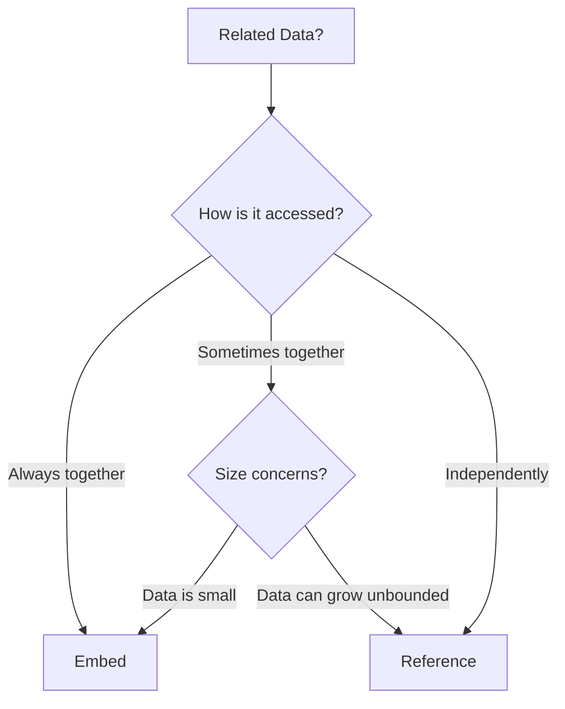
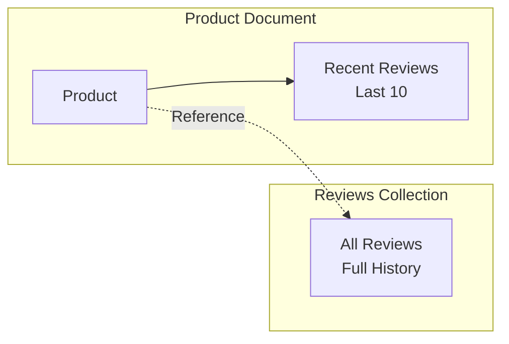
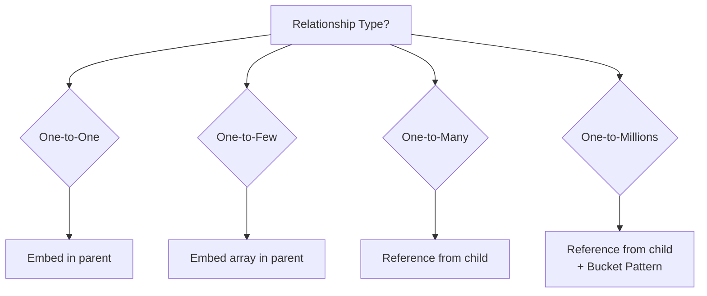

# How to Design MongoDB Schemas for Real-World Applications

Author: [nawazdhandala](https://www.github.com/nawazdhandala)

Tags: MongoDB, Schema Design, Data Modeling, Patterns, NoSQL

Description: Learn MongoDB schema design patterns including embedding, referencing, and denormalization for real-world applications.

---

MongoDB does not enforce a schema at the database level, but that does not mean you should skip schema design. In fact, poor schema design in MongoDB leads to worse performance problems than in relational databases, because there is no query optimizer to save you from bad data layouts.

This post covers the fundamental MongoDB schema design patterns: embedding, referencing, and several real-world patterns that help you model data for how your application actually uses it.

## The Core Question: Embed or Reference?

Every MongoDB schema decision comes down to this: should you embed related data inside a document, or store it in a separate collection and reference it by ID?



## Pattern 1: Embedding (Denormalization)

Embed related data directly inside the parent document. This is the default choice when data is read together.

```javascript
// Embedded schema: User with address
// Good when addresses are always read with the user
{
    "_id": ObjectId("64a1b2c3d4e5f6a7b8c9d0e1"),
    "name": "Alice Johnson",
    "email": "alice@example.com",
    // Address is embedded directly in the user document
    "address": {
        "street": "123 Main St",
        "city": "Portland",
        "state": "OR",
        "zip": "97201"
    },
    // Small, bounded arrays work well embedded
    "phone_numbers": [
        { "type": "mobile", "number": "+1-555-0100" },
        { "type": "work", "number": "+1-555-0200" }
    ]
}
```

**When to embed**:
- Data is read together in a single query
- The embedded data is small and bounded
- One-to-few relationships (1 user has 1-3 addresses)

**When not to embed**:
- The embedded array can grow without limit
- The embedded data is accessed independently
- The document would exceed the 16MB document size limit

## Pattern 2: Referencing (Normalization)

Store related data in separate collections and link them by ID. This is the right choice for large or independently accessed data.

```javascript
// Users collection
{
    "_id": ObjectId("64a1b2c3d4e5f6a7b8c9d0e1"),
    "name": "Alice Johnson",
    "email": "alice@example.com"
}

// Orders collection - references the user by ID
{
    "_id": ObjectId("74b2c3d4e5f6a7b8c9d0e1f2"),
    "user_id": ObjectId("64a1b2c3d4e5f6a7b8c9d0e1"),
    "items": [
        { "product": "Laptop", "price": 999.99, "quantity": 1 },
        { "product": "Mouse", "price": 29.99, "quantity": 2 }
    ],
    "total": 1059.97,
    "status": "shipped",
    "created_at": ISODate("2026-02-15T10:30:00Z")
}
```

```python
from pymongo import MongoClient

client = MongoClient("mongodb://localhost:27017")
db = client["myapp"]

def get_user_with_orders(user_id):
    """
    Fetch a user and their orders using two queries.
    This is the trade-off of referencing: more queries, but cleaner data.
    """
    # Query 1: Get the user
    user = db.users.find_one({"_id": user_id})

    # Query 2: Get the user's orders
    orders = list(db.orders.find(
        {"user_id": user_id}
    ).sort("created_at", -1))

    user["orders"] = orders
    return user


def get_user_with_orders_aggregation(user_id):
    """
    Use $lookup to join users and orders in a single query.
    This is MongoDB's equivalent of a SQL JOIN.
    """
    pipeline = [
        # Match the specific user
        {"$match": {"_id": user_id}},
        # Join with the orders collection
        {
            "$lookup": {
                "from": "orders",
                "localField": "_id",
                "foreignField": "user_id",
                "as": "orders"
            }
        }
    ]
    result = list(db.users.aggregate(pipeline))
    return result[0] if result else None
```

## Pattern 3: Subset Pattern

When a document contains a large array but you usually only need the most recent items, store a subset in the parent and the full history in a separate collection.



```javascript
// Product document with the 10 most recent reviews embedded
{
    "_id": ObjectId("product_123"),
    "name": "Wireless Keyboard",
    "price": 79.99,
    "rating_avg": 4.5,
    "review_count": 1247,
    // Only the latest 10 reviews are embedded
    "recent_reviews": [
        {
            "user": "Bob",
            "rating": 5,
            "text": "Great keyboard!",
            "date": ISODate("2026-02-19T08:00:00Z")
        },
        {
            "user": "Carol",
            "rating": 4,
            "text": "Good but pricey",
            "date": ISODate("2026-02-18T14:00:00Z")
        }
        // ... up to 10 reviews
    ]
}

// Separate reviews collection for full history
{
    "_id": ObjectId("review_456"),
    "product_id": ObjectId("product_123"),
    "user": "Bob",
    "rating": 5,
    "text": "Great keyboard!",
    "date": ISODate("2026-02-19T08:00:00Z")
}
```

```python
def add_review(product_id, review):
    """
    Add a review to both the full collection and the product's
    embedded subset. Keep only the 10 most recent in the product.
    """
    # Insert into the full reviews collection
    db.reviews.insert_one({
        "product_id": product_id,
        **review
    })

    # Update the product's embedded subset
    # $push with $slice keeps only the latest 10 reviews
    db.products.update_one(
        {"_id": product_id},
        {
            "$push": {
                "recent_reviews": {
                    "$each": [review],
                    # Sort by date descending
                    "$sort": {"date": -1},
                    # Keep only the 10 most recent
                    "$slice": 10
                }
            },
            "$inc": {"review_count": 1}
        }
    )
```

## Pattern 4: Bucket Pattern

Group related time-series data into buckets to reduce document count and improve query performance.

```python
def record_metric(sensor_id: str, value: float, timestamp):
    """
    Bucket pattern: group hourly readings into a single document.
    Instead of one document per reading, store many readings per bucket.
    """
    # Create a bucket key based on the hour
    bucket_date = timestamp.replace(minute=0, second=0, microsecond=0)

    db.metrics.update_one(
        {
            "sensor_id": sensor_id,
            "bucket": bucket_date,
            # Only add to buckets with fewer than 60 entries
            "count": {"$lt": 60}
        },
        {
            "$push": {
                "readings": {
                    "value": value,
                    "timestamp": timestamp
                }
            },
            "$inc": {"count": 1},
            "$min": {"min_value": value},
            "$max": {"max_value": value},
            "$setOnInsert": {
                "sensor_id": sensor_id,
                "bucket": bucket_date
            }
        },
        upsert=True
    )
```

## Pattern 5: Computed Pattern

Pre-compute values that are expensive to calculate on every read.

```python
def update_product_stats(product_id):
    """
    Computed pattern: pre-calculate statistics so reads are fast.
    Run this after adding a review instead of calculating on every read.
    """
    pipeline = [
        {"$match": {"product_id": product_id}},
        {
            "$group": {
                "_id": None,
                "avg_rating": {"$avg": "$rating"},
                "total_reviews": {"$sum": 1},
                # Count reviews per rating
                "five_star": {
                    "$sum": {"$cond": [{"$eq": ["$rating", 5]}, 1, 0]}
                },
                "one_star": {
                    "$sum": {"$cond": [{"$eq": ["$rating", 1]}, 1, 0]}
                }
            }
        }
    ]

    stats = list(db.reviews.aggregate(pipeline))
    if stats:
        # Store the computed values on the product document
        db.products.update_one(
            {"_id": product_id},
            {
                "$set": {
                    "rating_avg": round(stats[0]["avg_rating"], 2),
                    "review_count": stats[0]["total_reviews"],
                    "rating_distribution": {
                        "five_star": stats[0]["five_star"],
                        "one_star": stats[0]["one_star"]
                    }
                }
            }
        )
```

## Schema Design Cheat Sheet



| Relationship | Strategy | Example |
|-------------|----------|---------|
| One-to-One | Embed | User and profile |
| One-to-Few (< 100) | Embed array | User and addresses |
| One-to-Many (100-10K) | Reference | User and orders |
| One-to-Millions (> 10K) | Reference + Bucket | Sensor and readings |

## Common Mistakes

1. **Unbounded arrays**: Never embed an array that can grow without limit. It will hit the 16MB document limit.
2. **Over-normalizing**: MongoDB is not a relational database. If you have 10 collections with JOINs everywhere, you are using it wrong.
3. **Ignoring read patterns**: Design your schema for how you read data, not how it looks in an ER diagram.
4. **No indexes**: Schema design and indexing go hand in hand. A good schema with bad indexes is still slow.

## Conclusion

MongoDB schema design is about matching your data model to your access patterns. Embed data that is read together, reference data that is accessed independently, and use patterns like Subset, Bucket, and Computed to handle common scenarios efficiently. Always start by listing your queries, then design the schema to serve them.

To monitor your MongoDB performance, track slow queries, and get alerted on replication lag, [OneUptime](https://oneuptime.com) provides full database observability with metrics, logs, and alerting. It is open source and helps you keep your MongoDB instances healthy and performant.
