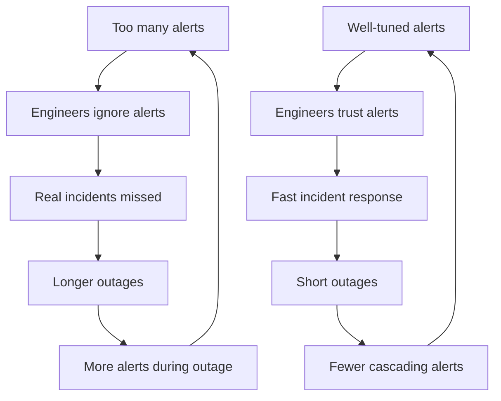
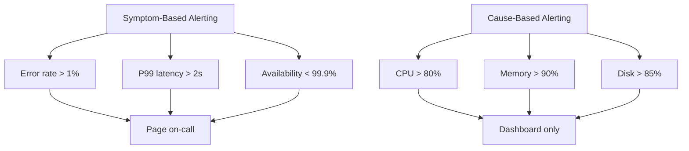
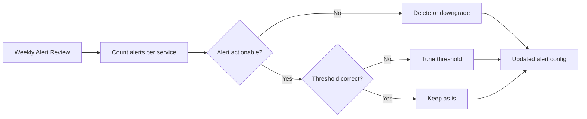

# Monitoring and Alerting Best Practices to Reduce Alert Fatigue

Author: [nawazdhandala](https://www.github.com/nawazdhandala)

Tags: Monitoring, Alerting, Best Practices, Alert Fatigue, SRE

Description: Best practices for monitoring and alerting to reduce alert fatigue including alert severity, routing, and actionable alerts.

---

Alert fatigue is one of the biggest problems in operations. When on-call engineers receive hundreds of alerts per day, they stop paying attention. Critical alerts get lost in the noise, and real incidents go unnoticed. This guide covers practical strategies to make your alerts meaningful, actionable, and manageable.

## The Alert Fatigue Problem



## Principle 1: Every Alert Must Be Actionable

If an alert fires and the on-call engineer cannot take a specific action to resolve it, the alert should not exist. Alerts that say "CPU is high" are not actionable. Alerts that say "Order processing service is dropping requests due to CPU saturation - scale up or investigate runaway process" are actionable.

```yaml
# alert_rules.yaml
# Example of non-actionable vs actionable alerts

groups:
  - name: bad_alerts
    rules:
      # BAD: Not actionable - what should the engineer do?
      - alert: HighCPU
        expr: node_cpu_usage > 80
        labels:
          severity: warning
        annotations:
          summary: "CPU is high on {{ $labels.instance }}"

  - name: good_alerts
    rules:
      # GOOD: Actionable with clear impact and remediation
      - alert: OrderServiceCPUSaturation
        expr: |
          (
            rate(container_cpu_usage_seconds_total{service="order-service"}[5m])
            / container_spec_cpu_quota{service="order-service"}
          ) > 0.85
        for: 10m
        labels:
          severity: critical
          team: order-platform
        annotations:
          summary: "Order service CPU at {{ $value | humanizePercentage }}"
          impact: "Order processing latency increasing. Customers may see slow checkouts."
          runbook: "https://runbooks.internal/order-service/cpu-saturation"
          remediation: "1. Check for runaway queries. 2. Scale HPA. 3. Check recent deployments."
```

## Principle 2: Use Severity Levels Correctly

Define clear severity levels and route them appropriately. Not every alert needs to wake someone up at 3 AM.

```python
# alert_severity.py
# Define clear severity levels with routing rules

from enum import Enum
from dataclasses import dataclass
from typing import List

class Severity(Enum):
    # Page on-call immediately, wake them up
    CRITICAL = "critical"
    # Notify on-call during work hours, needs attention today
    WARNING = "warning"
    # Create a ticket, handle in next sprint
    INFO = "info"

@dataclass
class AlertRoute:
    severity: Severity
    channels: List[str]
    escalation_minutes: int
    auto_resolve_minutes: int

# Define routing rules for each severity level
ROUTING_RULES = {
    Severity.CRITICAL: AlertRoute(
        severity=Severity.CRITICAL,
        channels=["pagerduty", "slack-critical"],
        # Escalate to next person after 15 minutes
        escalation_minutes=15,
        # Do not auto-resolve critical alerts
        auto_resolve_minutes=0
    ),
    Severity.WARNING: AlertRoute(
        severity=Severity.WARNING,
        channels=["slack-warnings"],
        # Escalate after 2 hours
        escalation_minutes=120,
        # Auto-resolve if condition clears within 30 minutes
        auto_resolve_minutes=30
    ),
    Severity.INFO: AlertRoute(
        severity=Severity.INFO,
        channels=["jira-ticket"],
        # No escalation for info alerts
        escalation_minutes=0,
        # Auto-resolve after 24 hours
        auto_resolve_minutes=1440
    ),
}


def route_alert(alert_name, severity, labels):
    """Route an alert based on its severity."""
    route = ROUTING_RULES.get(severity)
    if not route:
        raise ValueError(f"Unknown severity: {severity}")

    for channel in route.channels:
        send_to_channel(channel, alert_name, severity, labels)

    return route


def send_to_channel(channel, alert_name, severity, labels):
    """Send alert notification to a specific channel."""
    print(f"Sending {severity.value} alert '{alert_name}' to {channel}")
```

## Principle 3: Alert on Symptoms, Not Causes

Alert on what users experience, not on internal system metrics. Users do not care about your CPU usage. They care about whether the service is fast and correct.



```yaml
# symptom_alerts.yaml
# Alert on user-facing symptoms, not internal causes

groups:
  - name: symptom_alerts
    rules:
      # Alert when users experience errors
      - alert: HighUserErrorRate
        expr: |
          sum(rate(http_requests_total{status=~"5.."}[5m]))
          /
          sum(rate(http_requests_total[5m]))
          > 0.01
        for: 5m
        labels:
          severity: critical
        annotations:
          summary: "User error rate is {{ $value | humanizePercentage }}"
          impact: "Users are seeing errors on the platform"

      # Alert when checkout flow is degraded
      - alert: CheckoutLatencyHigh
        expr: |
          histogram_quantile(0.95,
            rate(http_request_duration_seconds_bucket{endpoint="/api/checkout"}[5m])
          ) > 3.0
        for: 5m
        labels:
          severity: critical
        annotations:
          summary: "Checkout P95 latency is {{ $value }}s"
          impact: "Customers experiencing slow checkouts, risk of cart abandonment"
```

## Principle 4: Set Proper Thresholds with Burn Rate Alerts

Instead of alerting on raw thresholds, use burn rate alerts that measure how quickly you are consuming your error budget.

```python
# burn_rate.py
# Calculate error budget burn rate for SLO-based alerting

from dataclasses import dataclass

@dataclass
class SLOConfig:
    # Target availability (e.g., 99.9%)
    target: float
    # Window in days (e.g., 30 days)
    window_days: int

def calculate_burn_rate(slo, current_error_rate):
    """
    Calculate the burn rate for an SLO.

    Burn rate = actual error rate / allowed error rate
    A burn rate of 1.0 means you will exactly exhaust your budget.
    A burn rate of 2.0 means you will exhaust your budget in half the time.
    """
    # Allowed error rate based on SLO target
    allowed_error_rate = 1.0 - slo.target

    # Current burn rate
    burn_rate = current_error_rate / allowed_error_rate

    # Hours until budget is exhausted at this rate
    hours_remaining = (slo.window_days * 24) / burn_rate if burn_rate > 0 else float("inf")

    return burn_rate, hours_remaining


# Example: 99.9% SLO over 30 days
slo = SLOConfig(target=0.999, window_days=30)

# If current error rate is 0.2% (0.002)
burn_rate, hours_left = calculate_burn_rate(slo, 0.002)
# burn_rate = 0.002 / 0.001 = 2.0
# At 2x burn rate, budget exhausted in 15 days instead of 30
print(f"Burn rate: {burn_rate}x, Budget exhausted in {hours_left:.0f} hours")
```

## Principle 5: Group and Deduplicate Alerts

When a service goes down, you do not want 50 separate alerts for every failing health check. Group related alerts and deduplicate them.

```python
# alert_grouping.py
# Group related alerts to reduce noise

from collections import defaultdict
import time

class AlertGrouper:
    def __init__(self, group_window_seconds=300):
        # Time window for grouping related alerts
        self.group_window = group_window_seconds
        # Active alert groups: group_key -> list of alerts
        self.groups = defaultdict(list)
        # Timestamp of first alert in each group
        self.group_start = {}

    def add_alert(self, alert):
        """Add an alert, grouping it with related alerts."""
        # Create a group key from service and alert type
        group_key = f"{alert['service']}:{alert['alert_name']}"

        now = time.time()

        # Check if this group is still within the window
        if group_key in self.group_start:
            elapsed = now - self.group_start[group_key]
            if elapsed > self.group_window:
                # Window expired, send grouped notification and start new group
                self._send_group(group_key)
                self.groups[group_key] = []
                self.group_start[group_key] = now
        else:
            self.group_start[group_key] = now

        # Add alert to its group
        self.groups[group_key].append(alert)

        # If this is the first alert in the group, send immediately
        if len(self.groups[group_key]) == 1:
            self._send_single(alert)

    def _send_group(self, group_key):
        """Send a grouped alert summary."""
        alerts = self.groups[group_key]
        if len(alerts) > 1:
            print(
                f"Alert group '{group_key}': "
                f"{len(alerts)} occurrences in the last "
                f"{self.group_window}s"
            )

    def _send_single(self, alert):
        """Send a single alert notification."""
        print(f"Alert: {alert['alert_name']} on {alert['service']}")
```

## Principle 6: Maintain Runbooks

Every alert should link to a runbook that tells the on-call engineer what to do.

```markdown
## Runbook: HighUserErrorRate

### What is this alert?
The user-facing error rate has exceeded 1% for at least 5 minutes.

### Impact
Users are experiencing errors. This directly affects revenue and user trust.

### Investigation steps
1. Check which endpoints are returning errors:
   `sum by (endpoint) (rate(http_requests_total{status=~"5.."}[5m]))`
2. Check recent deployments in the last 2 hours
3. Check downstream service health
4. Check database connectivity and query latency

### Remediation
- If caused by a bad deployment: roll back
- If caused by a downstream service: check that service status
- If caused by database issues: check connection pool and query performance

### Escalation
If not resolved within 30 minutes, escalate to the service owner.
```

## Alert Review Process

Schedule regular alert reviews to prune noisy alerts and improve signal quality.



With **OneUptime**, you can implement all of these alerting best practices out of the box. Define severity levels, set up intelligent alert routing, configure on-call schedules with escalation policies, and reduce alert fatigue with built-in grouping and deduplication. OneUptime helps your team focus on the alerts that matter.
