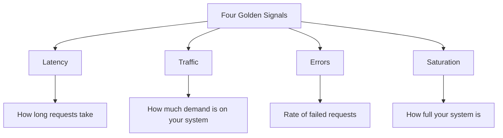
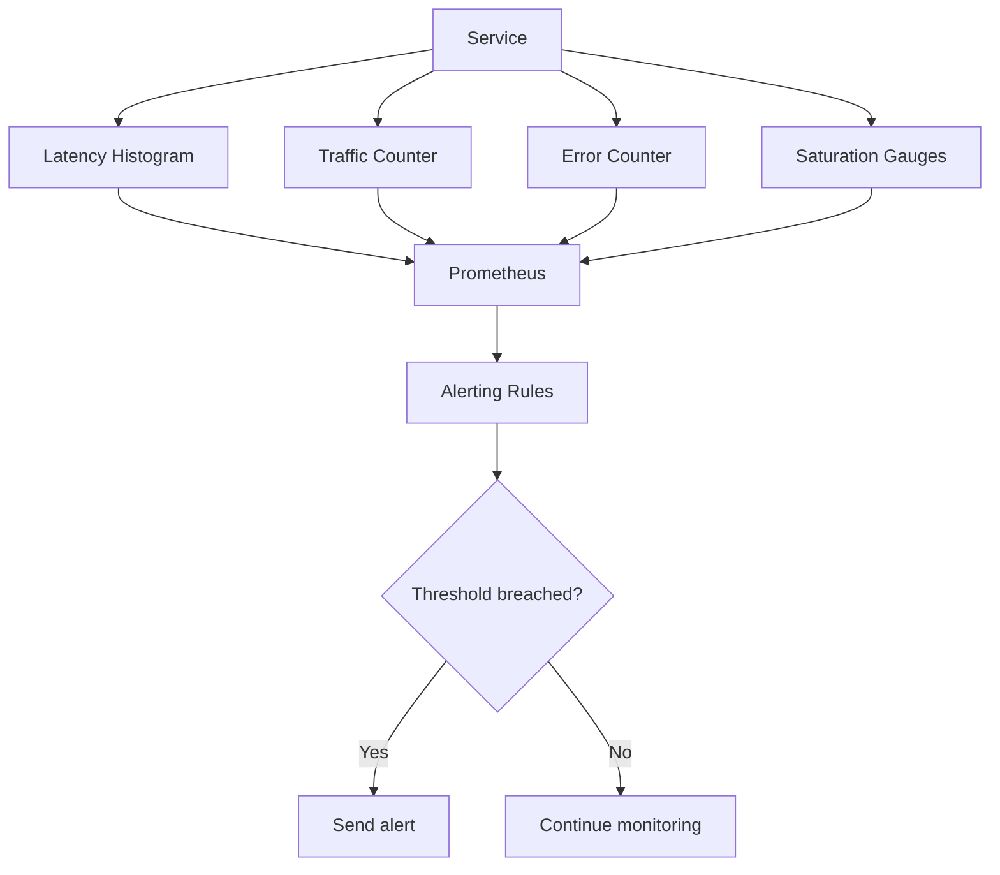

# How to Implement the Four Golden Signals of Monitoring

Author: [nawazdhandala](https://www.github.com/nawazdhandala)

Tags: Monitoring, Golden Signals, SRE, Observability, Metrics

Description: Learn how to implement the four golden signals of monitoring - latency, traffic, errors, and saturation - for your services.

---

The Four Golden Signals, defined in Google's SRE book, are the most important metrics to monitor for any user-facing system. If you can only monitor four things, monitor these: latency, traffic, errors, and saturation. This guide shows you how to implement each one with practical code examples.

## The Four Golden Signals



## Signal 1: Latency

Latency measures the time it takes to serve a request. It is important to distinguish between the latency of successful requests and failed requests. A fast error is not a good response.

```python
# latency_metrics.py
# Track request latency with Prometheus histograms

from prometheus_client import Histogram, Summary
import time
from functools import wraps

# Histogram for request duration with predefined buckets
# Buckets are in seconds: 5ms, 10ms, 25ms, 50ms, 100ms, 250ms, 500ms, 1s, 5s
request_latency = Histogram(
    "http_request_duration_seconds",
    "HTTP request latency in seconds",
    ["method", "endpoint", "status_code"],
    buckets=[0.005, 0.01, 0.025, 0.05, 0.1, 0.25, 0.5, 1.0, 5.0]
)

# Separate histogram for downstream service call latency
downstream_latency = Histogram(
    "downstream_call_duration_seconds",
    "Latency of calls to downstream services",
    ["service", "method"],
    buckets=[0.01, 0.05, 0.1, 0.25, 0.5, 1.0, 2.5, 5.0, 10.0]
)

def track_latency(endpoint):
    """Decorator to track endpoint latency."""
    def decorator(func):
        @wraps(func)
        async def wrapper(request, *args, **kwargs):
            # Record start time
            start = time.perf_counter()
            try:
                response = await func(request, *args, **kwargs)
                status = response.status_code
                return response
            except Exception as e:
                status = 500
                raise
            finally:
                # Record the duration regardless of success or failure
                duration = time.perf_counter() - start
                request_latency.labels(
                    method=request.method,
                    endpoint=endpoint,
                    status_code=str(status)
                ).observe(duration)
        return wrapper
    return decorator
```

## Signal 2: Traffic

Traffic measures how much demand is being placed on your system. For a web service, this is typically measured as HTTP requests per second. For other systems, it might be transactions, messages, or sessions.

```python
# traffic_metrics.py
# Track request traffic volume

from prometheus_client import Counter, Gauge
import time

# Count total requests by endpoint and method
request_count = Counter(
    "http_requests_total",
    "Total HTTP requests",
    ["method", "endpoint"]
)

# Track currently active requests (in-flight)
active_requests = Gauge(
    "http_requests_in_flight",
    "Number of HTTP requests currently being processed",
    ["endpoint"]
)

# Track request size for bandwidth monitoring
request_size = Counter(
    "http_request_size_bytes_total",
    "Total bytes received in requests",
    ["endpoint"]
)

# Track response size
response_size = Counter(
    "http_response_size_bytes_total",
    "Total bytes sent in responses",
    ["endpoint"]
)


class TrafficTracker:
    """Middleware to track traffic metrics."""

    async def __call__(self, request, call_next):
        endpoint = request.url.path

        # Increment total request counter
        request_count.labels(
            method=request.method,
            endpoint=endpoint
        ).inc()

        # Track in-flight requests
        active_requests.labels(endpoint=endpoint).inc()

        # Track request body size
        body = await request.body()
        request_size.labels(endpoint=endpoint).inc(len(body))

        try:
            response = await call_next(request)

            # Track response size from content-length header
            content_length = response.headers.get("content-length", 0)
            response_size.labels(endpoint=endpoint).inc(int(content_length))

            return response
        finally:
            # Decrement in-flight counter when request completes
            active_requests.labels(endpoint=endpoint).dec()
```

## Signal 3: Errors

Errors measure the rate of requests that fail. This includes explicit errors (HTTP 5xx responses), implicit errors (HTTP 200 with wrong content), and policy errors (responses that exceed a latency SLO).

```python
# error_metrics.py
# Track error rates and types

from prometheus_client import Counter
from enum import Enum

class ErrorType(Enum):
    # Server returned an error status code
    EXPLICIT = "explicit"
    # Server returned 200 but response was wrong
    IMPLICIT = "implicit"
    # Response was correct but too slow
    POLICY = "policy"

# Count errors by type and endpoint
error_count = Counter(
    "http_errors_total",
    "Total HTTP errors",
    ["endpoint", "error_type", "status_code"]
)

# Count errors by root cause category
error_cause = Counter(
    "error_by_cause_total",
    "Errors categorized by root cause",
    ["cause"]
)


def record_error(endpoint, error_type, status_code, cause=None):
    """Record an error occurrence."""
    error_count.labels(
        endpoint=endpoint,
        error_type=error_type.value,
        status_code=str(status_code)
    ).inc()

    if cause:
        error_cause.labels(cause=cause).inc()


def check_response_validity(endpoint, response, duration, slo_seconds=1.0):
    """Check if a response is valid beyond just status code."""
    status = response.status_code

    # Check for explicit errors (5xx)
    if status >= 500:
        record_error(endpoint, ErrorType.EXPLICIT, status, cause="server_error")
        return False

    # Check for client errors that indicate server issues
    if status == 429:
        record_error(endpoint, ErrorType.EXPLICIT, status, cause="rate_limited")
        return False

    # Check for implicit errors (200 but empty or malformed body)
    if status == 200:
        body = response.json()
        if body is None or "error" in body:
            record_error(endpoint, ErrorType.IMPLICIT, status, cause="bad_response")
            return False

    # Check for policy errors (too slow)
    if duration > slo_seconds:
        record_error(endpoint, ErrorType.POLICY, status, cause="slo_violation")
        return False

    return True
```

## Signal 4: Saturation

Saturation measures how full your service is. It focuses on the resources that are most constrained - CPU, memory, disk, or network. The goal is to detect when you are approaching capacity limits before performance degrades.

```python
# saturation_metrics.py
# Track system resource saturation

import psutil
from prometheus_client import Gauge

# CPU utilization as a percentage
cpu_usage = Gauge(
    "system_cpu_usage_percent",
    "Current CPU usage percentage"
)

# Memory utilization as a percentage
memory_usage = Gauge(
    "system_memory_usage_percent",
    "Current memory usage percentage"
)

# Disk utilization as a percentage
disk_usage = Gauge(
    "system_disk_usage_percent",
    "Current disk usage percentage",
    ["mount_point"]
)

# Open file descriptor count vs limit
fd_usage = Gauge(
    "process_fd_usage_ratio",
    "Ratio of used to available file descriptors"
)

# Thread pool saturation
thread_pool_usage = Gauge(
    "thread_pool_active_ratio",
    "Ratio of active threads to max threads",
    ["pool_name"]
)


def collect_saturation_metrics():
    """Collect current system saturation metrics."""
    # CPU usage averaged over 1 second
    cpu_usage.set(psutil.cpu_percent(interval=1))

    # Memory usage percentage
    mem = psutil.virtual_memory()
    memory_usage.set(mem.percent)

    # Disk usage for each mount point
    for partition in psutil.disk_partitions():
        try:
            usage = psutil.disk_usage(partition.mountpoint)
            disk_usage.labels(
                mount_point=partition.mountpoint
            ).set(usage.percent)
        except PermissionError:
            continue

    # File descriptor usage (Linux)
    import resource
    soft_limit, hard_limit = resource.getrlimit(resource.RLIMIT_NOFILE)
    import os
    current_fds = len(os.listdir(f"/proc/{os.getpid()}/fd"))
    fd_usage.set(current_fds / soft_limit)
```

## Putting It All Together



## Alerting on Golden Signals

Define alerts based on SLOs rather than arbitrary thresholds:

```yaml
# prometheus_alerts.yaml
# Alert rules for the four golden signals

groups:
  - name: golden_signals
    rules:
      # Latency: Alert when p99 latency exceeds 1 second
      - alert: HighLatency
        expr: histogram_quantile(0.99, rate(http_request_duration_seconds_bucket[5m])) > 1.0
        for: 5m
        labels:
          severity: warning
        annotations:
          summary: "P99 latency exceeds 1 second"

      # Traffic: Alert on unusual traffic drop (possible outage)
      - alert: TrafficDrop
        expr: rate(http_requests_total[5m]) < 0.1 * rate(http_requests_total[1h] offset 1d)
        for: 10m
        labels:
          severity: critical
        annotations:
          summary: "Traffic dropped by over 90% compared to yesterday"

      # Errors: Alert when error rate exceeds 1%
      - alert: HighErrorRate
        expr: sum(rate(http_errors_total[5m])) / sum(rate(http_requests_total[5m])) > 0.01
        for: 5m
        labels:
          severity: critical
        annotations:
          summary: "Error rate exceeds 1%"

      # Saturation: Alert when CPU or memory is high
      - alert: HighCPU
        expr: system_cpu_usage_percent > 85
        for: 10m
        labels:
          severity: warning
        annotations:
          summary: "CPU usage above 85% for 10 minutes"
```

With **OneUptime**, you can implement all four golden signals out of the box. Collect latency, traffic, errors, and saturation metrics from your services using OpenTelemetry, then create dashboards and alerts in OneUptime to maintain full visibility into your system health.
