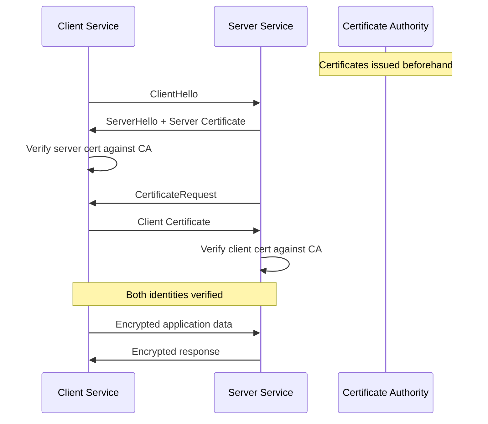
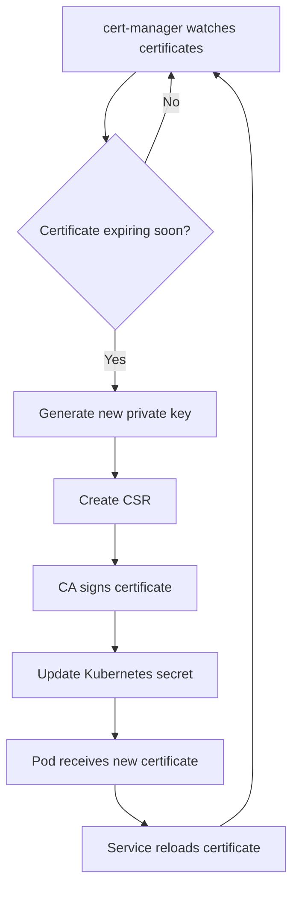

# How to Implement Mutual TLS for Service-to-Service Authentication

Author: [nawazdhandala](https://www.github.com/nawazdhandala)

Tags: mTLS, TLS, Service Authentication, Security, Certificates

Description: Learn how to implement mutual TLS for secure service-to-service authentication with certificate management.

---

In standard TLS, only the server presents a certificate. Mutual TLS (mTLS) requires both the client and server to present certificates, providing strong identity verification for service-to-service communication. This guide walks through implementing mTLS from certificate generation to application configuration.

## How mTLS Works

In regular TLS, the client verifies the server identity. In mTLS, both sides verify each other. This eliminates the need for API keys or tokens for service identity.



## Setting Up a Certificate Authority

For internal services, you create your own Certificate Authority (CA) to issue certificates to all services.

```bash
#!/bin/bash
# setup_ca.sh
# Create a self-signed Certificate Authority for internal mTLS

set -e

CA_DIR="./ca"
mkdir -p "$CA_DIR"

# Generate the CA private key (4096-bit RSA)
openssl genrsa -out "$CA_DIR/ca.key" 4096

# Create the CA certificate (valid for 10 years)
openssl req -x509 -new -nodes \
    -key "$CA_DIR/ca.key" \
    -sha256 \
    -days 3650 \
    -out "$CA_DIR/ca.crt" \
    -subj "/C=US/ST=California/O=MyCompany/CN=Internal CA"

echo "CA certificate created at $CA_DIR/ca.crt"
echo "CA private key created at $CA_DIR/ca.key"
echo "Keep the CA key secure - it can issue certificates for any service"
```

## Issuing Service Certificates

Each service gets its own certificate signed by the CA. The certificate Common Name (CN) or Subject Alternative Name (SAN) identifies the service.

```bash
#!/bin/bash
# issue_cert.sh
# Issue a certificate for a specific service

set -e

SERVICE_NAME=$1
if [ -z "$SERVICE_NAME" ]; then
    echo "Usage: ./issue_cert.sh <service-name>"
    exit 1
fi

CERT_DIR="./certs/$SERVICE_NAME"
CA_DIR="./ca"
mkdir -p "$CERT_DIR"

# Generate the service private key
openssl genrsa -out "$CERT_DIR/service.key" 2048

# Create a certificate signing request (CSR)
# Include DNS names for the service
openssl req -new \
    -key "$CERT_DIR/service.key" \
    -out "$CERT_DIR/service.csr" \
    -subj "/C=US/ST=California/O=MyCompany/CN=$SERVICE_NAME"

# Create a config file for Subject Alternative Names
cat > "$CERT_DIR/san.cnf" << EOF
[req]
distinguished_name = req_distinguished_name
[req_distinguished_name]
[v3_ext]
authorityKeyIdentifier=keyid,issuer
basicConstraints=CA:FALSE
keyUsage=digitalSignature,keyEncipherment
extendedKeyUsage=serverAuth,clientAuth
subjectAltName=@alt_names
[alt_names]
DNS.1 = $SERVICE_NAME
DNS.2 = $SERVICE_NAME.default.svc.cluster.local
DNS.3 = localhost
EOF

# Sign the certificate with the CA (valid for 1 year)
openssl x509 -req \
    -in "$CERT_DIR/service.csr" \
    -CA "$CA_DIR/ca.crt" \
    -CAkey "$CA_DIR/ca.key" \
    -CAcreateserial \
    -out "$CERT_DIR/service.crt" \
    -days 365 \
    -sha256 \
    -extensions v3_ext \
    -extfile "$CERT_DIR/san.cnf"

echo "Certificate issued for $SERVICE_NAME"
echo "  Certificate: $CERT_DIR/service.crt"
echo "  Private key: $CERT_DIR/service.key"
```

## Configuring an mTLS Server in Python

```python
# mtls_server.py
# FastAPI server with mTLS enabled

import ssl
import uvicorn
from fastapi import FastAPI, Request, HTTPException
import logging

logger = logging.getLogger(__name__)

app = FastAPI()

def get_client_identity(request: Request):
    """Extract the client service identity from the mTLS certificate."""
    # The TLS layer has already verified the certificate
    # Extract the Common Name (CN) from the client cert
    client_cert = request.scope.get("transport", {})

    # In production with uvicorn, client cert info is available
    # through the ASGI scope or middleware
    peer_cert = getattr(request.state, "peer_cert", None)

    if not peer_cert:
        raise HTTPException(
            status_code=403,
            detail="No client certificate provided"
        )

    # Extract CN from the certificate subject
    subject = dict(x[0] for x in peer_cert.get("subject", ()))
    return subject.get("commonName", "unknown")


@app.get("/api/data")
async def get_data(request: Request):
    """Endpoint that requires mTLS authentication."""
    client_service = get_client_identity(request)
    logger.info(f"Request from authenticated service: {client_service}")

    # Authorize based on service identity
    allowed_services = ["order-service", "payment-service"]
    if client_service not in allowed_services:
        raise HTTPException(
            status_code=403,
            detail=f"Service {client_service} is not authorized"
        )

    return {"data": "sensitive information", "client": client_service}


def create_ssl_context():
    """Create an SSL context with mTLS configuration."""
    ctx = ssl.SSLContext(ssl.PROTOCOL_TLS_SERVER)

    # Load the server certificate and private key
    ctx.load_cert_chain(
        certfile="/certs/service.crt",
        keyfile="/certs/service.key"
    )

    # Load the CA certificate for verifying client certificates
    ctx.load_verify_locations(cafile="/certs/ca.crt")

    # Require client certificate verification
    ctx.verify_mode = ssl.CERT_REQUIRED

    # Set minimum TLS version
    ctx.minimum_version = ssl.TLSVersion.TLSv1_2

    return ctx


if __name__ == "__main__":
    ssl_context = create_ssl_context()
    uvicorn.run(
        app,
        host="0.0.0.0",
        port=8443,
        ssl_keyfile="/certs/service.key",
        ssl_certfile="/certs/service.crt",
        ssl_ca_certs="/certs/ca.crt",
        ssl_cert_reqs=ssl.CERT_REQUIRED
    )
```

## Configuring an mTLS Client in Python

```python
# mtls_client.py
# HTTP client with mTLS certificate authentication

import httpx
import ssl
import logging

logger = logging.getLogger(__name__)

class MTLSClient:
    """HTTP client that authenticates using mTLS."""

    def __init__(self, cert_path, key_path, ca_path):
        # Path to the client certificate
        self.cert_path = cert_path
        # Path to the client private key
        self.key_path = key_path
        # Path to the CA certificate for server verification
        self.ca_path = ca_path

    def _create_ssl_context(self):
        """Create SSL context with client certificate."""
        ctx = ssl.create_default_context(cafile=self.ca_path)
        # Load client certificate and key for authentication
        ctx.load_cert_chain(
            certfile=self.cert_path,
            keyfile=self.key_path
        )
        return ctx

    async def get(self, url):
        """Make an authenticated GET request."""
        ssl_context = self._create_ssl_context()
        async with httpx.AsyncClient(verify=ssl_context) as client:
            response = await client.get(url)
            return response

    async def post(self, url, json_data):
        """Make an authenticated POST request."""
        ssl_context = self._create_ssl_context()
        async with httpx.AsyncClient(verify=ssl_context) as client:
            response = await client.post(url, json=json_data)
            return response


# Example usage
async def call_user_service():
    client = MTLSClient(
        cert_path="/certs/order-service/service.crt",
        key_path="/certs/order-service/service.key",
        ca_path="/certs/ca.crt"
    )

    response = await client.get("https://user-service:8443/api/data")
    print(f"Response: {response.status_code}")
```

## Certificate Rotation with Kubernetes

In Kubernetes, use cert-manager to automate certificate issuance and rotation.

```yaml
# cert-manager-issuer.yaml
# Set up cert-manager for automatic certificate management

apiVersion: cert-manager.io/v1
kind: ClusterIssuer
metadata:
  name: internal-ca-issuer
spec:
  ca:
    secretName: internal-ca-secret
---
# Certificate for a specific service
apiVersion: cert-manager.io/v1
kind: Certificate
metadata:
  name: order-service-cert
  namespace: default
spec:
  # Secret where the certificate will be stored
  secretName: order-service-tls
  # Certificate duration (90 days)
  duration: 2160h
  # Renew 30 days before expiration
  renewBefore: 720h
  # Service identity
  commonName: order-service
  dnsNames:
    - order-service
    - order-service.default.svc.cluster.local
  # Usage for both client and server authentication
  usages:
    - server auth
    - client auth
  issuerRef:
    name: internal-ca-issuer
    kind: ClusterIssuer
```

## Certificate Lifecycle



## Service Mesh Alternative

If managing certificates manually is too complex, a service mesh like Istio or Linkerd handles mTLS automatically. The mesh injects sidecar proxies that handle all TLS termination and certificate management.

```yaml
# istio-peer-auth.yaml
# Enable strict mTLS for all services in the mesh

apiVersion: security.istio.io/v1beta1
kind: PeerAuthentication
metadata:
  name: default
  namespace: default
spec:
  # Require mTLS for all services in this namespace
  mtls:
    mode: STRICT
```

## Monitoring mTLS

Monitor certificate expirations, TLS handshake errors, and authentication failures to catch issues before they cause outages.

With **OneUptime**, you can monitor your mTLS infrastructure end to end. Track certificate expiration dates, TLS handshake failure rates, and service authentication errors. Set up alerts for certificates approaching expiration and monitor the health of your certificate authority to maintain secure service-to-service communication.
