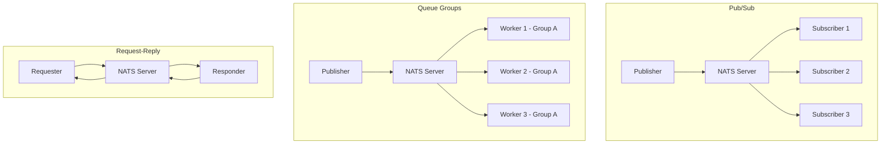

# How to Use NATS for Cloud-Native Messaging on Kubernetes

Author: [nawazdhandala](https://www.github.com/nawazdhandala)

Tags: NATS, Messaging, Kubernetes, Cloud Native, Pub/Sub

Description: Learn how to deploy and use NATS for lightweight cloud-native messaging on Kubernetes with JetStream persistence.

---

## What is NATS?

NATS is a high-performance, lightweight messaging system designed for cloud-native applications. Unlike heavier message brokers like RabbitMQ or Apache Kafka, NATS is built for simplicity and speed. It supports multiple messaging patterns including publish-subscribe, request-reply, and queue groups. With JetStream, NATS also provides persistent messaging with at-least-once and exactly-once delivery guarantees.

## NATS Messaging Patterns



- **Pub/Sub**: Messages are delivered to all subscribers on a subject.
- **Queue Groups**: Messages are load-balanced across subscribers in a group. Only one subscriber in the group receives each message.
- **Request-Reply**: A requester sends a message and waits for a response. NATS handles the routing automatically.

## Deploying NATS on Kubernetes with Helm

```bash
# Add the NATS Helm repository
helm repo add nats https://nats-io.github.io/k8s/helm/charts/
helm repo update

# Create a namespace for NATS
kubectl create namespace nats

# Install NATS with JetStream enabled
# JetStream provides persistent messaging and streaming capabilities
helm install nats nats/nats \
  --namespace nats \
  --set config.jetstream.enabled=true \
  --set config.jetstream.memStorage.size=1Gi \
  --set config.jetstream.fileStorage.size=10Gi \
  --set config.jetstream.fileStorage.storageClassName=standard \
  --set config.cluster.enabled=true \
  --set config.cluster.replicas=3

# Verify the deployment
kubectl get pods -n nats

# Check NATS server status
kubectl exec -n nats nats-0 -- nats-server --version
```

## NATS Cluster Architecture on Kubernetes

```yaml
# nats-values.yaml
# Custom Helm values for a production NATS deployment
config:
  cluster:
    enabled: true
    replicas: 3                            # 3-node cluster for HA
  jetstream:
    enabled: true                          # Enable persistent messaging
    memStorage:
      enabled: true
      size: 2Gi                            # In-memory storage for fast access
    fileStorage:
      enabled: true
      size: 20Gi                           # Persistent file storage
      storageClassName: fast-ssd           # Use fast storage for JetStream
  monitor:
    enabled: true                          # Enable HTTP monitoring endpoint
    port: 8222
  gateway:
    enabled: false                         # Enable for multi-cluster setups
  leafnodes:
    enabled: false                         # Enable for edge deployments

# Pod resources
podTemplate:
  merge:
    spec:
      containers:
        - name: nats
          resources:
            requests:
              cpu: 500m
              memory: 1Gi
            limits:
              cpu: 2
              memory: 4Gi

# Pod disruption budget
podDisruptionBudget:
  enabled: true
  minAvailable: 2                          # Keep at least 2 pods running
```

```bash
# Install with custom values
helm install nats nats/nats \
  --namespace nats \
  -f nats-values.yaml
```

## Publishing and Subscribing with Go

```go
package main

import (
	"fmt"
	"log"
	"time"

	"github.com/nats-io/nats.go"
)

func main() {
	// Connect to NATS server running in Kubernetes
	// Use the service DNS name for in-cluster connections
	nc, err := nats.Connect("nats://nats.nats.svc.cluster.local:4222")
	if err != nil {
		log.Fatalf("Failed to connect to NATS: %v", err)
	}
	defer nc.Close()

	// Subscribe to a subject using a queue group
	// Only one subscriber in the group receives each message
	_, err = nc.QueueSubscribe("events.>", "workers", func(msg *nats.Msg) {
		fmt.Printf("Received on %s: %s\n", msg.Subject, string(msg.Data))

		// Acknowledge if using JetStream
		// For core NATS, no acknowledgment is needed
	})
	if err != nil {
		log.Fatalf("Failed to subscribe: %v", err)
	}

	// Publish messages to different subjects
	// Wildcard subscribers on "events.>" receive all of these
	for i := 0; i < 100; i++ {
		subject := fmt.Sprintf("events.user.%d", i%10)
		data := fmt.Sprintf(`{"event": "click", "user_id": %d, "ts": "%s"}`,
			i, time.Now().Format(time.RFC3339))

		// Publish a message to the subject
		err = nc.Publish(subject, []byte(data))
		if err != nil {
			log.Printf("Failed to publish: %v", err)
		}
	}

	// Flush and wait for all messages to be sent
	nc.Flush()

	// Keep the subscriber running
	select {}
}
```

## Using JetStream for Persistent Messaging

```go
package main

import (
	"fmt"
	"log"
	"time"

	"github.com/nats-io/nats.go"
)

func main() {
	// Connect to NATS
	nc, err := nats.Connect("nats://nats.nats.svc.cluster.local:4222")
	if err != nil {
		log.Fatalf("Failed to connect: %v", err)
	}
	defer nc.Close()

	// Create a JetStream context
	// JetStream provides persistent, replicated message streams
	js, err := nc.JetStream()
	if err != nil {
		log.Fatalf("Failed to create JetStream context: %v", err)
	}

	// Create a stream that captures all events
	// The stream persists messages to disk with replication
	_, err = js.AddStream(&nats.StreamConfig{
		Name:       "EVENTS",                    // Stream name (uppercase convention)
		Subjects:   []string{"events.>"},        // Subjects captured by this stream
		Retention:  nats.LimitsPolicy,           // Retain based on limits
		MaxAge:     24 * time.Hour * 7,          // Keep messages for 7 days
		MaxBytes:   1024 * 1024 * 1024 * 10,     // 10 GB max storage
		Replicas:   3,                           // Replicate across 3 NATS nodes
		Storage:    nats.FileStorage,            // Use file storage (not memory)
		Discard:    nats.DiscardOld,             // Discard oldest when limits hit
	})
	if err != nil {
		log.Fatalf("Failed to create stream: %v", err)
	}

	// Create a durable consumer
	// Durable consumers remember their position across restarts
	_, err = js.AddConsumer("EVENTS", &nats.ConsumerConfig{
		Durable:       "event-processor",        // Consumer name
		DeliverPolicy: nats.DeliverAllPolicy,    // Start from the beginning
		AckPolicy:     nats.AckExplicitPolicy,   // Require explicit acks
		MaxDeliver:    5,                         // Retry up to 5 times
		AckWait:       30 * time.Second,         // Wait 30s for ack before redelivery
	})
	if err != nil {
		log.Fatalf("Failed to create consumer: %v", err)
	}

	// Subscribe using the durable consumer
	sub, err := js.PullSubscribe("events.>", "event-processor")
	if err != nil {
		log.Fatalf("Failed to subscribe: %v", err)
	}

	// Pull and process messages in batches
	for {
		// Fetch up to 10 messages at a time
		msgs, err := sub.Fetch(10, nats.MaxWait(5*time.Second))
		if err != nil {
			continue
		}

		for _, msg := range msgs {
			fmt.Printf("Processing: %s\n", string(msg.Data))

			// Acknowledge the message after successful processing
			// If not acked, NATS will redeliver after AckWait
			msg.Ack()
		}
	}
}
```

## Monitoring NATS

```mermaid
graph LR
    A[NATS Server] -->|Port 8222| B[Monitoring Endpoint]
    B --> C[/varz - Server Stats]
    B --> D[/connz - Connections]
    B --> E[/routez - Routes]
    B --> F[/jsz - JetStream]
    G[Prometheus] -->|Scrape| B
    H[OneUptime] -->|Dashboards| G
```

```bash
# Check NATS server health
kubectl exec -n nats nats-0 -- wget -qO- http://localhost:8222/healthz

# View server statistics
kubectl exec -n nats nats-0 -- wget -qO- http://localhost:8222/varz | head -20

# Check JetStream status
kubectl exec -n nats nats-0 -- wget -qO- http://localhost:8222/jsz

# Install the NATS CLI tool for easier management
# The nats CLI provides a comprehensive toolset
kubectl exec -n nats nats-0 -- nats stream ls
kubectl exec -n nats nats-0 -- nats consumer ls EVENTS
```

## NATS vs Other Messaging Systems

| Feature | NATS | Kafka | RabbitMQ |
|---------|------|-------|----------|
| Latency | Sub-millisecond | Low milliseconds | Low milliseconds |
| Throughput | Very high | Very high | Moderate |
| Complexity | Low | High | Moderate |
| Persistence | JetStream | Built-in | Plugins |
| Memory footprint | Very small | Large | Moderate |
| Clustering | Built-in | ZooKeeper/KRaft | Erlang clustering |
| Protocol | NATS protocol | Custom binary | AMQP |

## Production Checklist

- Enable JetStream with file storage for durability
- Deploy at least 3 NATS nodes for high availability
- Set appropriate stream retention policies and limits
- Use durable consumers for critical message processing
- Configure pod disruption budgets to maintain quorum
- Monitor connection counts, message rates, and JetStream storage usage
- Use TLS for encrypted communication between clients and servers

## Monitoring with OneUptime

NATS is a critical piece of infrastructure in cloud-native architectures. OneUptime (https://oneuptime.com) can monitor your NATS cluster health by scraping the built-in monitoring endpoints. You can set up dashboards for message throughput, connection counts, JetStream storage usage, and consumer lag. OneUptime alerts ensure you are notified when consumer lag grows or when cluster nodes become unreachable, helping you maintain reliable messaging across your services.
