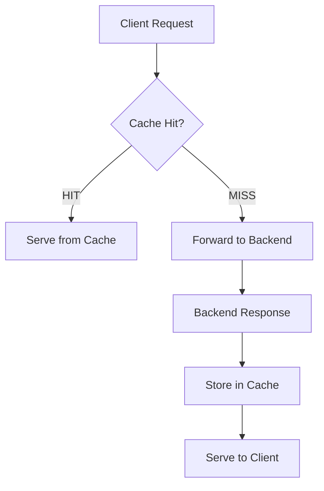
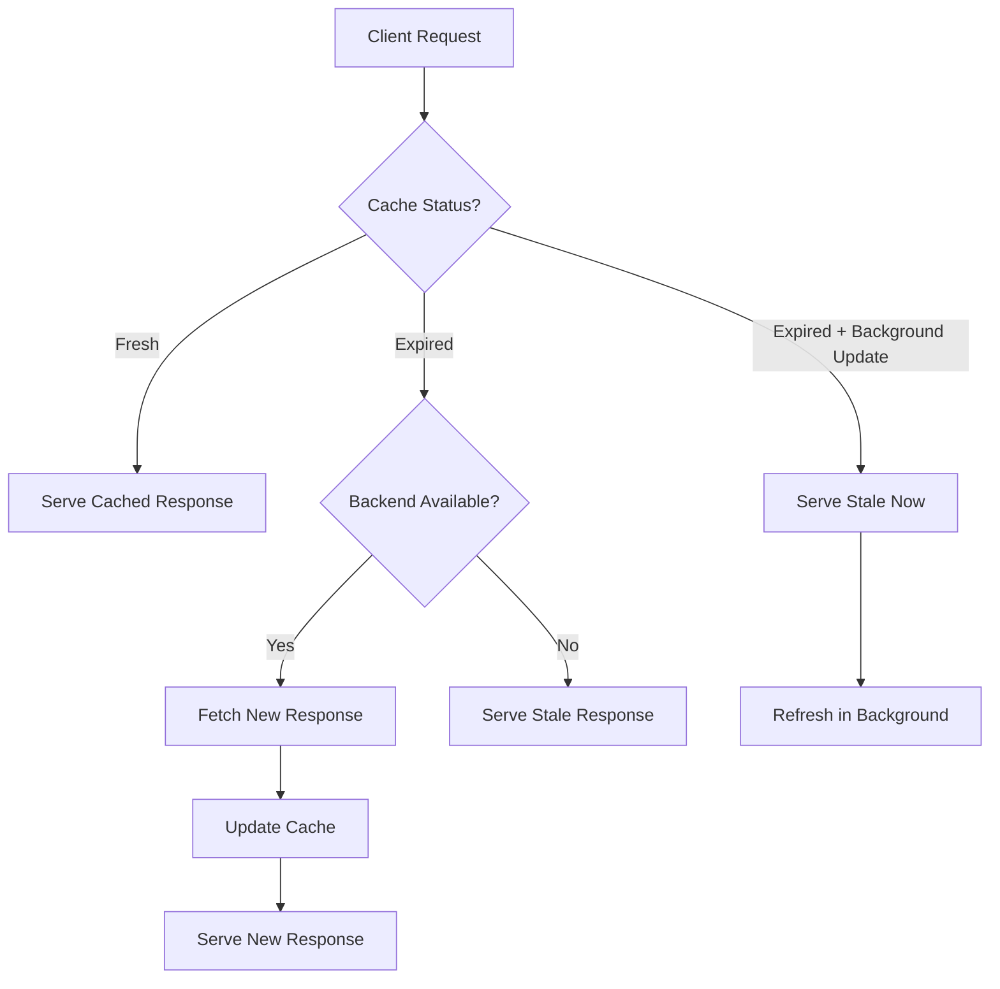

# How to Set Up Nginx Caching for Better Performance

Author: [nawazdhandala](https://www.github.com/nawazdhandala)

Tags: Nginx, Caching, Performance, Proxy Cache, Optimization

Description: Learn how to configure Nginx proxy caching for improved application performance and reduced backend load.

---

Caching at the reverse proxy layer is one of the fastest ways to improve response times and reduce backend load. Nginx can cache responses from upstream servers and serve them directly to clients without hitting the backend again.

This guide covers configuring proxy caching in Nginx from basic setup to advanced cache control.

## How Proxy Caching Works

When a request arrives, Nginx checks if a valid cached response exists. If it does, Nginx serves it directly. If not, Nginx forwards the request to the backend, caches the response, and serves it to the client.



## Basic Proxy Cache Configuration

Set up a cache zone in the `http` block and apply it to a `location`.

```nginx
# /etc/nginx/nginx.conf
http {
    # Define a cache zone
    # proxy_cache_path: directory where cached files are stored
    # levels=1:2: two-level directory structure for cache files
    # keys_zone=app_cache:10m: 10MB shared memory for cache keys (~80,000 keys)
    # max_size=1g: maximum total size of cached files on disk
    # inactive=60m: remove cached items not accessed in 60 minutes
    # use_temp_path=off: write cache files directly to the cache directory
    proxy_cache_path /var/cache/nginx/app
                     levels=1:2
                     keys_zone=app_cache:10m
                     max_size=1g
                     inactive=60m
                     use_temp_path=off;

    include /etc/nginx/conf.d/*.conf;
}
```

```nginx
# /etc/nginx/conf.d/cached-app.conf
server {
    listen 80;
    server_name app.example.com;

    location / {
        # Use the cache zone defined above
        proxy_cache app_cache;

        # Cache key determines what makes a response unique
        proxy_cache_key "$scheme$request_method$host$request_uri";

        # Cache 200 and 302 responses for 10 minutes
        proxy_cache_valid 200 302 10m;

        # Cache 404 responses for 1 minute
        proxy_cache_valid 404 1m;

        # Add a header so you can see if the response was cached
        add_header X-Cache-Status $upstream_cache_status;

        proxy_pass http://app_backend;
    }
}
```

The `X-Cache-Status` header will show one of these values: `HIT`, `MISS`, `EXPIRED`, `BYPASS`, `STALE`, or `UPDATING`.

## Cache Different Content Types

Apply different caching policies based on the type of content.

```nginx
server {
    listen 80;
    server_name app.example.com;

    # Cache static assets aggressively
    location ~* \.(css|js|png|jpg|jpeg|gif|ico|svg|woff2|woff)$ {
        proxy_cache app_cache;
        proxy_cache_valid 200 7d;  # Cache for 7 days

        # Serve stale content while revalidating in the background
        proxy_cache_use_stale error timeout updating;

        # Only one request triggers a backend fetch; others wait
        proxy_cache_lock on;

        add_header X-Cache-Status $upstream_cache_status;
        proxy_pass http://app_backend;
    }

    # Cache API responses for a shorter duration
    location /api/ {
        proxy_cache app_cache;
        proxy_cache_valid 200 30s;  # Cache for 30 seconds
        proxy_cache_valid 404 10s;

        # Include Authorization header in the cache key
        # so different users get different cached responses
        proxy_cache_key "$scheme$request_method$host$request_uri$http_authorization";

        add_header X-Cache-Status $upstream_cache_status;
        proxy_pass http://api_backend;
    }

    # Do not cache POST, PUT, DELETE requests
    location / {
        proxy_cache app_cache;

        # Bypass cache for non-GET requests
        proxy_cache_methods GET HEAD;

        proxy_cache_valid 200 5m;
        add_header X-Cache-Status $upstream_cache_status;
        proxy_pass http://app_backend;
    }
}
```

## Cache Bypass and Purging

Allow certain requests to bypass or refresh the cache.

```nginx
server {
    listen 80;
    server_name app.example.com;

    # Map to determine when to bypass the cache
    # Bypass if the request has a Cache-Control: no-cache header
    # or if there is a custom X-Purge-Cache header
    set $bypass_cache 0;

    if ($http_cache_control = "no-cache") {
        set $bypass_cache 1;
    }

    if ($http_x_purge_cache) {
        set $bypass_cache 1;
    }

    location / {
        proxy_cache app_cache;
        proxy_cache_valid 200 10m;

        # Skip the cache when $bypass_cache is 1
        proxy_cache_bypass $bypass_cache;

        # Do not store the response when bypassing
        proxy_no_cache $bypass_cache;

        add_header X-Cache-Status $upstream_cache_status;
        proxy_pass http://app_backend;
    }
}
```

```bash
# Force a cache refresh for a specific URL
curl -H "Cache-Control: no-cache" http://app.example.com/api/products

# Use a custom purge header
curl -H "X-Purge-Cache: true" http://app.example.com/api/products
```

## Serving Stale Content

Configure Nginx to serve stale (expired) cached content when the backend is unavailable.

```nginx
location / {
    proxy_cache app_cache;
    proxy_cache_valid 200 5m;

    # Serve stale content in these situations:
    # - error: backend returns a connection error
    # - timeout: backend times out
    # - updating: cache is being refreshed in the background
    # - http_500, http_502, http_503, http_504: backend returns server errors
    proxy_cache_use_stale error timeout updating http_500 http_502 http_503 http_504;

    # Refresh cache in the background while serving stale content
    proxy_cache_background_update on;

    # Only allow one request to update the cache at a time
    proxy_cache_lock on;

    # Maximum time to wait for a cache lock before forwarding to backend
    proxy_cache_lock_timeout 5s;

    add_header X-Cache-Status $upstream_cache_status;
    proxy_pass http://app_backend;
}
```



## Microcaching for Dynamic Content

Even caching dynamic content for 1 second can absorb traffic spikes.

```nginx
# Microcache zone for dynamic content
proxy_cache_path /var/cache/nginx/micro
                 levels=1:2
                 keys_zone=micro_cache:5m
                 max_size=500m
                 inactive=1m;

server {
    listen 80;
    server_name api.example.com;

    location /api/ {
        proxy_cache micro_cache;

        # Cache for just 1 second
        proxy_cache_valid 200 1s;

        # Serve stale while updating
        proxy_cache_use_stale updating;
        proxy_cache_background_update on;
        proxy_cache_lock on;

        add_header X-Cache-Status $upstream_cache_status;
        proxy_pass http://api_backend;
    }
}
```

A 1-second microcache means that under 1000 requests per second, only 1 request actually hits the backend. The other 999 are served from cache.

## Monitoring Cache Performance

Check cache hit rates to verify your configuration is working.

```bash
# Check the X-Cache-Status header
curl -I http://app.example.com/api/products
# Look for: X-Cache-Status: HIT

# Count cache hits vs misses from access logs
awk '{print $NF}' /var/log/nginx/access.log | sort | uniq -c | sort -rn

# Check cache directory disk usage
du -sh /var/cache/nginx/app/
```

## Summary

Nginx proxy caching is a powerful and low-effort way to reduce backend load and improve response times. Start with conservative cache durations for dynamic content, cache static assets aggressively, and always add the `X-Cache-Status` header so you can verify the cache is working.

Monitor your cache hit rates and backend response times with [OneUptime](https://oneuptime.com). OneUptime helps you track how effectively your caching layer is working and alerts you when cache miss rates climb, which could indicate configuration issues or changed traffic patterns.
