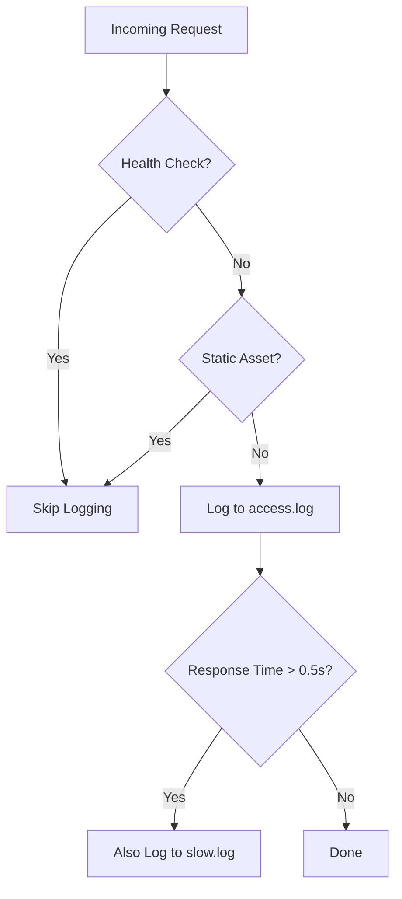

# How to Configure Nginx Logging and Monitoring

Author: [nawazdhandala](https://www.github.com/nawazdhandala)

Tags: Nginx, Logging, Monitoring, Access Logs, Observability

Description: Learn how to configure Nginx access and error logging with custom formats and integrate with monitoring tools.

---

Nginx logs are your window into what is happening at the edge of your infrastructure. Access logs tell you who is making requests and how your backend responds. Error logs tell you when things go wrong. Proper logging and monitoring of Nginx is essential for debugging issues, tracking performance, and maintaining security.

This guide covers configuring Nginx logging from custom formats to structured JSON output and monitoring integration.

## Default Log Configuration

Nginx ships with two log types: access logs and error logs.

```nginx
# Default logging (usually in /etc/nginx/nginx.conf)
http {
    # Access log records every request
    access_log /var/log/nginx/access.log;

    # Error log records errors and warnings
    # Log levels: debug, info, notice, warn, error, crit, alert, emerg
    error_log /var/log/nginx/error.log warn;
}
```

The default `combined` format looks like this:

```
10.0.1.5 - - [20/Feb/2026:14:30:00 +0000] "GET /api/users HTTP/1.1" 200 1234 "https://example.com" "Mozilla/5.0..."
```

## Custom Log Formats

Define custom formats to capture the information that matters for your use case.

```nginx
http {
    # Custom format with upstream and timing information
    log_format detailed '$remote_addr - $remote_user [$time_local] '
                        '"$request" $status $body_bytes_sent '
                        '"$http_referer" "$http_user_agent" '
                        'rt=$request_time '
                        'urt=$upstream_response_time '
                        'uct=$upstream_connect_time '
                        'uht=$upstream_header_time '
                        'cs=$upstream_cache_status '
                        'us=$upstream_status';

    # Apply the custom format
    access_log /var/log/nginx/access.log detailed;
}
```

Key variables explained:

- `$request_time` - Total time from first client byte to last byte sent to client
- `$upstream_response_time` - Time spent receiving the response from the backend
- `$upstream_connect_time` - Time spent establishing a connection to the backend
- `$upstream_header_time` - Time between connecting to the backend and receiving the first header byte
- `$upstream_cache_status` - Whether the response was served from cache (HIT, MISS, etc.)

## JSON Log Format

Structured JSON logs are easier to parse with log aggregation tools.

```nginx
http {
    # JSON-formatted access log
    log_format json_log escape=json
        '{'
            '"time": "$time_iso8601", '
            '"remote_addr": "$remote_addr", '
            '"remote_user": "$remote_user", '
            '"request_method": "$request_method", '
            '"request_uri": "$request_uri", '
            '"server_protocol": "$server_protocol", '
            '"status": $status, '
            '"body_bytes_sent": $body_bytes_sent, '
            '"http_referer": "$http_referer", '
            '"http_user_agent": "$http_user_agent", '
            '"request_time": $request_time, '
            '"upstream_response_time": "$upstream_response_time", '
            '"upstream_status": "$upstream_status", '
            '"upstream_cache_status": "$upstream_cache_status", '
            '"ssl_protocol": "$ssl_protocol", '
            '"ssl_cipher": "$ssl_cipher", '
            '"request_id": "$request_id"'
        '}';

    access_log /var/log/nginx/access.json json_log;
}
```

A sample output line:

```json
{"time": "2026-02-20T14:30:00+00:00", "remote_addr": "10.0.1.5", "request_method": "GET", "request_uri": "/api/users", "status": 200, "body_bytes_sent": 1234, "request_time": 0.045, "upstream_response_time": "0.043", "upstream_cache_status": "MISS", "request_id": "a1b2c3d4e5"}
```

## Conditional Logging

Log only specific requests to reduce noise or separate concerns.

```nginx
http {
    # Map to identify requests worth logging
    map $request_uri $is_loggable {
        # Do not log health checks or static assets
        ~*^/health   0;
        ~*^/ready    0;
        ~*\.(css|js|png|jpg|ico)$  0;
        default      1;
    }

    # Map to identify slow requests
    map $request_time $is_slow {
        ~^[0-9]*\.[5-9]  1;     # 0.5s or more
        ~^[1-9]          1;     # 1s or more
        default          0;
    }

    # Log only meaningful requests
    access_log /var/log/nginx/access.log detailed if=$is_loggable;

    # Log slow requests to a separate file for investigation
    access_log /var/log/nginx/slow.log detailed if=$is_slow;
}
```



## Per-Server and Per-Location Logging

Direct logs from different virtual hosts or locations to separate files.

```nginx
# API server logs
server {
    listen 80;
    server_name api.example.com;

    access_log /var/log/nginx/api-access.log json_log;
    error_log /var/log/nginx/api-error.log warn;

    location /api/v1/ {
        # Additional per-location log
        access_log /var/log/nginx/api-v1.log json_log;
        proxy_pass http://api_v1_backend;
    }

    location /api/v2/ {
        access_log /var/log/nginx/api-v2.log json_log;
        proxy_pass http://api_v2_backend;
    }
}

# Static assets server logs
server {
    listen 80;
    server_name static.example.com;

    # Disable access logging for static assets if not needed
    access_log off;
    error_log /var/log/nginx/static-error.log warn;

    location / {
        root /var/www/static;
    }
}
```

## Error Log Configuration

Tune error logging to capture the right level of detail.

```nginx
# Global error log at warn level
error_log /var/log/nginx/error.log warn;

server {
    listen 80;
    server_name api.example.com;

    # Per-server error log at info level for more detail
    error_log /var/log/nginx/api-error.log info;

    location / {
        proxy_pass http://api_backend;

        # Log upstream errors and timeouts
        # These appear in the error log automatically when:
        # - proxy_connect_timeout is exceeded
        # - proxy_read_timeout is exceeded
        # - backend returns a connection error
        proxy_connect_timeout 5s;
        proxy_read_timeout 30s;
    }
}
```

## Nginx Stub Status Module

Enable the stub status module to expose basic metrics.

```nginx
# /etc/nginx/conf.d/status.conf
server {
    listen 8080;

    # Only allow internal access
    allow 10.0.0.0/8;
    allow 127.0.0.1;
    deny all;

    location /nginx_status {
        # Enable the stub status module
        stub_status on;

        # Disable access logging for status checks
        access_log off;
    }
}
```

```bash
# Query the status endpoint
curl http://localhost:8080/nginx_status

# Output:
# Active connections: 42
# server accepts handled requests
#  1234567 1234567 9876543
# Reading: 3 Writing: 10 Waiting: 29
```

The metrics mean:
- **Active connections** - current client connections including waiting
- **Reading** - Nginx is reading the request header
- **Writing** - Nginx is writing the response to the client
- **Waiting** - Keep-alive connections waiting for new requests

## Log Rotation

Prevent log files from consuming all disk space.

```bash
# /etc/logrotate.d/nginx
/var/log/nginx/*.log {
    daily            # Rotate daily
    missingok        # Do not error if log file is missing
    rotate 14        # Keep 14 days of logs
    compress         # Compress rotated files with gzip
    delaycompress    # Delay compression by one rotation cycle
    notifempty       # Do not rotate empty files
    sharedscripts    # Run postrotate script once for all logs
    postrotate
        # Signal Nginx to reopen log files
        if [ -f /var/run/nginx.pid ]; then
            kill -USR1 $(cat /var/run/nginx.pid)
        fi
    endscript
}
```

## Summary

Good logging and monitoring starts with capturing the right data. Use JSON log formats for structured ingestion, conditional logging to reduce noise, and the stub status module for real-time metrics. Separate logs by service and always configure log rotation.

For comprehensive Nginx monitoring, use [OneUptime](https://oneuptime.com). OneUptime can track Nginx performance metrics, alert on error rate spikes and slow upstream responses, and give you visibility into your reverse proxy layer alongside the rest of your infrastructure.
