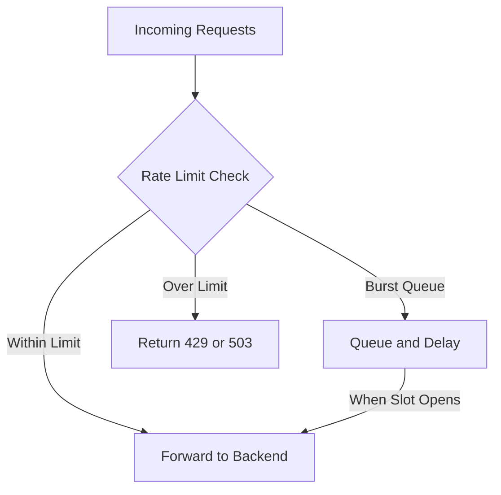
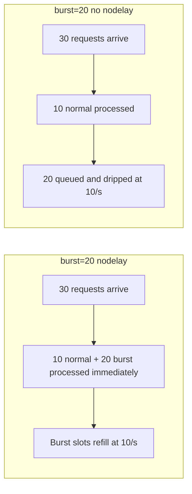

# How to Implement Rate Limiting in Nginx

Author: [nawazdhandala](https://www.github.com/nawazdhandala)

Tags: Nginx, Rate Limiting, Security, API Gateway, Configuration

Description: Learn how to implement rate limiting in Nginx using limit_req and limit_conn directives to protect your services.

---

Rate limiting is one of the simplest and most effective ways to protect your services from abuse, brute force attacks, and traffic spikes. Nginx has built-in rate limiting support through the `limit_req` and `limit_conn` modules.

This guide covers both modules, how they work, and how to configure them for real-world scenarios.

## How Nginx Rate Limiting Works

Nginx rate limiting uses a leaky bucket algorithm. Requests fill a bucket at a defined rate. If the bucket overflows, excess requests are rejected or delayed.



## Request Rate Limiting with limit_req

The `limit_req` module limits the rate of requests per key, typically per client IP.

### Step 1: Define a Rate Limit Zone

Define the zone in the `http` block. This allocates shared memory that all worker processes use to track request counts.

```nginx
# /etc/nginx/nginx.conf
http {
    # Define a rate limit zone called "api"
    # $binary_remote_addr = client IP in binary (saves memory vs $remote_addr)
    # zone=api:10m = 10MB shared memory (holds ~160,000 IPs)
    # rate=10r/s = allow 10 requests per second per IP
    limit_req_zone $binary_remote_addr zone=api:10m rate=10r/s;

    # Define a stricter zone for login endpoints
    limit_req_zone $binary_remote_addr zone=login:10m rate=1r/s;

    # Define a zone keyed on a custom header (e.g., API key)
    limit_req_zone $http_x_api_key zone=apikey:10m rate=100r/s;

    include /etc/nginx/conf.d/*.conf;
}
```

### Step 2: Apply the Rate Limit

Apply the zone to specific locations in your server block.

```nginx
# /etc/nginx/conf.d/api.conf
server {
    listen 80;
    server_name api.example.com;

    # Apply rate limiting to the API endpoints
    # burst=20 allows 20 extra requests to queue up
    # nodelay processes burst requests immediately instead of spacing them
    location /api/ {
        limit_req zone=api burst=20 nodelay;
        proxy_pass http://api_backend;
    }

    # Stricter rate limiting on the login endpoint
    # burst=5 allows a small burst for legitimate retry scenarios
    location /api/auth/login {
        limit_req zone=login burst=5 nodelay;
        proxy_pass http://api_backend;
    }

    # No rate limiting on health check endpoints
    location /health {
        proxy_pass http://api_backend;
    }
}
```

## Understanding Burst and Nodelay

The `burst` and `nodelay` parameters control how Nginx handles requests that exceed the rate.

```nginx
# Scenario 1: No burst
# Requests beyond 10/s are immediately rejected
limit_req zone=api;

# Scenario 2: Burst without nodelay
# Up to 20 extra requests are queued and processed at the defined rate (10/s)
# This adds latency to burst requests
limit_req zone=api burst=20;

# Scenario 3: Burst with nodelay
# Up to 20 extra requests are processed immediately
# But the burst slots refill at the defined rate (10/s)
limit_req zone=api burst=20 nodelay;

# Scenario 4: Burst with delay
# First 12 burst requests are processed immediately
# Remaining 8 burst requests are delayed to match the rate
limit_req zone=api burst=20 delay=12;
```



## Connection Limiting with limit_conn

While `limit_req` controls request rate, `limit_conn` limits the number of concurrent connections from a single source.

```nginx
http {
    # Define a connection limit zone
    # Tracks concurrent connections per client IP
    limit_conn_zone $binary_remote_addr zone=conn_per_ip:10m;

    # Track concurrent connections per server (virtual host)
    limit_conn_zone $server_name zone=conn_per_server:10m;
}

server {
    listen 80;
    server_name api.example.com;

    # Allow max 20 concurrent connections per IP
    limit_conn conn_per_ip 20;

    # Allow max 1000 concurrent connections to this server
    limit_conn conn_per_server 1000;

    # Limit bandwidth per connection (useful for file downloads)
    limit_rate 500k;

    location / {
        proxy_pass http://api_backend;
    }
}
```

## Custom Error Responses

By default, rate-limited requests receive a 503 status. You can change this to the more appropriate 429 (Too Many Requests).

```nginx
server {
    listen 80;
    server_name api.example.com;

    # Return 429 instead of the default 503
    limit_req_status 429;
    limit_conn_status 429;

    # Custom error page for rate-limited requests
    error_page 429 /429.json;

    location = /429.json {
        # Return a JSON response for API clients
        default_type application/json;
        return 429 '{"error": "too_many_requests", "message": "Rate limit exceeded. Please retry after a few seconds."}';
    }

    location /api/ {
        limit_req zone=api burst=20 nodelay;
        proxy_pass http://api_backend;
    }
}
```

## Whitelisting Trusted IPs

Exempt internal services and health check probes from rate limiting using geo and map blocks.

```nginx
# /etc/nginx/conf.d/rate-limit.conf

# Define which IPs are exempt from rate limiting
geo $rate_limit_exempt {
    default 0;
    10.0.0.0/8     1;   # Internal network
    172.16.0.0/12  1;   # Docker network
    192.168.0.0/16 1;   # Private network
    127.0.0.1      1;   # Localhost
}

# Map the exemption to a rate limit key
# Exempt IPs get an empty key, which disables rate limiting for them
map $rate_limit_exempt $rate_limit_key {
    0 $binary_remote_addr;  # Apply rate limiting
    1 "";                   # Skip rate limiting
}

http {
    # Use the mapped key instead of $binary_remote_addr
    limit_req_zone $rate_limit_key zone=api:10m rate=10r/s;
}
```

## Logging Rate-Limited Requests

Track how often rate limiting kicks in so you can tune your thresholds.

```nginx
http {
    # Custom log format that includes rate limit status
    log_format rate_limit '$remote_addr - $request '
                          'status=$status '
                          'limit_req_status=$limit_req_status '
                          'upstream_response_time=$upstream_response_time';

    # Log rate-limited requests to a separate file
    map $status $is_rate_limited {
        429 1;
        default 0;
    }
}

server {
    # Log rate-limited requests separately for analysis
    access_log /var/log/nginx/rate_limited.log rate_limit if=$is_rate_limited;

    # Standard access log
    access_log /var/log/nginx/access.log combined;
}
```

## Testing Rate Limits

Verify your rate limits are working with simple tools.

```bash
# Send 50 rapid requests and count the responses
for i in $(seq 1 50); do
    curl -s -o /dev/null -w "%{http_code}\n" http://api.example.com/api/test
done | sort | uniq -c

# Expected output (with rate=10r/s burst=20):
#   30 200    (10 normal + 20 burst)
#   20 429    (rejected)

# Use ab (Apache Benchmark) for more thorough testing
ab -n 100 -c 10 http://api.example.com/api/test
```

## Summary

Rate limiting in Nginx is a critical layer of defense for any production service. Start with generous limits and tighten them based on observed traffic patterns. Use `limit_req` for request rate and `limit_conn` for concurrent connections. Always whitelist internal services and return proper 429 responses to API clients.

Monitor your rate limiting effectiveness with [OneUptime](https://oneuptime.com). OneUptime can alert you when 429 responses spike, helping you distinguish between legitimate traffic growth and malicious abuse, so you can adjust your limits accordingly.
