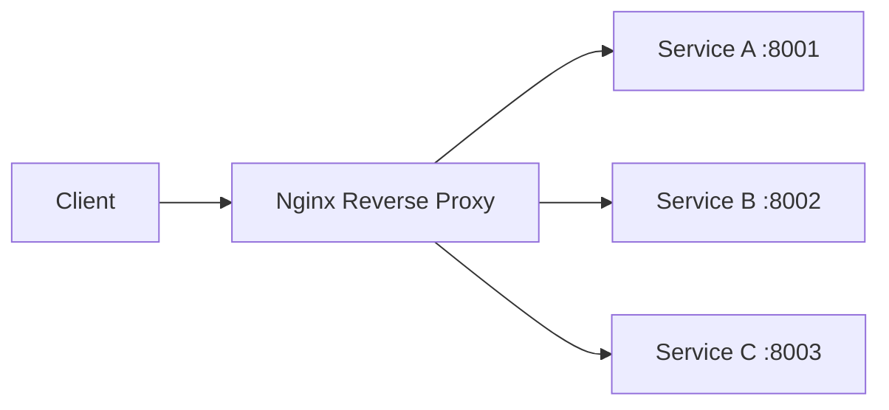
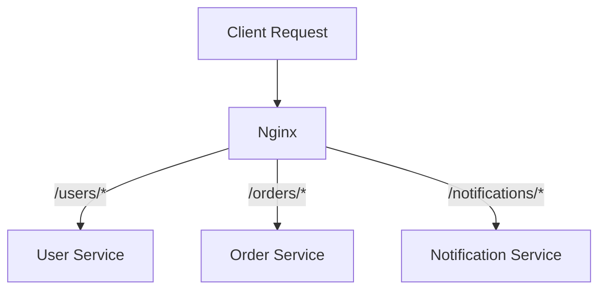

# How to Configure Nginx as a Reverse Proxy for Microservices

Author: [nawazdhandala](https://www.github.com/nawazdhandala)

Tags: Nginx, Reverse Proxy, Microservices, Load Balancing, Configuration

Description: Learn how to configure Nginx as a reverse proxy for microservices with upstream backends, health checks, and load balancing.

---

Nginx is one of the most popular choices for a reverse proxy in microservices architectures. It sits between clients and your backend services, distributing traffic, terminating SSL, and providing a single entry point.

This guide walks through configuring Nginx as a reverse proxy from scratch.

## What a Reverse Proxy Does

A reverse proxy accepts requests from clients and forwards them to one or more backend servers. The client never communicates directly with the backend.



Benefits include centralized SSL termination, load balancing, request routing, and a single point for logging and monitoring.

## Basic Reverse Proxy Configuration

Start with a minimal proxy setup that forwards all traffic to a single backend.

```nginx
# /etc/nginx/conf.d/app.conf
# Basic reverse proxy forwarding all requests to a backend on port 8001

server {
    listen 80;
    server_name app.example.com;

    # Forward all requests to the backend service
    location / {
        proxy_pass http://127.0.0.1:8001;

        # Pass the original host header to the backend
        proxy_set_header Host $host;

        # Forward the real client IP address
        proxy_set_header X-Real-IP $remote_addr;

        # Append to the X-Forwarded-For chain
        proxy_set_header X-Forwarded-For $proxy_add_x_forwarded_for;

        # Tell the backend the original protocol (http or https)
        proxy_set_header X-Forwarded-Proto $scheme;
    }
}
```

The `proxy_set_header` directives ensure your backend receives accurate client information instead of seeing all requests as coming from localhost.

## Upstream Backends and Load Balancing

When you have multiple instances of a service, use an `upstream` block to distribute traffic.

```nginx
# /etc/nginx/conf.d/upstream.conf
# Define a pool of backend servers for the API service

upstream api_backends {
    # Round-robin is the default load balancing method
    # Each request goes to the next server in order

    server 10.0.1.10:8001 weight=3;   # Receives 3x the traffic
    server 10.0.1.11:8001 weight=2;   # Receives 2x the traffic
    server 10.0.1.12:8001;            # Default weight of 1

    # Keep connections alive to reduce TCP handshake overhead
    keepalive 32;
}

server {
    listen 80;
    server_name api.example.com;

    location / {
        proxy_pass http://api_backends;

        # Required for upstream keepalive to work
        proxy_http_version 1.1;
        proxy_set_header Connection "";

        proxy_set_header Host $host;
        proxy_set_header X-Real-IP $remote_addr;
        proxy_set_header X-Forwarded-For $proxy_add_x_forwarded_for;
    }
}
```

## Load Balancing Methods

Nginx supports several load balancing algorithms.

```nginx
# Method 1: Least Connections
# Sends requests to the server with the fewest active connections
upstream api_least_conn {
    least_conn;
    server 10.0.1.10:8001;
    server 10.0.1.11:8001;
    server 10.0.1.12:8001;
}

# Method 2: IP Hash
# Routes the same client IP to the same backend (session affinity)
upstream api_ip_hash {
    ip_hash;
    server 10.0.1.10:8001;
    server 10.0.1.11:8001;
    server 10.0.1.12:8001;
}

# Method 3: Hash on a custom key
# Useful for consistent routing based on URI or header
upstream api_hash {
    hash $request_uri consistent;
    server 10.0.1.10:8001;
    server 10.0.1.11:8001;
    server 10.0.1.12:8001;
}
```

## Routing by Path

In a microservices architecture, you often route different URL paths to different services.

```nginx
# /etc/nginx/conf.d/microservices.conf
# Route requests to different backend services based on URL path

upstream user_service {
    server 10.0.2.10:8001;
    server 10.0.2.11:8001;
}

upstream order_service {
    server 10.0.3.10:8002;
    server 10.0.3.11:8002;
}

upstream notification_service {
    server 10.0.4.10:8003;
}

server {
    listen 80;
    server_name api.example.com;

    # Route /users/* to the user service
    location /users/ {
        proxy_pass http://user_service;
        proxy_set_header Host $host;
        proxy_set_header X-Real-IP $remote_addr;
    }

    # Route /orders/* to the order service
    location /orders/ {
        proxy_pass http://order_service;
        proxy_set_header Host $host;
        proxy_set_header X-Real-IP $remote_addr;
    }

    # Route /notifications/* to the notification service
    location /notifications/ {
        proxy_pass http://notification_service;
        proxy_set_header Host $host;
        proxy_set_header X-Real-IP $remote_addr;
    }
}
```



## Health Checks and Failover

Configure Nginx to detect unhealthy backends and stop sending traffic to them.

```nginx
upstream api_backends {
    server 10.0.1.10:8001 max_fails=3 fail_timeout=30s;
    server 10.0.1.11:8001 max_fails=3 fail_timeout=30s;

    # Backup server only receives traffic when all primary servers are down
    server 10.0.1.20:8001 backup;
}

server {
    listen 80;
    server_name api.example.com;

    location / {
        proxy_pass http://api_backends;

        # Timeout settings to detect slow or unresponsive backends
        proxy_connect_timeout 5s;
        proxy_read_timeout 30s;
        proxy_send_timeout 10s;

        # Retry the next upstream server on these errors
        proxy_next_upstream error timeout http_502 http_503 http_504;

        # Limit total time spent retrying upstream servers
        proxy_next_upstream_timeout 15s;

        # Limit the number of upstream servers to try
        proxy_next_upstream_tries 3;
    }
}
```

If a backend fails 3 times within 30 seconds, Nginx marks it as unavailable and routes traffic to the remaining servers. After 30 seconds, Nginx will try the failed server again.

## Buffering and Timeouts

Tune proxy buffering to handle responses of different sizes efficiently.

```nginx
location / {
    proxy_pass http://api_backends;

    # Enable response buffering (on by default)
    proxy_buffering on;

    # Number and size of buffers for reading the response
    proxy_buffers 16 8k;

    # Size of the buffer for the first part of the response (headers)
    proxy_buffer_size 4k;

    # Maximum size of temporary file if buffers are full
    proxy_max_temp_file_size 1024m;

    # Timeout for establishing a connection to the backend
    proxy_connect_timeout 10s;

    # Timeout between two read operations from the backend
    proxy_read_timeout 60s;

    # Timeout between two write operations to the backend
    proxy_send_timeout 10s;
}
```

## Testing Your Configuration

Always validate the Nginx configuration before reloading.

```bash
# Check configuration syntax
sudo nginx -t

# If the test passes, reload Nginx without downtime
sudo nginx -s reload

# Verify Nginx is running and listening
curl -I http://api.example.com
```

## Summary

A well-configured Nginx reverse proxy gives you centralized routing, load balancing, and failover for your microservices. Start with the basics, then layer on health checks, timeouts, and buffering as your architecture grows.

If you are running Nginx in production, consider monitoring it with [OneUptime](https://oneuptime.com). OneUptime can track upstream response times, error rates, and alert you when backends become unhealthy - so you catch issues before your users do.
