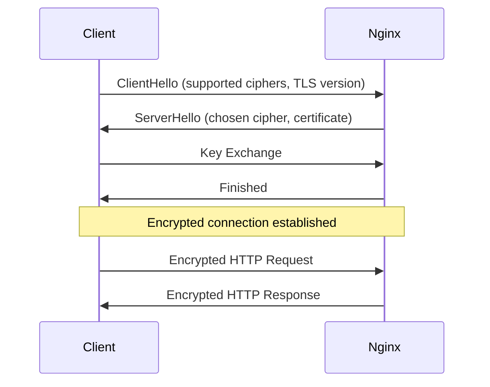
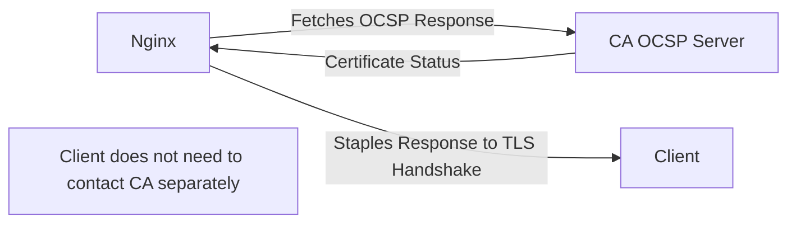

# How to Configure SSL/TLS in Nginx for Production

Author: [nawazdhandala](https://www.github.com/nawazdhandala)

Tags: Nginx, SSL, TLS, Security, HTTPS

Description: Best practices for configuring SSL/TLS in Nginx including cipher suites, HSTS, OCSP stapling, and certificate management.

---

Serving traffic over HTTPS is not optional in production. Browsers flag HTTP sites as insecure, search engines penalize them, and attackers can intercept unencrypted traffic. Nginx makes SSL/TLS configuration straightforward once you understand the key settings.

This guide covers a production-ready SSL/TLS setup for Nginx.

## SSL/TLS Handshake Overview

Before data flows, the client and server negotiate encryption parameters through a TLS handshake.



## Basic SSL Configuration

Start with a minimal HTTPS server block.

```nginx
# /etc/nginx/conf.d/ssl.conf
server {
    # Listen on port 443 with SSL and HTTP/2 enabled
    listen 443 ssl http2;
    server_name example.com www.example.com;

    # Path to your SSL certificate (includes intermediate certs)
    ssl_certificate /etc/ssl/certs/example.com.fullchain.pem;

    # Path to your private key (keep this file secure)
    ssl_certificate_key /etc/ssl/private/example.com.key.pem;

    location / {
        proxy_pass http://app_backend;
        proxy_set_header Host $host;
        proxy_set_header X-Forwarded-Proto https;
    }
}

# Redirect all HTTP traffic to HTTPS
server {
    listen 80;
    server_name example.com www.example.com;

    # 301 permanent redirect to HTTPS
    return 301 https://$host$request_uri;
}
```

## Production-Grade TLS Settings

Configure TLS protocols and cipher suites for security and compatibility.

```nginx
# /etc/nginx/conf.d/ssl-params.conf
# Include this file in your server blocks with: include /etc/nginx/conf.d/ssl-params.conf;

# Only allow TLS 1.2 and 1.3
# TLS 1.0 and 1.1 have known vulnerabilities and are deprecated
ssl_protocols TLSv1.2 TLSv1.3;

# Use server-preferred cipher order
# This ensures the server picks the strongest cipher the client supports
ssl_prefer_server_ciphers on;

# Modern cipher suite configuration
# These ciphers provide forward secrecy and strong encryption
ssl_ciphers 'ECDHE-ECDSA-AES128-GCM-SHA256:ECDHE-RSA-AES128-GCM-SHA256:ECDHE-ECDSA-AES256-GCM-SHA384:ECDHE-RSA-AES256-GCM-SHA384:ECDHE-ECDSA-CHACHA20-POLY1305:ECDHE-RSA-CHACHA20-POLY1305';

# Elliptic curves for ECDHE key exchange
ssl_ecdh_curve X25519:secp384r1:secp256r1;

# SSL session caching to reduce handshake overhead for returning clients
# shared:SSL:50m = 50MB shared cache across all workers (~200,000 sessions)
ssl_session_cache shared:SSL:50m;

# How long cached sessions remain valid
ssl_session_timeout 1d;

# Disable session tickets (they can weaken forward secrecy)
ssl_session_tickets off;
```

## HSTS (HTTP Strict Transport Security)

HSTS tells browsers to always use HTTPS for your domain, preventing downgrade attacks.

```nginx
server {
    listen 443 ssl http2;
    server_name example.com;

    # Include the shared SSL parameters
    include /etc/nginx/conf.d/ssl-params.conf;

    ssl_certificate /etc/ssl/certs/example.com.fullchain.pem;
    ssl_certificate_key /etc/ssl/private/example.com.key.pem;

    # Enable HSTS with a 1-year max-age
    # includeSubDomains applies HSTS to all subdomains
    # preload allows submission to the browser HSTS preload list
    add_header Strict-Transport-Security "max-age=31536000; includeSubDomains; preload" always;

    location / {
        proxy_pass http://app_backend;
    }
}
```

Be cautious with `preload`. Once your domain is in the browser preload list, it is very difficult to remove. Make sure HTTPS works for all subdomains before enabling it.

## OCSP Stapling

OCSP stapling lets Nginx fetch and cache the certificate revocation status, so clients do not have to contact the CA directly.

```nginx
# Enable OCSP stapling
ssl_stapling on;

# Enable the server to verify the OCSP response
ssl_stapling_verify on;

# Trusted CA certificates for OCSP verification
# This should be the full chain (root + intermediate CAs)
ssl_trusted_certificate /etc/ssl/certs/ca-chain.pem;

# DNS resolver for OCSP queries
# Use your preferred DNS resolver with a cache timeout
resolver 8.8.8.8 8.8.4.4 valid=300s;
resolver_timeout 5s;
```



## Security Headers

Add security headers alongside your SSL configuration.

```nginx
server {
    listen 443 ssl http2;
    server_name example.com;

    include /etc/nginx/conf.d/ssl-params.conf;

    ssl_certificate /etc/ssl/certs/example.com.fullchain.pem;
    ssl_certificate_key /etc/ssl/private/example.com.key.pem;

    # HSTS
    add_header Strict-Transport-Security "max-age=31536000; includeSubDomains" always;

    # Prevent MIME type sniffing
    add_header X-Content-Type-Options "nosniff" always;

    # Clickjacking protection
    add_header X-Frame-Options "SAMEORIGIN" always;

    # XSS protection (legacy but still useful)
    add_header X-XSS-Protection "1; mode=block" always;

    # Referrer policy
    add_header Referrer-Policy "strict-origin-when-cross-origin" always;

    # Permissions policy (restrict browser features)
    add_header Permissions-Policy "camera=(), microphone=(), geolocation=()" always;

    location / {
        proxy_pass http://app_backend;
    }
}
```

## Let's Encrypt with Certbot

Automate certificate management with Let's Encrypt and Certbot.

```bash
# Install Certbot and the Nginx plugin
sudo apt install certbot python3-certbot-nginx

# Obtain a certificate and automatically configure Nginx
sudo certbot --nginx -d example.com -d www.example.com

# Certbot adds a cron job or systemd timer for auto-renewal
# Verify the renewal timer is active
sudo systemctl status certbot.timer

# Test renewal manually (dry run)
sudo certbot renew --dry-run
```

## Diffie-Hellman Parameters

Generate strong DH parameters for key exchange.

```bash
# Generate a 4096-bit DH parameter file (takes a few minutes)
sudo openssl dhparam -out /etc/ssl/certs/dhparam.pem 4096
```

```nginx
# Add to your SSL configuration
ssl_dhparam /etc/ssl/certs/dhparam.pem;
```

## Testing Your SSL Configuration

Verify your setup with these tools.

```bash
# Check certificate details
openssl s_client -connect example.com:443 -servername example.com < /dev/null 2>/dev/null | openssl x509 -noout -dates -subject

# Check supported TLS versions and ciphers
nmap --script ssl-enum-ciphers -p 443 example.com

# Check OCSP stapling
openssl s_client -connect example.com:443 -status < /dev/null 2>/dev/null | grep -A 5 "OCSP Response"

# Validate Nginx configuration
sudo nginx -t && sudo nginx -s reload
```

You should also test with the Qualys SSL Labs tool at `https://www.ssllabs.com/ssltest/` and aim for an A+ rating.

## Summary

A production SSL/TLS configuration in Nginx goes well beyond just installing a certificate. Disable old protocols, configure strong ciphers, enable HSTS and OCSP stapling, and add security headers. Automate certificate renewal with Let's Encrypt to avoid expiration outages.

Monitor your SSL certificates with [OneUptime](https://oneuptime.com). OneUptime can check certificate expiration dates, TLS configuration health, and alert you days before a certificate expires - preventing those avoidable outages caused by forgotten renewals.
