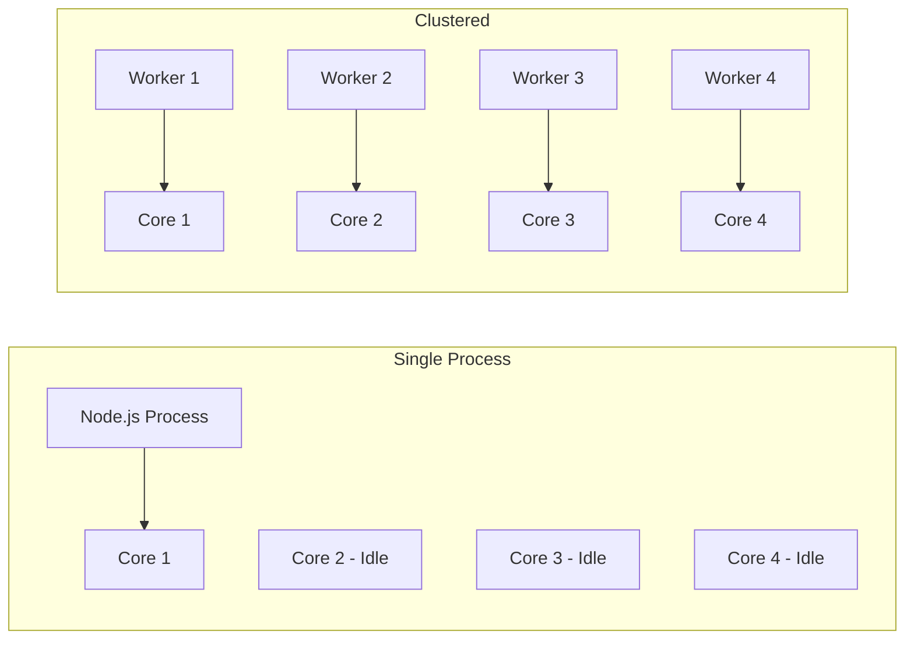
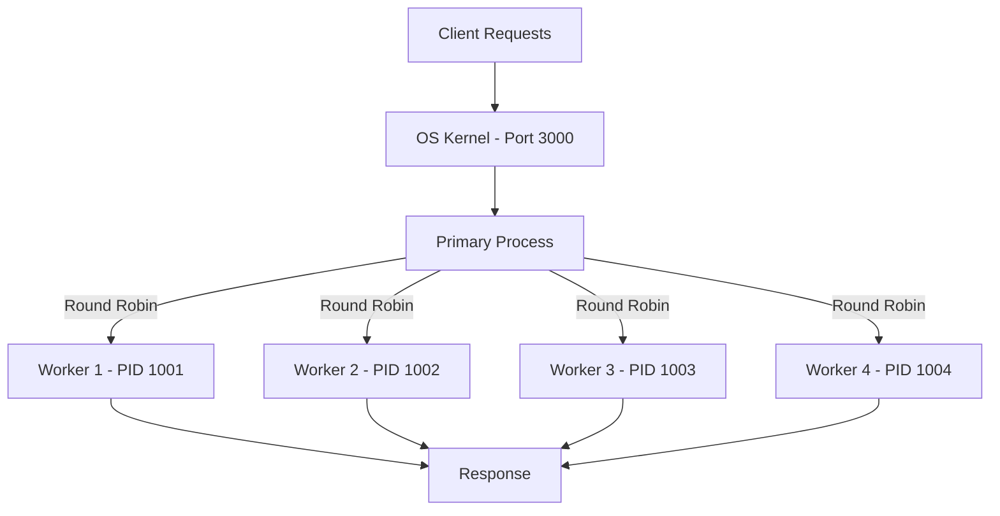
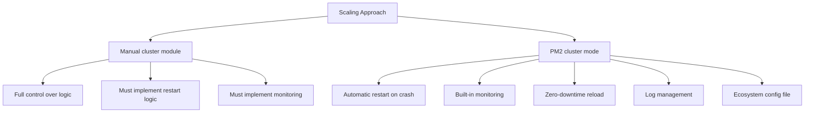

# How to Scale Node.js Applications with Cluster Mode and PM2

Author: [nawazdhandala](https://www.github.com/nawazdhandala)

Tags: Node.js, Clustering, PM2, Scaling, Performance

Description: Learn how to scale Node.js applications using cluster mode and PM2 for multi-core CPU utilization.

---

Node.js runs JavaScript on a single thread. On a modern server with 8, 16, or more CPU cores, a single Node.js process uses only one core while the rest sit idle. Clustering solves this by running multiple instances of your application, one per core, behind a shared port. In this guide, we will explore both the built-in cluster module and PM2 for production process management.

## The Single-Thread Problem



## Built-in Cluster Module

Node.js includes a cluster module that forks worker processes:

```javascript
// src/cluster.js
// Uses the built-in cluster module to fork worker processes

const cluster = require('node:cluster');
const os = require('node:os');

// Number of CPU cores available
const numCPUs = os.cpus().length;

if (cluster.isPrimary) {
    // This block runs only in the primary (master) process
    console.log(`Primary process ${process.pid} starting`);
    console.log(`Forking ${numCPUs} workers`);

    // Fork one worker per CPU core
    for (let i = 0; i < numCPUs; i++) {
        cluster.fork();
    }

    // Handle worker crashes by forking a replacement
    cluster.on('exit', (worker, code, signal) => {
        console.log(
            `Worker ${worker.process.pid} exited ` +
            `(code: ${code}, signal: ${signal})`
        );

        // Only restart if the exit was unexpected
        if (code !== 0 && !worker.exitedAfterDisconnect) {
            console.log('Starting a replacement worker');
            cluster.fork();
        }
    });

    // Log when a worker comes online
    cluster.on('online', (worker) => {
        console.log(`Worker ${worker.process.pid} is online`);
    });

} else {
    // This block runs in each worker process
    // Each worker is a full copy of the application
    require('./app');
}
```

## The Worker Application

```javascript
// src/app.js
// A simple Express server that each worker runs independently

const express = require('express');
const app = express();

const PORT = process.env.PORT || 3000;

// Each worker can handle requests on the same port
// The OS distributes incoming connections across workers
app.get('/api/health', (req, res) => {
    res.json({
        status: 'healthy',
        pid: process.pid,
        uptime: process.uptime(),
        memoryUsage: process.memoryUsage().rss,
    });
});

// Simulate a CPU-intensive operation
app.get('/api/compute', (req, res) => {
    const start = Date.now();
    // Fibonacci calculation to simulate CPU work
    const n = parseInt(req.query.n) || 40;
    const result = fibonacci(n);
    const duration = Date.now() - start;

    res.json({
        result,
        duration_ms: duration,
        worker_pid: process.pid,
    });
});

function fibonacci(n) {
    if (n <= 1) return n;
    return fibonacci(n - 1) + fibonacci(n - 2);
}

app.listen(PORT, () => {
    console.log(`Worker ${process.pid} listening on port ${PORT}`);
});
```

## How Cluster Mode Works



## Graceful Shutdown with Clustering

```javascript
// src/cluster-graceful.js
// Graceful shutdown support for clustered applications

const cluster = require('node:cluster');
const os = require('node:os');

if (cluster.isPrimary) {
    const numCPUs = os.cpus().length;

    for (let i = 0; i < numCPUs; i++) {
        cluster.fork();
    }

    // Graceful shutdown: disconnect all workers on SIGTERM
    function shutdownCluster() {
        console.log('Primary received shutdown signal');

        // Tell each worker to finish current requests and exit
        for (const id in cluster.workers) {
            const worker = cluster.workers[id];
            if (worker) {
                worker.send('shutdown');
                // Force kill after 30 seconds
                setTimeout(() => {
                    if (!worker.isDead()) {
                        console.log(`Force killing worker ${worker.process.pid}`);
                        worker.kill('SIGKILL');
                    }
                }, 30000);
            }
        }
    }

    process.on('SIGTERM', shutdownCluster);
    process.on('SIGINT', shutdownCluster);

    // Zero-downtime restart: replace workers one at a time
    process.on('SIGUSR2', () => {
        console.log('Starting rolling restart');
        const workerIds = Object.keys(cluster.workers);
        let index = 0;

        function restartNext() {
            if (index >= workerIds.length) {
                console.log('Rolling restart complete');
                return;
            }

            const worker = cluster.workers[workerIds[index]];
            if (worker) {
                console.log(`Restarting worker ${worker.process.pid}`);

                // Fork a new worker before killing the old one
                const newWorker = cluster.fork();
                newWorker.on('online', () => {
                    worker.disconnect();
                    index++;
                    // Wait a moment before restarting the next worker
                    setTimeout(restartNext, 1000);
                });
            }
        }

        restartNext();
    });
}
```

## Using PM2 in Production

PM2 is a production process manager that handles clustering, monitoring, and restarts automatically:

```bash
# Install PM2 globally
npm install -g pm2

# Start with cluster mode using all available cores
pm2 start src/app.js -i max --name "api"

# Start with a specific number of instances
pm2 start src/app.js -i 4 --name "api"

# View running processes
pm2 list

# Monitor CPU and memory in real-time
pm2 monit

# View application logs
pm2 logs api

# Zero-downtime reload
pm2 reload api

# Stop the application
pm2 stop api
```

## PM2 Ecosystem File

For production deployments, use an ecosystem configuration file:

```javascript
// ecosystem.config.js
// PM2 configuration for production deployment

module.exports = {
    apps: [
        {
            name: 'api',
            script: './src/app.js',

            // Cluster mode with all available CPUs
            instances: 'max',
            exec_mode: 'cluster',

            // Restart if memory exceeds 500 MB per worker
            max_memory_restart: '500M',

            // Environment variables for production
            env_production: {
                NODE_ENV: 'production',
                PORT: 3000,
            },

            // Environment variables for staging
            env_staging: {
                NODE_ENV: 'staging',
                PORT: 3001,
            },

            // Logging configuration
            error_file: './logs/error.log',
            out_file: './logs/output.log',
            log_date_format: 'YYYY-MM-DD HH:mm:ss Z',
            merge_logs: true,

            // Auto-restart settings
            watch: false,
            max_restarts: 10,
            restart_delay: 4000,

            // Graceful shutdown timeout
            kill_timeout: 5000,
            listen_timeout: 8000,

            // Wait for the app to be ready before considering it online
            wait_ready: true,
        },
    ],
};
```

```bash
# Start with the ecosystem file
pm2 start ecosystem.config.js --env production

# Reload with zero downtime
pm2 reload ecosystem.config.js --env production
```

## PM2 Ready Signal

Tell PM2 when your application is ready to accept connections:

```javascript
// src/app.js with PM2 ready signal
const express = require('express');
const app = express();

const PORT = process.env.PORT || 3000;

app.get('/api/health', (req, res) => {
    res.json({ status: 'healthy', pid: process.pid });
});

const server = app.listen(PORT, () => {
    console.log(`Worker ${process.pid} listening on port ${PORT}`);

    // Tell PM2 that this worker is ready to receive traffic
    // This works with the wait_ready option in ecosystem.config.js
    if (process.send) {
        process.send('ready');
    }
});

// Handle graceful shutdown message from PM2
process.on('SIGINT', () => {
    console.log(`Worker ${process.pid} shutting down gracefully`);
    server.close(() => {
        console.log(`Worker ${process.pid} closed all connections`);
        process.exit(0);
    });
});
```

## PM2 vs Manual Clustering



## Performance Considerations

1. Each worker uses its own memory space. Shared state requires an external store like Redis.
2. Sticky sessions may be needed for WebSocket connections so clients reconnect to the same worker.
3. The primary process distributes connections using round-robin scheduling on most platforms.
4. Monitor individual worker memory usage to catch memory leaks early.
5. Use the max_memory_restart option in PM2 to auto-restart workers that consume too much memory.

## Conclusion

Clustering transforms a single-threaded Node.js application into a multi-core powerhouse. Whether you use the built-in cluster module for fine-grained control or PM2 for a batteries-included production setup, the result is better CPU utilization, improved reliability through automatic restarts, and the ability to perform zero-downtime deployments.

If you are running clustered Node.js applications in production, [OneUptime](https://oneuptime.com) provides monitoring that tracks each instance's health, alerts you when workers crash or memory usage spikes, and gives you a unified view of your application's performance across all processes and servers.
