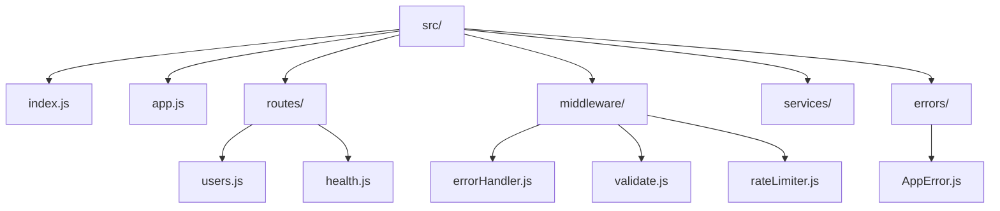
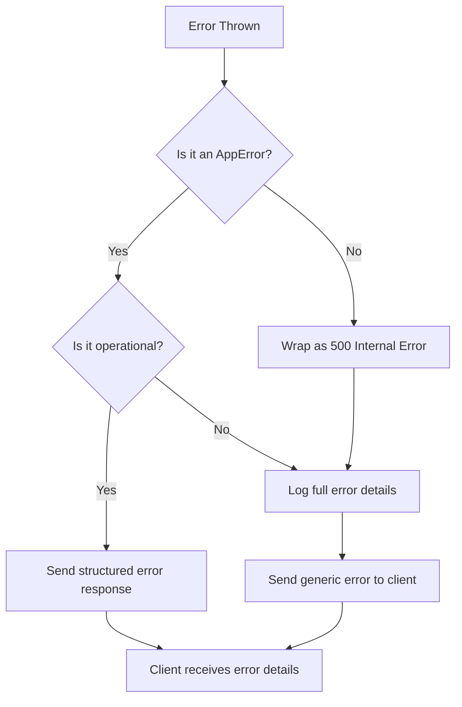
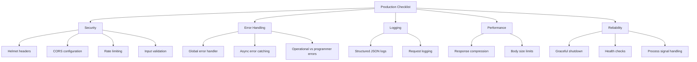

# How to Build a Production-Ready Node.js Express API

Author: [nawazdhandala](https://www.github.com/nawazdhandala)

Tags: Node.js, Express, Production, API, Best Practices

Description: Learn how to build a production-ready Express API with proper error handling, validation, security middleware, and logging.

---

Building an Express API that works in development is straightforward. Building one that is reliable, secure, and maintainable in production requires careful attention to error handling, validation, security headers, structured logging, and graceful shutdown. In this guide, we will build a production-ready Express API step by step.

## Project Structure



## Application Setup

```javascript
// src/app.js
// This file configures the Express application without starting the server
// Separating app config from server startup makes testing easier

const express = require('express');
const helmet = require('helmet');
const cors = require('cors');
const compression = require('compression');
const morgan = require('morgan');
const { errorHandler } = require('./middleware/errorHandler');
const { rateLimiter } = require('./middleware/rateLimiter');
const healthRoutes = require('./routes/health');
const userRoutes = require('./routes/users');

const app = express();

// Security headers - helmet sets various HTTP headers for protection
app.use(helmet());

// CORS - configure allowed origins for production
app.use(cors({
    origin: process.env.ALLOWED_ORIGINS
        ? process.env.ALLOWED_ORIGINS.split(',')
        : ['http://localhost:3000'],
    methods: ['GET', 'POST', 'PUT', 'DELETE'],
    allowedHeaders: ['Content-Type', 'Authorization'],
}));

// Parse JSON request bodies with a size limit
app.use(express.json({ limit: '10kb' }));

// Compress responses to reduce bandwidth
app.use(compression());

// Request logging - use 'combined' format in production for full details
app.use(morgan(process.env.NODE_ENV === 'production' ? 'combined' : 'dev'));

// Rate limiting - prevent abuse
app.use('/api/', rateLimiter);

// Mount route handlers
app.use('/api/health', healthRoutes);
app.use('/api/users', userRoutes);

// Handle 404 for unmatched routes
app.use((req, res) => {
    res.status(404).json({
        status: 'error',
        message: `Route ${req.method} ${req.path} not found`,
    });
});

// Global error handler must be the last middleware
app.use(errorHandler);

module.exports = app;
```

## Custom Error Class

```javascript
// src/errors/AppError.js
// Custom error class that carries an HTTP status code and operational flag

class AppError extends Error {
    /**
     * @param {string} message - Human-readable error description
     * @param {number} statusCode - HTTP status code to return
     * @param {boolean} isOperational - true if this is an expected error
     */
    constructor(message, statusCode, isOperational = true) {
        super(message);
        this.statusCode = statusCode;
        this.isOperational = isOperational;
        this.status = statusCode >= 500 ? 'error' : 'fail';

        // Capture the stack trace, excluding the constructor itself
        Error.captureStackTrace(this, this.constructor);
    }
}

// Factory methods for common error types
AppError.badRequest = (message) => new AppError(message, 400);
AppError.unauthorized = (message) => new AppError(message || 'Unauthorized', 401);
AppError.forbidden = (message) => new AppError(message || 'Forbidden', 403);
AppError.notFound = (message) => new AppError(message || 'Resource not found', 404);
AppError.conflict = (message) => new AppError(message, 409);
AppError.internal = (message) => new AppError(message || 'Internal server error', 500, false);

module.exports = { AppError };
```

## Error Handling Flow



## Error Handler Middleware

```javascript
// src/middleware/errorHandler.js
// Centralized error handling middleware for Express

const logger = require('../services/logger');

function errorHandler(err, req, res, _next) {
    // Default to 500 if no status code is set
    const statusCode = err.statusCode || 500;
    const isOperational = err.isOperational || false;

    // Log the error with context
    const logPayload = {
        message: err.message,
        statusCode,
        method: req.method,
        path: req.originalUrl,
        ip: req.ip,
        stack: err.stack,
    };

    if (statusCode >= 500) {
        // Server errors get full stack traces in logs
        logger.error('Server error', logPayload);
    } else {
        // Client errors get a warning-level log
        logger.warn('Client error', logPayload);
    }

    // Build the response object
    const response = {
        status: statusCode >= 500 ? 'error' : 'fail',
        message: isOperational ? err.message : 'An internal error occurred',
    };

    // Include stack trace in development mode only
    if (process.env.NODE_ENV === 'development') {
        response.stack = err.stack;
    }

    res.status(statusCode).json(response);
}

module.exports = { errorHandler };
```

## Request Validation

```javascript
// src/middleware/validate.js
// Validation middleware using Joi schemas

const Joi = require('joi');
const { AppError } = require('../errors/AppError');

/**
 * Creates a middleware that validates request data against a Joi schema
 * @param {Joi.ObjectSchema} schema - The Joi validation schema
 * @param {string} property - Which part of the request to validate (body, params, query)
 */
function validate(schema, property = 'body') {
    return (req, _res, next) => {
        const { error, value } = schema.validate(req[property], {
            abortEarly: false,    // Report all errors, not just the first
            stripUnknown: true,   // Remove fields not in the schema
        });

        if (error) {
            // Combine all validation messages into one string
            const message = error.details
                .map((detail) => detail.message)
                .join('; ');
            return next(AppError.badRequest(message));
        }

        // Replace the request property with the validated and cleaned data
        req[property] = value;
        next();
    };
}

// Define reusable validation schemas
const userSchemas = {
    create: Joi.object({
        name: Joi.string().min(2).max(100).required(),
        email: Joi.string().email().required(),
        age: Joi.number().integer().min(0).max(150),
    }),
    update: Joi.object({
        name: Joi.string().min(2).max(100),
        email: Joi.string().email(),
        age: Joi.number().integer().min(0).max(150),
    }).min(1), // At least one field must be provided
};

module.exports = { validate, userSchemas };
```

## Rate Limiter

```javascript
// src/middleware/rateLimiter.js
// Rate limiting to protect against abuse and brute-force attacks

const rateLimit = require('express-rate-limit');

const rateLimiter = rateLimit({
    // Time window: 15 minutes
    windowMs: 15 * 60 * 1000,
    // Maximum requests per window per IP
    max: 100,
    // Return rate limit info in response headers
    standardHeaders: true,
    legacyHeaders: false,
    // Custom response when limit is exceeded
    message: {
        status: 'fail',
        message: 'Too many requests, please try again later',
    },
});

module.exports = { rateLimiter };
```

## Route Handlers

```javascript
// src/routes/users.js
// User routes with validation and async error handling

const express = require('express');
const { validate, userSchemas } = require('../middleware/validate');
const { AppError } = require('../errors/AppError');

const router = express.Router();

// Wrap async handlers to catch rejected promises automatically
function asyncHandler(fn) {
    return (req, res, next) => {
        Promise.resolve(fn(req, res, next)).catch(next);
    };
}

// GET /api/users - List all users
router.get('/', asyncHandler(async (req, res) => {
    // In production, this would query a database
    const users = await userService.findAll();
    res.json({ status: 'success', data: users });
}));

// POST /api/users - Create a new user
router.post(
    '/',
    validate(userSchemas.create),  // Validate request body before handler
    asyncHandler(async (req, res) => {
        const user = await userService.create(req.body);
        res.status(201).json({ status: 'success', data: user });
    }),
);

// GET /api/users/:id - Get a user by ID
router.get('/:id', asyncHandler(async (req, res) => {
    const user = await userService.findById(req.params.id);
    if (!user) {
        throw AppError.notFound(`User with id '${req.params.id}' not found`);
    }
    res.json({ status: 'success', data: user });
}));

module.exports = router;
```

## Structured Logger

```javascript
// src/services/logger.js
// Structured JSON logging for production environments

const winston = require('winston');

const logger = winston.createLogger({
    level: process.env.LOG_LEVEL || 'info',
    format: winston.format.combine(
        winston.format.timestamp({ format: 'YYYY-MM-DDTHH:mm:ss.sssZ' }),
        winston.format.errors({ stack: true }),
        winston.format.json(),
    ),
    defaultMeta: {
        service: 'api',
        version: process.env.npm_package_version || '1.0.0',
    },
    transports: [
        // Write all logs to stdout as JSON
        new winston.transports.Console(),
    ],
});

module.exports = logger;
```

## Graceful Shutdown

```javascript
// src/index.js
// Server entry point with graceful shutdown handling

const app = require('./app');
const logger = require('./services/logger');

const PORT = process.env.PORT || 3000;

const server = app.listen(PORT, () => {
    logger.info(`Server started on port ${PORT}`);
});

// Graceful shutdown handler
function shutdown(signal) {
    logger.info(`${signal} received, shutting down gracefully`);

    // Stop accepting new connections
    server.close(() => {
        logger.info('HTTP server closed');
        // Close database connections, flush logs, etc.
        process.exit(0);
    });

    // Force exit after 30 seconds if connections are not closed
    setTimeout(() => {
        logger.error('Forced shutdown after timeout');
        process.exit(1);
    }, 30000);
}

// Listen for termination signals from the OS or orchestrator
process.on('SIGTERM', () => shutdown('SIGTERM'));
process.on('SIGINT', () => shutdown('SIGINT'));

// Catch unhandled promise rejections
process.on('unhandledRejection', (reason) => {
    logger.error('Unhandled promise rejection', { reason });
});

// Catch uncaught exceptions - log and exit
process.on('uncaughtException', (error) => {
    logger.error('Uncaught exception', { error });
    process.exit(1);
});
```

## Production Checklist



## Conclusion

A production-ready Express API requires layers of protection and operational awareness beyond basic route handling. By implementing structured error handling, input validation, security middleware, structured logging, and graceful shutdown, you build a service that is resilient, secure, and debuggable.

If you are running Express APIs in production and want to monitor their availability, response times, and error rates, [OneUptime](https://oneuptime.com) provides uptime monitoring, distributed tracing, and incident management that helps your team detect and resolve issues before they impact users.
