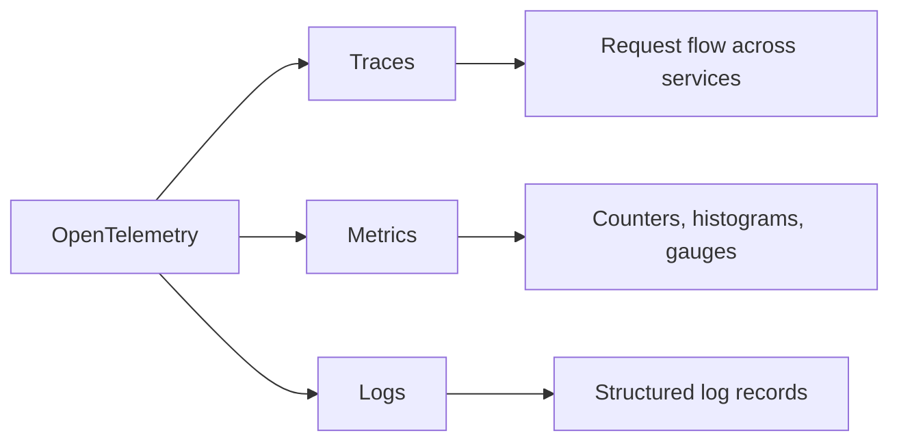
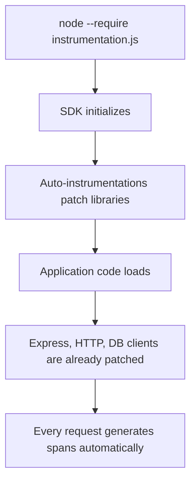
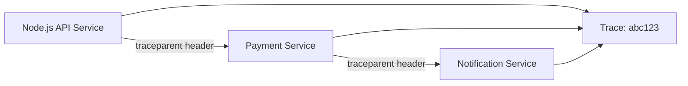

# How to Set Up OpenTelemetry for Node.js Applications

Author: [nawazdhandala](https://www.github.com/nawazdhandala)

Tags: Node.js, OpenTelemetry, Tracing, Metrics, Observability

Description: Step-by-step guide to setting up OpenTelemetry for Node.js applications with automatic instrumentation and custom spans.

---

OpenTelemetry is the industry standard for collecting telemetry data from applications. For Node.js services, it provides automatic instrumentation for popular frameworks like Express, Fastify, and database drivers, plus APIs for adding custom spans and metrics. In this guide, we will set up OpenTelemetry from scratch in a Node.js application.

## What OpenTelemetry Captures



## Install Dependencies

```bash
# Core OpenTelemetry packages
npm install @opentelemetry/api \
  @opentelemetry/sdk-node \
  @opentelemetry/sdk-trace-node \
  @opentelemetry/sdk-metrics

# OTLP exporter to send data to a collector
npm install @opentelemetry/exporter-trace-otlp-http \
  @opentelemetry/exporter-metrics-otlp-http

# Automatic instrumentation for common libraries
npm install @opentelemetry/auto-instrumentations-node

# Resource detection for environment metadata
npm install @opentelemetry/resources \
  @opentelemetry/semantic-conventions
```

## Instrumentation File

This file must be loaded before any other application code. It registers the SDK and auto-instrumentation:

```javascript
// src/instrumentation.js
// This file MUST be loaded first, before importing express or any other library
// Use: node --require ./src/instrumentation.js src/index.js

const { NodeSDK } = require('@opentelemetry/sdk-node');
const { OTLPTraceExporter } = require('@opentelemetry/exporter-trace-otlp-http');
const { OTLPMetricExporter } = require('@opentelemetry/exporter-metrics-otlp-http');
const { PeriodicExportingMetricReader } = require('@opentelemetry/sdk-metrics');
const { getNodeAutoInstrumentations } = require('@opentelemetry/auto-instrumentations-node');
const { Resource } = require('@opentelemetry/resources');
const { ATTR_SERVICE_NAME, ATTR_SERVICE_VERSION } = require('@opentelemetry/semantic-conventions');

// Define which service this telemetry belongs to
const resource = new Resource({
    [ATTR_SERVICE_NAME]: process.env.OTEL_SERVICE_NAME || 'node-api',
    [ATTR_SERVICE_VERSION]: process.env.npm_package_version || '1.0.0',
    'deployment.environment': process.env.NODE_ENV || 'development',
});

// Configure the trace exporter to send spans via OTLP HTTP
const traceExporter = new OTLPTraceExporter({
    url: process.env.OTEL_EXPORTER_OTLP_ENDPOINT
        ? `${process.env.OTEL_EXPORTER_OTLP_ENDPOINT}/v1/traces`
        : 'http://localhost:4318/v1/traces',
});

// Configure the metric exporter with a 60-second export interval
const metricExporter = new OTLPMetricExporter({
    url: process.env.OTEL_EXPORTER_OTLP_ENDPOINT
        ? `${process.env.OTEL_EXPORTER_OTLP_ENDPOINT}/v1/metrics`
        : 'http://localhost:4318/v1/metrics',
});

const metricReader = new PeriodicExportingMetricReader({
    exporter: metricExporter,
    exportIntervalMillis: 60000, // Export metrics every 60 seconds
});

// Build and start the OpenTelemetry SDK
const sdk = new NodeSDK({
    resource,
    traceExporter,
    metricReader,
    instrumentations: [
        getNodeAutoInstrumentations({
            // Customize which auto-instrumentations are enabled
            '@opentelemetry/instrumentation-fs': { enabled: false },
            '@opentelemetry/instrumentation-http': {
                // Ignore health check endpoints to reduce noise
                ignoreIncomingRequestHook: (req) => {
                    return req.url === '/health' || req.url === '/ready';
                },
            },
        }),
    ],
});

// Start the SDK - this must happen before the app loads
sdk.start();

// Ensure telemetry is flushed when the process exits
process.on('SIGTERM', () => {
    sdk.shutdown()
        .then(() => console.log('OpenTelemetry SDK shut down'))
        .catch((err) => console.error('Error shutting down SDK', err))
        .finally(() => process.exit(0));
});

console.log('OpenTelemetry instrumentation initialized');
```

## Instrumentation Loading Order



## Custom Spans

Auto-instrumentation covers HTTP requests and database queries, but you often need custom spans for business logic:

```javascript
// src/services/orderService.js
// Adding custom spans to business logic

const { trace, SpanStatusCode } = require('@opentelemetry/api');

// Get a tracer instance for this module
const tracer = trace.getTracer('order-service');

/**
 * Process an order with custom tracing spans
 * @param {Object} orderData - The order request data
 * @returns {Object} The created order
 */
async function processOrder(orderData) {
    // Start a custom span for the entire order processing flow
    return tracer.startActiveSpan('processOrder', async (span) => {
        try {
            // Set attributes on the span for later analysis
            span.setAttribute('order.customer_id', orderData.customerId);
            span.setAttribute('order.item_count', orderData.items.length);

            // Validate the order in a child span
            const validationResult = await tracer.startActiveSpan(
                'validateOrder',
                async (validationSpan) => {
                    const result = validateOrderData(orderData);
                    validationSpan.setAttribute('validation.passed', result.valid);
                    validationSpan.end();
                    return result;
                },
            );

            if (!validationResult.valid) {
                span.setStatus({
                    code: SpanStatusCode.ERROR,
                    message: 'Order validation failed',
                });
                throw new Error(validationResult.reason);
            }

            // Calculate totals in a child span
            const total = await tracer.startActiveSpan(
                'calculateTotal',
                async (calcSpan) => {
                    const amount = calculateOrderTotal(orderData.items);
                    calcSpan.setAttribute('order.total_cents', amount);
                    calcSpan.end();
                    return amount;
                },
            );

            // Add an event to mark a significant point in time
            span.addEvent('order.calculated', {
                'order.total_cents': total,
            });

            // Save to database (auto-instrumented by the DB driver)
            const order = await saveOrder({ ...orderData, total });

            span.setAttribute('order.id', order.id);
            span.setStatus({ code: SpanStatusCode.OK });

            return order;
        } catch (error) {
            // Record the error on the span
            span.recordException(error);
            span.setStatus({
                code: SpanStatusCode.ERROR,
                message: error.message,
            });
            throw error;
        } finally {
            // Always end the span
            span.end();
        }
    });
}

module.exports = { processOrder };
```

## Custom Metrics

```javascript
// src/metrics/appMetrics.js
// Custom application metrics using the OpenTelemetry Metrics API

const { metrics } = require('@opentelemetry/api');

// Get a meter instance for this module
const meter = metrics.getMeter('app-metrics');

// Counter - tracks the total number of orders created
const orderCounter = meter.createCounter('orders.created', {
    description: 'Total number of orders created',
    unit: 'orders',
});

// Histogram - tracks how long order processing takes
const orderDuration = meter.createHistogram('orders.processing_duration', {
    description: 'Time taken to process an order',
    unit: 'ms',
});

// Up/Down Counter - tracks currently active connections
const activeConnections = meter.createUpDownCounter('connections.active', {
    description: 'Number of currently active connections',
});

/**
 * Record that an order was created
 * @param {string} status - The order status (success, failed)
 * @param {string} paymentMethod - The payment method used
 */
function recordOrderCreated(status, paymentMethod) {
    orderCounter.add(1, {
        'order.status': status,
        'order.payment_method': paymentMethod,
    });
}

/**
 * Record how long an order took to process
 * @param {number} durationMs - The processing time in milliseconds
 */
function recordOrderDuration(durationMs) {
    orderDuration.record(durationMs);
}

module.exports = {
    recordOrderCreated,
    recordOrderDuration,
    activeConnections,
};
```

## Context Propagation

OpenTelemetry automatically propagates trace context across HTTP boundaries:

```javascript
// src/services/paymentService.js
// Trace context is propagated automatically in outgoing HTTP headers

const axios = require('axios');

async function chargePayment(orderId, amount) {
    // The auto-instrumentation patches axios/http
    // W3C Traceparent header is added automatically
    // The payment service receives the trace context and creates child spans
    const response = await axios.post('https://payments.internal/charge', {
        orderId,
        amount,
        currency: 'usd',
    });

    return response.data;
}

module.exports = { chargePayment };
```



## Running with Instrumentation

```bash
# Load the instrumentation file before the application
node --require ./src/instrumentation.js src/index.js

# Or set it via environment variable
export NODE_OPTIONS="--require ./src/instrumentation.js"
node src/index.js

# Configure the collector endpoint
export OTEL_EXPORTER_OTLP_ENDPOINT="http://collector:4318"
export OTEL_SERVICE_NAME="my-api"
node --require ./src/instrumentation.js src/index.js
```

## Collector Configuration for OneUptime

```yaml
# otel-collector-config.yaml
receivers:
  otlp:
    protocols:
      http:
        endpoint: "0.0.0.0:4318"

processors:
  batch:
    timeout: 5s
    send_batch_size: 512

exporters:
  otlphttp:
    endpoint: "https://otlp.oneuptime.com"
    headers:
      x-oneuptime-token: "your-project-token"

service:
  pipelines:
    traces:
      receivers: [otlp]
      processors: [batch]
      exporters: [otlphttp]
    metrics:
      receivers: [otlp]
      processors: [batch]
      exporters: [otlphttp]
```

## Conclusion

OpenTelemetry for Node.js combines powerful automatic instrumentation with a flexible API for custom telemetry. By setting up the SDK early in your application lifecycle, you get comprehensive traces and metrics with minimal code changes. Custom spans and metrics let you add business-level observability on top of the infrastructure-level data.

[OneUptime](https://oneuptime.com) is fully compatible with OpenTelemetry, accepting traces and metrics via OTLP. Send your Node.js telemetry data to OneUptime for distributed trace visualization, metric dashboards, alerting, and incident management - all in one platform.
