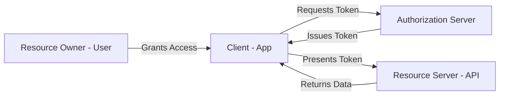
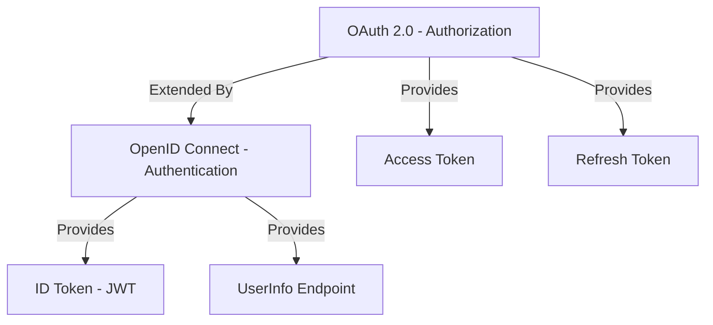
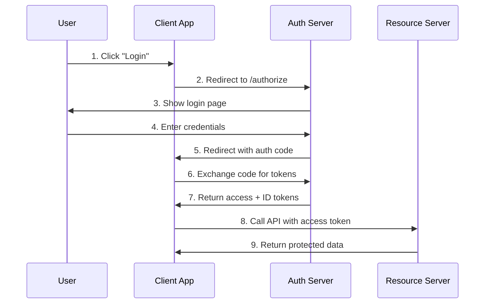
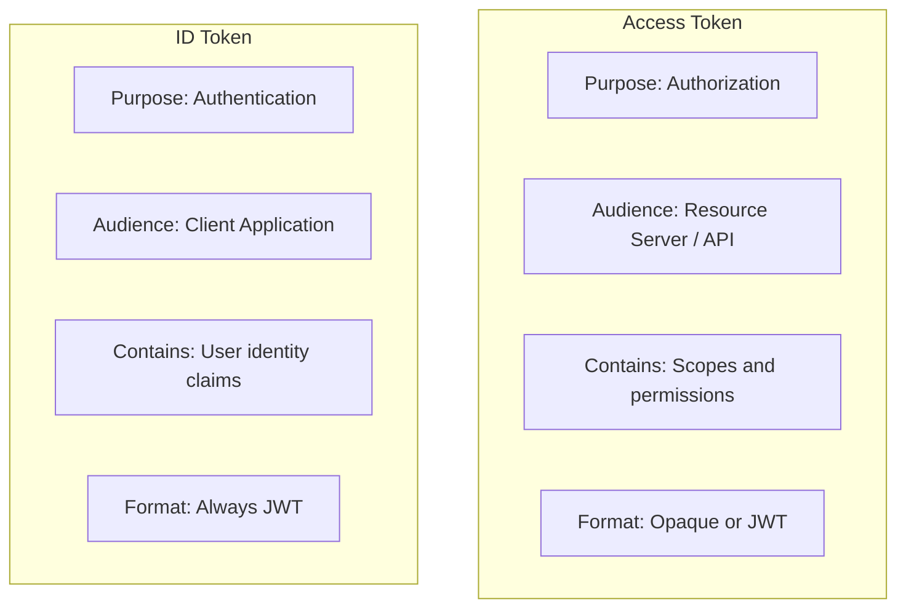
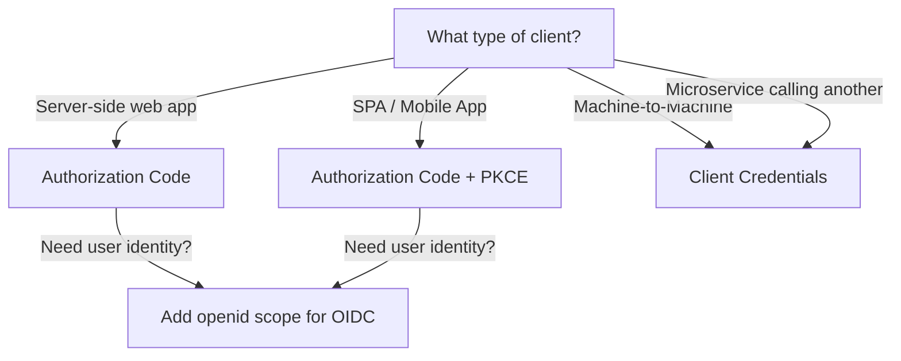

# Understanding OAuth 2.0 and OpenID Connect for Developers

Author: [nawazdhandala](https://www.github.com/nawazdhandala)

Tags: OAuth2, OpenID Connect, Authentication, Security, Identity

Description: A practical guide to understanding OAuth 2.0 and OpenID Connect flows, tokens, and implementation patterns for developers.

---

## Introduction

OAuth 2.0 and OpenID Connect (OIDC) form the backbone of modern identity and access management. Yet many developers struggle to understand how they fit together and when to use each flow. This guide breaks down both protocols with practical examples and clear diagrams.

## What is OAuth 2.0?

OAuth 2.0 is an authorization framework that lets third-party applications access resources on behalf of a user without exposing credentials. It issues access tokens rather than sharing passwords.

### Key Roles in OAuth 2.0



- **Resource Owner**: The user who owns the data.
- **Client**: The application requesting access.
- **Authorization Server**: Issues tokens after authenticating the user.
- **Resource Server**: The API that holds protected resources.

## What is OpenID Connect?

OpenID Connect is an identity layer built on top of OAuth 2.0. While OAuth 2.0 handles authorization ("what can you access?"), OIDC handles authentication ("who are you?").



## OAuth 2.0 Grant Types

### Authorization Code Flow

This is the most common and recommended flow for server-side applications.



### Authorization Code with PKCE

PKCE (Proof Key for Code Exchange) adds security for public clients like SPAs and mobile apps.

```python
# Step 1: Generate PKCE code verifier and challenge
import hashlib
import base64
import secrets

# Generate a random code verifier (43-128 characters)
code_verifier = secrets.token_urlsafe(32)

# Create code challenge from verifier using SHA256
code_challenge = base64.urlsafe_b64encode(
    hashlib.sha256(code_verifier.encode()).digest()
).rstrip(b"=").decode()

print(f"Code Verifier: {code_verifier}")
print(f"Code Challenge: {code_challenge}")
```

```python
# Step 2: Build the authorization URL with PKCE parameters
from urllib.parse import urlencode

auth_params = {
    "response_type": "code",
    "client_id": "my-app-client-id",
    "redirect_uri": "http://localhost:3000/callback",
    "scope": "openid profile email",
    "state": secrets.token_urlsafe(16),  # CSRF protection
    "code_challenge": code_challenge,
    "code_challenge_method": "S256",
}

# Redirect user to this URL
auth_url = f"https://auth.example.com/authorize?{urlencode(auth_params)}"
print(f"Authorization URL: {auth_url}")
```

```python
# Step 3: Exchange authorization code for tokens
import httpx

async def exchange_code_for_tokens(auth_code: str) -> dict:
    """Exchange the authorization code for access and ID tokens."""
    token_url = "https://auth.example.com/token"

    # Include the original code_verifier for PKCE verification
    payload = {
        "grant_type": "authorization_code",
        "code": auth_code,
        "redirect_uri": "http://localhost:3000/callback",
        "client_id": "my-app-client-id",
        "code_verifier": code_verifier,  # PKCE: proves we initiated the flow
    }

    async with httpx.AsyncClient() as client:
        response = await client.post(token_url, data=payload)
        response.raise_for_status()
        return response.json()

# Response contains: access_token, id_token, refresh_token, expires_in
```

### Client Credentials Flow

Used for machine-to-machine communication where no user is involved.

```python
# Client Credentials flow for service-to-service auth
import httpx

async def get_machine_token() -> str:
    """Get an access token for machine-to-machine communication."""
    token_url = "https://auth.example.com/token"

    payload = {
        "grant_type": "client_credentials",
        "client_id": "service-a-client-id",
        "client_secret": "service-a-secret",
        "scope": "api:read api:write",
    }

    async with httpx.AsyncClient() as client:
        response = await client.post(token_url, data=payload)
        response.raise_for_status()
        data = response.json()
        return data["access_token"]
```

## Understanding Tokens

### ID Token (OIDC)

The ID Token is a JWT that contains claims about the authenticated user.

```python
# Decode and validate an ID token
import jwt  # PyJWT library
import httpx

async def validate_id_token(id_token: str, client_id: str) -> dict:
    """Validate an OIDC ID token and return its claims."""

    # Fetch the JWKS (JSON Web Key Set) from the auth server
    jwks_url = "https://auth.example.com/.well-known/jwks.json"
    async with httpx.AsyncClient() as client:
        response = await client.get(jwks_url)
        jwks = response.json()

    # Get the signing key from JWKS
    # The kid (Key ID) in the token header identifies which key to use
    header = jwt.get_unverified_header(id_token)
    signing_key = None
    for key in jwks["keys"]:
        if key["kid"] == header["kid"]:
            signing_key = jwt.algorithms.RSAAlgorithm.from_jwk(key)
            break

    if not signing_key:
        raise ValueError("Unable to find matching signing key")

    # Decode and validate the token
    claims = jwt.decode(
        id_token,
        signing_key,
        algorithms=["RS256"],
        audience=client_id,
        issuer="https://auth.example.com",
    )

    return claims

# Example claims in an ID token:
# {
#   "iss": "https://auth.example.com",     -- Issuer
#   "sub": "user-12345",                    -- Subject (unique user ID)
#   "aud": "my-app-client-id",             -- Audience (your app)
#   "exp": 1700000000,                     -- Expiration time
#   "iat": 1699996400,                     -- Issued at
#   "email": "user@example.com",           -- User email
#   "name": "Jane Doe"                     -- User name
# }
```

### Access Token vs ID Token



## Implementing Token Refresh

```python
# Token refresh implementation
import httpx
import time

class TokenManager:
    """Manages OAuth tokens with automatic refresh."""

    def __init__(self, token_url: str, client_id: str, client_secret: str):
        self.token_url = token_url
        self.client_id = client_id
        self.client_secret = client_secret
        self._access_token = None
        self._refresh_token = None
        self._expires_at = 0

    async def get_access_token(self) -> str:
        """Return a valid access token, refreshing if expired."""
        # Check if token is expired or about to expire (30s buffer)
        if time.time() >= (self._expires_at - 30):
            await self._refresh()
        return self._access_token

    async def _refresh(self):
        """Refresh the access token using the refresh token."""
        payload = {
            "grant_type": "refresh_token",
            "refresh_token": self._refresh_token,
            "client_id": self.client_id,
            "client_secret": self.client_secret,
        }

        async with httpx.AsyncClient() as client:
            response = await client.post(self.token_url, data=payload)
            response.raise_for_status()
            data = response.json()

        # Update stored tokens
        self._access_token = data["access_token"]
        self._expires_at = time.time() + data["expires_in"]

        # Refresh token rotation: update if a new one is issued
        if "refresh_token" in data:
            self._refresh_token = data["refresh_token"]
```

## OIDC Discovery

Every OIDC provider exposes a discovery document that describes its configuration.

```python
# Fetch OIDC discovery document
import httpx

async def discover_oidc_config(issuer: str) -> dict:
    """Fetch the OIDC discovery document for an issuer."""
    discovery_url = f"{issuer}/.well-known/openid-configuration"

    async with httpx.AsyncClient() as client:
        response = await client.get(discovery_url)
        response.raise_for_status()
        config = response.json()

    # The discovery document contains all endpoints you need:
    print(f"Authorization endpoint: {config['authorization_endpoint']}")
    print(f"Token endpoint: {config['token_endpoint']}")
    print(f"UserInfo endpoint: {config['userinfo_endpoint']}")
    print(f"JWKS URI: {config['jwks_uri']}")
    print(f"Supported scopes: {config['scopes_supported']}")
    print(f"Supported grant types: {config['grant_types_supported']}")

    return config
```

## Common Mistakes to Avoid

1. **Using the implicit flow**: It exposes tokens in the URL. Use Authorization Code with PKCE instead.
2. **Storing tokens in localStorage**: Use httpOnly cookies or in-memory storage.
3. **Skipping state parameter**: Always include a state parameter to prevent CSRF attacks.
4. **Not validating tokens server-side**: Always verify the signature, issuer, audience, and expiration.
5. **Using access tokens for authentication**: Access tokens are for authorization. Use ID tokens for authentication.

## Choosing the Right Flow



## Conclusion

OAuth 2.0 and OpenID Connect are complementary protocols. OAuth 2.0 handles authorization while OIDC adds authentication. Use Authorization Code with PKCE for user-facing apps and Client Credentials for service-to-service communication. Always validate tokens properly and follow the principle of least privilege when requesting scopes.

To monitor your authentication services and ensure your OAuth endpoints stay healthy, check out [OneUptime](https://oneuptime.com) for uptime monitoring, incident management, and observability.
