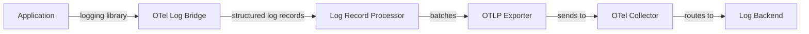
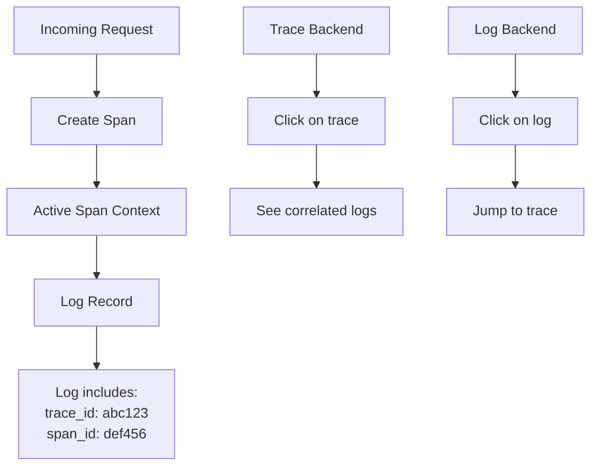
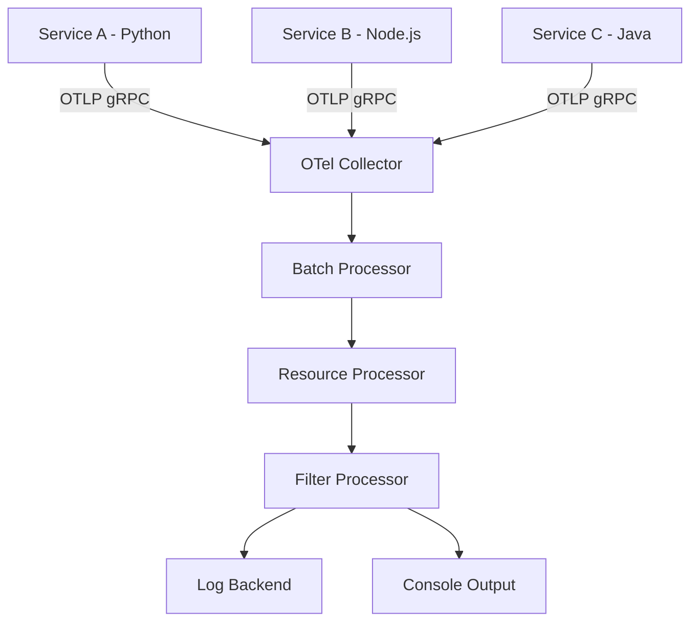

# How to Send Structured Logs with OpenTelemetry

Author: [nawazdhandala](https://www.github.com/nawazdhandala)

Tags: OpenTelemetry, Logs, Structured Logging, Observability, Correlation

Description: Learn how to send structured logs with OpenTelemetry including trace-log correlation and log pipeline configuration.

---

Logs are the most familiar observability signal. Every application produces logs. But unstructured logs scattered across services are hard to search and correlate. OpenTelemetry brings structure to logs by defining a log data model, providing SDKs for emitting logs, and correlating logs with traces and metrics. This guide shows how to send structured logs using OpenTelemetry.

## The OpenTelemetry Logs Pipeline



OpenTelemetry does not replace your existing logging library. Instead, it provides a bridge that connects your logging library (like Python's `logging` module or Winston in Node.js) to the OpenTelemetry pipeline. Your logs gain trace context, structured attributes, and a standard export format.

## Log Data Model

Every OpenTelemetry log record has these fields:

| Field | Description |
|-------|-------------|
| Timestamp | When the log was emitted |
| Observed Timestamp | When the log was collected |
| Severity Number | Numeric severity (1-24) |
| Severity Text | Human-readable severity (INFO, ERROR) |
| Body | The log message |
| Attributes | Structured key-value pairs |
| Trace ID | Correlation to a trace |
| Span ID | Correlation to a specific span |
| Trace Flags | Sampling flags from the trace |
| Resource | Service name, version, environment |

## Trace-Log Correlation

The most powerful feature of OpenTelemetry logs is automatic correlation with traces:



When you emit a log while a span is active, the OpenTelemetry SDK automatically attaches the trace ID and span ID to the log record. This lets you jump from a log entry to the full trace, and vice versa.

## Python: Structured Logging with OpenTelemetry

### Setup

```python
# Install required packages
# pip install opentelemetry-api opentelemetry-sdk
# pip install opentelemetry-exporter-otlp
# pip install opentelemetry-sdk-extension-aws  (if on AWS)

import logging
from opentelemetry import trace
from opentelemetry.sdk.trace import TracerProvider
from opentelemetry.sdk.trace.export import BatchSpanProcessor
from opentelemetry.sdk._logs import LoggerProvider, LoggingHandler
from opentelemetry.sdk._logs.export import (
    BatchLogRecordProcessor,
    ConsoleLogExporter,
)
from opentelemetry.exporter.otlp.proto.grpc._log_exporter import (
    OTLPLogExporter,
)
from opentelemetry.sdk.resources import Resource

# Define the service resource
# This metadata is attached to every log and trace
resource = Resource.create({
    "service.name": "order-service",
    "service.version": "1.2.0",
    "deployment.environment": "production",
})

# Set up tracing (needed for trace-log correlation)
trace_provider = TracerProvider(resource=resource)
trace_provider.add_span_processor(
    BatchSpanProcessor(
        # Configure your trace exporter here
        ConsoleSpanExporter()
    )
)
trace.set_tracer_provider(trace_provider)

# Set up logging with OpenTelemetry
logger_provider = LoggerProvider(resource=resource)

# Export logs via OTLP to the OpenTelemetry Collector
otlp_exporter = OTLPLogExporter(
    endpoint="http://otel-collector:4317",
    insecure=True,
)
logger_provider.add_log_record_processor(
    BatchLogRecordProcessor(otlp_exporter)
)

# Also export to console for debugging
logger_provider.add_log_record_processor(
    BatchLogRecordProcessor(ConsoleLogExporter())
)

# Create a logging handler that bridges Python logging to OTel
handler = LoggingHandler(
    level=logging.INFO,
    logger_provider=logger_provider,
)

# Attach the handler to Python's root logger
logging.getLogger().addHandler(handler)
logging.getLogger().setLevel(logging.INFO)
```

### Emitting Structured Logs

```python
import logging

# Standard Python logger - works exactly as you are used to
logger = logging.getLogger("order.service")
tracer = trace.get_tracer("order.service")


def process_order(order_id: str, customer_id: str) -> dict:
    """Process an order with correlated logs and traces."""

    # Start a span - all logs within this span get trace context
    with tracer.start_as_current_span("process_order") as span:
        span.set_attribute("order.id", order_id)

        # This log automatically gets trace_id and span_id
        logger.info(
            "Processing order",
            extra={
                "order_id": order_id,
                "customer_id": customer_id,
            }
        )

        try:
            # Validate the order
            validate_order(order_id)

            # Process payment
            with tracer.start_as_current_span("charge_payment"):
                logger.info(
                    "Charging payment",
                    extra={
                        "order_id": order_id,
                        "payment_method": "credit_card",
                    }
                )
                # ... payment logic ...

            logger.info(
                "Order completed successfully",
                extra={
                    "order_id": order_id,
                    "status": "completed",
                }
            )
            return {"status": "completed"}

        except Exception as e:
            # Error logs also get trace context
            logger.error(
                "Order processing failed",
                extra={
                    "order_id": order_id,
                    "error_type": type(e).__name__,
                },
                exc_info=True,
            )
            raise


def validate_order(order_id: str) -> None:
    """Validate order details."""
    with tracer.start_as_current_span("validate_order"):
        logger.info(
            "Validating order",
            extra={"order_id": order_id}
        )
        # ... validation logic ...
```

## Node.js: Structured Logging with OpenTelemetry

```javascript
// Install: npm install @opentelemetry/api @opentelemetry/sdk-logs
// npm install @opentelemetry/exporter-logs-otlp-grpc winston

const { logs, SeverityNumber } = require("@opentelemetry/api-logs");
const { LoggerProvider, BatchLogRecordProcessor } = require("@opentelemetry/sdk-logs");
const { OTLPLogExporter } = require("@opentelemetry/exporter-logs-otlp-grpc");
const { Resource } = require("@opentelemetry/resources");
const { trace, context } = require("@opentelemetry/api");

// Set up the logger provider
const resource = new Resource({
  "service.name": "order-service",
  "service.version": "1.2.0",
});

const loggerProvider = new LoggerProvider({ resource });

// Export logs via OTLP
loggerProvider.addLogRecordProcessor(
  new BatchLogRecordProcessor(
    new OTLPLogExporter({
      url: "http://otel-collector:4317",
    })
  )
);

// Get a logger instance
const logger = loggerProvider.getLogger("order-service");

function processOrder(orderId) {
  const tracer = trace.getTracer("order-service");

  return tracer.startActiveSpan("process_order", (span) => {
    // Emit a structured log - trace context is automatic
    logger.emit({
      severityNumber: SeverityNumber.INFO,
      severityText: "INFO",
      body: "Processing order",
      attributes: {
        "order.id": orderId,
        "event.name": "order.processing",
      },
    });

    // ... process the order ...

    logger.emit({
      severityNumber: SeverityNumber.INFO,
      severityText: "INFO",
      body: "Order completed",
      attributes: {
        "order.id": orderId,
        "order.status": "completed",
      },
    });

    span.end();
  });
}
```

## OpenTelemetry Collector Log Pipeline

The Collector receives, processes, and exports logs:

```yaml
# otel-collector-config.yaml
receivers:
  otlp:
    protocols:
      grpc:
        # Receive logs on port 4317
        endpoint: "0.0.0.0:4317"
      http:
        # Receive logs on port 4318
        endpoint: "0.0.0.0:4318"

processors:
  # Batch logs for efficient export
  batch:
    timeout: 5s
    send_batch_size: 1000

  # Add resource attributes
  resource:
    attributes:
      - key: environment
        value: production
        action: upsert

  # Filter out noisy logs
  filter:
    logs:
      # Drop debug logs
      log_record:
        - severity_number < 9

exporters:
  # Export to a log backend
  otlp/backend:
    endpoint: "https://logs-backend.example.com:4317"

  # Also export to stdout for debugging
  logging:
    loglevel: info

service:
  pipelines:
    logs:
      receivers: [otlp]
      processors: [batch, resource, filter]
      exporters: [otlp/backend, logging]
```

## Log Pipeline Architecture



## Structured Log Best Practices

### Use Consistent Attribute Names

```python
# Good: use semantic conventions
logger.info("Request handled", extra={
    "http.method": "POST",
    "http.route": "/api/orders",
    "http.status_code": 201,
    "http.response.body.size": 256,
})

# Bad: inconsistent naming
logger.info("Request handled", extra={
    "method": "POST",
    "url": "/api/orders",
    "statusCode": 201,
})
```

### Include Context in Every Log

```python
# Good: enough context to understand the log without searching
logger.info(
    "Payment processed",
    extra={
        "order_id": "ord-123",
        "payment_id": "pay-456",
        "amount": 99.99,
        "currency": "USD",
        "payment_method": "credit_card",
    }
)

# Bad: not enough context
logger.info("Payment done")
```

### Use Appropriate Severity Levels

| Level | Severity Number | When to Use |
|-------|----------------|-------------|
| TRACE | 1-4 | Detailed debugging information |
| DEBUG | 5-8 | Diagnostic information |
| INFO | 9-12 | Normal operations |
| WARN | 13-16 | Something unexpected but not broken |
| ERROR | 17-20 | Operation failed |
| FATAL | 21-24 | Application cannot continue |

## Conclusion

OpenTelemetry logs bring structure and correlation to your log data. By bridging your existing logging library to the OpenTelemetry pipeline, you get automatic trace context injection, structured attributes, and a standard export format. The result is logs that are easy to search, filter, and correlate with traces and metrics.

For a monitoring platform that ingests OpenTelemetry logs and provides unified search across traces, metrics, and logs, check out [OneUptime](https://oneuptime.com). OneUptime supports OTLP log ingestion and lets you correlate logs with traces for faster debugging.
