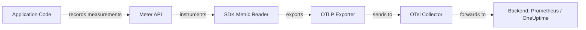
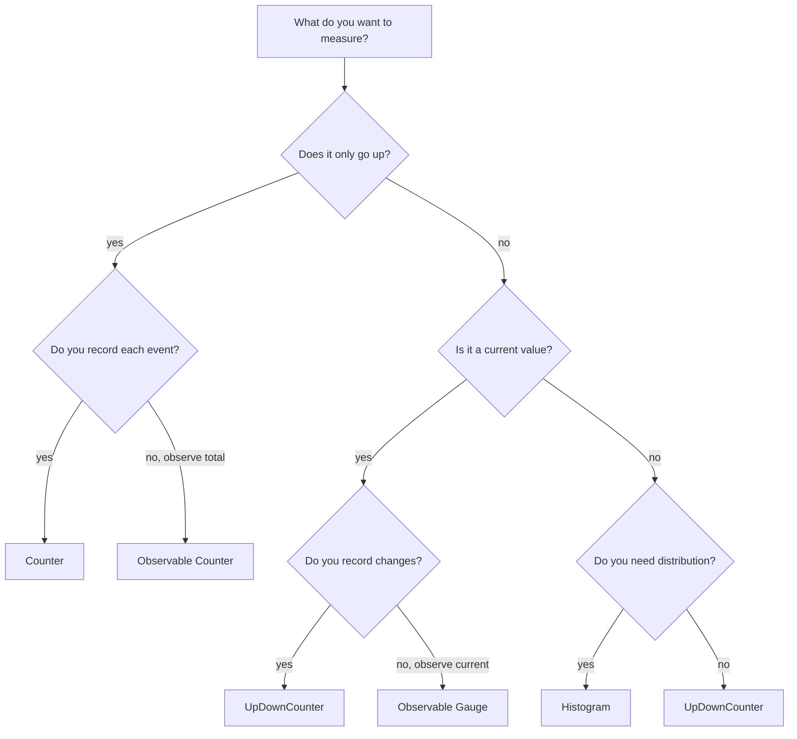
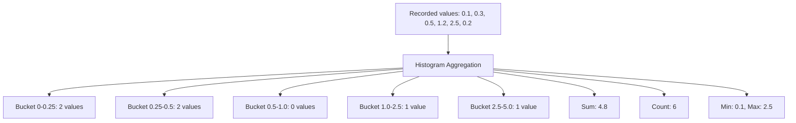

# Understanding OpenTelemetry Metrics: Counters, Gauges, and Histograms

Author: [nawazdhandala](https://www.github.com/nawazdhandala)

Tags: OpenTelemetry, Metrics, Counters, Histograms, Observability

Description: A guide to OpenTelemetry metric instruments including counters, gauges, histograms, and how to choose the right instrument.

---

Metrics are numbers that describe the state and behavior of your system over time. OpenTelemetry provides a standard API for recording metrics across languages and frameworks. This guide covers the core metric instruments, when to use each one, and how to implement them.

## OpenTelemetry Metrics Pipeline



The metrics pipeline has three layers:

1. **API** - the interface your code uses to record measurements
2. **SDK** - processes and aggregates measurements
3. **Exporter** - sends aggregated data to a backend

## Metric Instruments

OpenTelemetry defines six metric instruments:

| Instrument | Sync/Async | Monotonic | Use Case |
|------------|-----------|-----------|----------|
| Counter | Sync | Yes | Count events that only go up |
| UpDownCounter | Sync | No | Track values that go up and down |
| Histogram | Sync | N/A | Measure distributions (latency, size) |
| Observable Counter | Async | Yes | Observe monotonic totals on demand |
| Observable UpDownCounter | Async | No | Observe fluctuating values on demand |
| Observable Gauge | Async | No | Observe current values on demand |

## Choosing the Right Instrument



## Counter

A counter records values that only increase. Use it for counting events.

### Python Example

```python
# Install: pip install opentelemetry-api opentelemetry-sdk

from opentelemetry import metrics
from opentelemetry.sdk.metrics import MeterProvider
from opentelemetry.sdk.metrics.export import (
    ConsoleMetricExporter,
    PeriodicExportingMetricReader,
)

# Set up the meter provider with a console exporter
# The reader collects metrics every 10 seconds
reader = PeriodicExportingMetricReader(
    ConsoleMetricExporter(),
    export_interval_millis=10000,
)
provider = MeterProvider(metric_readers=[reader])
metrics.set_meter_provider(provider)

# Create a meter - named after your service or module
meter = metrics.get_meter("order.service")

# Create a counter instrument
# Counters only go up - perfect for counting events
request_counter = meter.create_counter(
    name="http.requests",
    description="Total number of HTTP requests",
    unit="1",
)

# Create a counter for bytes processed
bytes_counter = meter.create_counter(
    name="http.request.bytes",
    description="Total bytes received in requests",
    unit="By",
)


def handle_request(method: str, path: str, body_size: int) -> None:
    """Handle an HTTP request and record metrics."""

    # Add to the counter with attributes
    # Attributes let you break down metrics by dimensions
    request_counter.add(1, {
        "http.method": method,
        "http.route": path,
    })

    # Record the size of the request body
    bytes_counter.add(body_size, {
        "http.method": method,
    })
```

### Node.js Example

```javascript
const { metrics } = require("@opentelemetry/api");
const { MeterProvider } = require("@opentelemetry/sdk-metrics");
const {
  ConsoleMetricExporter,
  PeriodicExportingMetricReader,
} = require("@opentelemetry/sdk-metrics");

// Set up the meter provider
const reader = new PeriodicExportingMetricReader({
  exporter: new ConsoleMetricExporter(),
  exportIntervalMillis: 10000,
});

const provider = new MeterProvider({ readers: [reader] });
metrics.setGlobalMeterProvider(provider);

// Create a meter
const meter = metrics.getMeter("order-service");

// Create a counter
const requestCounter = meter.createCounter("http.requests", {
  description: "Total number of HTTP requests",
  unit: "1",
});

// Record a measurement
function handleRequest(method, path) {
  requestCounter.add(1, {
    "http.method": method,
    "http.route": path,
  });
}
```

## UpDownCounter

An UpDownCounter tracks values that can increase and decrease. Use it for things like active connections, queue depth, or items in a cache.

```python
# Track active connections - can go up and down
active_connections = meter.create_up_down_counter(
    name="http.active_connections",
    description="Number of active HTTP connections",
    unit="1",
)

# Track items in a queue
queue_depth = meter.create_up_down_counter(
    name="queue.depth",
    description="Number of items in the processing queue",
    unit="1",
)


def on_connection_open(client_ip: str) -> None:
    """Called when a new connection is opened."""
    # Increment by 1
    active_connections.add(1, {"client.ip": client_ip})


def on_connection_close(client_ip: str) -> None:
    """Called when a connection is closed."""
    # Decrement by 1
    active_connections.add(-1, {"client.ip": client_ip})


def enqueue_item(queue_name: str) -> None:
    """Add an item to the queue."""
    queue_depth.add(1, {"queue.name": queue_name})


def dequeue_item(queue_name: str) -> None:
    """Remove an item from the queue."""
    queue_depth.add(-1, {"queue.name": queue_name})
```

## Histogram

A histogram records the distribution of values. Use it for measuring latency, request sizes, or any value where you care about percentiles and distribution shape.

```python
import time

# Create a histogram for request latency
request_duration = meter.create_histogram(
    name="http.request.duration",
    description="Duration of HTTP requests in seconds",
    unit="s",
)

# Create a histogram for response sizes
response_size = meter.create_histogram(
    name="http.response.size",
    description="Size of HTTP responses in bytes",
    unit="By",
)


def handle_request(method: str, path: str) -> bytes:
    """Handle a request and record latency and response size."""

    start_time = time.time()

    # ... handle the request ...
    response_body = b"OK"

    # Calculate duration
    duration = time.time() - start_time

    # Record the duration in the histogram
    # The SDK aggregates this into buckets automatically
    request_duration.record(duration, {
        "http.method": method,
        "http.route": path,
        "http.status_code": 200,
    })

    # Record the response size
    response_size.record(len(response_body), {
        "http.method": method,
        "http.route": path,
    })

    return response_body
```

## How Histogram Aggregation Works



The SDK groups values into buckets. Default bucket boundaries are:

```
0, 5, 10, 25, 50, 75, 100, 250, 500, 750, 1000, 2500, 5000, 7500, 10000
```

You can customize boundaries:

```python
from opentelemetry.sdk.metrics.view import View, ExplicitBucketHistogramAggregation

# Custom bucket boundaries for latency (in seconds)
latency_view = View(
    instrument_name="http.request.duration",
    aggregation=ExplicitBucketHistogramAggregation(
        boundaries=[0.005, 0.01, 0.025, 0.05, 0.1, 0.25, 0.5, 1.0, 2.5, 5.0, 10.0]
    ),
)

# Pass views to the meter provider
provider = MeterProvider(
    metric_readers=[reader],
    views=[latency_view],
)
```

## Observable (Async) Instruments

Observable instruments are called by the SDK at collection time, rather than being recorded inline. Use them when you want to observe a current state.

```python
import psutil

# Observable gauge - reports the current CPU usage
# The callback is called whenever metrics are collected
def cpu_usage_callback(options):
    """Called by the SDK to get current CPU usage."""
    cpu_percent = psutil.cpu_percent(interval=None)
    yield metrics.Observation(cpu_percent, {"cpu": "total"})


cpu_gauge = meter.create_observable_gauge(
    name="system.cpu.usage",
    description="Current CPU usage percentage",
    unit="%",
    callbacks=[cpu_usage_callback],
)


# Observable counter - reports a running total
def disk_reads_callback(options):
    """Called by the SDK to get total disk reads."""
    disk_io = psutil.disk_io_counters()
    yield metrics.Observation(disk_io.read_bytes, {"device": "sda"})


disk_counter = meter.create_observable_counter(
    name="system.disk.read_bytes",
    description="Total bytes read from disk",
    unit="By",
    callbacks=[disk_reads_callback],
)
```

## Attributes and Cardinality

Attributes are key-value pairs that add dimensions to your metrics. Be careful with cardinality:

```python
# Good: low cardinality attributes
request_counter.add(1, {
    "http.method": "GET",           # ~5 unique values
    "http.route": "/api/orders",    # bounded set of routes
    "http.status_code": 200,        # ~50 unique values
})

# Bad: high cardinality attributes - avoid these
request_counter.add(1, {
    "user.id": "user-12345",        # millions of unique values
    "request.id": "req-abc-xyz",    # unique per request
    "http.url": "/api/orders/12345", # unbounded
})
```

## Summary: When to Use Each Instrument

| Scenario | Instrument |
|----------|-----------|
| Count HTTP requests | Counter |
| Count errors | Counter |
| Track active connections | UpDownCounter |
| Track queue size | UpDownCounter |
| Measure request latency | Histogram |
| Measure payload size | Histogram |
| Report current CPU usage | Observable Gauge |
| Report current memory usage | Observable Gauge |
| Report total bytes sent (from OS counter) | Observable Counter |

## Conclusion

OpenTelemetry metrics give you a vendor-neutral way to instrument your applications. Counters, UpDownCounters, and Histograms cover the vast majority of use cases. Choose the right instrument based on whether your value only goes up, fluctuates, or needs distribution analysis. Keep attribute cardinality low to avoid storage and query performance issues.

For a monitoring platform that natively ingests OpenTelemetry metrics and provides dashboards, alerting, and incident management, check out [OneUptime](https://oneuptime.com). OneUptime supports OTLP metrics ingestion out of the box and gives you a complete observability platform.
