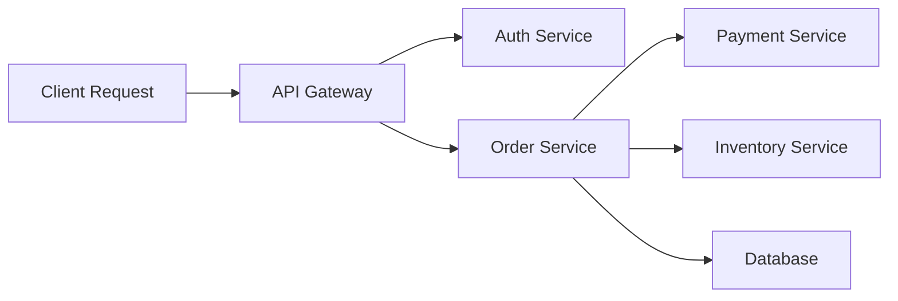
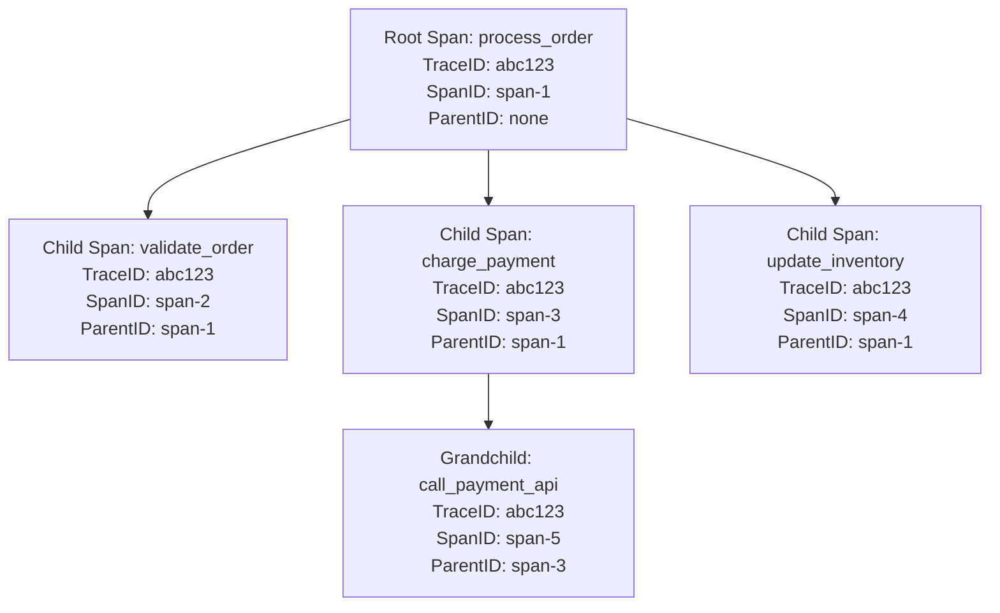

# Understanding OpenTelemetry Traces and Spans

Author: [nawazdhandala](https://www.github.com/nawazdhandala)

Tags: OpenTelemetry, Traces, Spans, Distributed Tracing, Observability

Description: A comprehensive guide to OpenTelemetry traces and spans including trace context, span attributes, events, and parent-child relationships.

---

Distributed tracing is one of the three pillars of observability. When a request flows through multiple services, tracing shows you the complete path it takes, how long each step took, and where failures happen. OpenTelemetry provides the standard API and SDK for producing traces. This guide explains traces and spans from the ground up.

## What Is a Trace?

A trace represents the full lifecycle of a request as it moves through a distributed system. It is made up of one or more spans. Each span represents a single operation within the trace.



Each arrow in this diagram would be a span. Together, all the spans form a single trace.

## Trace and Span Structure

```mermaid
gantt
    title Trace: Order Request
    dateFormat X
    axisFormat %s

    section API Gateway
    gateway-span           :0, 100

    section Auth Service
    auth-span              :5, 20

    section Order Service
    order-span             :25, 90

    section Payment Service
    payment-span           :30, 60

    section Database
    db-query               :65, 85
```



Every span has:

| Field | Description |
|-------|-------------|
| Trace ID | Unique identifier shared by all spans in the trace |
| Span ID | Unique identifier for this span |
| Parent Span ID | The span that created this span (empty for root span) |
| Name | Descriptive name of the operation |
| Start Time | When the operation started |
| End Time | When the operation finished |
| Status | OK, ERROR, or UNSET |
| Attributes | Key-value pairs with metadata |
| Events | Timestamped log entries within the span |
| Links | References to spans in other traces |

## Creating Spans in Python

```python
# Install: pip install opentelemetry-api opentelemetry-sdk

from opentelemetry import trace
from opentelemetry.sdk.trace import TracerProvider
from opentelemetry.sdk.trace.export import (
    ConsoleSpanExporter,
    BatchSpanProcessor,
)

# Set up the tracer provider
# The provider manages tracer instances and span processors
provider = TracerProvider()
processor = BatchSpanProcessor(ConsoleSpanExporter())
provider.add_span_processor(processor)
trace.set_tracer_provider(provider)

# Get a tracer - typically named after your module
tracer = trace.get_tracer("order.service")


def process_order(order_id: str) -> dict:
    """Process an order with nested spans."""

    # Start a new span - this becomes the root span if no parent exists
    with tracer.start_as_current_span("process_order") as span:
        # Add attributes to the span
        # Attributes are key-value metadata
        span.set_attribute("order.id", order_id)
        span.set_attribute("service.name", "order-service")

        # Validate the order (child span)
        validate_order(order_id)

        # Process payment (child span)
        charge_payment(order_id)

        # Update inventory (child span)
        update_inventory(order_id)

        return {"status": "completed", "order_id": order_id}


def validate_order(order_id: str) -> None:
    """Validate order details - creates a child span."""

    # This span is automatically parented to the current active span
    with tracer.start_as_current_span("validate_order") as span:
        span.set_attribute("order.id", order_id)
        # Add an event - a timestamped log entry within the span
        span.add_event("Validation started", {"order.id": order_id})
        # ... validation logic ...
        span.add_event("Validation passed")


def charge_payment(order_id: str) -> None:
    """Process payment - creates a child span."""

    with tracer.start_as_current_span("charge_payment") as span:
        span.set_attribute("order.id", order_id)
        span.set_attribute("payment.method", "credit_card")
        # ... payment logic ...


def update_inventory(order_id: str) -> None:
    """Update inventory - creates a child span."""

    with tracer.start_as_current_span("update_inventory") as span:
        span.set_attribute("order.id", order_id)
        span.set_attribute("inventory.action", "decrement")
        # ... inventory logic ...
```

## Creating Spans in Node.js

```javascript
// Install: npm install @opentelemetry/api @opentelemetry/sdk-trace-node

const { trace, SpanStatusCode } = require("@opentelemetry/api");
const {
  NodeTracerProvider,
} = require("@opentelemetry/sdk-trace-node");
const {
  ConsoleSpanExporter,
  BatchSpanProcessor,
} = require("@opentelemetry/sdk-trace-base");

// Set up the tracer provider
const provider = new NodeTracerProvider();
provider.addSpanProcessor(
  new BatchSpanProcessor(new ConsoleSpanExporter())
);
provider.register();

// Get a tracer instance
const tracer = trace.getTracer("order-service");

async function processOrder(orderId) {
  // Start a root span
  return tracer.startActiveSpan("process_order", async (span) => {
    try {
      // Set attributes on the span
      span.setAttribute("order.id", orderId);

      // Child span for database query
      await tracer.startActiveSpan("db_query", async (dbSpan) => {
        dbSpan.setAttribute("db.system", "postgresql");
        dbSpan.setAttribute("db.statement", "SELECT * FROM orders WHERE id = $1");
        // ... query logic ...
        dbSpan.end();
      });

      // Child span for payment processing
      await tracer.startActiveSpan("charge_payment", async (paySpan) => {
        paySpan.setAttribute("payment.method", "credit_card");
        paySpan.addEvent("Payment initiated");
        // ... payment logic ...
        paySpan.addEvent("Payment completed");
        paySpan.end();
      });

      // Set span status to OK
      span.setStatus({ code: SpanStatusCode.OK });
    } catch (error) {
      // Record the error on the span
      span.setStatus({
        code: SpanStatusCode.ERROR,
        message: error.message,
      });
      span.recordException(error);
      throw error;
    } finally {
      // Always end the span
      span.end();
    }
  });
}
```

## Span Parent-Child Relationships



All spans in a trace share the same Trace ID. Each span has a unique Span ID and a Parent Span ID pointing to the span that created it. The root span has no parent.

## Trace Context Propagation

When a request crosses service boundaries (HTTP, gRPC, message queues), the trace context must be propagated. OpenTelemetry uses the W3C Trace Context standard:

```
# W3C traceparent header format
traceparent: 00-<trace-id>-<parent-span-id>-<trace-flags>

# Example
traceparent: 00-4bf92f3577b34da6a3ce929d0e0e4736-00f067aa0ba902b7-01
```

```python
# Python: automatic propagation with instrumentation
# Install: pip install opentelemetry-instrumentation-requests

from opentelemetry.instrumentation.requests import RequestsInstrumentor
import requests

# This automatically injects trace context headers
RequestsInstrumentor().instrument()

def call_payment_service(order_id: str) -> dict:
    """Call payment service - trace context is automatically propagated."""

    with tracer.start_as_current_span("call_payment_service") as span:
        span.set_attribute("order.id", order_id)
        # The traceparent header is automatically added
        response = requests.post(
            "http://payment-service/charge",
            json={"order_id": order_id}
        )
        return response.json()
```

## Span Attributes Best Practices

Use semantic conventions for common attribute names:

```python
# HTTP attributes
span.set_attribute("http.method", "POST")
span.set_attribute("http.url", "https://api.example.com/orders")
span.set_attribute("http.status_code", 200)

# Database attributes
span.set_attribute("db.system", "postgresql")
span.set_attribute("db.name", "orders")
span.set_attribute("db.statement", "SELECT * FROM orders WHERE id = $1")

# RPC attributes
span.set_attribute("rpc.system", "grpc")
span.set_attribute("rpc.service", "PaymentService")
span.set_attribute("rpc.method", "Charge")

# Custom business attributes
span.set_attribute("order.id", "12345")
span.set_attribute("order.total", 99.99)
span.set_attribute("customer.tier", "premium")
```

## Span Events

Events are timestamped logs attached to a span:

```python
# Add events to record important moments within a span
with tracer.start_as_current_span("process_payment") as span:
    span.add_event("Payment validation started")

    # Events can have attributes
    span.add_event("Payment gateway called", {
        "gateway": "stripe",
        "amount": 99.99,
        "currency": "USD",
    })

    span.add_event("Payment completed", {
        "transaction_id": "txn_abc123",
    })
```

## Recording Errors

```python
from opentelemetry.trace import StatusCode

with tracer.start_as_current_span("risky_operation") as span:
    try:
        # ... operation that might fail ...
        result = perform_operation()
    except Exception as e:
        # Record the exception on the span
        span.record_exception(e)
        # Set the span status to ERROR
        span.set_status(
            StatusCode.ERROR,
            description=str(e)
        )
        raise
```

## Span Links

Links connect spans across different traces:

```python
from opentelemetry.trace import Link

# Link to a span from a previous trace
# Useful for batch processing or async workflows
with tracer.start_as_current_span(
    "process_batch",
    links=[
        Link(previous_span_context, {"relationship": "triggered_by"}),
    ]
) as span:
    # ... process batch ...
    pass
```

## Conclusion

Traces and spans are the building blocks of distributed tracing. Understanding how they relate to each other, how context propagates across services, and how to add meaningful attributes and events makes your traces useful for debugging production issues. Start by instrumenting your entry points, add child spans for significant operations, and let auto-instrumentation handle the rest.

For a monitoring platform that ingests OpenTelemetry traces and provides trace visualization, alerting, and incident management, check out [OneUptime](https://oneuptime.com). OneUptime natively supports OpenTelemetry and provides a complete observability platform for your distributed systems.
