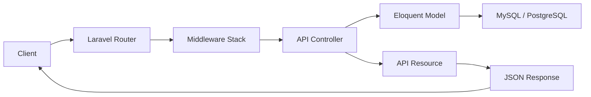
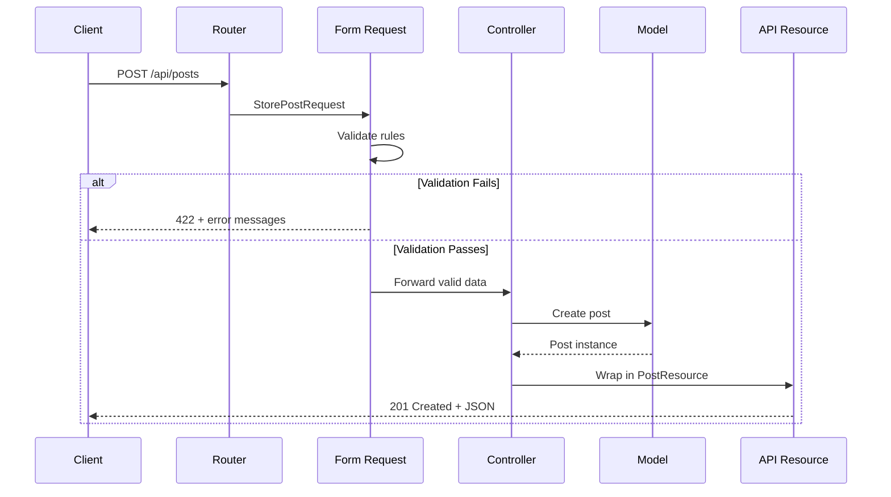

# How to Build REST APIs with Laravel

Author: [nawazdhandala](https://www.github.com/nawazdhandala)

Tags: PHP, Laravel, REST API, Backend, Web Development

Description: Learn how to build REST APIs with Laravel including routing, controllers, Eloquent ORM, and API resources.

---

Laravel is the most popular PHP framework for building web applications and APIs. Its elegant syntax, powerful ORM, and rich ecosystem make it an excellent choice for building REST APIs. In this guide, we will build a production-ready REST API with Laravel covering routing, controllers, validation, API resources, and authentication.

## Architecture Overview



## Creating a New Laravel Project

```bash
# Create a new Laravel project using Composer
composer create-project laravel/laravel my-api

# Navigate into the project
cd my-api

# Configure your database in .env
# DB_CONNECTION=pgsql
# DB_HOST=127.0.0.1
# DB_PORT=5432
# DB_DATABASE=my_api
# DB_USERNAME=postgres
# DB_PASSWORD=secret

# Run migrations
php artisan migrate
```

## Defining Routes

Laravel separates web and API routes. API routes are defined in `routes/api.php`:

```php
<?php
// routes/api.php

use App\Http\Controllers\Api\PostController;
use App\Http\Controllers\Api\AuthController;
use Illuminate\Support\Facades\Route;

// Public routes - no authentication required
Route::post('/register', [AuthController::class, 'register']);
Route::post('/login', [AuthController::class, 'login']);

// Public read-only routes
Route::get('/posts', [PostController::class, 'index']);
Route::get('/posts/{post}', [PostController::class, 'show']);

// Protected routes - require authentication via Sanctum
Route::middleware('auth:sanctum')->group(function () {
    // Post CRUD operations
    Route::post('/posts', [PostController::class, 'store']);
    Route::put('/posts/{post}', [PostController::class, 'update']);
    Route::delete('/posts/{post}', [PostController::class, 'destroy']);

    // User profile
    Route::get('/user', [AuthController::class, 'profile']);
    Route::post('/logout', [AuthController::class, 'logout']);
});
```

## Creating the Model and Migration

```bash
# Generate model, migration, controller, and factory in one command
php artisan make:model Post -mfc --api
```

```php
<?php
// database/migrations/xxxx_create_posts_table.php

use Illuminate\Database\Migrations\Migration;
use Illuminate\Database\Schema\Blueprint;
use Illuminate\Support\Facades\Schema;

return new class extends Migration
{
    public function up(): void
    {
        Schema::create('posts', function (Blueprint $table) {
            $table->id();
            // Foreign key to the users table
            $table->foreignId('user_id')->constrained()->onDelete('cascade');
            $table->string('title', 200);
            $table->string('slug')->unique();
            $table->text('body');
            $table->boolean('published')->default(false);
            $table->timestamp('published_at')->nullable();
            $table->timestamps();

            // Add indexes for common query patterns
            $table->index(['published', 'published_at']);
            $table->index('user_id');
        });
    }

    public function down(): void
    {
        Schema::dropIfExists('posts');
    }
};
```

## Defining the Eloquent Model

```php
<?php
// app/Models/Post.php

namespace App\Models;

use Illuminate\Database\Eloquent\Factories\HasFactory;
use Illuminate\Database\Eloquent\Model;
use Illuminate\Database\Eloquent\Relations\BelongsTo;
use Illuminate\Database\Eloquent\Relations\HasMany;
use Illuminate\Support\Str;

class Post extends Model
{
    use HasFactory;

    // Fields that can be mass-assigned
    protected $fillable = [
        'title',
        'slug',
        'body',
        'published',
        'published_at',
    ];

    // Automatic type casting
    protected $casts = [
        'published' => 'boolean',
        'published_at' => 'datetime',
    ];

    // Auto-generate slug from title when creating a post
    protected static function booted(): void
    {
        static::creating(function (Post $post) {
            if (empty($post->slug)) {
                $post->slug = Str::slug($post->title);
            }
        });
    }

    // Relationship: a post belongs to a user
    public function user(): BelongsTo
    {
        return $this->belongsTo(User::class);
    }

    // Relationship: a post has many comments
    public function comments(): HasMany
    {
        return $this->hasMany(Comment::class);
    }

    // Scope: only published posts
    public function scopePublished($query)
    {
        return $query->where('published', true)
                     ->whereNotNull('published_at');
    }
}
```

## Building the Controller

```php
<?php
// app/Http/Controllers/Api/PostController.php

namespace App\Http\Controllers\Api;

use App\Http\Controllers\Controller;
use App\Http\Requests\StorePostRequest;
use App\Http\Requests\UpdatePostRequest;
use App\Http\Resources\PostResource;
use App\Http\Resources\PostCollection;
use App\Models\Post;
use Illuminate\Http\JsonResponse;
use Illuminate\Http\Request;

class PostController extends Controller
{
    /**
     * List all published posts with pagination.
     * Supports filtering by search query.
     */
    public function index(Request $request): PostCollection
    {
        $query = Post::published()
            ->with('user') // Eager load the author to avoid N+1 queries
            ->latest('published_at');

        // Optional search filter
        if ($request->has('search')) {
            $search = $request->input('search');
            $query->where(function ($q) use ($search) {
                $q->where('title', 'like', "%{$search}%")
                  ->orWhere('body', 'like', "%{$search}%");
            });
        }

        // Return paginated results wrapped in a resource collection
        return new PostCollection($query->paginate($request->input('per_page', 15)));
    }

    /**
     * Show a single post by ID.
     */
    public function show(Post $post): PostResource
    {
        // Load relationships
        $post->load(['user', 'comments.user']);

        return new PostResource($post);
    }

    /**
     * Create a new post for the authenticated user.
     */
    public function store(StorePostRequest $request): JsonResponse
    {
        // Create the post and associate it with the authenticated user
        $post = $request->user()->posts()->create($request->validated());

        return (new PostResource($post))
            ->response()
            ->setStatusCode(201);
    }

    /**
     * Update an existing post.
     */
    public function update(UpdatePostRequest $request, Post $post): PostResource
    {
        // Ensure the user owns this post
        $this->authorize('update', $post);

        $post->update($request->validated());

        return new PostResource($post);
    }

    /**
     * Delete a post.
     */
    public function destroy(Post $post): JsonResponse
    {
        $this->authorize('delete', $post);

        $post->delete();

        return response()->json(null, 204);
    }
}
```

## Request Flow with Validation



## Form Request Validation

```php
<?php
// app/Http/Requests/StorePostRequest.php

namespace App\Http\Requests;

use Illuminate\Foundation\Http\FormRequest;

class StorePostRequest extends FormRequest
{
    // Authorize the request (authentication is handled by middleware)
    public function authorize(): bool
    {
        return true;
    }

    // Define validation rules for creating a post
    public function rules(): array
    {
        return [
            'title' => ['required', 'string', 'min:5', 'max:200'],
            'body' => ['required', 'string', 'min:50'],
            'published' => ['boolean'],
            'published_at' => ['nullable', 'date', 'after_or_equal:now'],
        ];
    }

    // Custom error messages
    public function messages(): array
    {
        return [
            'title.min' => 'The title must be at least 5 characters long.',
            'body.min' => 'The body must be at least 50 characters long.',
        ];
    }
}
```

## API Resources for Consistent Output

```php
<?php
// app/Http/Resources/PostResource.php

namespace App\Http\Resources;

use Illuminate\Http\Request;
use Illuminate\Http\Resources\Json\JsonResource;

class PostResource extends JsonResource
{
    /**
     * Transform the resource into a JSON array.
     * This controls exactly what fields are returned to the client.
     */
    public function toArray(Request $request): array
    {
        return [
            'id' => $this->id,
            'title' => $this->title,
            'slug' => $this->slug,
            'body' => $this->body,
            'published' => $this->published,
            'published_at' => $this->published_at?->toIso8601String(),
            'reading_time' => $this->calculateReadingTime(),
            'created_at' => $this->created_at->toIso8601String(),
            'updated_at' => $this->updated_at->toIso8601String(),
            // Conditionally include relationships only when loaded
            'author' => new UserResource($this->whenLoaded('user')),
            'comments' => CommentResource::collection($this->whenLoaded('comments')),
            'comments_count' => $this->whenCounted('comments'),
        ];
    }

    // Calculate estimated reading time
    private function calculateReadingTime(): string
    {
        $words = str_word_count($this->body);
        $minutes = max(1, (int) ceil($words / 200));
        return "{$minutes} min read";
    }
}
```

## Authentication with Sanctum

```php
<?php
// app/Http/Controllers/Api/AuthController.php

namespace App\Http\Controllers\Api;

use App\Http\Controllers\Controller;
use App\Models\User;
use Illuminate\Http\JsonResponse;
use Illuminate\Http\Request;
use Illuminate\Support\Facades\Hash;
use Illuminate\Validation\ValidationException;

class AuthController extends Controller
{
    // Register a new user and return an API token
    public function register(Request $request): JsonResponse
    {
        $validated = $request->validate([
            'name' => ['required', 'string', 'max:255'],
            'email' => ['required', 'email', 'unique:users'],
            'password' => ['required', 'string', 'min:8', 'confirmed'],
        ]);

        $user = User::create([
            'name' => $validated['name'],
            'email' => $validated['email'],
            'password' => Hash::make($validated['password']),
        ]);

        // Create a personal access token
        $token = $user->createToken('api-token')->plainTextToken;

        return response()->json([
            'user' => $user,
            'token' => $token,
        ], 201);
    }

    // Log in and return an API token
    public function login(Request $request): JsonResponse
    {
        $request->validate([
            'email' => ['required', 'email'],
            'password' => ['required'],
        ]);

        $user = User::where('email', $request->email)->first();

        if (! $user || ! Hash::check($request->password, $user->password)) {
            throw ValidationException::withMessages([
                'email' => ['The provided credentials are incorrect.'],
            ]);
        }

        $token = $user->createToken('api-token')->plainTextToken;

        return response()->json([
            'user' => $user,
            'token' => $token,
        ]);
    }
}
```

## Summary

Laravel provides everything you need to build robust REST APIs:

- Resourceful routing for clean URL patterns
- Eloquent ORM for database interactions
- Form Requests for validation and authorization
- API Resources for consistent JSON transformation
- Sanctum for token-based authentication

After deploying your Laravel API, you need to know it is running reliably. [OneUptime](https://oneuptime.com) provides uptime monitoring, API endpoint checks, and performance tracking for your Laravel applications - helping you catch errors before your users report them.
