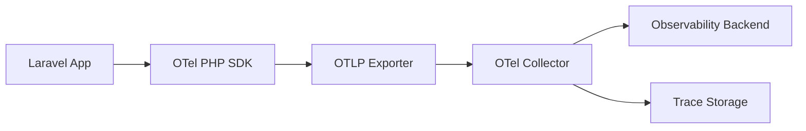
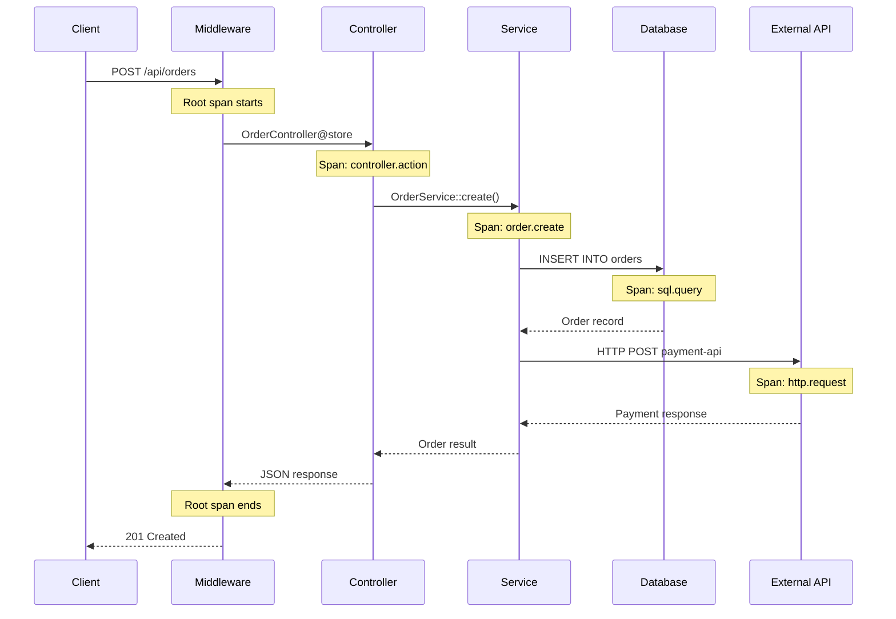
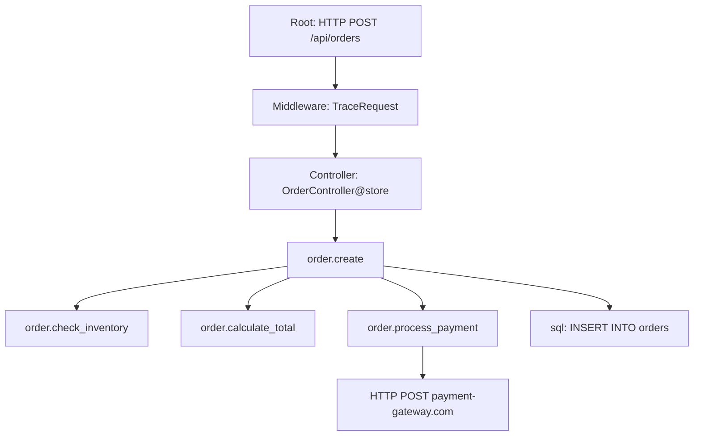

# How to Instrument Laravel Applications with OpenTelemetry

Author: [nawazdhandala](https://www.github.com/nawazdhandala)

Tags: PHP, Laravel, OpenTelemetry, Tracing, Observability

Description: Learn how to add OpenTelemetry instrumentation to Laravel applications for distributed tracing and performance monitoring.

---

Observability is critical for understanding how your Laravel application behaves in production. OpenTelemetry provides a vendor-neutral way to collect traces, metrics, and logs from your PHP applications. In this guide, we will instrument a Laravel application with OpenTelemetry for distributed tracing and performance monitoring.

## How Traces Flow from Laravel to Your Backend



## Installing OpenTelemetry for PHP

OpenTelemetry provides both a PHP extension (for auto-instrumentation) and a Composer package (for manual instrumentation).

### Install the PHP Extension

```bash
# Install the OpenTelemetry PHP extension via PECL
pecl install opentelemetry

# Add the extension to your php.ini
echo "extension=opentelemetry.so" >> $(php -i | grep "Loaded Configuration" | awk '{print $5}')

# Verify the installation
php -m | grep opentelemetry
```

### Install Composer Packages

```bash
# Core SDK and OTLP exporter
composer require open-telemetry/sdk
composer require open-telemetry/exporter-otlp

# Auto-instrumentation packages for Laravel
composer require open-telemetry/opentelemetry-auto-laravel
composer require open-telemetry/opentelemetry-auto-pdo
composer require open-telemetry/opentelemetry-auto-http-async

# HTTP transport for sending traces
composer require php-http/guzzle7-adapter
```

## Configuring OpenTelemetry in Laravel

Create a service provider to configure the OpenTelemetry SDK:

```php
<?php
// app/Providers/OpenTelemetryServiceProvider.php

namespace App\Providers;

use Illuminate\Support\ServiceProvider;
use OpenTelemetry\API\Globals;
use OpenTelemetry\API\Trace\TracerInterface;
use OpenTelemetry\SDK\Trace\TracerProvider;
use OpenTelemetry\SDK\Trace\SpanProcessor\BatchSpanProcessor;
use OpenTelemetry\SDK\Resource\ResourceInfo;
use OpenTelemetry\SDK\Resource\ResourceInfoFactory;
use OpenTelemetry\SDK\Common\Attribute\Attributes;
use OpenTelemetry\Contrib\Otlp\OtlpHttpTransportFactory;
use OpenTelemetry\Contrib\Otlp\SpanExporter;
use OpenTelemetry\SemConv\ResourceAttributes;

class OpenTelemetryServiceProvider extends ServiceProvider
{
    public function register(): void
    {
        // Register the tracer as a singleton in the container
        $this->app->singleton(TracerInterface::class, function () {
            return Globals::tracerProvider()->getTracer(
                config('app.name', 'laravel-app'),
                config('app.version', '1.0.0')
            );
        });
    }

    public function boot(): void
    {
        // Only configure if OpenTelemetry is enabled
        if (! config('telemetry.enabled', false)) {
            return;
        }

        // Build resource attributes that describe this service
        $resource = ResourceInfoFactory::defaultResource()->merge(
            ResourceInfo::create(Attributes::create([
                ResourceAttributes::SERVICE_NAME => config('telemetry.service_name'),
                ResourceAttributes::SERVICE_VERSION => config('app.version', '1.0.0'),
                ResourceAttributes::DEPLOYMENT_ENVIRONMENT => config('app.env'),
                'host.name' => gethostname(),
            ]))
        );

        // Configure the OTLP HTTP transport
        $transport = (new OtlpHttpTransportFactory())->create(
            config('telemetry.endpoint') . '/v1/traces',
            'application/x-protobuf',
            ['x-oneuptime-token' => config('telemetry.token')]
        );

        // Create the span exporter
        $exporter = new SpanExporter($transport);

        // Use batch processing for better performance
        $spanProcessor = new BatchSpanProcessor($exporter);

        // Build the tracer provider
        $tracerProvider = TracerProvider::builder()
            ->setResource($resource)
            ->addSpanProcessor($spanProcessor)
            ->build();

        // Register globally so auto-instrumentation picks it up
        Globals::registerInitializer(function () use ($tracerProvider) {
            return $tracerProvider;
        });
    }
}
```

## Configuration File

```php
<?php
// config/telemetry.php

return [
    // Enable or disable OpenTelemetry
    'enabled' => env('OTEL_ENABLED', false),

    // Service name as it will appear in traces
    'service_name' => env('OTEL_SERVICE_NAME', 'laravel-app'),

    // OTLP collector endpoint
    'endpoint' => env('OTEL_EXPORTER_OTLP_ENDPOINT', 'http://localhost:4318'),

    // Authentication token for the collector
    'token' => env('ONEUPTIME_TOKEN', ''),

    // Sampling rate: 1.0 = trace everything, 0.1 = trace 10%
    'sampling_rate' => env('OTEL_SAMPLING_RATE', 1.0),
];
```

## Trace Structure in a Laravel Request



## Adding Custom Spans

Auto-instrumentation captures HTTP requests and database queries. Add custom spans for business logic:

```php
<?php
// app/Services/OrderService.php

namespace App\Services;

use App\Models\Order;
use OpenTelemetry\API\Trace\TracerInterface;
use OpenTelemetry\API\Trace\StatusCode;

class OrderService
{
    public function __construct(
        // Inject the tracer via Laravel's service container
        private TracerInterface $tracer
    ) {}

    public function createOrder(array $data): Order
    {
        // Create a span for the entire order creation process
        $span = $this->tracer->spanBuilder('order.create')
            ->setAttribute('order.customer_id', $data['customer_id'])
            ->setAttribute('order.item_count', count($data['items']))
            ->startSpan();

        // Activate the span so child spans are linked automatically
        $scope = $span->activate();

        try {
            // Validate inventory availability
            $this->checkInventory($data['items']);

            // Calculate pricing
            $total = $this->calculateTotal($data['items']);
            $span->setAttribute('order.total_cents', $total);

            // Create the order in the database
            $order = Order::create([
                'customer_id' => $data['customer_id'],
                'total_cents' => $total,
                'status' => 'pending',
            ]);

            // Process payment
            $this->processPayment($order, $data['payment_method']);

            $span->setAttribute('order.id', $order->id);
            $span->setStatus(StatusCode::STATUS_OK);

            return $order;

        } catch (\Throwable $e) {
            // Record the error on the span
            $span->recordException($e);
            $span->setStatus(StatusCode::STATUS_ERROR, $e->getMessage());
            throw $e;
        } finally {
            // Always close the scope and end the span
            $scope->detach();
            $span->end();
        }
    }

    private function checkInventory(array $items): void
    {
        $span = $this->tracer->spanBuilder('order.check_inventory')
            ->setAttribute('inventory.item_count', count($items))
            ->startSpan();
        $scope = $span->activate();

        try {
            foreach ($items as $item) {
                $available = app(InventoryService::class)->getStock($item['product_id']);
                if ($available < $item['quantity']) {
                    throw new \RuntimeException(
                        "Insufficient stock for product {$item['product_id']}"
                    );
                }
            }
            $span->setStatus(StatusCode::STATUS_OK);
        } catch (\Throwable $e) {
            $span->recordException($e);
            $span->setStatus(StatusCode::STATUS_ERROR, $e->getMessage());
            throw $e;
        } finally {
            $scope->detach();
            $span->end();
        }
    }

    private function calculateTotal(array $items): int
    {
        $span = $this->tracer->spanBuilder('order.calculate_total')
            ->startSpan();

        $total = 0;
        foreach ($items as $item) {
            $total += $item['price'] * $item['quantity'];
        }

        $span->setAttribute('pricing.total_cents', $total);
        $span->end();

        return $total;
    }

    private function processPayment(Order $order, string $method): void
    {
        $span = $this->tracer->spanBuilder('order.process_payment')
            ->setAttribute('payment.method', $method)
            ->setAttribute('payment.amount_cents', $order->total_cents)
            ->startSpan();
        $scope = $span->activate();

        try {
            // Call payment gateway - HTTP instrumentation adds child spans
            $result = app(PaymentGateway::class)->charge($order, $method);
            $span->setAttribute('payment.transaction_id', $result->transactionId);
            $span->setStatus(StatusCode::STATUS_OK);
        } catch (\Throwable $e) {
            $span->recordException($e);
            $span->setStatus(StatusCode::STATUS_ERROR, $e->getMessage());
            throw $e;
        } finally {
            $scope->detach();
            $span->end();
        }
    }
}
```

## Middleware for Custom Attributes

Add request-level attributes to the root span:

```php
<?php
// app/Http/Middleware/TraceRequestMiddleware.php

namespace App\Http\Middleware;

use Closure;
use Illuminate\Http\Request;
use OpenTelemetry\API\Trace\Span;

class TraceRequestMiddleware
{
    public function handle(Request $request, Closure $next)
    {
        // Get the current active span (created by auto-instrumentation)
        $span = Span::getCurrent();

        // Add useful attributes to the span
        $span->setAttribute('http.request_id', $request->header('X-Request-ID', ''));
        $span->setAttribute('http.user_agent', $request->userAgent());

        // Add authenticated user info if available
        if ($user = $request->user()) {
            $span->setAttribute('user.id', (string) $user->id);
            $span->setAttribute('user.email', $user->email);
        }

        $response = $next($request);

        // Add response attributes
        $span->setAttribute('http.response_content_length', strlen($response->getContent()));

        return $response;
    }
}
```

## Span Hierarchy



## Environment Variables

```bash
# Enable OpenTelemetry
OTEL_ENABLED=true
OTEL_SERVICE_NAME="my-laravel-api"
OTEL_EXPORTER_OTLP_ENDPOINT="https://otel.oneuptime.com"
ONEUPTIME_TOKEN="your-project-token"
OTEL_SAMPLING_RATE=0.5
```

## Summary

Instrumenting Laravel with OpenTelemetry provides deep visibility into your application:

- Auto-instrumentation captures HTTP requests, database queries, and external calls
- Custom spans trace business logic and service interactions
- Error recording links exceptions to the spans where they occurred
- Context propagation connects traces across microservices

Send your traces to [OneUptime](https://oneuptime.com) for a complete observability solution. OneUptime natively accepts OpenTelemetry data and gives you distributed tracing dashboards, performance analytics, and intelligent alerting - all without vendor lock-in.
