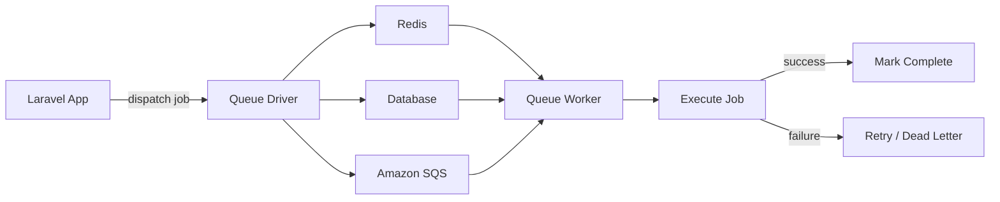
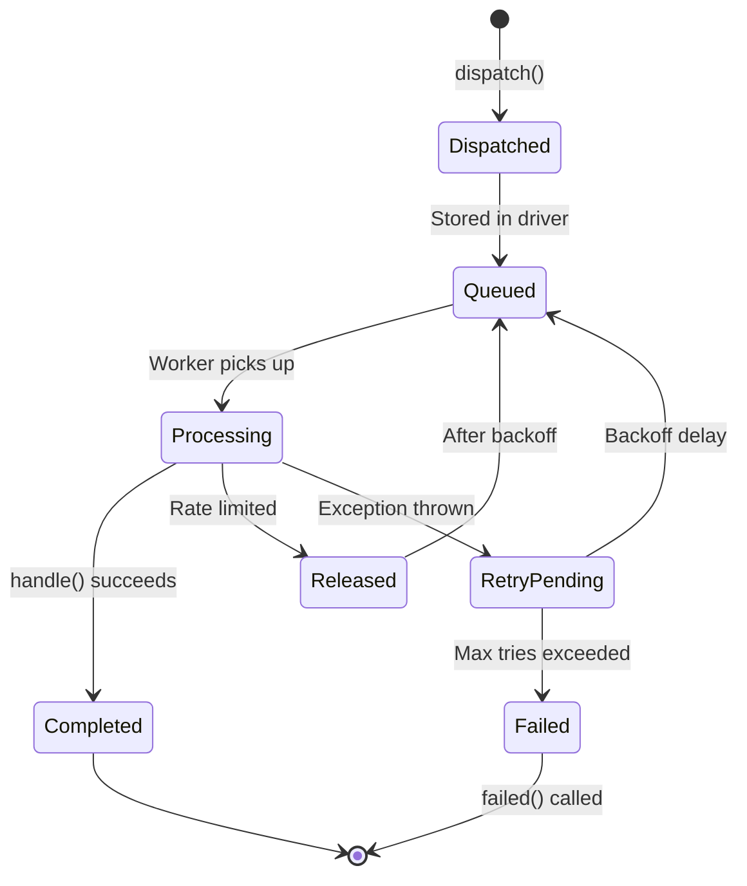
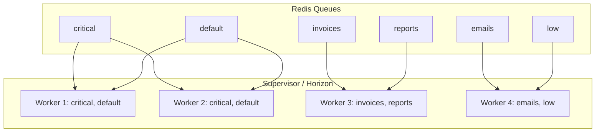

# How to Use Laravel Queue Workers for Background Processing

Author: [nawazdhandala](https://www.github.com/nawazdhandala)

Tags: PHP, Laravel, Queues, Workers, Background Jobs

Description: Learn how to use Laravel queue workers for background job processing with Redis, database, and SQS drivers.

---

Background processing is essential for keeping your Laravel application responsive. Tasks like sending emails, processing uploads, generating PDFs, and calling external APIs should happen asynchronously. Laravel's queue system provides a unified API across multiple backends including Redis, database, Amazon SQS, and more. This guide walks through setting up and using Laravel queues in production.

## Queue Architecture



## Configuring the Queue Driver

Set your preferred queue driver in the environment file:

```bash
# .env
# Options: sync, database, redis, sqs, beanstalkd
QUEUE_CONNECTION=redis
REDIS_HOST=127.0.0.1
REDIS_PORT=6379
REDIS_PASSWORD=null
```

Configure queue connections in `config/queue.php`:

```php
<?php
// config/queue.php

return [
    'default' => env('QUEUE_CONNECTION', 'sync'),

    'connections' => [
        // Synchronous driver - jobs run immediately (good for development)
        'sync' => [
            'driver' => 'sync',
        ],

        // Redis driver - fast, recommended for production
        'redis' => [
            'driver' => 'redis',
            'connection' => 'default',
            'queue' => env('REDIS_QUEUE', 'default'),
            'retry_after' => 90,        // Retry if job takes longer than 90 seconds
            'block_for' => 5,           // Block for 5 seconds when polling for jobs
            'after_commit' => true,     // Only dispatch after database transaction commits
        ],

        // Database driver - no additional infrastructure needed
        'database' => [
            'driver' => 'database',
            'table' => 'jobs',
            'queue' => 'default',
            'retry_after' => 90,
            'after_commit' => true,
        ],
    ],

    // Failed job storage
    'failed' => [
        'driver' => env('QUEUE_FAILED_DRIVER', 'database-uuids'),
        'database' => env('DB_CONNECTION', 'mysql'),
        'table' => 'failed_jobs',
    ],
];
```

## Creating Jobs

Generate a new job class:

```bash
php artisan make:job ProcessOrder
```

```php
<?php
// app/Jobs/ProcessOrder.php

namespace App\Jobs;

use App\Models\Order;
use App\Services\PaymentGateway;
use App\Services\InventoryService;
use Illuminate\Bus\Queueable;
use Illuminate\Contracts\Queue\ShouldQueue;
use Illuminate\Foundation\Bus\Dispatchable;
use Illuminate\Queue\InteractsWithQueue;
use Illuminate\Queue\SerializesModels;
use Illuminate\Support\Facades\Log;

class ProcessOrder implements ShouldQueue
{
    use Dispatchable, InteractsWithQueue, Queueable, SerializesModels;

    // Maximum number of retry attempts
    public int $tries = 5;

    // Maximum time in seconds the job can run
    public int $timeout = 120;

    // Exponential backoff intervals (in seconds)
    public array $backoff = [10, 30, 60, 300, 600];

    /**
     * Create a new job instance.
     * Laravel automatically serializes Eloquent models by their ID
     * and retrieves them when the job is processed.
     */
    public function __construct(
        public Order $order
    ) {}

    /**
     * Execute the job.
     */
    public function handle(
        PaymentGateway $paymentGateway,
        InventoryService $inventory
    ): void {
        Log::info("Processing order {$this->order->id}");

        // Step 1: Reserve inventory
        $inventory->reserve($this->order->items);
        Log::info("Inventory reserved for order {$this->order->id}");

        // Step 2: Charge payment
        $charge = $paymentGateway->charge(
            $this->order->customer_id,
            $this->order->total_cents
        );

        // Step 3: Update the order status
        $this->order->update([
            'status' => 'paid',
            'payment_id' => $charge->id,
            'paid_at' => now(),
        ]);

        Log::info("Order {$this->order->id} processed successfully");

        // Step 4: Dispatch follow-up jobs
        SendOrderConfirmationEmail::dispatch($this->order);
        UpdateAnalytics::dispatch($this->order);
    }

    /**
     * Handle a job failure.
     * Called when all retry attempts are exhausted.
     */
    public function failed(\Throwable $exception): void
    {
        Log::error("Order {$this->order->id} processing failed: {$exception->getMessage()}");

        // Update the order status to reflect the failure
        $this->order->update(['status' => 'failed']);

        // Notify the operations team
        NotifyOpsTeam::dispatch(
            "Order processing failed",
            "Order #{$this->order->id}: {$exception->getMessage()}"
        );
    }
}
```

## Dispatching Jobs

```php
<?php
// app/Http/Controllers/OrderController.php

namespace App\Http\Controllers;

use App\Jobs\ProcessOrder;
use App\Jobs\GenerateInvoice;
use App\Models\Order;
use Illuminate\Http\JsonResponse;
use Illuminate\Http\Request;

class OrderController extends Controller
{
    public function store(Request $request): JsonResponse
    {
        $order = Order::create($request->validated());

        // Dispatch to the default queue
        ProcessOrder::dispatch($order);

        // Dispatch to a specific queue
        GenerateInvoice::dispatch($order)->onQueue('invoices');

        // Dispatch with a delay
        SendFollowUpSurvey::dispatch($order)
            ->delay(now()->addDays(7))
            ->onQueue('low');

        return response()->json([
            'message' => 'Order received and is being processed',
            'order_id' => $order->id,
        ], 202);
    }
}
```

## Job Lifecycle



## Job Middleware

Add middleware to jobs for cross-cutting concerns:

```php
<?php
// app/Jobs/Middleware/RateLimited.php

namespace App\Jobs\Middleware;

use Illuminate\Support\Facades\Redis;
use Closure;

class RateLimited
{
    /**
     * Process the job through the middleware.
     * Limits to 10 jobs per minute for the payment-api key.
     */
    public function handle(object $job, Closure $next): void
    {
        Redis::throttle('payment-api')
            ->block(0)           // Do not wait for the lock
            ->allow(10)          // Allow 10 jobs
            ->every(60)          // Per 60 seconds
            ->then(
                function () use ($job, $next) {
                    // Lock acquired - process the job
                    $next($job);
                },
                function () use ($job) {
                    // Could not acquire lock - release back to queue
                    $job->release(30); // Try again in 30 seconds
                }
            );
    }
}
```

```php
<?php
// app/Jobs/ChargePayment.php

namespace App\Jobs;

use App\Jobs\Middleware\RateLimited;
use Illuminate\Contracts\Queue\ShouldQueue;

class ChargePayment implements ShouldQueue
{
    // Apply rate limiting middleware to this job
    public function middleware(): array
    {
        return [new RateLimited()];
    }

    public function handle(): void
    {
        // Payment processing logic
    }
}
```

## Job Batching

Process groups of jobs together and track their progress:

```php
<?php
// app/Http/Controllers/ReportController.php

namespace App\Http\Controllers;

use App\Jobs\ProcessReportChunk;
use App\Jobs\MergeReportChunks;
use Illuminate\Bus\Batch;
use Illuminate\Support\Facades\Bus;

class ReportController extends Controller
{
    public function generate()
    {
        // Split the report into chunks for parallel processing
        $chunks = Order::query()
            ->where('created_at', '>=', now()->subMonth())
            ->pluck('id')
            ->chunk(100);

        // Create a batch of jobs
        $jobs = $chunks->map(function ($orderIds) {
            return new ProcessReportChunk($orderIds->toArray());
        })->toArray();

        $batch = Bus::batch($jobs)
            ->then(function (Batch $batch) {
                // All jobs completed successfully
                MergeReportChunks::dispatch($batch->id);
            })
            ->catch(function (Batch $batch, \Throwable $e) {
                // First batch job failure detected
                logger()->error("Report batch {$batch->id} failed: {$e->getMessage()}");
            })
            ->finally(function (Batch $batch) {
                // Batch has finished (with or without failures)
                logger()->info("Report batch {$batch->id} finished. Failed: {$batch->failedJobs}");
            })
            ->name('monthly-report')
            ->onQueue('reports')
            ->dispatch();

        return response()->json([
            'batch_id' => $batch->id,
            'total_jobs' => $batch->totalJobs,
        ]);
    }
}
```

## Queue Worker Architecture



## Running Workers

```bash
# Start a worker that processes jobs from multiple queues
php artisan queue:work redis --queue=critical,default,low --tries=3 --timeout=90

# Start a worker for a specific queue
php artisan queue:work redis --queue=emails --tries=5 --timeout=60

# Process a single job and exit (useful for debugging)
php artisan queue:work redis --once

# Restart all workers gracefully (after deploying new code)
php artisan queue:restart

# List and retry failed jobs
php artisan queue:failed
php artisan queue:retry all
```

## Using Laravel Horizon

For Redis-based queues, Laravel Horizon provides a dashboard and advanced configuration:

```bash
# Install Horizon
composer require laravel/horizon

# Publish the configuration
php artisan horizon:install
```

```php
<?php
// config/horizon.php (excerpt)

'environments' => [
    'production' => [
        'supervisor-1' => [
            'connection' => 'redis',
            'queue' => ['critical', 'default'],
            'balance' => 'auto',        // Auto-balance workers across queues
            'minProcesses' => 2,
            'maxProcesses' => 10,
            'tries' => 3,
            'timeout' => 90,
        ],
        'supervisor-2' => [
            'connection' => 'redis',
            'queue' => ['emails', 'reports', 'low'],
            'balance' => 'auto',
            'minProcesses' => 1,
            'maxProcesses' => 5,
            'tries' => 5,
            'timeout' => 120,
        ],
    ],
],
```

## Summary

Laravel's queue system is powerful and flexible:

- Choose from multiple drivers (Redis, database, SQS)
- Use job middleware for rate limiting and other cross-cutting concerns
- Batch jobs for parallel processing with progress tracking
- Configure retry strategies with exponential backoff
- Use Horizon for dashboard monitoring of Redis queues

For comprehensive monitoring beyond the Horizon dashboard, [OneUptime](https://oneuptime.com) can track your queue worker health, alert on growing queue depths, monitor Redis performance, and give you end-to-end visibility into your background processing pipeline - ensuring your jobs run reliably around the clock.
