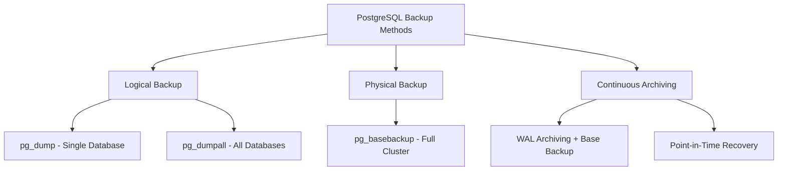

# How to Set Up PostgreSQL Backup and Restore Strategies

Author: [nawazdhandala](https://www.github.com/nawazdhandala)

Tags: PostgreSQL, Backup, Restore, pg_dump, WAL Archiving

Description: Learn PostgreSQL backup strategies including pg_dump, pg_basebackup, WAL archiving, and point-in-time recovery.

---

A database without a tested backup strategy is a disaster waiting to happen. PostgreSQL offers multiple backup methods, each suited to different requirements. This guide covers logical backups with pg_dump, physical backups with pg_basebackup, continuous archiving with WAL, and point-in-time recovery.

## Backup Methods Overview



| Method | Speed | Size | PITR | Cross-Version |
|--------|-------|------|------|---------------|
| pg_dump | Slow for large DBs | Compact | No | Yes |
| pg_basebackup | Fast | Full size | Yes (with WAL) | No |
| WAL Archiving | Continuous | Incremental | Yes | No |

## Logical Backups with pg_dump

`pg_dump` exports a database as SQL statements or a custom archive format. It is the simplest backup method and works across PostgreSQL versions.

### Basic pg_dump Usage

```bash
# Dump a single database in custom format (compressed, most flexible)
pg_dump -h localhost -U postgres -d myapp \
    -Fc \
    -f /backups/myapp_$(date +%Y%m%d_%H%M%S).dump

# Dump in plain SQL format (human-readable)
pg_dump -h localhost -U postgres -d myapp \
    -Fp \
    -f /backups/myapp_$(date +%Y%m%d_%H%M%S).sql

# Dump specific tables only
pg_dump -h localhost -U postgres -d myapp \
    -t users -t orders \
    -Fc \
    -f /backups/myapp_tables.dump

# Dump schema only (no data)
pg_dump -h localhost -U postgres -d myapp \
    --schema-only \
    -f /backups/myapp_schema.sql

# Dump data only (no schema)
pg_dump -h localhost -U postgres -d myapp \
    --data-only \
    -Fc \
    -f /backups/myapp_data.dump
```

### Parallel pg_dump for Large Databases

```bash
# Use the directory format with parallel jobs for faster backups
# -j 4 uses 4 parallel workers
pg_dump -h localhost -U postgres -d myapp \
    -Fd \
    -j 4 \
    -f /backups/myapp_parallel/

# This creates a directory with one file per table
ls /backups/myapp_parallel/
# toc.dat  1234.dat.gz  1235.dat.gz  ...
```

### Restoring from pg_dump

```bash
# Restore from custom format
pg_restore -h localhost -U postgres \
    -d myapp_restored \
    --no-owner \
    --no-privileges \
    /backups/myapp_20260220.dump

# Restore specific tables from a dump
pg_restore -h localhost -U postgres \
    -d myapp_restored \
    -t users \
    /backups/myapp_20260220.dump

# Restore from plain SQL format
psql -h localhost -U postgres -d myapp_restored \
    -f /backups/myapp_20260220.sql

# Parallel restore (directory format only)
pg_restore -h localhost -U postgres \
    -d myapp_restored \
    -j 4 \
    /backups/myapp_parallel/
```

### Dump All Databases

```bash
# pg_dumpall exports all databases, roles, and tablespaces
pg_dumpall -h localhost -U postgres \
    -f /backups/full_cluster_$(date +%Y%m%d).sql

# Dump only global objects (roles, tablespaces)
pg_dumpall -h localhost -U postgres \
    --globals-only \
    -f /backups/globals.sql
```

## Physical Backups with pg_basebackup

`pg_basebackup` copies the entire database cluster at the file level. It is faster than pg_dump for large databases and is required for point-in-time recovery.

```bash
# Take a base backup with WAL files included
pg_basebackup \
    -h localhost \
    -U replicator \
    -D /backups/base_$(date +%Y%m%d) \
    -Ft \
    -z \
    -X stream \
    -P \
    -v

# Flags explained:
# -Ft    = tar format (creates base.tar.gz and pg_wal.tar.gz)
# -z     = compress the output with gzip
# -X stream = include WAL files by streaming them during the backup
# -P     = show progress
# -v     = verbose output
```

### Restoring from pg_basebackup

```bash
# Stop PostgreSQL
sudo systemctl stop postgresql

# Remove the existing data directory
sudo rm -rf /var/lib/postgresql/16/main/*

# Extract the base backup
sudo tar xzf /backups/base_20260220/base.tar.gz \
    -C /var/lib/postgresql/16/main/

# Extract the WAL files
sudo tar xzf /backups/base_20260220/pg_wal.tar.gz \
    -C /var/lib/postgresql/16/main/pg_wal/

# Fix ownership
sudo chown -R postgres:postgres /var/lib/postgresql/16/main/

# Start PostgreSQL
sudo systemctl start postgresql
```

## WAL Archiving and Point-in-Time Recovery

WAL archiving continuously saves every WAL segment to a separate location. Combined with a base backup, this enables recovery to any point in time.


### Configure WAL Archiving

```ini
# /etc/postgresql/16/main/postgresql.conf

# Enable archiving
archive_mode = on

# Command to archive each WAL segment
# %p = path to the WAL file
# %f = filename of the WAL file
archive_command = 'cp %p /var/lib/postgresql/wal_archive/%f && sync'

# For remote archiving (to another server or S3):
# archive_command = 'aws s3 cp %p s3://my-bucket/wal-archive/%f'

# WAL level must be replica or logical
wal_level = replica
```

```bash
# Create the archive directory
sudo mkdir -p /var/lib/postgresql/wal_archive
sudo chown postgres:postgres /var/lib/postgresql/wal_archive

# Restart PostgreSQL to enable archiving
sudo systemctl restart postgresql
```

### Point-in-Time Recovery (PITR)

Recover the database to a specific timestamp.

```bash
# Step 1: Stop PostgreSQL
sudo systemctl stop postgresql

# Step 2: Remove the current data directory
sudo rm -rf /var/lib/postgresql/16/main/*

# Step 3: Restore the base backup
sudo tar xzf /backups/base_20260220/base.tar.gz \
    -C /var/lib/postgresql/16/main/

# Step 4: Create recovery configuration
cat << 'EOF' | sudo tee /var/lib/postgresql/16/main/postgresql.auto.conf
# Restore WAL archives
restore_command = 'cp /var/lib/postgresql/wal_archive/%f %p'

# Stop recovery at this specific time
recovery_target_time = '2026-02-20 15:30:00'

# Action after reaching the recovery target
recovery_target_action = 'promote'
EOF

# Step 5: Create the recovery signal file
sudo touch /var/lib/postgresql/16/main/recovery.signal

# Step 6: Fix ownership
sudo chown -R postgres:postgres /var/lib/postgresql/16/main/

# Step 7: Start PostgreSQL - it will replay WAL up to the target time
sudo systemctl start postgresql

# Step 8: Check the logs for recovery progress
sudo tail -f /var/log/postgresql/postgresql-16-main.log
```

## Automated Backup Script

A production backup script that handles rotation and verification.

```bash
#!/bin/bash
# /usr/local/bin/pg_backup.sh
# Automated PostgreSQL backup script

set -euo pipefail

# Configuration
BACKUP_DIR="/backups/postgresql"
RETENTION_DAYS=7
DB_HOST="localhost"
DB_USER="postgres"
DB_NAME="myapp"
DATE=$(date +%Y%m%d_%H%M%S)
BACKUP_FILE="${BACKUP_DIR}/${DB_NAME}_${DATE}.dump"

# Create backup directory if it does not exist
mkdir -p "${BACKUP_DIR}"

echo "[$(date)] Starting backup of ${DB_NAME}..."

# Take the backup in custom format with compression
pg_dump -h "${DB_HOST}" -U "${DB_USER}" -d "${DB_NAME}" \
    -Fc \
    -Z 6 \
    -f "${BACKUP_FILE}"

# Verify the backup is valid
echo "[$(date)] Verifying backup..."
pg_restore --list "${BACKUP_FILE}" > /dev/null 2>&1
if [ $? -eq 0 ]; then
    echo "[$(date)] Backup verified successfully: ${BACKUP_FILE}"
    echo "[$(date)] Size: $(du -h "${BACKUP_FILE}" | cut -f1)"
else
    echo "[$(date)] ERROR: Backup verification failed!"
    exit 1
fi

# Remove backups older than RETENTION_DAYS
echo "[$(date)] Removing backups older than ${RETENTION_DAYS} days..."
find "${BACKUP_DIR}" -name "*.dump" -mtime +${RETENTION_DAYS} -delete

echo "[$(date)] Backup completed successfully."
```

```bash
# Make the script executable
chmod +x /usr/local/bin/pg_backup.sh

# Schedule with cron (daily at 2 AM)
echo "0 2 * * * /usr/local/bin/pg_backup.sh >> /var/log/pg_backup.log 2>&1" | crontab -
```

## Backup Verification

A backup you have not tested is not a backup.

```bash
# Verify a backup by restoring it to a temporary database
createdb -h localhost -U postgres myapp_verify

pg_restore -h localhost -U postgres \
    -d myapp_verify \
    --no-owner \
    /backups/myapp_20260220.dump

# Run a quick sanity check
psql -h localhost -U postgres -d myapp_verify \
    -c "SELECT count(*) FROM users;"

# Clean up
dropdb -h localhost -U postgres myapp_verify
```

## Summary

Use pg_dump for simple, portable backups of individual databases. Use pg_basebackup with WAL archiving for full cluster backups and point-in-time recovery. Automate your backups, verify them regularly, and test your restore procedure before you need it in a real emergency.

Monitor your backup jobs with [OneUptime](https://oneuptime.com). OneUptime can alert you when backup jobs fail, when backup sizes change unexpectedly, or when your WAL archive falls behind - so you always know your data is protected.
