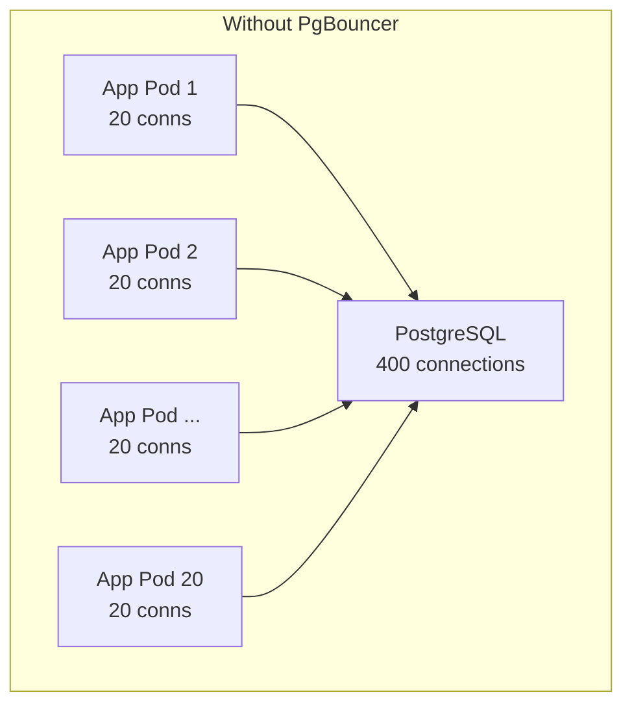
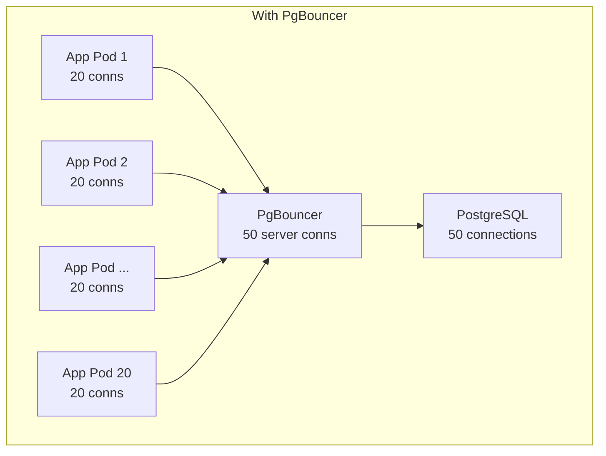
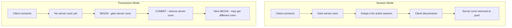

# How to Set Up PgBouncer for PostgreSQL Connection Pooling

Author: [nawazdhandala](https://www.github.com/nawazdhandala)

Tags: PostgreSQL, PgBouncer, Connection Pooling, Performance, Database

Description: Learn how to set up PgBouncer for PostgreSQL connection pooling to handle high connection counts efficiently.

---

Every PostgreSQL connection consumes memory (typically 5-10MB) and OS resources. When your application opens hundreds or thousands of connections, PostgreSQL spends more time managing connections than executing queries. PgBouncer sits between your application and PostgreSQL, pooling and reusing a smaller number of actual database connections.

This guide covers installing, configuring, and operating PgBouncer in production.

## Why Connection Pooling Matters

Without pooling, each application instance opens its own connections to PostgreSQL. With 20 application pods each maintaining a pool of 20 connections, PostgreSQL handles 400 connections. Most of those connections sit idle most of the time, wasting memory.





PgBouncer multiplexes 400 client connections onto 50 actual PostgreSQL connections, reducing memory usage and improving throughput.

## Installation

```bash
# Ubuntu/Debian
sudo apt update && sudo apt install pgbouncer

# CentOS/RHEL
sudo yum install pgbouncer

# macOS
brew install pgbouncer

# Verify installation
pgbouncer --version
```

## Configuration

PgBouncer uses two main configuration files: `pgbouncer.ini` and `userlist.txt`.

### pgbouncer.ini

```ini
; /etc/pgbouncer/pgbouncer.ini

[databases]
; Map database names to PostgreSQL connection strings
; Clients connect to PgBouncer using these database names

; Direct mapping: same name on both sides
myapp = host=10.0.1.10 port=5432 dbname=myapp

; Alias: clients connect to "appdb", routed to "myapp" database
appdb = host=10.0.1.10 port=5432 dbname=myapp

; Read replica routing
myapp_readonly = host=10.0.1.11 port=5432 dbname=myapp

; Wildcard: forward any database name to the same PostgreSQL host
; * = host=10.0.1.10 port=5432

[pgbouncer]
; Address and port PgBouncer listens on
listen_addr = 0.0.0.0
listen_port = 6432

; Authentication method
; md5 = use MD5 password hashing (matches PostgreSQL default)
; scram-sha-256 = use SCRAM-SHA-256 (more secure, PostgreSQL 10+)
auth_type = scram-sha-256

; File containing usernames and passwords
auth_file = /etc/pgbouncer/userlist.txt

; Alternatively, query PostgreSQL for authentication
; auth_query = SELECT usename, passwd FROM pg_shadow WHERE usename=$1

; Pool mode (most important setting)
; session    = connection assigned for the entire client session (safest)
; transaction = connection assigned per transaction (best performance)
; statement  = connection assigned per statement (most restrictive)
pool_mode = transaction

; Maximum number of client connections PgBouncer accepts
max_client_conn = 1000

; Default pool size per user/database pair
; This is the number of server connections PgBouncer maintains
default_pool_size = 25

; Minimum pool size (keep this many connections open even when idle)
min_pool_size = 5

; Reserve connections for superuser access
reserve_pool_size = 5
reserve_pool_timeout = 3

; Connection limits
max_db_connections = 50
max_user_connections = 50

; Timeouts
; Close server connections that have been idle for this long
server_idle_timeout = 600

; Close client connections that have been idle for this long
client_idle_timeout = 0

; Maximum time to wait for a server connection from the pool
server_connect_timeout = 15

; Maximum time a query can take
query_timeout = 300

; Log settings
logfile = /var/log/pgbouncer/pgbouncer.log
pidfile = /var/run/pgbouncer/pgbouncer.pid

; Admin access (for SHOW commands)
admin_users = pgbouncer_admin
stats_users = pgbouncer_stats
```

### userlist.txt

```bash
# /etc/pgbouncer/userlist.txt
# Format: "username" "password"
# For scram-sha-256, use the hashed password from PostgreSQL

# Get the hashed password from PostgreSQL:
# SELECT usename, passwd FROM pg_shadow WHERE usename = 'myapp_user';

"myapp_user" "SCRAM-SHA-256$4096:salt$stored_key:server_key"
"pgbouncer_admin" "admin_password_hash"
"pgbouncer_stats" "stats_password_hash"
```

## Pool Modes Explained

The pool mode determines when PgBouncer assigns and releases server connections.



### When to Use Each Mode

```ini
; Session mode:
; - Compatible with all PostgreSQL features
; - Use when you need: PREPARE/EXECUTE, LISTEN/NOTIFY, SET commands
; - Least efficient pooling
pool_mode = session

; Transaction mode (recommended for most applications):
; - Connection released after each transaction
; - Cannot use session-level features across transactions
; - Best balance of compatibility and efficiency
pool_mode = transaction

; Statement mode:
; - Connection released after each statement
; - Cannot use multi-statement transactions
; - Most efficient but most restrictive
pool_mode = statement
```

## Starting and Managing PgBouncer

```bash
# Start PgBouncer
sudo systemctl start pgbouncer

# Enable PgBouncer to start on boot
sudo systemctl enable pgbouncer

# Check status
sudo systemctl status pgbouncer

# Reload configuration without dropping connections
sudo systemctl reload pgbouncer

# Connect to the PgBouncer admin console
psql -h 127.0.0.1 -p 6432 -U pgbouncer_admin pgbouncer
```

## Monitoring PgBouncer

Connect to the PgBouncer admin database to view pool statistics.

```sql
-- Connect to the admin console
-- psql -h 127.0.0.1 -p 6432 -U pgbouncer_admin pgbouncer

-- Show pool status (most useful command)
SHOW POOLS;
-- Columns: database, user, cl_active, cl_waiting, sv_active, sv_idle, pool_mode

-- Show connected clients
SHOW CLIENTS;

-- Show server connections to PostgreSQL
SHOW SERVERS;

-- Show aggregate statistics
SHOW STATS;
-- Shows: total_xact_count, total_query_count, avg_xact_time, avg_query_time

-- Show per-database statistics
SHOW STATS_TOTALS;

-- Show current configuration
SHOW CONFIG;

-- Show DNS resolution results
SHOW DNS_HOSTS;
```

Key metrics to watch:

```
cl_active   - clients currently executing a query (using a server connection)
cl_waiting  - clients waiting for a server connection (pool exhausted)
sv_active   - server connections currently in use
sv_idle     - server connections available in the pool
```

If `cl_waiting` is consistently above 0, your pool is too small.

## Application Connection String

Update your application to connect through PgBouncer instead of directly to PostgreSQL.

```python
# Python example with psycopg2
# Before (direct to PostgreSQL):
# conn_string = "host=10.0.1.10 port=5432 dbname=myapp user=myapp_user"

# After (through PgBouncer):
import psycopg2

conn_string = (
    "host=10.0.1.20 "    # PgBouncer host
    "port=6432 "          # PgBouncer port (not 5432)
    "dbname=myapp "
    "user=myapp_user "
    "password=secret"
)

# In transaction mode, disable prepared statements
# because they are session-level features
conn = psycopg2.connect(conn_string)
conn.autocommit = False
```

```bash
# Test connectivity through PgBouncer
psql -h 10.0.1.20 -p 6432 -U myapp_user -d myapp -c "SELECT 1;"
```

## Health Checks

Set up health checks to detect PgBouncer failures.

```bash
#!/bin/bash
# /usr/local/bin/pgbouncer_health.sh
# Simple health check script for PgBouncer

set -euo pipefail

# Try to execute a query through PgBouncer
RESULT=$(psql -h 127.0.0.1 -p 6432 -U myapp_user -d myapp \
    -t -A -c "SELECT 1" 2>/dev/null)

if [ "$RESULT" = "1" ]; then
    echo "OK"
    exit 0
else
    echo "FAIL: PgBouncer health check failed"
    exit 1
fi
```

## Common Issues and Solutions

### Prepared Statements in Transaction Mode

```ini
; If your application uses prepared statements and you run in transaction mode,
; you will get errors. There are two solutions:

; Solution 1: Disable prepared statements in your application
; (framework-specific, usually a connection parameter)

; Solution 2: Enable prepared statement tracking in PgBouncer
; This is available in PgBouncer 1.21+
max_prepared_statements = 100
```

### SET Commands in Transaction Mode

```sql
-- SET commands are session-level and will not persist across transactions
-- in transaction mode. Use SET LOCAL instead:

BEGIN;
SET LOCAL statement_timeout = '5s';
SELECT * FROM slow_table;
COMMIT;
-- statement_timeout is reset after COMMIT
```

## Summary

PgBouncer is essential for any PostgreSQL deployment that handles more than a handful of connections. Transaction pooling mode gives you the best balance of efficiency and compatibility. Monitor your pool sizes, watch for client wait queues, and size your pools based on actual PostgreSQL capacity rather than client demand.

Monitor your PgBouncer and PostgreSQL connection health with [OneUptime](https://oneuptime.com). OneUptime can track pool utilization, client wait times, and connection errors - alerting you before connection exhaustion causes application failures.
