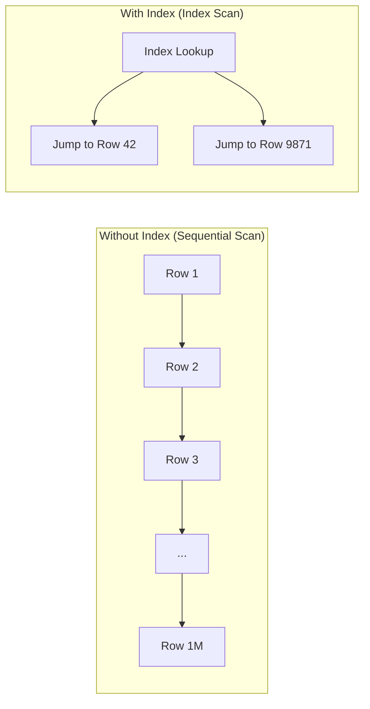
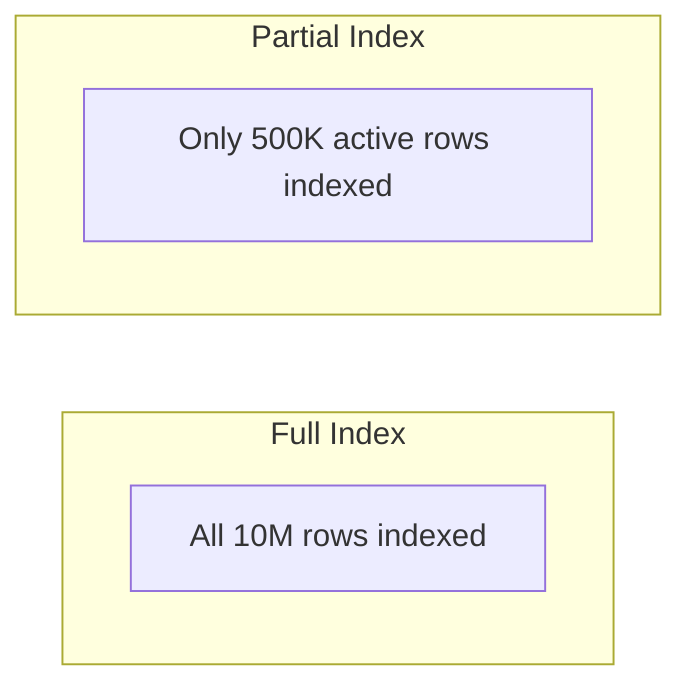

# How to Use PostgreSQL Indexes Effectively

Author: [nawazdhandala](https://www.github.com/nawazdhandala)

Tags: PostgreSQL, Indexes, Performance, Query Optimization, Database

Description: A practical guide to PostgreSQL indexing including B-tree, GIN, GiST indexes and how to identify missing indexes.

---

Indexes are the single most effective tool for improving PostgreSQL query performance. A well-placed index can turn a query that scans millions of rows into one that reads a handful of pages. But indexes also have costs: they consume disk space, slow down writes, and can mislead the query planner if used incorrectly.

This guide covers how PostgreSQL indexes work, which type to use, and how to find missing indexes.

## How Indexes Work

Without an index, PostgreSQL must scan every row in a table to find matching data (a sequential scan). An index creates a separate data structure that maps column values to row locations, allowing the database to jump directly to the relevant rows.



## Index Types

PostgreSQL supports several index types, each optimized for different query patterns.

### B-tree (Default)

The default index type. Best for equality and range queries.

```sql
-- B-tree index on a single column
-- Good for: WHERE email = 'user@example.com'
-- Good for: WHERE created_at > '2026-01-01'
-- Good for: ORDER BY created_at DESC
CREATE INDEX idx_users_email ON users (email);

-- Composite index on multiple columns
-- Good for: WHERE status = 'active' AND created_at > '2026-01-01'
-- Column order matters: put high-selectivity columns first
CREATE INDEX idx_orders_status_created
    ON orders (status, created_at);

-- Index with DESC ordering for queries that sort descending
CREATE INDEX idx_orders_created_desc
    ON orders (created_at DESC);
```

### Hash Index

Faster than B-tree for simple equality lookups only. Does not support range queries.

```sql
-- Hash index for exact equality lookups
-- Good for: WHERE session_id = 'abc123'
-- Not useful for: WHERE session_id > 'abc'
CREATE INDEX idx_sessions_hash ON sessions USING hash (session_id);
```

### GIN (Generalized Inverted Index)

Best for full-text search, JSONB, and array columns.

```sql
-- GIN index on a JSONB column
-- Good for: WHERE metadata @> '{"type": "premium"}'
-- Good for: WHERE metadata ? 'discount'
CREATE INDEX idx_products_metadata ON products USING gin (metadata);

-- GIN index for full-text search
CREATE INDEX idx_articles_search
    ON articles USING gin (to_tsvector('english', title || ' ' || body));

-- GIN index on an array column
-- Good for: WHERE tags @> ARRAY['python']
CREATE INDEX idx_posts_tags ON posts USING gin (tags);
```

### GiST (Generalized Search Tree)

Best for geometric data, range types, and full-text search.

```sql
-- GiST index for range queries
-- Good for: WHERE tsrange @> '2026-02-20 14:00:00'::timestamp
CREATE INDEX idx_reservations_period
    ON reservations USING gist (tsrange(start_time, end_time));

-- GiST index for geometric/spatial queries
CREATE INDEX idx_locations_coords
    ON locations USING gist (point(longitude, latitude));
```

## Partial Indexes

Index only a subset of rows. Smaller, faster, and more efficient.

```sql
-- Only index active users (ignores deleted/inactive users)
-- Saves space and speeds up queries that filter by active status
CREATE INDEX idx_users_active_email
    ON users (email)
    WHERE deleted_at IS NULL AND status = 'active';

-- Only index recent orders (last 90 days)
CREATE INDEX idx_orders_recent
    ON orders (created_at, user_id)
    WHERE created_at > now() - interval '90 days';

-- Index only unprocessed jobs
CREATE INDEX idx_jobs_pending
    ON jobs (priority, created_at)
    WHERE status = 'pending';
```



## Covering Indexes (INCLUDE)

Include additional columns in the index so PostgreSQL can satisfy the query entirely from the index, without reading the table (an index-only scan).

```sql
-- Without INCLUDE: PostgreSQL reads the index, then fetches name from the table
CREATE INDEX idx_users_email ON users (email);

-- With INCLUDE: PostgreSQL reads everything from the index (index-only scan)
CREATE INDEX idx_users_email_covering
    ON users (email)
    INCLUDE (name, created_at);

-- This query can now be satisfied entirely from the index:
-- SELECT name, created_at FROM users WHERE email = 'user@example.com';
```

## Unique Indexes

Enforce uniqueness at the database level.

```sql
-- Unique index (also acts as a constraint)
CREATE UNIQUE INDEX idx_users_unique_email ON users (email);

-- Unique partial index (unique only among non-deleted records)
CREATE UNIQUE INDEX idx_users_unique_active_email
    ON users (email)
    WHERE deleted_at IS NULL;
```

## Concurrent Index Creation

Creating an index normally locks the table for writes. Use `CONCURRENTLY` to avoid this in production.

```sql
-- Normal index creation (blocks writes on the table)
CREATE INDEX idx_orders_user ON orders (user_id);

-- Concurrent index creation (does not block writes)
-- Takes longer but allows normal operations to continue
CREATE INDEX CONCURRENTLY idx_orders_user ON orders (user_id);

-- Important: CONCURRENTLY cannot run inside a transaction
-- If it fails, it leaves an INVALID index that must be dropped:
-- DROP INDEX CONCURRENTLY idx_orders_user;
```

## Finding Missing Indexes

### Check for Sequential Scans on Large Tables

```sql
-- Tables with high sequential scan counts relative to index scans
-- These are candidates for new indexes
SELECT
    relname AS table_name,
    seq_scan,
    idx_scan,
    seq_tup_read,
    CASE
        WHEN (seq_scan + idx_scan) > 0
        THEN round(100.0 * idx_scan / (seq_scan + idx_scan), 1)
        ELSE 0
    END AS index_usage_percent
FROM pg_stat_user_tables
WHERE seq_scan > 100
ORDER BY seq_tup_read DESC
LIMIT 15;
```

### Find Unused Indexes

Unused indexes waste disk space and slow down writes without providing any benefit.

```sql
-- Find indexes that have never been used (or rarely used)
SELECT
    schemaname,
    relname AS table_name,
    indexrelname AS index_name,
    idx_scan AS times_used,
    pg_size_pretty(pg_relation_size(indexrelid)) AS index_size
FROM pg_stat_user_indexes
WHERE idx_scan < 10
ORDER BY pg_relation_size(indexrelid) DESC;
```

### Check Index Sizes

```sql
-- List all indexes with their sizes
SELECT
    tablename,
    indexname,
    pg_size_pretty(pg_relation_size(quote_ident(indexname)::text)) AS index_size
FROM pg_indexes
WHERE schemaname = 'public'
ORDER BY pg_relation_size(quote_ident(indexname)::text) DESC
LIMIT 20;

-- Total index size vs table size
SELECT
    relname AS table_name,
    pg_size_pretty(pg_table_size(relid)) AS table_size,
    pg_size_pretty(pg_indexes_size(relid)) AS indexes_size,
    pg_size_pretty(pg_total_relation_size(relid)) AS total_size
FROM pg_catalog.pg_statio_user_tables
ORDER BY pg_total_relation_size(relid) DESC
LIMIT 10;
```

## Use EXPLAIN to Verify Index Usage

Always check that your index is actually being used by the query planner.

```sql
-- Check if the query uses an index
EXPLAIN (ANALYZE, BUFFERS)
SELECT * FROM users WHERE email = 'test@example.com';

-- Good: shows "Index Scan using idx_users_email"
-- Bad: shows "Seq Scan on users" with a Filter

-- If the planner ignores your index, possible reasons:
-- 1. The table is small (seq scan is faster)
-- 2. The query returns too many rows (seq scan is more efficient)
-- 3. Statistics are out of date (run ANALYZE)
-- 4. The index columns do not match the query

-- Force statistics update
ANALYZE users;
```

## Index Maintenance

```sql
-- Reindex a single index (rebuilds it from scratch)
REINDEX INDEX CONCURRENTLY idx_users_email;

-- Reindex all indexes on a table
REINDEX TABLE CONCURRENTLY users;

-- Check index bloat (wasted space from deleted rows)
SELECT
    indexrelname,
    pg_size_pretty(pg_relation_size(indexrelid)) AS size
FROM pg_stat_user_indexes
WHERE relname = 'users';
```

## Summary

Start with B-tree indexes on columns that appear in WHERE clauses, JOIN conditions, and ORDER BY. Use partial indexes to keep them small and focused. Check for missing indexes by looking at sequential scan statistics and unused indexes that should be dropped. Always verify with EXPLAIN ANALYZE.

Track your PostgreSQL query performance with [OneUptime](https://oneuptime.com). OneUptime can monitor slow queries, alert on degraded database performance, and help you identify when new indexes are needed - keeping your database fast as your data grows.
