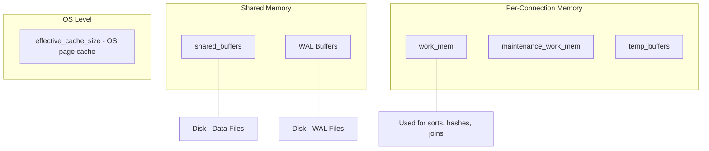
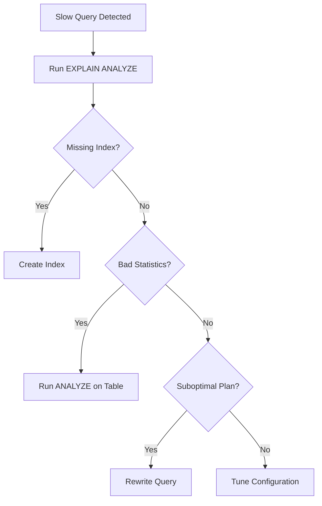

# How to Tune PostgreSQL Performance for Production

Author: [nawazdhandala](https://www.github.com/nawazdhandala)

Tags: PostgreSQL, Performance Tuning, Database, Configuration, Optimization

Description: A practical guide to tuning PostgreSQL performance including shared_buffers, work_mem, and query optimization techniques.

---

PostgreSQL ships with conservative default settings designed to run on minimal hardware. In production, these defaults leave significant performance on the table. Tuning a handful of key parameters can dramatically improve query throughput and response times.

This guide covers the most impactful PostgreSQL configuration changes and query optimization techniques.

## Memory Architecture

Understanding how PostgreSQL uses memory helps you make informed tuning decisions.



## Key Configuration Parameters

### shared_buffers

This is the most important tuning parameter. It controls how much memory PostgreSQL uses for caching data pages.

```sql
-- Check current value
SHOW shared_buffers;

-- Recommendation: 25% of total system RAM
-- For a server with 32GB RAM:
-- shared_buffers = 8GB
```

```ini
# /etc/postgresql/16/main/postgresql.conf

# 25% of total RAM (32GB system)
shared_buffers = 8GB
```

### work_mem

Memory allocated per sort or hash operation per query. A single complex query can use multiple `work_mem` allocations.

```ini
# Default is 4MB, which is too small for analytical queries
# Be careful: this is per-operation, not per-query
# If you have 100 connections each running a query with 4 sort operations:
# Max usage = 100 * 4 * work_mem

# For OLTP workloads with many connections
work_mem = 16MB

# For analytical workloads with fewer connections
# work_mem = 256MB
```

### effective_cache_size

This is not an allocation. It tells the query planner how much memory is available for caching (shared_buffers + OS page cache). It influences whether the planner chooses index scans over sequential scans.

```ini
# Set to ~75% of total RAM
# For a 32GB system:
effective_cache_size = 24GB
```

### maintenance_work_mem

Memory for maintenance operations like VACUUM, CREATE INDEX, and ALTER TABLE.

```ini
# Higher values speed up maintenance operations
# Safe to set higher than work_mem because these run less frequently
maintenance_work_mem = 2GB
```

## WAL Configuration

Write-Ahead Log settings affect write performance significantly.

```ini
# Size of WAL segment files
# Larger segments reduce the number of WAL file switches
wal_buffers = 64MB

# Minimum WAL size before a checkpoint is triggered
min_wal_size = 1GB

# Maximum WAL size
max_wal_size = 4GB

# Spread checkpoint writes over this fraction of the checkpoint interval
# 0.9 means spread over 90% of the interval, reducing I/O spikes
checkpoint_completion_target = 0.9

# How often to flush WAL to disk
# 'on' = flush every commit (safest, slowest)
# 'off' = batch flushes (faster, small risk of data loss on crash)
synchronous_commit = on
```

## Connection Settings

```ini
# Maximum number of concurrent connections
# Each connection uses ~10MB of memory
# For 32GB RAM: keep under 200, use connection pooling for more
max_connections = 100

# Superuser reserved connections
superuser_reserved_connections = 3
```

## Query Optimization

### Using EXPLAIN ANALYZE

The most powerful tool for understanding query performance.

```sql
-- EXPLAIN shows the query plan
-- ANALYZE actually runs the query and shows real timings
-- BUFFERS shows cache hit/miss information

EXPLAIN (ANALYZE, BUFFERS, FORMAT TEXT)
SELECT u.name, COUNT(o.id) as order_count
FROM users u
JOIN orders o ON o.user_id = u.id
WHERE o.created_at > '2026-01-01'
GROUP BY u.name
ORDER BY order_count DESC
LIMIT 10;
```

Key things to look for in the output:

```
-- Look for these warning signs:
-- 1. Sequential scans on large tables (Seq Scan)
-- 2. Large difference between estimated and actual rows
-- 3. High "Buffers: read" count (data not in cache)
-- 4. Sorts using disk instead of memory (Sort Method: external merge)
```

### Identifying Slow Queries

Enable the `pg_stat_statements` extension to track query performance.

```sql
-- Enable the extension
CREATE EXTENSION IF NOT EXISTS pg_stat_statements;

-- Find the top 10 slowest queries by total time
SELECT
    calls,
    round(total_exec_time::numeric, 2) as total_time_ms,
    round(mean_exec_time::numeric, 2) as avg_time_ms,
    round((100 * total_exec_time / sum(total_exec_time) OVER ())::numeric, 2) as percent_total,
    query
FROM pg_stat_statements
ORDER BY total_exec_time DESC
LIMIT 10;
```



## Autovacuum Tuning

Autovacuum reclaims dead rows and updates statistics. Poorly tuned autovacuum leads to table bloat and degraded performance.

```ini
# Enable autovacuum (on by default, never disable it)
autovacuum = on

# Number of autovacuum worker processes
autovacuum_max_workers = 3

# Run vacuum when 20% of rows have changed
autovacuum_vacuum_scale_factor = 0.1

# Run analyze when 10% of rows have changed
autovacuum_analyze_scale_factor = 0.05

# Slow down vacuum to reduce I/O impact on production queries
# Cost-based delay: pause for 10ms after accumulating 1000 cost units
autovacuum_vacuum_cost_delay = 10ms
autovacuum_vacuum_cost_limit = 1000
```

For large tables, set per-table autovacuum settings:

```sql
-- Custom autovacuum settings for a high-write table
ALTER TABLE events SET (
    autovacuum_vacuum_scale_factor = 0.01,   -- Vacuum after 1% change
    autovacuum_analyze_scale_factor = 0.005,  -- Analyze after 0.5% change
    autovacuum_vacuum_cost_delay = 5          -- Faster vacuum for this table
);
```

## Checking Current Performance

Use built-in views to assess database health.

```sql
-- Check cache hit ratio (should be > 99%)
SELECT
    sum(heap_blks_read) as disk_reads,
    sum(heap_blks_hit) as cache_hits,
    round(
        sum(heap_blks_hit)::numeric /
        (sum(heap_blks_hit) + sum(heap_blks_read)) * 100, 2
    ) as cache_hit_ratio
FROM pg_statio_user_tables;

-- Check index usage ratio (should be > 95% for OLTP)
SELECT
    relname,
    seq_scan,
    idx_scan,
    round(
        idx_scan::numeric / (seq_scan + idx_scan) * 100, 2
    ) as index_usage_percent
FROM pg_stat_user_tables
WHERE seq_scan + idx_scan > 0
ORDER BY seq_scan DESC
LIMIT 10;

-- Check table bloat
SELECT
    relname,
    n_dead_tup,
    n_live_tup,
    round(n_dead_tup::numeric / GREATEST(n_live_tup, 1) * 100, 2) as dead_ratio
FROM pg_stat_user_tables
ORDER BY n_dead_tup DESC
LIMIT 10;
```

## Applying Configuration Changes

```bash
# Edit the PostgreSQL configuration
sudo vim /etc/postgresql/16/main/postgresql.conf

# Check for syntax errors
sudo -u postgres pg_conftool 16 main show all

# Some settings require a restart, others only a reload
# Reload (no downtime):
sudo systemctl reload postgresql

# Restart (brief downtime, required for shared_buffers change):
sudo systemctl restart postgresql
```

```sql
-- Check which settings require a restart
SELECT name, setting, context
FROM pg_settings
WHERE context = 'postmaster'
ORDER BY name;
```

## Summary

PostgreSQL performance tuning is an iterative process. Start with memory settings (shared_buffers, work_mem, effective_cache_size), then tune WAL and checkpoint parameters, and finally focus on query-level optimization with EXPLAIN ANALYZE and proper indexing. Monitor cache hit ratios and slow queries continuously.

Use [OneUptime](https://oneuptime.com) to monitor your PostgreSQL instances in production. OneUptime can track query latency, connection counts, replication lag, and cache hit ratios - alerting you before performance degradation affects your users.
