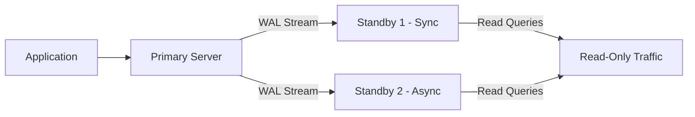
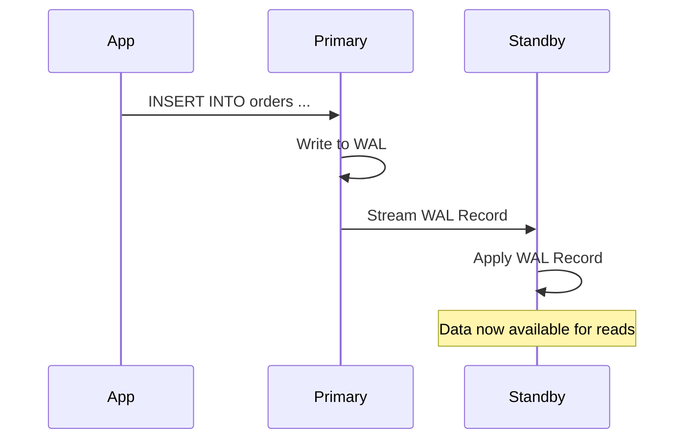

# How to Set Up PostgreSQL Streaming Replication

Author: [nawazdhandala](https://www.github.com/nawazdhandala)

Tags: PostgreSQL, Replication, High Availability, Streaming, Database

Description: Step-by-step guide to setting up PostgreSQL streaming replication for high availability with automatic failover.

---

PostgreSQL streaming replication continuously ships WAL (Write-Ahead Log) records from a primary server to one or more standby servers. The standbys apply these records in real time, keeping an almost identical copy of the database. If the primary goes down, a standby can be promoted to take over.

This guide walks through setting up streaming replication from scratch.

## Replication Architecture



The primary handles all write operations. Standbys receive WAL records and can serve read-only queries, distributing read load across multiple servers.

## Prerequisites

You need at least two PostgreSQL servers running the same major version.

```
Primary:  10.0.1.10 (pg-primary)
Standby:  10.0.1.11 (pg-standby)
```

## Step 1: Configure the Primary Server

### Create a Replication User

```sql
-- Connect to the primary as a superuser
-- Create a dedicated user for replication with the REPLICATION privilege

CREATE ROLE replicator WITH
    LOGIN
    REPLICATION
    PASSWORD 'strong_replication_password';
```

### Configure pg_hba.conf

Allow the standby server to connect for replication.

```bash
# /etc/postgresql/16/main/pg_hba.conf
# Add this line to allow the standby to connect for replication

# TYPE  DATABASE        USER           ADDRESS          METHOD
host    replication     replicator     10.0.1.11/32     scram-sha-256
```

### Configure postgresql.conf on Primary

```ini
# /etc/postgresql/16/main/postgresql.conf

# Listen on all interfaces (or specify the primary's IP)
listen_addresses = '*'

# WAL level must be 'replica' or 'logical' for replication
wal_level = replica

# Maximum number of concurrent replication connections
max_wal_senders = 5

# Number of WAL segments to retain for standbys that fall behind
# Each segment is 16MB, so 64 segments = 1GB
wal_keep_size = 1GB

# Enable replication slots (prevents WAL from being removed
# before the standby has received it)
max_replication_slots = 5

# Optional: enable archiving for additional safety
archive_mode = on
archive_command = 'cp %p /var/lib/postgresql/wal_archive/%f'
```

### Restart the Primary

```bash
# Restart to apply wal_level change (requires restart)
sudo systemctl restart postgresql
```

### Create a Replication Slot

Replication slots ensure the primary retains WAL segments until the standby has consumed them.

```sql
-- Create a physical replication slot for the standby
SELECT pg_create_physical_replication_slot('standby_1_slot');

-- Verify the slot was created
SELECT slot_name, slot_type, active FROM pg_replication_slots;
```

## Step 2: Set Up the Standby Server

### Take a Base Backup

Stop PostgreSQL on the standby and create a base backup from the primary.

```bash
# Stop PostgreSQL on the standby
sudo systemctl stop postgresql

# Remove the existing data directory
sudo rm -rf /var/lib/postgresql/16/main/*

# Take a base backup from the primary
# -R creates standby.signal and configures replication in postgresql.auto.conf
# -S specifies the replication slot to use
# -X stream includes WAL files during the backup
sudo -u postgres pg_basebackup \
    -h 10.0.1.10 \
    -U replicator \
    -D /var/lib/postgresql/16/main \
    -R \
    -S standby_1_slot \
    -X stream \
    -P \
    -v
```

The `-R` flag automatically creates:
- `standby.signal` - tells PostgreSQL this is a standby
- Connection settings in `postgresql.auto.conf`

### Verify the Auto-Generated Configuration

```bash
# Check that pg_basebackup created the standby signal file
ls -la /var/lib/postgresql/16/main/standby.signal

# Check the auto-generated replication configuration
cat /var/lib/postgresql/16/main/postgresql.auto.conf

# Expected content:
# primary_conninfo = 'user=replicator password=... host=10.0.1.10 port=5432'
# primary_slot_name = 'standby_1_slot'
```

### Configure the Standby

```ini
# /etc/postgresql/16/main/postgresql.conf on the standby

# Allow read-only queries on the standby
hot_standby = on

# How much WAL data to buffer before applying
# Higher values can improve replay performance
wal_receiver_timeout = 60s

# Feedback interval to the primary
hot_standby_feedback = on
```

### Start the Standby

```bash
sudo systemctl start postgresql
```

## Step 3: Verify Replication

### On the Primary

```sql
-- Check replication status
SELECT
    client_addr,
    state,
    sent_lsn,
    write_lsn,
    flush_lsn,
    replay_lsn,
    sync_state,
    pg_wal_lsn_diff(sent_lsn, replay_lsn) AS replay_lag_bytes
FROM pg_stat_replication;
```

### On the Standby

```sql
-- Confirm this server is in recovery (standby) mode
SELECT pg_is_in_recovery();
-- Should return: true

-- Check replication lag
SELECT
    now() - pg_last_xact_replay_timestamp() AS replication_lag;

-- Check the WAL receiver status
SELECT status, sender_host, sender_port
FROM pg_stat_wal_receiver;
```



## Step 4: Synchronous Replication (Optional)

By default, replication is asynchronous. The primary does not wait for the standby to confirm receipt of WAL records. Synchronous replication ensures zero data loss at the cost of higher write latency.

```ini
# On the primary: postgresql.conf

# Name the standbys that must confirm writes
# FIRST 1 means at least 1 standby must confirm
synchronous_standby_names = 'FIRST 1 (standby_1_slot)'

# Options:
# 'FIRST 1 (s1, s2)' - wait for first of s1 or s2
# 'ANY 1 (s1, s2)' - wait for any one of them
# '*' - wait for all standbys
```

```sql
-- On the standby, set the application_name to match
-- This goes in postgresql.auto.conf or primary_conninfo
-- primary_conninfo = '... application_name=standby_1_slot'
```

## Step 5: Manual Failover

If the primary fails, promote the standby to become the new primary.

```bash
# On the standby server, promote it to primary
sudo -u postgres pg_ctl promote -D /var/lib/postgresql/16/main

# Or use pg_promote() from SQL
# SELECT pg_promote();

# Verify the standby is no longer in recovery mode
sudo -u postgres psql -c "SELECT pg_is_in_recovery();"
# Should return: false
```

After promotion:
1. Update your application connection strings to point to the new primary
2. Rebuild the old primary as a new standby (using pg_basebackup)
3. Update DNS records if applicable

## Monitoring Replication Health

Key metrics to watch continuously:

```sql
-- On the primary: check all replication connections
SELECT
    application_name,
    client_addr,
    state,
    sync_state,
    pg_wal_lsn_diff(pg_current_wal_lsn(), replay_lsn) AS lag_bytes,
    pg_wal_lsn_diff(pg_current_wal_lsn(), replay_lsn) / 1024 / 1024 AS lag_mb
FROM pg_stat_replication;

-- On the standby: check lag in seconds
SELECT
    CASE
        WHEN pg_last_xact_replay_timestamp() IS NULL THEN -1
        ELSE EXTRACT(EPOCH FROM now() - pg_last_xact_replay_timestamp())
    END AS lag_seconds;
```

## Summary

PostgreSQL streaming replication provides a robust foundation for high availability. Start with asynchronous replication for minimal write latency, and switch to synchronous mode for critical data that cannot tolerate any loss. Always monitor replication lag and test your failover procedure regularly.

Monitor your PostgreSQL replication with [OneUptime](https://oneuptime.com). OneUptime can track replication lag, alert when standbys fall behind or disconnect, and help you ensure your database layer stays highly available.
