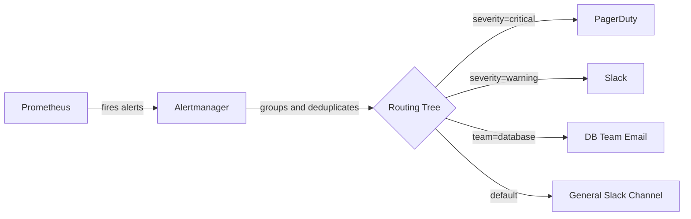
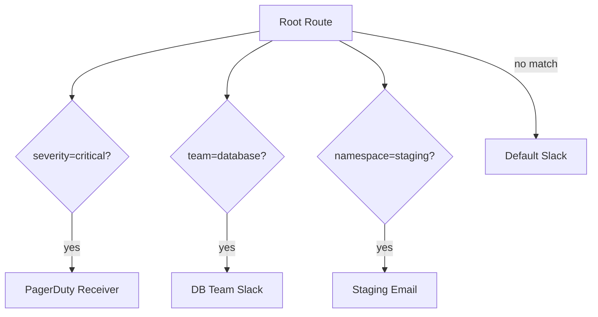
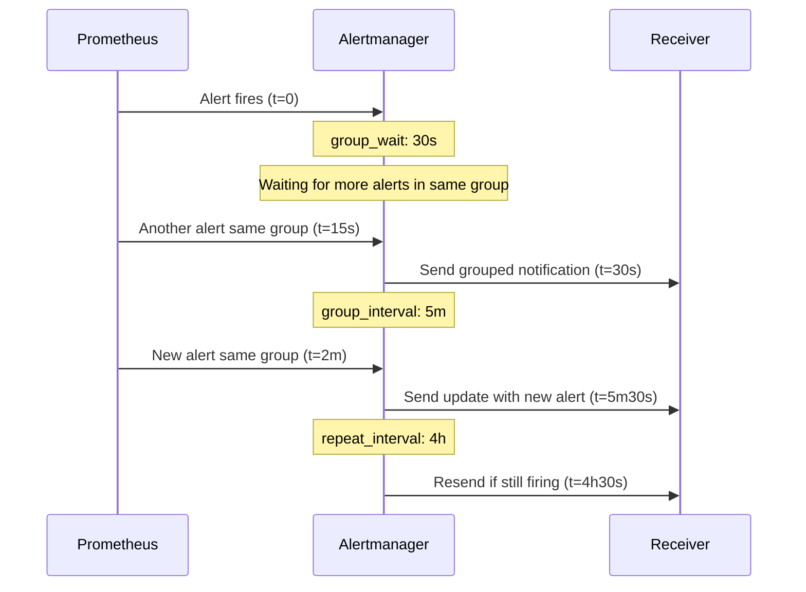

# How to Configure Prometheus Alertmanager Routing and Receivers

Author: [nawazdhandala](https://www.github.com/nawazdhandala)

Tags: Prometheus, Alertmanager, Routing, Alerts, Notifications

Description: Learn how to configure Alertmanager routing trees, receivers, and notification integrations for Prometheus alerts.

---

Prometheus fires alerts, but it does not send notifications. That job belongs to Alertmanager. Alertmanager receives alerts from Prometheus, groups them, deduplicates them, and routes them to the right notification channel. This post covers how to configure routing trees and receivers in Alertmanager.

## How Alertmanager Fits In



Prometheus evaluates alert rules at regular intervals. When a rule fires, Prometheus sends the alert to one or more Alertmanager instances. Alertmanager then decides where to send the notification based on the routing configuration.

## Basic Alertmanager Configuration

The Alertmanager configuration file has three main sections: `global`, `route`, and `receivers`.

```yaml
# alertmanager.yml
# Global settings apply to all notification integrations
global:
  # Default SMTP settings for email notifications
  smtp_smarthost: 'smtp.example.com:587'
  smtp_from: 'alerts@example.com'
  smtp_auth_username: 'alerts@example.com'
  smtp_auth_password: 'secret'
  # Time to wait before sending a resolved notification
  resolve_timeout: 5m

# The routing tree - determines where alerts go
route:
  # Default receiver if no child route matches
  receiver: 'default-slack'
  # How long to wait before sending a group notification
  group_wait: 30s
  # How long to wait before sending updates for a group
  group_interval: 5m
  # How long to wait before resending a notification
  repeat_interval: 4h
  # Group alerts by these labels
  group_by: ['alertname', 'namespace']

# List of notification receivers
receivers:
  - name: 'default-slack'
    slack_configs:
      - api_url: 'https://hooks.slack.com/services/T00/B00/XXXX'
        channel: '#alerts'
        text: '{{ .CommonAnnotations.description }}'
```

## Routing Tree Structure

The routing tree is hierarchical. Each route can have child routes. Alerts flow down the tree and match against the first child route whose matchers match.



### Multi-Level Routing

```yaml
# alertmanager.yml
route:
  receiver: 'default-slack'
  group_wait: 30s
  group_interval: 5m
  repeat_interval: 4h
  group_by: ['alertname', 'namespace']

  # Child routes - evaluated in order
  routes:
    # Critical alerts go to PagerDuty
    - match:
        severity: critical
      receiver: 'pagerduty-critical'
      # Shorter repeat interval for critical alerts
      repeat_interval: 1h
      # Continue to next matching route as well
      continue: false

    # Warning alerts go to Slack
    - match:
        severity: warning
      receiver: 'warning-slack'
      repeat_interval: 4h

    # Database team alerts - match using regex
    - match_re:
        team: 'database|dba'
      receiver: 'db-team-slack'
      # Nested child routes
      routes:
        # Critical DB alerts also page
        - match:
            severity: critical
          receiver: 'db-pagerduty'

    # Staging alerts - lower priority
    - match:
        environment: staging
      receiver: 'staging-email'
      # Longer repeat interval for staging
      repeat_interval: 12h
```

## Configuring Receivers

### Slack Receiver

```yaml
receivers:
  - name: 'warning-slack'
    slack_configs:
      # Incoming webhook URL from Slack
      - api_url: 'https://hooks.slack.com/services/T00/B00/XXXX'
        channel: '#alerts-warning'
        # Use Go template syntax for message formatting
        title: '[{{ .Status | toUpper }}] {{ .CommonLabels.alertname }}'
        text: >-
          *Namespace:* {{ .CommonLabels.namespace }}
          *Description:* {{ .CommonAnnotations.description }}
          *Runbook:* {{ .CommonAnnotations.runbook_url }}
        # Send a notification when the alert resolves
        send_resolved: true
        # Color based on status
        color: '{{ if eq .Status "firing" }}danger{{ else }}good{{ end }}'
```

### PagerDuty Receiver

```yaml
receivers:
  - name: 'pagerduty-critical'
    pagerduty_configs:
      # Integration key from PagerDuty service
      - routing_key: 'your-pagerduty-integration-key'
        # Severity mapping
        severity: '{{ .CommonLabels.severity }}'
        # Include useful details
        details:
          namespace: '{{ .CommonLabels.namespace }}'
          pod: '{{ .CommonLabels.pod }}'
          description: '{{ .CommonAnnotations.description }}'
        send_resolved: true
```

### Email Receiver

```yaml
receivers:
  - name: 'staging-email'
    email_configs:
      # Send to multiple addresses
      - to: 'team@example.com'
        # Override global SMTP settings if needed
        send_resolved: true
        headers:
          Subject: '[{{ .Status | toUpper }}] {{ .CommonLabels.alertname }}'
```

### Webhook Receiver

```yaml
receivers:
  - name: 'custom-webhook'
    webhook_configs:
      # POST alert data as JSON to this URL
      - url: 'https://api.example.com/alerts'
        send_resolved: true
        # Optional HTTP basic auth
        http_config:
          basic_auth:
            username: 'alertmanager'
            password: 'secret'
```

## Grouping, Throttling, and Timing



Three timing parameters control notification frequency:

| Parameter | Purpose | Typical Value |
|-----------|---------|---------------|
| `group_wait` | Wait time before sending first notification for a new group | 30s |
| `group_interval` | Wait time before sending updates for an existing group | 5m |
| `repeat_interval` | Wait time before resending a notification | 4h |

## Inhibition Rules

Inhibition rules suppress notifications for certain alerts when other alerts are firing:

```yaml
# alertmanager.yml
inhibit_rules:
  # If a critical alert fires, suppress warnings for the same alertname
  - source_match:
      severity: 'critical'
    target_match:
      severity: 'warning'
    # Only inhibit if these labels match between source and target
    equal: ['alertname', 'namespace']

  # If the cluster is down, suppress all pod-level alerts
  - source_match:
      alertname: 'ClusterDown'
    target_match_re:
      alertname: 'Pod.*'
    equal: ['cluster']
```

## Silences

Silences temporarily mute notifications. You can create them via the Alertmanager UI or API:

```bash
# Create a silence via the Alertmanager API
# Silences all alerts matching namespace=staging for 2 hours
curl -X POST http://alertmanager:9093/api/v2/silences \
  -H "Content-Type: application/json" \
  -d '{
    "matchers": [
      {
        "name": "namespace",
        "value": "staging",
        "isRegex": false
      }
    ],
    "startsAt": "2026-02-20T10:00:00Z",
    "endsAt": "2026-02-20T12:00:00Z",
    "createdBy": "admin",
    "comment": "Deploying to staging"
  }'
```

## Testing Your Configuration

Validate the configuration file before applying:

```bash
# Check configuration syntax
amtool check-config alertmanager.yml

# Test which route an alert would match
amtool config routes test \
  --config.file=alertmanager.yml \
  severity=critical team=database

# Show the routing tree
amtool config routes show --config.file=alertmanager.yml
```

## High Availability

Run multiple Alertmanager instances in a cluster to avoid single points of failure:

```yaml
# Run three Alertmanager instances with mesh networking
# Each instance knows about the others
# alertmanager-0
alertmanager --config.file=alertmanager.yml \
  --cluster.peer=alertmanager-1:9094 \
  --cluster.peer=alertmanager-2:9094

# alertmanager-1
alertmanager --config.file=alertmanager.yml \
  --cluster.peer=alertmanager-0:9094 \
  --cluster.peer=alertmanager-2:9094
```

## Conclusion

A well-configured Alertmanager routing tree ensures critical alerts reach the right people at the right time. Start with a simple default route, add child routes for specific teams and severities, and tune the timing parameters to avoid alert fatigue.

If you want a monitoring platform with built-in alert routing, on-call schedules, and incident management, check out [OneUptime](https://oneuptime.com). OneUptime handles alert notifications, escalation policies, and status pages so you can focus on building your product.
