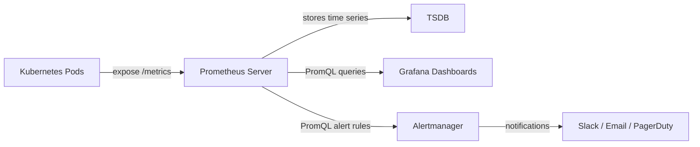
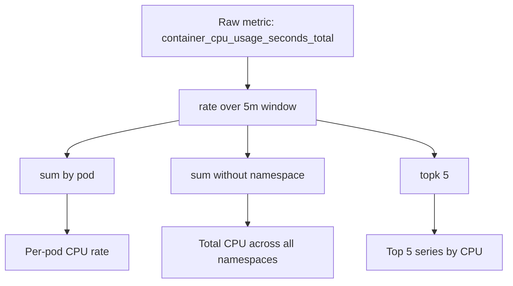

# How to Write PromQL Queries for Kubernetes Monitoring

Author: [nawazdhandala](https://www.github.com/nawazdhandala)

Tags: Prometheus, PromQL, Kubernetes, Metrics, Monitoring

Description: A practical guide to writing PromQL queries for Kubernetes monitoring including selectors, aggregations, rate functions, and common patterns.

---

PromQL is the query language that powers Prometheus. If you are running Kubernetes workloads and scraping metrics with Prometheus, learning PromQL is essential. This guide walks through the core concepts with practical examples you can use right away.

## What is PromQL?

PromQL (Prometheus Query Language) is a functional query language that lets you select, aggregate, and transform time series data. Every metric stored in Prometheus can be queried using PromQL expressions.

There are four PromQL data types:

- **Instant vector** - a set of time series with a single sample per series
- **Range vector** - a set of time series with a range of samples per series
- **Scalar** - a single numeric value
- **String** - a simple string value (rarely used)

## How PromQL Fits Into the Monitoring Stack



## Selectors and Label Matchers

The simplest PromQL query is just a metric name:

```promql
# Return all time series for this metric
container_cpu_usage_seconds_total
```

You filter with label matchers inside curly braces:

```promql
# Exact match on namespace
container_cpu_usage_seconds_total{namespace="production"}

# Regex match on pod name
container_cpu_usage_seconds_total{pod=~"api-server-.*"}

# Negative match - exclude kube-system
container_cpu_usage_seconds_total{namespace!="kube-system"}

# Negative regex - exclude any system namespace
container_cpu_usage_seconds_total{namespace!~"kube-.*"}
```

There are four label matchers:

| Operator | Meaning |
|----------|---------|
| `=`      | Equals |
| `!=`     | Not equals |
| `=~`     | Regex match |
| `!~`     | Negative regex match |

## Range Vectors and the Rate Function

Counter metrics always go up. To get a useful per-second rate, use the `rate()` function with a range vector:

```promql
# Per-second CPU usage rate over the last 5 minutes
rate(container_cpu_usage_seconds_total{namespace="production"}[5m])
```

The `[5m]` turns the instant vector into a range vector covering the last 5 minutes. The `rate()` function calculates the per-second average rate of increase.

For short-lived jobs or spiky traffic, use `irate()` instead:

```promql
# Instantaneous rate using the last two data points
irate(container_cpu_usage_seconds_total{namespace="production"}[5m])
```

## Aggregation Operators

PromQL supports aggregation operators to combine multiple time series:

```promql
# Total CPU usage across all pods in production
sum(rate(container_cpu_usage_seconds_total{namespace="production"}[5m]))

# CPU usage grouped by pod
sum by (pod) (rate(container_cpu_usage_seconds_total{namespace="production"}[5m]))

# Average memory usage per namespace
avg by (namespace) (container_memory_usage_bytes)

# Top 5 pods by memory usage
topk(5, container_memory_usage_bytes{namespace="production"})
```

Common aggregation operators:

| Operator | Description |
|----------|-------------|
| `sum`    | Sum of values |
| `avg`    | Average of values |
| `min`    | Minimum value |
| `max`    | Maximum value |
| `count`  | Count of series |
| `topk`   | Top K elements |
| `bottomk`| Bottom K elements |
| `quantile`| Quantile calculation |

## Aggregation Flow



## Common Kubernetes Monitoring Queries

### Pod CPU Usage as a Percentage of Request

```promql
# CPU usage relative to CPU request
# Shows how close each pod is to its CPU request
sum by (pod, namespace) (
    rate(container_cpu_usage_seconds_total{image!=""}[5m])
)
/
sum by (pod, namespace) (
    kube_pod_container_resource_requests{resource="cpu"}
)
* 100
```

### Pod Memory Usage as a Percentage of Limit

```promql
# Memory usage relative to memory limit
# Values approaching 100 mean OOMKill risk
sum by (pod, namespace) (
    container_memory_working_set_bytes{image!=""}
)
/
sum by (pod, namespace) (
    kube_pod_container_resource_limits{resource="memory"}
)
* 100
```

### Pod Restart Count

```promql
# Pods that have restarted in the last hour
# A high restart count usually signals CrashLoopBackOff
sum by (pod, namespace) (
    increase(kube_pod_container_status_restarts_total[1h])
) > 0
```

### Node Disk Pressure

```promql
# Percentage of disk used on each node
# Alert when this goes above 85%
(
    node_filesystem_size_bytes{mountpoint="/"} 
    - node_filesystem_avail_bytes{mountpoint="/"}
)
/ node_filesystem_size_bytes{mountpoint="/"}
* 100
```

### HTTP Request Rate by Status Code

```promql
# Request rate grouped by status code
# Useful for spotting 5xx error spikes
sum by (status_code) (
    rate(http_requests_total{namespace="production"}[5m])
)
```

### 99th Percentile Request Latency

```promql
# P99 latency using histogram quantile
# histogram_quantile works with histogram bucket metrics
histogram_quantile(
    0.99,
    sum by (le) (
        rate(http_request_duration_seconds_bucket{namespace="production"}[5m])
    )
)
```

## Subqueries

Subqueries let you run a range query on the result of an instant query:

```promql
# Average of the 5-minute rate, computed over the last hour
# with a resolution of 1 minute
avg_over_time(
    rate(http_requests_total[5m])[1h:1m]
)
```

## Binary Operators and Filtering

PromQL supports arithmetic and comparison operators:

```promql
# Only show pods using more than 1 CPU core
sum by (pod) (rate(container_cpu_usage_seconds_total[5m])) > 1

# Calculate error rate percentage
sum(rate(http_requests_total{status_code=~"5.."}[5m]))
/
sum(rate(http_requests_total[5m]))
* 100
```

## Vector Matching

When combining two vectors with different labels, you need vector matching:

```promql
# Use 'on' to specify which labels to match
sum by (namespace) (rate(container_cpu_usage_seconds_total[5m]))
/
on(namespace)
sum by (namespace) (kube_pod_container_resource_requests{resource="cpu"})
```

## Useful Functions

| Function | Purpose | Example |
|----------|---------|---------|
| `rate()` | Per-second rate of a counter | `rate(metric[5m])` |
| `increase()` | Total increase over a range | `increase(metric[1h])` |
| `histogram_quantile()` | Percentile from histogram | `histogram_quantile(0.95, ...)` |
| `absent()` | Returns 1 if metric is missing | `absent(up{job="api"})` |
| `label_replace()` | Modify label values | `label_replace(metric, "dst", "$1", "src", "(.*)")` |
| `predict_linear()` | Linear prediction | `predict_linear(metric[1h], 3600)` |
| `delta()` | Difference over a range (gauges) | `delta(metric[1h])` |
| `deriv()` | Per-second derivative (gauges) | `deriv(metric[5m])` |

## Tips for Writing Good PromQL

1. Always use `rate()` on counters, never query raw counter values
2. Use `sum by (label)` rather than `sum without (label)` for clarity
3. Filter early with label matchers to reduce cardinality
4. Use recording rules for expensive queries that run repeatedly
5. Test queries in Prometheus UI before adding them to dashboards

## Conclusion

PromQL is a powerful tool for querying Kubernetes metrics. Starting with simple selectors, building up through rate calculations and aggregations, and combining vectors gives you everything you need to monitor a Kubernetes cluster effectively. Practice these patterns on your own cluster and they will become second nature.

If you are looking for a monitoring platform that integrates with Prometheus and supports PromQL-based alerting, check out [OneUptime](https://oneuptime.com). OneUptime provides infrastructure monitoring, incident management, and status pages - all in one platform.
