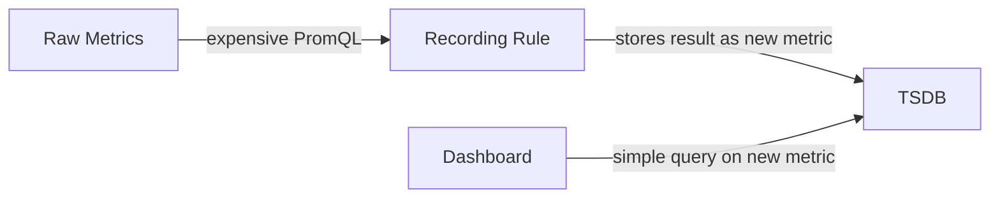
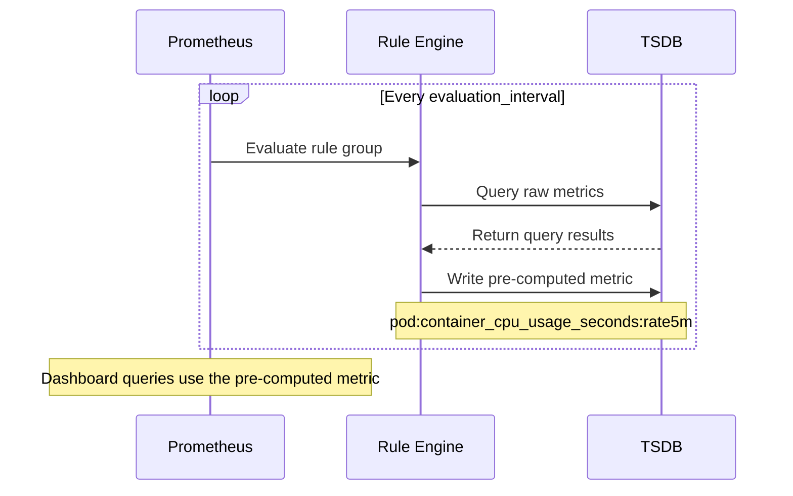
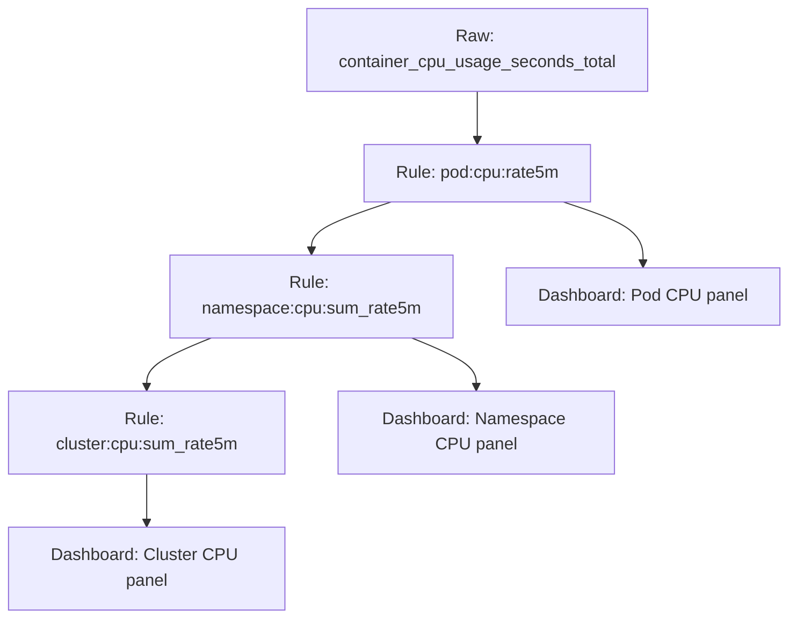

# How to Use Prometheus Recording Rules for Performance

Author: [nawazdhandala](https://www.github.com/nawazdhandala)

Tags: Prometheus, Recording Rules, Performance, PromQL, Optimization

Description: Learn how to use Prometheus recording rules to pre-compute expensive queries and improve dashboard performance.

---

As your Prometheus deployment grows, some PromQL queries become slow. Queries that aggregate across thousands of time series, compute rates over long ranges, or join multiple metrics can take seconds to evaluate. Recording rules solve this by pre-computing query results and storing them as new time series.

## What Are Recording Rules?

A recording rule runs a PromQL expression at regular intervals and saves the result as a new metric. Instead of computing an expensive aggregation every time a dashboard loads, Prometheus computes it once and stores the result.



Without recording rules, every dashboard panel runs the full query on raw data. With recording rules, the dashboard queries a pre-computed metric that returns instantly.

## Recording Rules vs Alert Rules

Prometheus has two types of rules:

| Feature | Recording Rules | Alert Rules |
|---------|----------------|-------------|
| Purpose | Pre-compute and store metrics | Fire alerts when conditions are met |
| Output | New time series | Alerts sent to Alertmanager |
| Keyword | `record` | `alert` |
| Use case | Dashboard performance | Notification triggers |

Both types live in rule files and are evaluated at the same interval.

## Basic Recording Rule

```yaml
# rules/recording-rules.yml
groups:
  # Each group has a name and evaluation interval
  - name: cpu_rules
    # How often to evaluate rules in this group
    interval: 30s
    rules:
      # Pre-compute the per-pod CPU usage rate
      - record: pod:container_cpu_usage_seconds:rate5m
        # The PromQL expression to evaluate
        expr: >
          sum by (pod, namespace) (
            rate(container_cpu_usage_seconds_total{image!=""}[5m])
          )
```

The `record` field is the name of the new metric. The `expr` field is the PromQL expression. Every 30 seconds, Prometheus evaluates the expression and writes the result as `pod:container_cpu_usage_seconds:rate5m`.

## Naming Convention

Prometheus recommends a naming convention for recording rules:

```
level:metric_name:operations
```

- **level** - the aggregation level (e.g., `pod`, `namespace`, `cluster`)
- **metric_name** - the base metric name
- **operations** - the operations applied (e.g., `rate5m`, `sum`)

Examples:

```yaml
# Pod-level CPU rate
pod:container_cpu_usage_seconds:rate5m

# Namespace-level memory sum
namespace:container_memory_usage_bytes:sum

# Cluster-level request rate
cluster:http_requests_total:rate5m_sum

# Job-level error ratio
job:http_request_errors:ratio_rate5m
```

## Loading Rules in Prometheus

Add the rule file path to your Prometheus configuration:

```yaml
# prometheus.yml
global:
  scrape_interval: 15s
  evaluation_interval: 15s

# Load recording rule files
rule_files:
  - "rules/recording-rules.yml"
  - "rules/alert-rules.yml"

scrape_configs:
  - job_name: 'kubernetes-pods'
    kubernetes_sd_configs:
      - role: pod
```

## Evaluation Flow



## Practical Recording Rules

### CPU and Memory Rules

```yaml
groups:
  - name: resource_rules
    interval: 30s
    rules:
      # Per-pod CPU usage rate
      - record: pod:container_cpu_usage_seconds:rate5m
        expr: >
          sum by (pod, namespace) (
            rate(container_cpu_usage_seconds_total{image!=""}[5m])
          )

      # Per-namespace CPU usage
      - record: namespace:container_cpu_usage_seconds:sum_rate5m
        # Build on the previous recording rule
        expr: >
          sum by (namespace) (
            pod:container_cpu_usage_seconds:rate5m
          )

      # Per-pod memory working set
      - record: pod:container_memory_working_set_bytes:sum
        expr: >
          sum by (pod, namespace) (
            container_memory_working_set_bytes{image!=""}
          )

      # Per-namespace memory usage
      - record: namespace:container_memory_working_set_bytes:sum
        expr: >
          sum by (namespace) (
            pod:container_memory_working_set_bytes:sum
          )
```

### HTTP Request Rules

```yaml
groups:
  - name: http_rules
    interval: 30s
    rules:
      # Total request rate by service
      - record: service:http_requests_total:rate5m
        expr: >
          sum by (service, namespace) (
            rate(http_requests_total[5m])
          )

      # Error request rate by service
      - record: service:http_request_errors_total:rate5m
        expr: >
          sum by (service, namespace) (
            rate(http_requests_total{status_code=~"5.."}[5m])
          )

      # Error ratio by service
      - record: service:http_request_errors:ratio_rate5m
        expr: >
          service:http_request_errors_total:rate5m
          /
          service:http_requests_total:rate5m

      # P99 latency by service
      - record: service:http_request_duration_seconds:p99_rate5m
        expr: >
          histogram_quantile(0.99,
            sum by (service, namespace, le) (
              rate(http_request_duration_seconds_bucket[5m])
            )
          )

      # P50 latency by service
      - record: service:http_request_duration_seconds:p50_rate5m
        expr: >
          histogram_quantile(0.50,
            sum by (service, namespace, le) (
              rate(http_request_duration_seconds_bucket[5m])
            )
          )
```

### Chaining Recording Rules

Recording rules can reference other recording rules. This lets you build up aggregations in layers:



```yaml
groups:
  - name: chained_rules
    interval: 30s
    rules:
      # Layer 1: pod level
      - record: pod:container_cpu_usage:rate5m
        expr: >
          sum by (pod, namespace) (
            rate(container_cpu_usage_seconds_total{image!=""}[5m])
          )

      # Layer 2: namespace level (uses layer 1)
      - record: namespace:container_cpu_usage:sum_rate5m
        expr: >
          sum by (namespace) (
            pod:container_cpu_usage:rate5m
          )

      # Layer 3: cluster level (uses layer 2)
      - record: cluster:container_cpu_usage:sum_rate5m
        expr: >
          sum(
            namespace:container_cpu_usage:sum_rate5m
          )
```

## Adding Labels to Recording Rules

You can add fixed labels to recording rule results:

```yaml
rules:
  - record: cluster:http_requests:rate5m
    expr: sum(rate(http_requests_total[5m]))
    # Add a static label to identify the source
    labels:
      aggregation: "cluster-wide"
      environment: "production"
```

## Validating Rule Files

Use `promtool` to validate rule files before deploying:

```bash
# Check rule file syntax
promtool check rules rules/recording-rules.yml

# Run unit tests for rules
promtool test rules tests/rules-test.yml
```

### Unit Test for Recording Rules

```yaml
# tests/rules-test.yml
rule_files:
  - ../rules/recording-rules.yml

evaluation_interval: 30s

tests:
  - interval: 1m
    input_series:
      # Simulate input data
      - series: 'container_cpu_usage_seconds_total{pod="api-1",namespace="prod",image="api:v1"}'
        values: '0+1x10'
      - series: 'container_cpu_usage_seconds_total{pod="api-2",namespace="prod",image="api:v1"}'
        values: '0+2x10'
    alert_rule_test: []
    promql_expr_test:
      - expr: pod:container_cpu_usage_seconds:rate5m{namespace="prod"}
        eval_time: 10m
        exp_samples:
          - labels: 'pod:container_cpu_usage_seconds:rate5m{pod="api-1",namespace="prod"}'
            value: 1
          - labels: 'pod:container_cpu_usage_seconds:rate5m{pod="api-2",namespace="prod"}'
            value: 2
```

## When to Use Recording Rules

Use recording rules when:

1. A dashboard query takes more than a second to evaluate
2. The same expensive query is used in multiple dashboards
3. You need to aggregate across high-cardinality metrics
4. Alert rules reference complex expressions that run frequently
5. You want to build multi-layer aggregation hierarchies

Avoid recording rules when:

1. The raw query is fast enough already
2. You rarely query the metric
3. You need to explore data interactively with ad-hoc label filtering

## Conclusion

Recording rules are a simple but powerful optimization for Prometheus. They reduce query latency, lower Prometheus CPU usage during dashboard loads, and make alert rule expressions cleaner. Start by identifying your slowest dashboard queries and converting them to recording rules.

For a monitoring platform that handles metrics storage, dashboarding, and alerting with built-in performance optimizations, check out [OneUptime](https://oneuptime.com). OneUptime provides Prometheus-compatible metrics ingestion with long-term storage and fast query performance out of the box.
