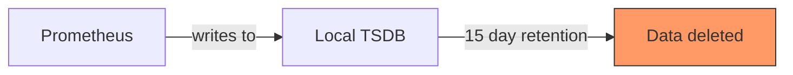
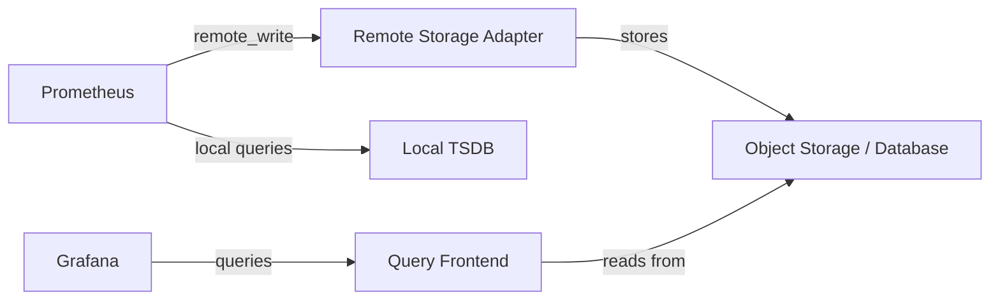
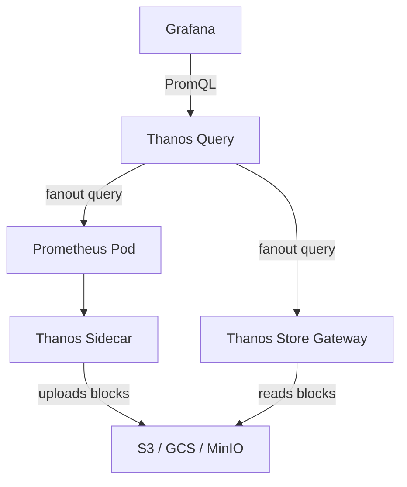
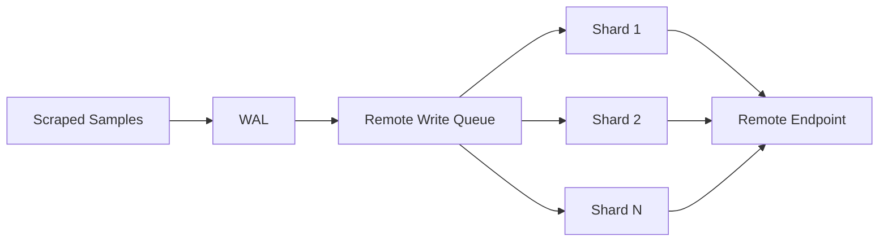

# How to Configure Prometheus Remote Write for Long-Term Storage

Author: [nawazdhandala](https://www.github.com/nawazdhandala)

Tags: Prometheus, Remote Write, Storage, Thanos, Cortex

Description: Learn how to configure Prometheus remote write for long-term metrics storage using Thanos, Cortex, or other remote storage solutions.

---

Prometheus stores metrics locally on disk. By default, it retains data for 15 days. For many teams, this is not enough. Capacity planning, year-over-year comparisons, and compliance requirements often demand months or years of metrics history. Remote write solves this by sending metrics from Prometheus to external long-term storage.

## The Problem with Local Storage



Local storage has three limitations:

1. **Retention** - data is deleted after the configured retention period
2. **Capacity** - local disk is finite and shared with WAL and compaction
3. **Durability** - if the disk fails, historical data is lost

## Remote Write Architecture



With remote write, Prometheus sends each ingested sample to a remote endpoint over HTTP. The remote storage backend handles long-term retention, compaction, and query serving.

## Basic Remote Write Configuration

```yaml
# prometheus.yml
global:
  scrape_interval: 15s

# Remote write configuration
remote_write:
  # Send metrics to a remote endpoint
  - url: "https://remote-storage.example.com/api/v1/write"

    # Queue configuration for buffering
    queue_config:
      # Maximum number of samples per send
      max_samples_per_send: 1000
      # Maximum number of shards (parallel senders)
      max_shards: 200
      # Capacity of the in-memory queue per shard
      capacity: 2500
      # Maximum time a sample can sit in the queue
      batch_send_deadline: 5s

    # Optional authentication
    basic_auth:
      username: "prometheus"
      password: "secret"
```

## Remote Storage Options

| Solution | Type | Storage Backend | Query API |
|----------|------|-----------------|-----------|
| Thanos | Sidecar/Receive | Object storage (S3, GCS) | PromQL via Thanos Query |
| Cortex | Push-based | Object storage + DynamoDB/Cassandra | PromQL compatible |
| Mimir | Push-based | Object storage | PromQL compatible |
| VictoriaMetrics | Push/Pull | Custom TSDB | MetricsQL (PromQL superset) |
| InfluxDB | Push-based | Custom storage engine | InfluxQL / Flux |

## Thanos Sidecar Setup

Thanos uses a sidecar container that reads Prometheus TSDB blocks and uploads them to object storage:



### Prometheus with Thanos Sidecar

```yaml
# prometheus-deployment.yaml
apiVersion: apps/v1
kind: Deployment
metadata:
  name: prometheus
  namespace: monitoring
spec:
  replicas: 1
  selector:
    matchLabels:
      app: prometheus
  template:
    metadata:
      labels:
        app: prometheus
    spec:
      containers:
        # Prometheus container
        - name: prometheus
          image: prom/prometheus:v2.51.0
          args:
            - "--config.file=/etc/prometheus/prometheus.yml"
            - "--storage.tsdb.path=/prometheus"
            # Keep local data for 2 hours
            # Thanos sidecar handles long-term storage
            - "--storage.tsdb.retention.time=2h"
            # Required for Thanos sidecar to read blocks
            - "--storage.tsdb.min-block-duration=2h"
            - "--storage.tsdb.max-block-duration=2h"
            - "--web.enable-lifecycle"
          volumeMounts:
            - name: prometheus-data
              mountPath: /prometheus

        # Thanos sidecar container
        - name: thanos-sidecar
          image: thanosio/thanos:v0.34.0
          args:
            - "sidecar"
            - "--tsdb.path=/prometheus"
            - "--prometheus.url=http://localhost:9090"
            # Object storage configuration
            - "--objstore.config-file=/etc/thanos/objstore.yml"
          volumeMounts:
            - name: prometheus-data
              mountPath: /prometheus
            - name: thanos-config
              mountPath: /etc/thanos

      volumes:
        - name: prometheus-data
          persistentVolumeClaim:
            claimName: prometheus-data
        - name: thanos-config
          secret:
            secretName: thanos-objstore-config
```

### Thanos Object Store Configuration

```yaml
# thanos-objstore.yml
type: S3
config:
  bucket: "thanos-metrics"
  endpoint: "s3.amazonaws.com"
  region: "us-east-1"
  access_key: "${AWS_ACCESS_KEY_ID}"
  secret_key: "${AWS_SECRET_ACCESS_KEY}"
```

## Remote Write to Cortex or Mimir

Cortex and Mimir accept metrics directly via the Prometheus remote write API:

```yaml
# prometheus.yml
remote_write:
  - url: "http://mimir-distributor:8080/api/v1/push"
    # Add tenant header for multi-tenancy
    headers:
      X-Scope-OrgID: "my-tenant"
    queue_config:
      max_samples_per_send: 5000
      max_shards: 10
      capacity: 10000
    # Retry configuration
    metadata_config:
      send: true
      send_interval: 1m
```

## Remote Write to VictoriaMetrics

```yaml
# prometheus.yml
remote_write:
  - url: "http://victoriametrics:8428/api/v1/write"
    queue_config:
      max_samples_per_send: 10000
      capacity: 20000
```

## Queue Configuration Details

The remote write queue buffers samples before sending them:



Key queue parameters:

| Parameter | Default | Description |
|-----------|---------|-------------|
| `capacity` | 2500 | Per-shard buffer size in samples |
| `max_shards` | 200 | Maximum parallel senders |
| `min_shards` | 1 | Minimum parallel senders |
| `max_samples_per_send` | 500 | Batch size per HTTP request |
| `batch_send_deadline` | 5s | Maximum wait before sending a partial batch |
| `min_backoff` | 30ms | Initial retry backoff |
| `max_backoff` | 5s | Maximum retry backoff |

## Write-Ahead Log (WAL) for Reliability

Prometheus writes all samples to a write-ahead log (WAL) before processing. If Prometheus restarts, it replays the WAL to recover samples that have not been sent via remote write:

```yaml
# prometheus.yml
remote_write:
  - url: "http://remote-storage:8080/api/v1/write"
    # WAL replay ensures no data loss on restart
    queue_config:
      capacity: 5000
      max_shards: 50
```

## Filtering What Gets Sent

Use `write_relabel_configs` to filter which metrics are sent remotely:

```yaml
remote_write:
  - url: "http://remote-storage:8080/api/v1/write"
    write_relabel_configs:
      # Only send metrics matching these names
      - source_labels: [__name__]
        regex: "container_cpu_.*|container_memory_.*|http_requests_.*"
        action: keep

      # Drop high-cardinality labels before sending
      - regex: "pod_template_hash"
        action: labeldrop

      # Drop all metrics from the kube-system namespace
      - source_labels: [namespace]
        regex: "kube-system"
        action: drop
```

## Monitoring Remote Write

Prometheus exposes metrics about its own remote write pipeline:

```promql
# Remote write samples pending in the queue
prometheus_remote_storage_pending_samples

# Rate of samples successfully sent
rate(prometheus_remote_storage_succeeded_samples_total[5m])

# Rate of failed samples
rate(prometheus_remote_storage_failed_samples_total[5m])

# Highest timestamp successfully sent
prometheus_remote_storage_highest_timestamp_in_seconds
- prometheus_remote_storage_queue_highest_sent_timestamp_seconds
```

## Conclusion

Remote write transforms Prometheus from a short-term metrics store into a pipeline that feeds long-term storage backends. Whether you choose Thanos, Mimir, VictoriaMetrics, or another solution, the remote write protocol ensures your metrics survive beyond the local retention window. Start with a basic remote write configuration, tune the queue parameters for your throughput, and use write relabeling to control storage costs.

For a monitoring platform that provides built-in long-term metrics storage without the complexity of managing Thanos or Cortex, check out [OneUptime](https://oneuptime.com). OneUptime accepts Prometheus remote write data and stores your metrics with long-term retention, alerting, and dashboards included.
