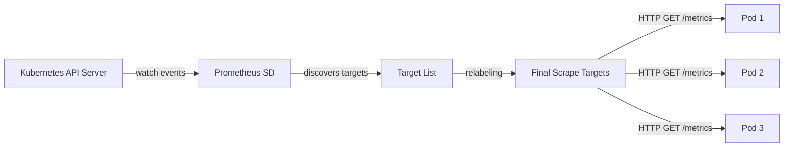
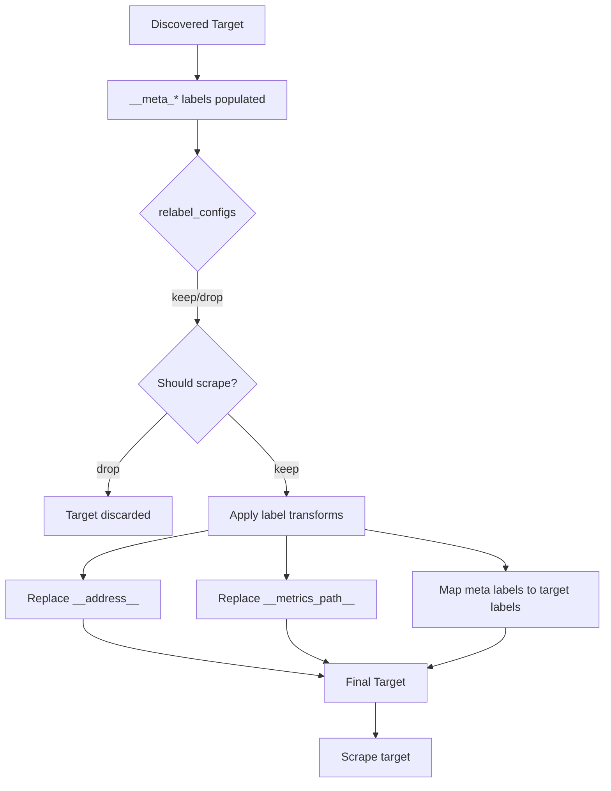

# How Prometheus Service Discovery Works in Kubernetes

Author: [nawazdhandala](https://www.github.com/nawazdhandala)

Tags: Prometheus, Service Discovery, Kubernetes, Scraping, Targets

Description: Deep dive into how Prometheus discovers scrape targets in Kubernetes using pod, service, and endpoint service discovery.

---

Prometheus needs to know which targets to scrape. In a static environment you list endpoints in a configuration file. In Kubernetes, pods come and go constantly. Service discovery solves this by letting Prometheus automatically find scrape targets using the Kubernetes API.

## The Discovery Flow



Prometheus watches the Kubernetes API for changes to pods, services, endpoints, nodes, and ingresses. When a new pod starts or an old one terminates, Prometheus updates its target list automatically.

## Kubernetes SD Roles

Prometheus supports five Kubernetes service discovery roles:

| Role | Discovers | Use Case |
|------|-----------|----------|
| `pod` | Individual pods | Application metrics |
| `service` | Kubernetes services | Service-level probing |
| `endpoints` | Endpoints behind services | Most common for app metrics |
| `endpointslice` | EndpointSlice objects | Preferred over endpoints in newer clusters |
| `node` | Cluster nodes | Node-level metrics (node-exporter) |
| `ingress` | Ingress resources | Blackbox probing of URLs |

## Basic Configuration

Here is a Prometheus configuration that discovers pods in Kubernetes:

```yaml
# prometheus.yml
global:
  scrape_interval: 15s
  evaluation_interval: 15s

scrape_configs:
  # Discover and scrape all pods with the right annotations
  - job_name: 'kubernetes-pods'
    kubernetes_sd_configs:
      # Use the pod role to discover individual pods
      - role: pod
    relabel_configs:
      # Only scrape pods that have the annotation
      # prometheus.io/scrape: "true"
      - source_labels: [__meta_kubernetes_pod_annotation_prometheus_io_scrape]
        action: keep
        regex: true

      # Use the prometheus.io/path annotation for the metrics path
      # Default is /metrics
      - source_labels: [__meta_kubernetes_pod_annotation_prometheus_io_path]
        action: replace
        target_label: __metrics_path__
        regex: (.+)

      # Use the prometheus.io/port annotation for the port
      - source_labels:
          [__address__, __meta_kubernetes_pod_annotation_prometheus_io_port]
        action: replace
        regex: ([^:]+)(?::\d+)?;(\d+)
        replacement: $1:$2
        target_label: __address__

      # Add namespace as a label
      - source_labels: [__meta_kubernetes_namespace]
        action: replace
        target_label: namespace

      # Add pod name as a label
      - source_labels: [__meta_kubernetes_pod_name]
        action: replace
        target_label: pod
```

## Pod Annotations

The configuration above relies on pod annotations. Here is how to annotate your deployment:

```yaml
# deployment.yaml
apiVersion: apps/v1
kind: Deployment
metadata:
  name: api-server
  namespace: production
spec:
  replicas: 3
  selector:
    matchLabels:
      app: api-server
  template:
    metadata:
      labels:
        app: api-server
      annotations:
        # Tell Prometheus to scrape this pod
        prometheus.io/scrape: "true"
        # Custom metrics port
        prometheus.io/port: "8080"
        # Custom metrics path
        prometheus.io/path: "/metrics"
    spec:
      containers:
        - name: api-server
          image: api-server:latest
          ports:
            - containerPort: 8080
```

## Endpoints Role

The endpoints role discovers targets through Kubernetes Service endpoints. This is the most common approach:

```yaml
scrape_configs:
  - job_name: 'kubernetes-service-endpoints'
    kubernetes_sd_configs:
      - role: endpoints
    relabel_configs:
      # Only scrape endpoints for services with the annotation
      - source_labels:
          [__meta_kubernetes_service_annotation_prometheus_io_scrape]
        action: keep
        regex: true

      # Use the service annotation for scheme (http/https)
      - source_labels:
          [__meta_kubernetes_service_annotation_prometheus_io_scheme]
        action: replace
        target_label: __scheme__
        regex: (https?)

      # Use service annotation for metrics path
      - source_labels:
          [__meta_kubernetes_service_annotation_prometheus_io_path]
        action: replace
        target_label: __metrics_path__
        regex: (.+)

      # Use service annotation for port
      - source_labels:
          [__address__,
           __meta_kubernetes_service_annotation_prometheus_io_port]
        action: replace
        target_label: __address__
        regex: ([^:]+)(?::\d+)?;(\d+)
        replacement: $1:$2

      # Preserve the service name as a label
      - source_labels: [__meta_kubernetes_service_name]
        action: replace
        target_label: service

      # Preserve the namespace
      - source_labels: [__meta_kubernetes_namespace]
        action: replace
        target_label: namespace
```

## Node Role for Infrastructure Metrics

```yaml
scrape_configs:
  # Scrape kubelet metrics from each node
  - job_name: 'kubelet'
    kubernetes_sd_configs:
      - role: node
    scheme: https
    tls_config:
      # Use the service account token for auth
      ca_file: /var/run/secrets/kubernetes.io/serviceaccount/ca.crt
    bearer_token_file: /var/run/secrets/kubernetes.io/serviceaccount/token
    relabel_configs:
      # Replace the target address with the kubelet metrics endpoint
      - action: labelmap
        regex: __meta_kubernetes_node_label_(.+)
```

## Relabeling Flow



## Common Relabel Actions

| Action | Description |
|--------|-------------|
| `keep` | Keep targets where regex matches source labels |
| `drop` | Drop targets where regex matches source labels |
| `replace` | Replace target label with regex substitution |
| `labelmap` | Map meta labels to target labels using regex |
| `labeldrop` | Drop labels matching regex |
| `labelkeep` | Keep only labels matching regex |
| `hashmod` | Set target label to hash mod of source labels |

## Namespace Filtering

To discover targets only in specific namespaces:

```yaml
scrape_configs:
  - job_name: 'production-pods'
    kubernetes_sd_configs:
      - role: pod
        # Only discover pods in these namespaces
        namespaces:
          names:
            - production
            - staging
```

## RBAC Configuration

Prometheus needs RBAC permissions to access the Kubernetes API:

```yaml
# rbac.yaml
apiVersion: rbac.authorization.k8s.io/v1
kind: ClusterRole
metadata:
  name: prometheus
rules:
  # Permissions needed for service discovery
  - apiGroups: [""]
    resources:
      - nodes
      - nodes/proxy
      - services
      - endpoints
      - pods
    verbs: ["get", "list", "watch"]
  - apiGroups: ["networking.k8s.io"]
    resources:
      - ingresses
    verbs: ["get", "list", "watch"]
---
apiVersion: rbac.authorization.k8s.io/v1
kind: ClusterRoleBinding
metadata:
  name: prometheus
roleRef:
  apiGroup: rbac.authorization.k8s.io
  kind: ClusterRole
  name: prometheus
subjects:
  - kind: ServiceAccount
    name: prometheus
    namespace: monitoring
```

## Debugging Service Discovery

Check discovered targets in the Prometheus UI under Status > Targets. You can also use the API:

```bash
# List all active targets
curl -s http://prometheus:9090/api/v1/targets | jq '.data.activeTargets[] | {
  scrapeUrl: .scrapeUrl,
  health: .health,
  labels: .labels
}'

# Check service discovery results before relabeling
curl -s http://prometheus:9090/api/v1/targets/metadata
```

## Conclusion

Kubernetes service discovery makes Prometheus a natural fit for dynamic container environments. By combining the right SD role with annotation-based relabeling, you get automatic target discovery without maintaining static configuration files. Start with the pod or endpoints role and add annotation-based filtering to control which workloads get scraped.

For a monitoring platform that handles service discovery, metrics collection, and alerting out of the box, check out [OneUptime](https://oneuptime.com). OneUptime supports Prometheus metrics ingestion and provides dashboards, alerting, and incident management in a single platform.
