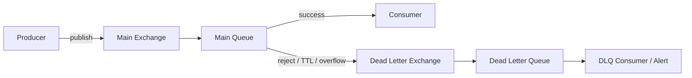
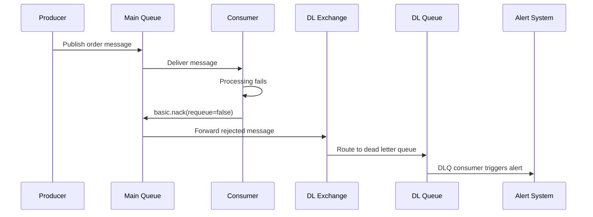
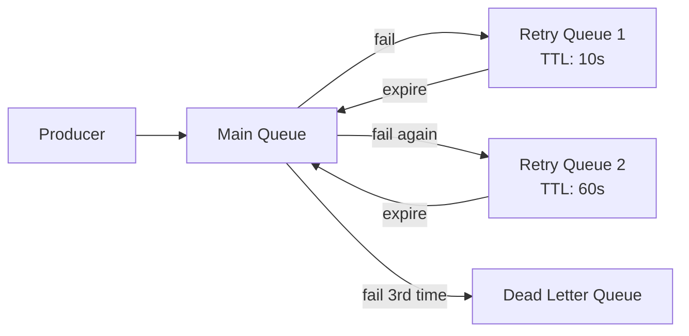

# How to Implement Dead Letter Queues in RabbitMQ

Author: [nawazdhandala](https://www.github.com/nawazdhandala)

Tags: RabbitMQ, Dead Letter Queue, Error Handling, Message Processing, Reliability

Description: Learn how to implement dead letter queues in RabbitMQ for handling failed messages and implementing retry patterns.

---

Not every message can be processed successfully on the first attempt. Dead letter queues (DLQs) give you a safety net for messages that fail, expire, or get rejected. Instead of losing these messages, RabbitMQ routes them to a separate queue where you can inspect, retry, or alert on them. This guide shows you how to implement DLQs and build retry patterns on top of them.

## What Is a Dead Letter Queue?

A dead letter queue is a queue that receives messages that could not be delivered or processed from another queue. In RabbitMQ, messages are "dead-lettered" when:

1. The consumer rejects the message with `basic.nack` or `basic.reject` and `requeue=false`
2. The message TTL (time-to-live) expires
3. The queue exceeds its maximum length



## Setting Up a Dead Letter Queue

```python
# setup_dlq.py
# Creates a main queue with a dead letter exchange and queue
import pika

credentials = pika.PlainCredentials("admin", "secretpassword")
connection = pika.BlockingConnection(
    pika.ConnectionParameters(host="localhost", credentials=credentials)
)
channel = connection.channel()

# Step 1: Declare the dead letter exchange
channel.exchange_declare(
    exchange="dlx.orders",
    exchange_type="direct",
    durable=True,
)

# Step 2: Declare the dead letter queue
channel.queue_declare(
    queue="orders.dead-letter",
    durable=True,
)

# Step 3: Bind the DLQ to the dead letter exchange
channel.queue_bind(
    queue="orders.dead-letter",
    exchange="dlx.orders",
    routing_key="orders.failed",
)

# Step 4: Declare the main exchange
channel.exchange_declare(
    exchange="orders",
    exchange_type="direct",
    durable=True,
)

# Step 5: Declare the main queue WITH dead letter configuration
channel.queue_declare(
    queue="orders.processing",
    durable=True,
    arguments={
        # Route rejected messages to the dead letter exchange
        "x-dead-letter-exchange": "dlx.orders",
        # Use this routing key when dead-lettering
        "x-dead-letter-routing-key": "orders.failed",
        # Optional: auto-expire messages after 30 minutes
        "x-message-ttl": 1800000,
    },
)

# Step 6: Bind the main queue
channel.queue_bind(
    queue="orders.processing",
    exchange="orders",
    routing_key="orders.new",
)

print("DLQ setup complete")
connection.close()
```

## Dead Letter Flow



## Consumer with Error Handling

```python
# consumer_with_dlq.py
# Consumer that sends failed messages to the dead letter queue
import pika
import json
import traceback

credentials = pika.PlainCredentials("admin", "secretpassword")
connection = pika.BlockingConnection(
    pika.ConnectionParameters(host="localhost", credentials=credentials)
)
channel = connection.channel()

channel.queue_declare(queue="orders.processing", durable=True)
channel.basic_qos(prefetch_count=1)

def process_order(ch, method, properties, body):
    """Process an order message. Reject to DLQ on failure."""
    try:
        order = json.loads(body)
        print(f"Processing order: {order['order_id']}")

        # Validate the order
        if "item" not in order:
            raise ValueError("Order missing required field: item")

        # Process the order (database write, API call, etc.)
        save_order(order)

        # Acknowledge successful processing
        ch.basic_ack(delivery_tag=method.delivery_tag)
        print(f"Order {order['order_id']} completed")

    except Exception as e:
        print(f"Failed to process order: {e}")
        traceback.print_exc()

        # Reject the message WITHOUT requeueing
        # This sends it to the dead letter exchange
        ch.basic_nack(
            delivery_tag=method.delivery_tag,
            requeue=False,  # Do not put it back on the main queue
        )

channel.basic_consume(
    queue="orders.processing",
    on_message_callback=process_order,
    auto_ack=False,
)

print("Consumer started. Waiting for messages...")
channel.start_consuming()
```

## Implementing a Retry Pattern

A more sophisticated approach uses multiple queues with increasing delays to retry messages before sending them to the final DLQ.



```python
# retry_setup.py
# Sets up a retry chain with exponential backoff
import pika

credentials = pika.PlainCredentials("admin", "secretpassword")
connection = pika.BlockingConnection(
    pika.ConnectionParameters(host="localhost", credentials=credentials)
)
channel = connection.channel()

# Main exchange and queue
channel.exchange_declare(exchange="tasks", exchange_type="direct", durable=True)

# Final dead letter queue (after all retries exhausted)
channel.exchange_declare(exchange="dlx.tasks", exchange_type="direct", durable=True)
channel.queue_declare(queue="tasks.dead-letter", durable=True)
channel.queue_bind(queue="tasks.dead-letter", exchange="dlx.tasks", routing_key="tasks.failed")

# Retry queues with increasing TTLs
# When the TTL expires, messages go back to the main exchange
retry_delays = [
    ("tasks.retry-1", 10000),    # 10 seconds
    ("tasks.retry-2", 60000),    # 1 minute
    ("tasks.retry-3", 300000),   # 5 minutes
]

for queue_name, ttl in retry_delays:
    channel.queue_declare(
        queue=queue_name,
        durable=True,
        arguments={
            # When TTL expires, route back to the main exchange
            "x-dead-letter-exchange": "tasks",
            "x-dead-letter-routing-key": "tasks.process",
            "x-message-ttl": ttl,
        },
    )

# Main processing queue
channel.queue_declare(
    queue="tasks.processing",
    durable=True,
    arguments={
        "x-dead-letter-exchange": "dlx.tasks",
        "x-dead-letter-routing-key": "tasks.failed",
    },
)
channel.queue_bind(queue="tasks.processing", exchange="tasks", routing_key="tasks.process")

print("Retry chain configured")
connection.close()
```

## Retry Consumer with Attempt Tracking

```python
# retry_consumer.py
# Consumer that tracks retry attempts using message headers
import pika
import json

credentials = pika.PlainCredentials("admin", "secretpassword")
connection = pika.BlockingConnection(
    pika.ConnectionParameters(host="localhost", credentials=credentials)
)
channel = connection.channel()

MAX_RETRIES = 3
RETRY_QUEUES = ["tasks.retry-1", "tasks.retry-2", "tasks.retry-3"]

def get_retry_count(properties):
    """Extract the current retry count from message headers."""
    headers = properties.headers or {}
    return headers.get("x-retry-count", 0)

def process_task(ch, method, properties, body):
    """Process a task with retry logic."""
    retry_count = get_retry_count(properties)
    task = json.loads(body)

    try:
        print(f"Processing task (attempt {retry_count + 1}): {task}")
        execute_task(task)
        ch.basic_ack(delivery_tag=method.delivery_tag)

    except Exception as e:
        print(f"Task failed (attempt {retry_count + 1}): {e}")

        if retry_count < MAX_RETRIES:
            # Publish to the appropriate retry queue
            retry_queue = RETRY_QUEUES[retry_count]
            updated_headers = dict(properties.headers or {})
            updated_headers["x-retry-count"] = retry_count + 1

            ch.basic_publish(
                exchange="",
                routing_key=retry_queue,
                body=body,
                properties=pika.BasicProperties(
                    delivery_mode=2,
                    headers=updated_headers,
                ),
            )
            ch.basic_ack(delivery_tag=method.delivery_tag)
            print(f"Queued for retry {retry_count + 1} in {retry_queue}")
        else:
            # All retries exhausted, reject to DLQ
            ch.basic_nack(delivery_tag=method.delivery_tag, requeue=False)
            print("All retries exhausted. Message sent to DLQ.")

channel.basic_qos(prefetch_count=1)
channel.basic_consume(
    queue="tasks.processing",
    on_message_callback=process_task,
    auto_ack=False,
)

print("Retry consumer started...")
channel.start_consuming()
```

## Monitoring the Dead Letter Queue

```python
# dlq_monitor.py
# Monitors the DLQ and sends alerts when messages arrive
import pika
import json
import requests

credentials = pika.PlainCredentials("admin", "secretpassword")
connection = pika.BlockingConnection(
    pika.ConnectionParameters(host="localhost", credentials=credentials)
)
channel = connection.channel()

def on_dead_letter(ch, method, properties, body):
    """Alert when a message lands in the DLQ."""
    message = json.loads(body)
    headers = properties.headers or {}

    alert_payload = {
        "summary": f"Message failed after {headers.get('x-retry-count', 0)} retries",
        "message_body": message,
        "original_exchange": headers.get("x-first-death-exchange", "unknown"),
        "reason": headers.get("x-first-death-reason", "unknown"),
    }

    print(f"ALERT: Dead letter received - {alert_payload['summary']}")

    # Acknowledge so we do not process the same alert twice
    ch.basic_ack(delivery_tag=method.delivery_tag)

channel.basic_consume(
    queue="tasks.dead-letter",
    on_message_callback=on_dead_letter,
    auto_ack=False,
)

print("DLQ monitor running...")
channel.start_consuming()
```

## Best Practices

| Practice | Why |
|----------|-----|
| Always set up a DLQ | Prevents silent message loss |
| Include original error in headers | Makes debugging easier |
| Use exponential backoff for retries | Avoids overwhelming failing services |
| Monitor DLQ depth | Catches systemic failures early |
| Set TTL on DLQ messages | Prevents unbounded growth |
| Log dead-lettered messages | Creates an audit trail |

## Alerting on Failed Messages with OneUptime

Dead letter queues catch failures, but someone needs to notice them. [OneUptime](https://oneuptime.com) can monitor your DLQ depth, alert your on-call team when messages start piling up, and track the incident from detection through resolution. Combine DLQ monitoring with application traces to quickly identify why messages are failing and fix the root cause.
