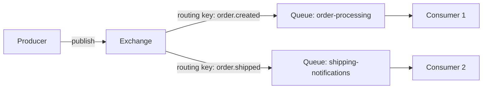
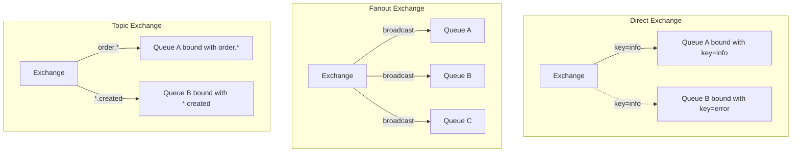
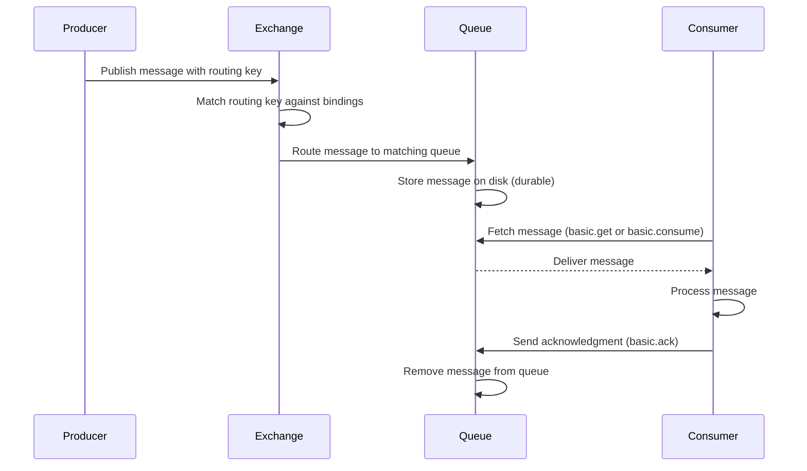

# How to Get Started with RabbitMQ for Message Queuing

Author: [nawazdhandala](https://www.github.com/nawazdhandala)

Tags: RabbitMQ, Message Queue, AMQP, Exchanges, Queues

Description: A beginner's guide to RabbitMQ covering exchanges, queues, bindings, and common messaging patterns.

---

RabbitMQ is one of the most widely deployed open-source message brokers. It supports multiple messaging protocols, with AMQP 0-9-1 being the most common. This guide covers the core concepts and walks you through publishing and consuming your first messages.

## What Is RabbitMQ?

RabbitMQ acts as an intermediary between producers (publishers) and consumers. Producers send messages to exchanges, exchanges route messages to queues based on rules called bindings, and consumers read from queues.

## Core Concepts



### Exchanges

An exchange receives messages from producers and routes them to queues. There are four exchange types:

- **Direct** - Routes messages to queues whose binding key exactly matches the routing key
- **Fanout** - Broadcasts messages to all bound queues (ignores routing key)
- **Topic** - Routes messages based on wildcard pattern matching
- **Headers** - Routes based on message header attributes

### Queues

Queues store messages until a consumer retrieves them. They are FIFO (First In, First Out) by default.

### Bindings

A binding is a link between an exchange and a queue. It can include a routing key or pattern that the exchange uses to decide which queues receive a message.

### Virtual Hosts

Virtual hosts provide logical grouping and separation of resources. Each vhost has its own set of exchanges, queues, and permissions.

## Exchange Types Explained



## Installing RabbitMQ

The fastest way to start is with Docker:

```bash
# Run RabbitMQ with the management UI enabled
docker run -d \
  --name rabbitmq \
  -p 5672:5672 \
  -p 15672:15672 \
  -e RABBITMQ_DEFAULT_USER=admin \
  -e RABBITMQ_DEFAULT_PASS=secretpassword \
  rabbitmq:3.13-management
```

Access the management UI at `http://localhost:15672` with the credentials above.

## Publishing Messages with Python

Install the client library:

```bash
pip install pika
```

Create a publisher:

```python
# publisher.py
# Publishes messages to a direct exchange
import pika
import json

# Establish a connection to RabbitMQ
credentials = pika.PlainCredentials("admin", "secretpassword")
connection = pika.BlockingConnection(
    pika.ConnectionParameters(
        host="localhost",
        port=5672,
        credentials=credentials,
    )
)
channel = connection.channel()

# Declare a direct exchange
channel.exchange_declare(
    exchange="orders",
    exchange_type="direct",
    durable=True,  # Survive broker restarts
)

# Declare a queue and bind it to the exchange
channel.queue_declare(queue="order-processing", durable=True)
channel.queue_bind(
    queue="order-processing",
    exchange="orders",
    routing_key="order.created",
)

# Publish a message
order = {"order_id": "ORD-001", "item": "Widget", "quantity": 5}
channel.basic_publish(
    exchange="orders",
    routing_key="order.created",
    body=json.dumps(order),
    properties=pika.BasicProperties(
        delivery_mode=2,       # Make the message persistent
        content_type="application/json",
    ),
)

print(f"Published order: {order['order_id']}")
connection.close()
```

## Consuming Messages with Python

```python
# consumer.py
# Consumes messages from the order-processing queue with manual acknowledgment
import pika
import json

credentials = pika.PlainCredentials("admin", "secretpassword")
connection = pika.BlockingConnection(
    pika.ConnectionParameters(
        host="localhost",
        port=5672,
        credentials=credentials,
    )
)
channel = connection.channel()

# Ensure the queue exists (idempotent operation)
channel.queue_declare(queue="order-processing", durable=True)

# Set prefetch count to 1 so each consumer gets one message at a time
# This ensures fair distribution across multiple consumers
channel.basic_qos(prefetch_count=1)

def process_order(ch, method, properties, body):
    """Callback function that processes each message."""
    order = json.loads(body)
    print(f"Processing order: {order['order_id']}")

    # Simulate order processing
    save_to_database(order)

    # Acknowledge the message after successful processing
    # If we crash before this, RabbitMQ will redeliver the message
    ch.basic_ack(delivery_tag=method.delivery_tag)
    print(f"Order {order['order_id']} processed successfully")

# Start consuming
channel.basic_consume(
    queue="order-processing",
    on_message_callback=process_order,
    auto_ack=False,  # Manual acknowledgment for reliability
)

print("Waiting for orders. Press Ctrl+C to exit.")
channel.start_consuming()
```

## Using Topic Exchanges for Flexible Routing

```python
# topic_publisher.py
# Demonstrates topic exchange with wildcard routing
import pika
import json

credentials = pika.PlainCredentials("admin", "secretpassword")
connection = pika.BlockingConnection(
    pika.ConnectionParameters(host="localhost", credentials=credentials)
)
channel = connection.channel()

# Declare a topic exchange
channel.exchange_declare(exchange="events", exchange_type="topic", durable=True)

# Bind queues with patterns
# "*" matches exactly one word, "#" matches zero or more words
channel.queue_declare(queue="all-orders", durable=True)
channel.queue_bind(queue="all-orders", exchange="events", routing_key="order.*")

channel.queue_declare(queue="all-created", durable=True)
channel.queue_bind(queue="all-created", exchange="events", routing_key="*.created")

# This message matches both queues
channel.basic_publish(
    exchange="events",
    routing_key="order.created",
    body=json.dumps({"event": "new order"}),
)

# This message matches only the all-orders queue
channel.basic_publish(
    exchange="events",
    routing_key="order.shipped",
    body=json.dumps({"event": "order shipped"}),
)

connection.close()
```

## Message Flow



## Key Configuration Tips

| Setting | Purpose | Recommendation |
|---------|---------|---------------|
| `durable: true` | Queue survives restarts | Always for production |
| `delivery_mode: 2` | Message persisted to disk | Use for important messages |
| `prefetch_count` | Messages per consumer | 1 for fair dispatch |
| `auto_ack: false` | Manual acknowledgment | Always for reliability |
| `x-message-ttl` | Message expiration | Set based on use case |

## Monitoring Your RabbitMQ Infrastructure

RabbitMQ's management UI is useful for debugging, but production systems need automated alerting. [OneUptime](https://oneuptime.com) can monitor your RabbitMQ nodes, track queue depths, alert on connection spikes, and integrate with your incident management workflow. Pair it with OpenTelemetry to trace messages from producer through consumer and pinpoint exactly where bottlenecks occur.
