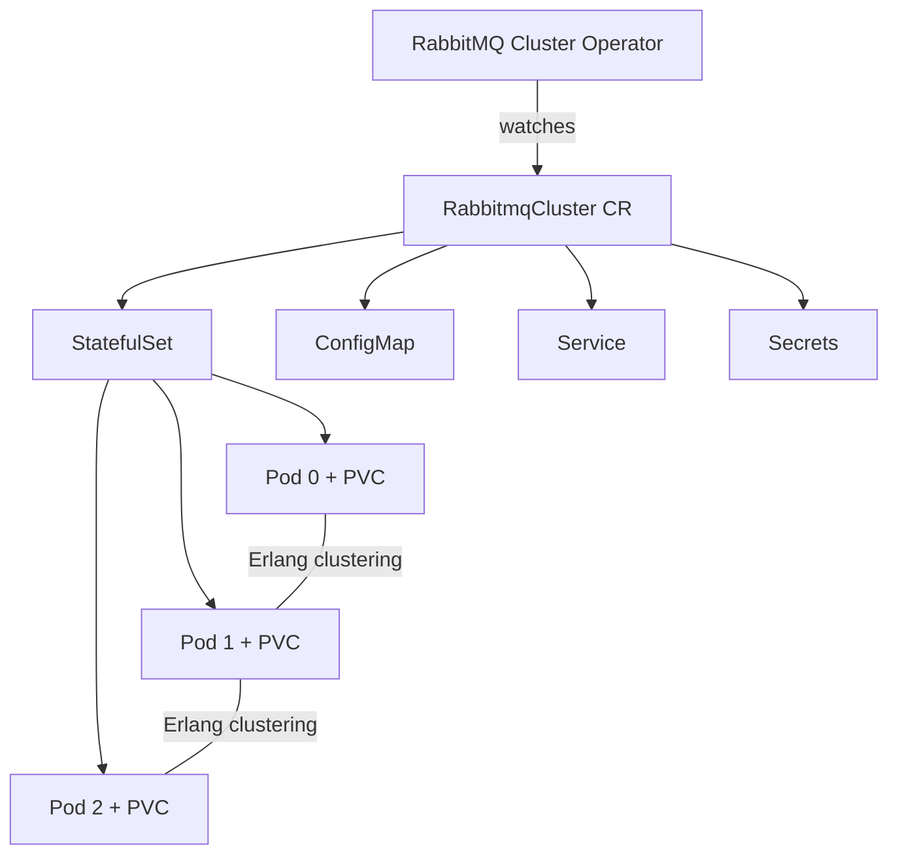
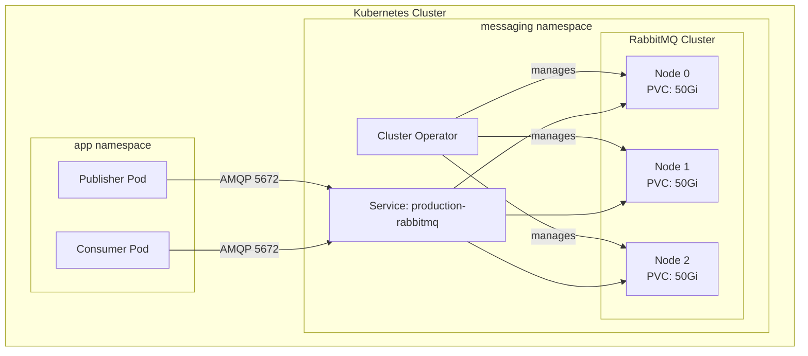

# How to Deploy RabbitMQ on Kubernetes with the Cluster Operator

Author: [nawazdhandala](https://www.github.com/nawazdhandala)

Tags: RabbitMQ, Kubernetes, Operator, StatefulSet, Deployment

Description: Learn how to deploy and manage RabbitMQ clusters on Kubernetes using the RabbitMQ Cluster Operator.

---

Running RabbitMQ on Kubernetes gives you automated scaling, self-healing, and declarative configuration. The RabbitMQ Cluster Operator is the official way to deploy and manage RabbitMQ clusters as native Kubernetes resources. This guide walks through a production-grade setup.

## Why Use the Cluster Operator?

Manually deploying RabbitMQ on Kubernetes means configuring StatefulSets, persistent volumes, service discovery, Erlang clustering, and TLS certificates by hand. The Cluster Operator handles all of this through a single Custom Resource Definition.



## Prerequisites

- Kubernetes cluster v1.25 or later
- `kubectl` configured for your cluster
- A StorageClass with dynamic provisioning
- At least 3 worker nodes for high availability

## Step 1: Install the Operator

```bash
# Install the RabbitMQ Cluster Operator
kubectl apply -f https://github.com/rabbitmq/cluster-operator/releases/latest/download/cluster-operator.yml

# Verify the operator is running
kubectl get pods -n rabbitmq-system
```

## Step 2: Deploy a RabbitMQ Cluster

```yaml
# rabbitmq-cluster.yaml
# Deploys a 3-node RabbitMQ cluster with persistence and management plugin
apiVersion: rabbitmq.com/v1beta1
kind: RabbitmqCluster
metadata:
  name: production-rabbitmq
  namespace: messaging
spec:
  # Run 3 replicas for high availability
  replicas: 3
  image: rabbitmq:3.13-management
  resources:
    requests:
      cpu: 500m
      memory: 1Gi
    limits:
      cpu: "2"
      memory: 2Gi
  persistence:
    storageClassName: standard
    storage: 50Gi
  rabbitmq:
    # Additional RabbitMQ configuration
    additionalConfig: |
      # Set default queue type to quorum for high availability
      default_queue_type = quorum
      # Enable consumer timeout to detect stuck consumers
      consumer_timeout = 900000
      # Limit total memory usage to 80% of the container limit
      vm_memory_high_watermark.relative = 0.8
      # Set disk free limit
      disk_free_limit.absolute = 2GB
    # Enable useful plugins
    additionalPlugins:
      - rabbitmq_shovel
      - rabbitmq_shovel_management
      - rabbitmq_prometheus
  # TLS configuration
  tls:
    secretName: rabbitmq-tls-secret
```

Apply the cluster definition:

```bash
# Create the namespace first
kubectl create namespace messaging

# Deploy the cluster
kubectl apply -f rabbitmq-cluster.yaml

# Watch the pods come up
kubectl get pods -n messaging -w
```

## Step 3: Access the Management UI

```bash
# Get the default admin credentials
kubectl get secret production-rabbitmq-default-user -n messaging \
  -o jsonpath='{.data.username}' | base64 --decode && echo
kubectl get secret production-rabbitmq-default-user -n messaging \
  -o jsonpath='{.data.password}' | base64 --decode && echo

# Port-forward the management UI
kubectl port-forward svc/production-rabbitmq -n messaging 15672:15672
```

## Cluster Architecture



## Step 4: Configure Policies with Kubernetes

```yaml
# rabbitmq-policy.yaml
# Define a policy for high-availability queues
apiVersion: rabbitmq.com/v1beta1
kind: Policy
metadata:
  name: ha-queues
  namespace: messaging
spec:
  name: ha-queues
  vhost: "/"
  # Apply to all queues matching the pattern
  pattern: ".*"
  applyTo: "queues"
  definition:
    # Mirror queues across all nodes
    ha-mode: all
    ha-sync-mode: automatic
  rabbitmqClusterReference:
    name: production-rabbitmq
```

## Step 5: Create Users and Permissions

```yaml
# rabbitmq-user.yaml
# Create an application-specific user
apiVersion: rabbitmq.com/v1beta1
kind: User
metadata:
  name: app-user
  namespace: messaging
spec:
  rabbitmqClusterReference:
    name: production-rabbitmq
  importCredentialsSecret:
    name: app-user-credentials
---
# rabbitmq-permission.yaml
# Grant permissions to the user
apiVersion: rabbitmq.com/v1beta1
kind: Permission
metadata:
  name: app-user-permission
  namespace: messaging
spec:
  vhost: "/"
  userReference:
    name: app-user
  permissions:
    configure: "^app\\."
    write: "^app\\."
    read: "^app\\."
  rabbitmqClusterReference:
    name: production-rabbitmq
```

## Step 6: Connect from an Application

```python
# app.py
# Connect to RabbitMQ running inside Kubernetes
import pika
import os

# Read credentials from environment variables (injected from the secret)
username = os.environ.get("RABBITMQ_USERNAME", "guest")
password = os.environ.get("RABBITMQ_PASSWORD", "guest")

# Use the Kubernetes service DNS name
credentials = pika.PlainCredentials(username, password)
connection = pika.BlockingConnection(
    pika.ConnectionParameters(
        # Service DNS name: <cluster-name>.<namespace>.svc.cluster.local
        host="production-rabbitmq.messaging.svc.cluster.local",
        port=5672,
        credentials=credentials,
        # Enable heartbeats to detect broken connections
        heartbeat=60,
        # Set connection timeout
        blocked_connection_timeout=300,
    )
)

channel = connection.channel()

# Declare a quorum queue for high availability
channel.queue_declare(
    queue="app.tasks",
    durable=True,
    arguments={
        "x-queue-type": "quorum",  # Replicated across nodes
    },
)

print("Connected to RabbitMQ cluster successfully")
connection.close()
```

## Step 7: Enable Prometheus Monitoring

```yaml
# rabbitmq-monitor.yaml
# ServiceMonitor for Prometheus to scrape RabbitMQ metrics
apiVersion: monitoring.coreos.com/v1
kind: ServiceMonitor
metadata:
  name: rabbitmq-metrics
  namespace: messaging
spec:
  selector:
    matchLabels:
      app.kubernetes.io/component: rabbitmq
  endpoints:
    - port: prometheus
      interval: 15s
      path: /metrics
```

## Scaling the Cluster

```bash
# Scale from 3 to 5 nodes
kubectl patch rabbitmqcluster production-rabbitmq -n messaging \
  --type merge -p '{"spec":{"replicas":5}}'

# The operator handles Erlang clustering and queue rebalancing
kubectl get pods -n messaging -w
```

## Production Checklist

| Item | Recommendation |
|------|---------------|
| Replicas | Minimum 3 for quorum queues |
| Storage | SSD-backed persistent volumes |
| Queue type | Quorum queues for durability |
| Memory limit | Set vm_memory_high_watermark |
| Disk limit | Set disk_free_limit |
| TLS | Enable for all connections |
| Network policy | Restrict access to the messaging namespace |
| Pod disruption budget | Configured automatically by the operator |

## Monitoring RabbitMQ on Kubernetes

Running RabbitMQ in Kubernetes adds infrastructure complexity. [OneUptime](https://oneuptime.com) monitors both the Kubernetes layer and the RabbitMQ nodes, giving you alerts on queue buildup, memory pressure, and pod restarts. Combined with incident management and status pages, it keeps your team informed and your messaging infrastructure healthy.
