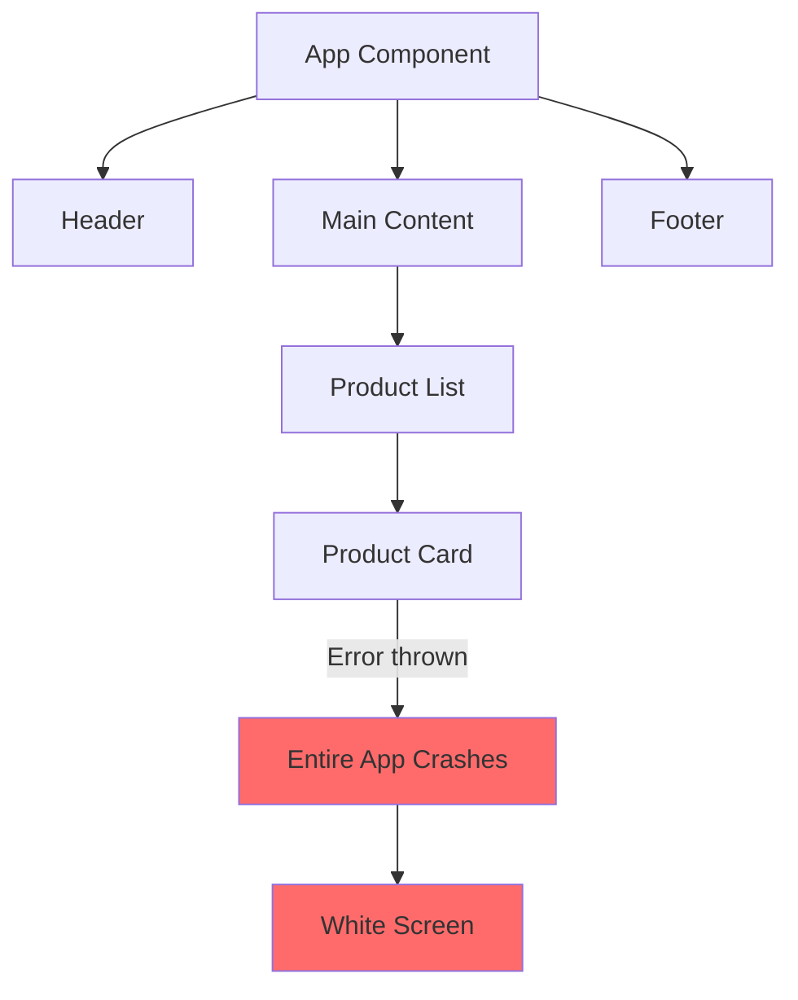
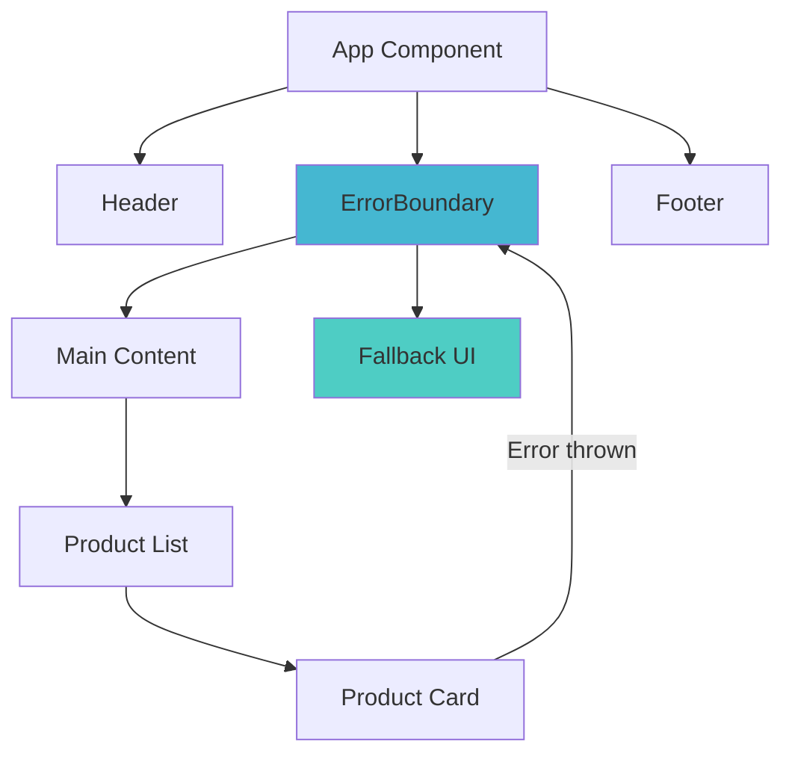
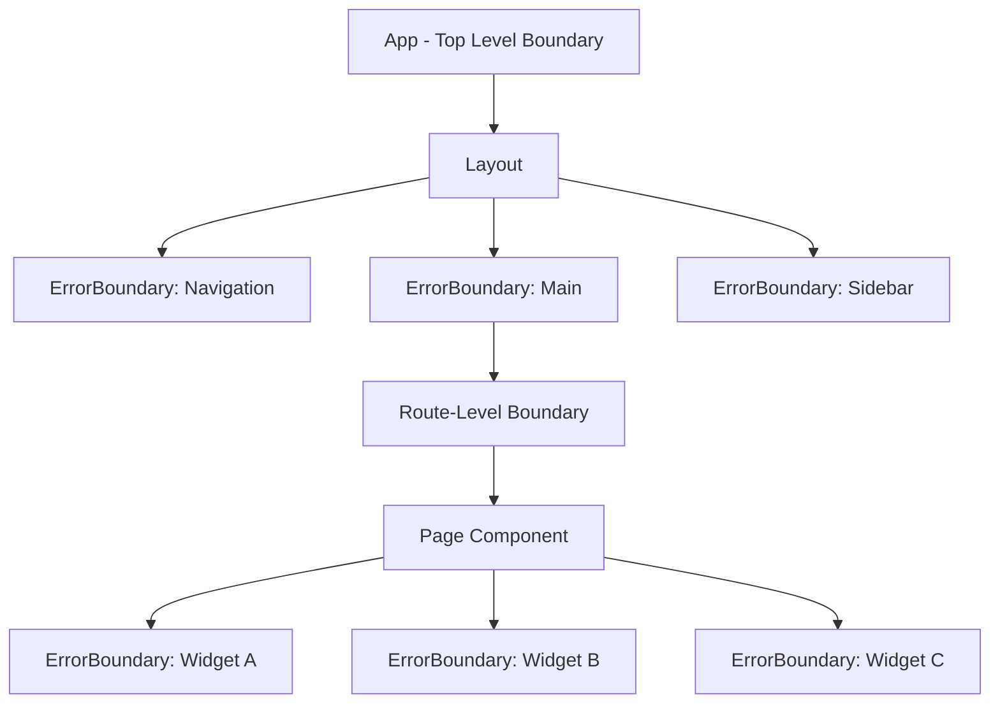

# How to Implement React Error Boundaries for Resilient UIs

Author: [nawazdhandala](https://www.github.com/nawazdhandala)

Tags: React, Error Boundaries, Error Handling, UI, Frontend

Description: Learn how to implement React error boundaries to gracefully handle component errors and prevent full-page crashes.

---

A single JavaScript error in one component should not crash your entire application. React error boundaries let you catch rendering errors in a component tree, display a fallback UI, and report the error for debugging. In this guide, we will build production-ready error boundaries with logging, recovery, and user-friendly fallbacks.

## What Happens Without Error Boundaries



Without error boundaries, an error in any component unmounts the entire React tree.

## What Happens With Error Boundaries



With an error boundary, only the affected subtree shows a fallback. The rest of the app keeps working.

## Building a Basic Error Boundary

Error boundaries must be class components because they rely on lifecycle methods that hooks do not support:

```tsx
// src/components/ErrorBoundary.tsx
import React, { Component, ErrorInfo, ReactNode } from 'react';

// Define the props interface
interface ErrorBoundaryProps {
  children: ReactNode;
  // Optional custom fallback UI
  fallback?: ReactNode;
  // Optional callback when an error is caught
  onError?: (error: Error, errorInfo: ErrorInfo) => void;
}

// Define the state interface
interface ErrorBoundaryState {
  hasError: boolean;
  error: Error | null;
}

class ErrorBoundary extends Component<ErrorBoundaryProps, ErrorBoundaryState> {
  constructor(props: ErrorBoundaryProps) {
    super(props);
    // Initialize state with no error
    this.state = {
      hasError: false,
      error: null,
    };
  }

  /**
   * Called when a descendant component throws an error.
   * Updates state so the next render shows the fallback UI.
   * This is a static lifecycle method - it cannot access `this`.
   */
  static getDerivedStateFromError(error: Error): ErrorBoundaryState {
    return {
      hasError: true,
      error,
    };
  }

  /**
   * Called after an error is caught.
   * Use this for side effects like logging.
   */
  componentDidCatch(error: Error, errorInfo: ErrorInfo): void {
    // Log the error details for debugging
    console.error('ErrorBoundary caught an error:', error);
    console.error('Component stack:', errorInfo.componentStack);

    // Call the optional onError callback
    if (this.props.onError) {
      this.props.onError(error, errorInfo);
    }
  }

  /**
   * Reset the error state to allow retrying.
   */
  handleReset = (): void => {
    this.setState({
      hasError: false,
      error: null,
    });
  };

  render(): ReactNode {
    if (this.state.hasError) {
      // If a custom fallback was provided, render it
      if (this.props.fallback) {
        return this.props.fallback;
      }

      // Default fallback UI
      return (
        <div role="alert" style={styles.container}>
          <h2 style={styles.title}>Something went wrong</h2>
          <p style={styles.message}>
            We are sorry for the inconvenience. Please try again.
          </p>
          <button onClick={this.handleReset} style={styles.button}>
            Try Again
          </button>
        </div>
      );
    }

    // No error - render children normally
    return this.props.children;
  }
}

// Inline styles for the fallback UI
const styles = {
  container: {
    padding: '2rem',
    textAlign: 'center' as const,
    backgroundColor: '#fff3f3',
    borderRadius: '8px',
    border: '1px solid #ffcdd2',
    margin: '1rem',
  },
  title: {
    color: '#c62828',
    marginBottom: '0.5rem',
  },
  message: {
    color: '#555',
    marginBottom: '1rem',
  },
  button: {
    padding: '0.5rem 1.5rem',
    backgroundColor: '#1976d2',
    color: 'white',
    border: 'none',
    borderRadius: '4px',
    cursor: 'pointer',
    fontSize: '1rem',
  },
};

export default ErrorBoundary;
```

## Using the Error Boundary

Wrap sections of your app that should fail independently:

```tsx
// src/App.tsx
import React from 'react';
import ErrorBoundary from './components/ErrorBoundary';
import Header from './components/Header';
import ProductList from './components/ProductList';
import Sidebar from './components/Sidebar';
import Footer from './components/Footer';

function App() {
  return (
    <div className="app">
      {/* Header is critical - wrap it separately */}
      <ErrorBoundary fallback={<div>Navigation unavailable</div>}>
        <Header />
      </ErrorBoundary>

      <main className="content">
        {/* Sidebar errors should not break the main content */}
        <ErrorBoundary fallback={<div>Sidebar unavailable</div>}>
          <Sidebar />
        </ErrorBoundary>

        {/* Main content area with retry capability */}
        <ErrorBoundary>
          <ProductList />
        </ErrorBoundary>
      </main>

      <ErrorBoundary fallback={<div>Footer unavailable</div>}>
        <Footer />
      </ErrorBoundary>
    </div>
  );
}

export default App;
```

## Advanced Error Boundary with Logging

Build a production-ready error boundary that reports errors to your monitoring service:

```tsx
// src/components/MonitoredErrorBoundary.tsx
import React, { Component, ErrorInfo, ReactNode } from 'react';

interface Props {
  children: ReactNode;
  // Identifier for where this boundary is placed
  boundaryName: string;
  // Custom fallback component that receives error details
  FallbackComponent?: React.ComponentType<FallbackProps>;
}

// Props passed to the fallback component
interface FallbackProps {
  error: Error;
  resetError: () => void;
  boundaryName: string;
}

interface State {
  hasError: boolean;
  error: Error | null;
  errorCount: number;
}

class MonitoredErrorBoundary extends Component<Props, State> {
  constructor(props: Props) {
    super(props);
    this.state = {
      hasError: false,
      error: null,
      errorCount: 0,
    };
  }

  static getDerivedStateFromError(error: Error): Partial<State> {
    return { hasError: true, error };
  }

  componentDidCatch(error: Error, errorInfo: ErrorInfo): void {
    // Increment the error count
    this.setState((prev) => ({ errorCount: prev.errorCount + 1 }));

    // Build the error report payload
    const errorReport = {
      boundary: this.props.boundaryName,
      error: {
        name: error.name,
        message: error.message,
        stack: error.stack,
      },
      componentStack: errorInfo.componentStack,
      timestamp: new Date().toISOString(),
      url: window.location.href,
      userAgent: navigator.userAgent,
    };

    // Send error report to your monitoring service
    this.reportError(errorReport);
  }

  /**
   * Send the error to a monitoring endpoint.
   * In production, this would go to OneUptime or a similar service.
   */
  private reportError(errorReport: Record<string, unknown>): void {
    fetch('/api/errors', {
      method: 'POST',
      headers: { 'Content-Type': 'application/json' },
      body: JSON.stringify(errorReport),
    }).catch((reportingError) => {
      // If error reporting itself fails, log to console
      console.error('Failed to report error:', reportingError);
    });
  }

  /**
   * Reset the boundary to try rendering children again.
   * If errors keep recurring, show a permanent failure message.
   */
  handleReset = (): void => {
    if (this.state.errorCount >= 3) {
      // Too many errors - do not allow further retries
      return;
    }
    this.setState({ hasError: false, error: null });
  };

  render(): ReactNode {
    if (this.state.hasError && this.state.error) {
      // If too many errors occurred, show a permanent failure message
      if (this.state.errorCount >= 3) {
        return (
          <div role="alert" style={{ padding: '1rem', textAlign: 'center' }}>
            <p>This section is temporarily unavailable. Please refresh the page.</p>
          </div>
        );
      }

      // Use the custom fallback component if provided
      if (this.props.FallbackComponent) {
        const { FallbackComponent } = this.props;
        return (
          <FallbackComponent
            error={this.state.error}
            resetError={this.handleReset}
            boundaryName={this.props.boundaryName}
          />
        );
      }

      // Default fallback
      return (
        <div role="alert" style={{ padding: '1rem', textAlign: 'center' }}>
          <h3>Something went wrong in {this.props.boundaryName}</h3>
          <button onClick={this.handleReset}>Try Again</button>
        </div>
      );
    }

    return this.props.children;
  }
}

export default MonitoredErrorBoundary;
```

## Custom Fallback Components

Create reusable fallback UIs for different scenarios:

```tsx
// src/components/fallbacks/DetailedErrorFallback.tsx
import React from 'react';

interface Props {
  error: Error;
  resetError: () => void;
  boundaryName: string;
}

/**
 * A detailed error fallback that shows the error message
 * in development and a user-friendly message in production.
 */
const DetailedErrorFallback: React.FC<Props> = ({
  error,
  resetError,
  boundaryName,
}) => {
  const isDev = process.env.NODE_ENV === 'development';

  return (
    <div role="alert" className="error-fallback">
      <div className="error-fallback__icon">
        <svg width="48" height="48" viewBox="0 0 24 24" fill="none">
          <circle cx="12" cy="12" r="10" stroke="#e53935" strokeWidth="2" />
          <line x1="12" y1="8" x2="12" y2="13" stroke="#e53935" strokeWidth="2" />
          <circle cx="12" cy="16" r="1" fill="#e53935" />
        </svg>
      </div>

      <h3>Unable to load {boundaryName}</h3>
      <p>We encountered an unexpected error. Please try again.</p>

      {/* Show error details only in development */}
      {isDev && (
        <details style={{ marginTop: '1rem', textAlign: 'left' }}>
          <summary>Error Details</summary>
          <pre style={{ overflow: 'auto', padding: '0.5rem' }}>
            {error.message}
            {'\n\n'}
            {error.stack}
          </pre>
        </details>
      )}

      <button onClick={resetError} className="error-fallback__button">
        Try Again
      </button>
    </div>
  );
};

export default DetailedErrorFallback;
```

## Error Boundary Placement Strategy



Place boundaries at these levels:

1. **Top level** - catches any uncaught error as a last resort
2. **Layout sections** - isolates header, sidebar, and footer
3. **Route level** - each page gets its own boundary
4. **Widget level** - independent widgets fail independently

## Handling Async Errors

Error boundaries do not catch errors in event handlers or async code. Handle those separately:

```tsx
// src/hooks/useAsyncError.ts
import { useState, useCallback } from 'react';

/**
 * Hook to throw async errors into the nearest error boundary.
 * Error boundaries only catch errors during rendering.
 * This hook bridges async errors into the render cycle.
 */
function useAsyncError() {
  const [, setError] = useState();

  // Wrap the error in a state update so React catches it during rendering
  const throwError = useCallback((error: Error) => {
    setError(() => {
      throw error;
    });
  }, []);

  return throwError;
}

export default useAsyncError;
```

```tsx
// src/components/DataLoader.tsx
import React, { useEffect, useState } from 'react';
import useAsyncError from '../hooks/useAsyncError';

function DataLoader() {
  const [data, setData] = useState(null);
  const throwError = useAsyncError();

  useEffect(() => {
    fetch('/api/data')
      .then((res) => {
        if (!res.ok) {
          throw new Error(`HTTP ${res.status}: ${res.statusText}`);
        }
        return res.json();
      })
      .then(setData)
      .catch((error) => {
        // This throws the error into the error boundary
        throwError(error);
      });
  }, [throwError]);

  if (!data) return <div>Loading...</div>;
  return <div>{JSON.stringify(data)}</div>;
}

export default DataLoader;
```

## Summary

Error boundaries are essential for building resilient React applications:

- They prevent a single component error from crashing the entire UI
- Place them strategically at layout, route, and widget levels
- Use custom fallback components for a polished user experience
- Bridge async errors into boundaries using a state-based hook
- Report errors to your monitoring service for debugging

For complete frontend error monitoring, [OneUptime](https://oneuptime.com) captures client-side errors, tracks error rates, and alerts your team when issues spike - giving you full visibility into the health of your React application in production.
