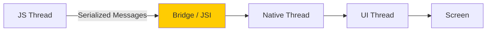
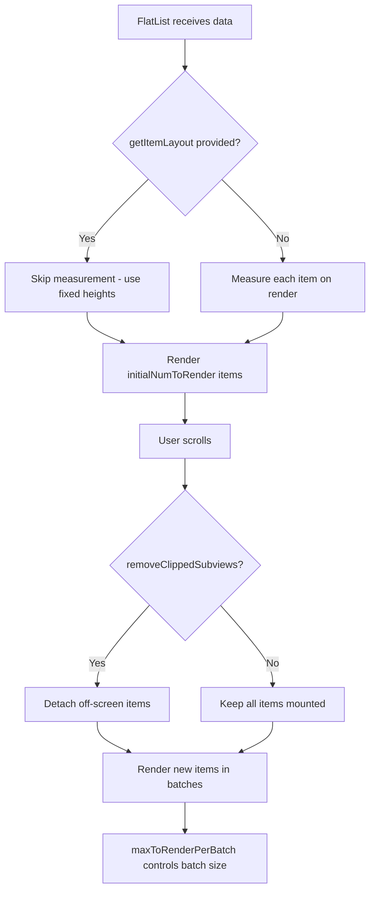
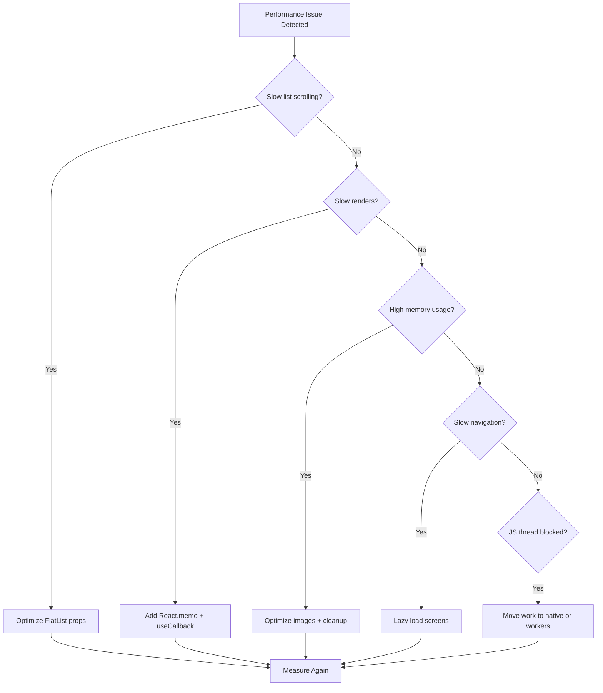

# How to Optimize React Native App Performance

Author: [nawazdhandala](https://www.github.com/nawazdhandala)

Tags: React Native, Performance, Mobile, Optimization, Rendering

Description: Learn techniques for optimizing React Native app performance including list rendering, image optimization, and native modules.

---

React Native lets you build mobile apps with JavaScript, but performance requires careful attention. Unlike the web, mobile devices have limited CPU, memory, and battery. Slow renders, heavy images, and inefficient lists can make your app feel sluggish. In this guide, we will cover the most impactful techniques for optimizing React Native app performance.

## React Native Architecture

Understanding the architecture helps you identify where bottlenecks occur.



Performance issues often come from too many messages crossing the bridge, heavy work on the JS thread, or layout thrashing on the UI thread.

## Optimizing FlatList Rendering

`FlatList` is the most common performance bottleneck. Here is how to optimize it:

```tsx
// src/components/OptimizedProductList.tsx
import React, { useCallback, useMemo } from 'react';
import { FlatList, View, Text, Image, StyleSheet } from 'react-native';

interface Product {
  id: string;
  name: string;
  price: number;
  imageUrl: string;
  category: string;
}

interface Props {
  products: Product[];
}

/**
 * Memoized list item component.
 * React.memo prevents re-rendering when the item data has not changed.
 */
const ProductItem = React.memo<{ item: Product }>(({ item }) => {
  return (
    <View style={styles.card}>
      <Image
        source={{ uri: item.imageUrl }}
        style={styles.image}
        // Use resize mode to avoid unnecessary scaling work
        resizeMode="cover"
      />
      <View style={styles.info}>
        <Text style={styles.name}>{item.name}</Text>
        <Text style={styles.price}>${(item.price / 100).toFixed(2)}</Text>
      </View>
    </View>
  );
});

ProductItem.displayName = 'ProductItem';

const OptimizedProductList: React.FC<Props> = ({ products }) => {
  /**
   * keyExtractor must return a unique string for each item.
   * useCallback ensures the function reference is stable.
   */
  const keyExtractor = useCallback((item: Product) => item.id, []);

  /**
   * renderItem is wrapped in useCallback to prevent
   * FlatList from re-rendering all visible items
   * when the parent re-renders.
   */
  const renderItem = useCallback(({ item }: { item: Product }) => {
    return <ProductItem item={item} />;
  }, []);

  /**
   * getItemLayout tells FlatList the exact size of each item.
   * This skips the measurement step and enables faster scrolling.
   * Only use this when all items have the same height.
   */
  const getItemLayout = useCallback(
    (_data: Product[] | null | undefined, index: number) => ({
      length: ITEM_HEIGHT,
      offset: ITEM_HEIGHT * index,
      index,
    }),
    []
  );

  return (
    <FlatList
      data={products}
      keyExtractor={keyExtractor}
      renderItem={renderItem}
      getItemLayout={getItemLayout}
      // Render 5 items beyond the visible area for smooth scrolling
      windowSize={5}
      // Maximum items to render in one batch
      maxToRenderPerBatch={10}
      // Number of items rendered on first mount
      initialNumToRender={10}
      // Time between rendering off-screen items (in ms)
      updateCellsBatchingPeriod={50}
      // Remove items far from the viewport from the component tree
      removeClippedSubviews={true}
    />
  );
};

const ITEM_HEIGHT = 120;

const styles = StyleSheet.create({
  card: {
    flexDirection: 'row',
    height: ITEM_HEIGHT,
    padding: 12,
    borderBottomWidth: 1,
    borderBottomColor: '#eee',
  },
  image: {
    width: 96,
    height: 96,
    borderRadius: 8,
  },
  info: {
    flex: 1,
    marginLeft: 12,
    justifyContent: 'center',
  },
  name: {
    fontSize: 16,
    fontWeight: '600',
  },
  price: {
    fontSize: 14,
    color: '#666',
    marginTop: 4,
  },
});

export default OptimizedProductList;
```

## FlatList Optimization Flow



## Image Optimization

Images are often the largest resource in a mobile app. Optimize them aggressively:

```tsx
// src/components/OptimizedImage.tsx
import React, { useState } from 'react';
import { View, Image, ActivityIndicator, StyleSheet } from 'react-native';

interface OptimizedImageProps {
  uri: string;
  width: number;
  height: number;
  // Use a smaller placeholder while the full image loads
  placeholderColor?: string;
}

/**
 * Image component with loading state and caching.
 * Shows a placeholder while the image is being fetched.
 */
const OptimizedImage: React.FC<OptimizedImageProps> = React.memo(
  ({ uri, width, height, placeholderColor = '#e0e0e0' }) => {
    const [loading, setLoading] = useState(true);
    const [error, setError] = useState(false);

    return (
      <View style={[styles.container, { width, height }]}>
        {/* Show placeholder while loading */}
        {loading && (
          <View
            style={[
              styles.placeholder,
              { backgroundColor: placeholderColor, width, height },
            ]}
          >
            <ActivityIndicator size="small" color="#999" />
          </View>
        )}

        {!error && (
          <Image
            source={{
              uri,
              // Request the exact size needed to avoid loading oversized images
              width,
              height,
              // Enable caching
              cache: 'force-cache',
            }}
            style={{ width, height }}
            resizeMode="cover"
            onLoadEnd={() => setLoading(false)}
            onError={() => {
              setLoading(false);
              setError(true);
            }}
            // Lower quality for thumbnails
            progressiveRenderingEnabled={true}
          />
        )}

        {error && (
          <View style={[styles.placeholder, { width, height }]}>
            <Text style={styles.errorText}>Failed to load</Text>
          </View>
        )}
      </View>
    );
  }
);

OptimizedImage.displayName = 'OptimizedImage';

const styles = StyleSheet.create({
  container: {
    overflow: 'hidden',
    borderRadius: 8,
  },
  placeholder: {
    position: 'absolute',
    justifyContent: 'center',
    alignItems: 'center',
  },
  errorText: {
    color: '#999',
    fontSize: 12,
  },
});

export default OptimizedImage;
```

## Avoiding Unnecessary Re-renders

Use `useMemo` and `useCallback` strategically:

```tsx
// src/screens/DashboardScreen.tsx
import React, { useState, useMemo, useCallback } from 'react';
import { View, Text, TouchableOpacity, StyleSheet } from 'react-native';

interface DashboardProps {
  transactions: Transaction[];
}

const DashboardScreen: React.FC<DashboardProps> = ({ transactions }) => {
  const [selectedPeriod, setSelectedPeriod] = useState<'day' | 'week' | 'month'>('week');

  /**
   * Memoize expensive statistics calculation.
   * Only recomputes when transactions or selectedPeriod changes.
   */
  const stats = useMemo(() => {
    const now = new Date();
    const filtered = transactions.filter((t) => {
      const diff = now.getTime() - new Date(t.date).getTime();
      const days = diff / (1000 * 60 * 60 * 24);
      switch (selectedPeriod) {
        case 'day': return days <= 1;
        case 'week': return days <= 7;
        case 'month': return days <= 30;
      }
    });

    return {
      count: filtered.length,
      total: filtered.reduce((sum, t) => sum + t.amount, 0),
      average: filtered.length > 0
        ? filtered.reduce((sum, t) => sum + t.amount, 0) / filtered.length
        : 0,
    };
  }, [transactions, selectedPeriod]);

  /**
   * Stable callback references for period buttons.
   * Without useCallback, these create new functions every render,
   * causing the memoized buttons to re-render.
   */
  const selectDay = useCallback(() => setSelectedPeriod('day'), []);
  const selectWeek = useCallback(() => setSelectedPeriod('week'), []);
  const selectMonth = useCallback(() => setSelectedPeriod('month'), []);

  return (
    <View style={styles.container}>
      <View style={styles.periodSelector}>
        <PeriodButton label="Day" active={selectedPeriod === 'day'} onPress={selectDay} />
        <PeriodButton label="Week" active={selectedPeriod === 'week'} onPress={selectWeek} />
        <PeriodButton label="Month" active={selectedPeriod === 'month'} onPress={selectMonth} />
      </View>

      <View style={styles.statsGrid}>
        <StatCard label="Transactions" value={stats.count.toString()} />
        <StatCard label="Total" value={`$${(stats.total / 100).toFixed(2)}`} />
        <StatCard label="Average" value={`$${(stats.average / 100).toFixed(2)}`} />
      </View>
    </View>
  );
};

/**
 * Memoized button component.
 * Only re-renders when active state or onPress changes.
 */
const PeriodButton = React.memo<{
  label: string;
  active: boolean;
  onPress: () => void;
}>(({ label, active, onPress }) => (
  <TouchableOpacity
    onPress={onPress}
    style={[styles.periodButton, active && styles.periodButtonActive]}
  >
    <Text style={[styles.periodText, active && styles.periodTextActive]}>
      {label}
    </Text>
  </TouchableOpacity>
));

PeriodButton.displayName = 'PeriodButton';

const StatCard = React.memo<{ label: string; value: string }>(({ label, value }) => (
  <View style={styles.statCard}>
    <Text style={styles.statValue}>{value}</Text>
    <Text style={styles.statLabel}>{label}</Text>
  </View>
));

StatCard.displayName = 'StatCard';

const styles = StyleSheet.create({
  container: { flex: 1, padding: 16 },
  periodSelector: { flexDirection: 'row', marginBottom: 16, gap: 8 },
  periodButton: { paddingVertical: 8, paddingHorizontal: 16, borderRadius: 20, backgroundColor: '#f0f0f0' },
  periodButtonActive: { backgroundColor: '#1976d2' },
  periodText: { color: '#333' },
  periodTextActive: { color: '#fff' },
  statsGrid: { flexDirection: 'row', gap: 12 },
  statCard: { flex: 1, padding: 16, backgroundColor: '#f8f9fa', borderRadius: 12, alignItems: 'center' },
  statValue: { fontSize: 24, fontWeight: '700' },
  statLabel: { fontSize: 12, color: '#666', marginTop: 4 },
});

export default DashboardScreen;
```

## Memory Management

Prevent memory leaks by cleaning up resources:

```tsx
// src/hooks/useInterval.ts
import { useEffect, useRef } from 'react';

/**
 * A safe interval hook that cleans up when the component unmounts.
 * Prevents the common memory leak of intervals running
 * after a component has been removed.
 */
function useInterval(callback: () => void, delay: number | null) {
  const savedCallback = useRef(callback);

  // Update the callback ref on every render
  useEffect(() => {
    savedCallback.current = callback;
  }, [callback]);

  // Set up the interval
  useEffect(() => {
    if (delay === null) return;

    const id = setInterval(() => {
      savedCallback.current();
    }, delay);

    // Cleanup: clear the interval when component unmounts or delay changes
    return () => clearInterval(id);
  }, [delay]);
}

export default useInterval;
```

## Optimization Checklist



## Animation Performance

Keep animations on the native thread using the Animated API with `useNativeDriver`:

```tsx
// src/components/FadeInView.tsx
import React, { useEffect, useRef } from 'react';
import { Animated, ViewStyle } from 'react-native';

interface FadeInViewProps {
  children: React.ReactNode;
  duration?: number;
  delay?: number;
  style?: ViewStyle;
}

/**
 * Fade-in animation that runs entirely on the native thread.
 * useNativeDriver: true ensures the JS thread is not involved
 * during the animation, keeping it at 60fps.
 */
const FadeInView: React.FC<FadeInViewProps> = ({
  children,
  duration = 300,
  delay = 0,
  style,
}) => {
  const opacity = useRef(new Animated.Value(0)).current;
  const translateY = useRef(new Animated.Value(20)).current;

  useEffect(() => {
    Animated.parallel([
      Animated.timing(opacity, {
        toValue: 1,
        duration,
        delay,
        useNativeDriver: true, // Run on native thread
      }),
      Animated.timing(translateY, {
        toValue: 0,
        duration,
        delay,
        useNativeDriver: true,
      }),
    ]).start();
  }, [opacity, translateY, duration, delay]);

  return (
    <Animated.View
      style={[style, { opacity, transform: [{ translateY }] }]}
    >
      {children}
    </Animated.View>
  );
};

export default FadeInView;
```

## Summary

React Native performance optimization focuses on:

- **FlatList tuning** with proper props for smooth scrolling
- **Image optimization** with caching and correct sizing
- **Memoization** with React.memo, useMemo, and useCallback
- **Native-driven animations** to keep the JS thread free
- **Memory cleanup** to prevent leaks

To monitor your React Native app in production, [OneUptime](https://oneuptime.com) provides real-time performance monitoring, crash reporting, and uptime tracking for the backend services your app depends on - giving you complete visibility into your mobile application's health.
