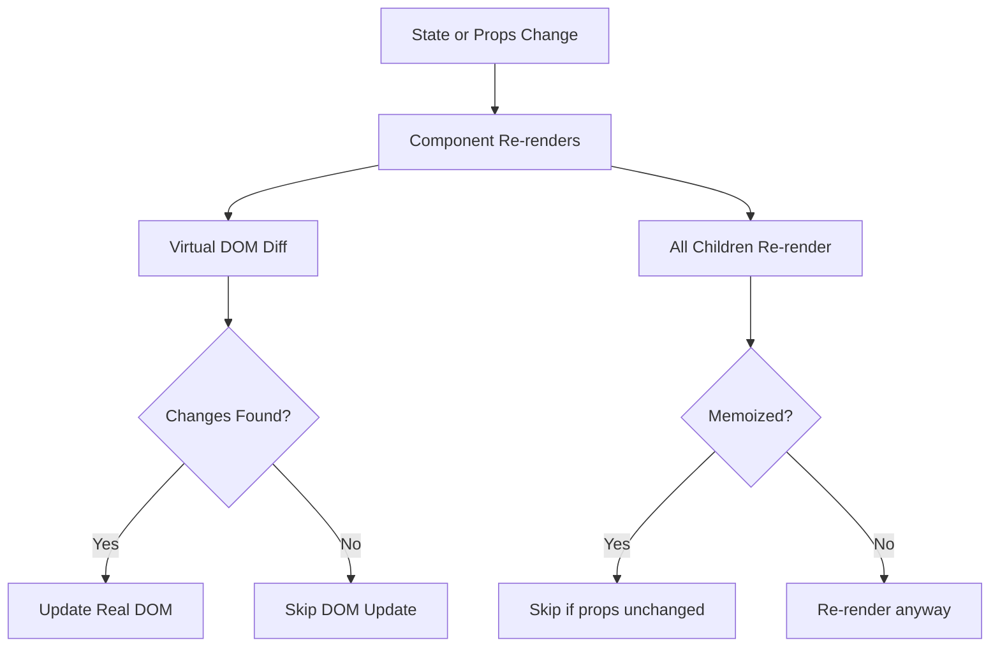
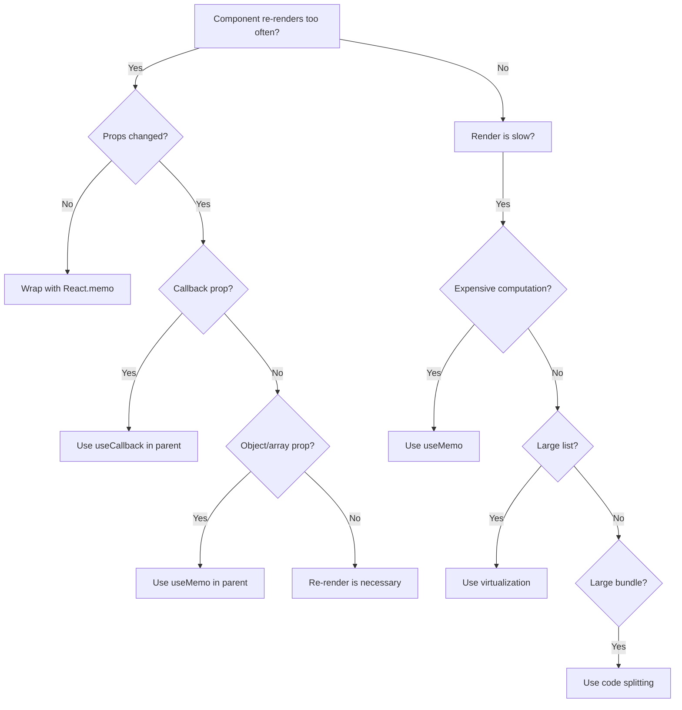

# How to Optimize React Application Performance

Author: [nawazdhandala](https://www.github.com/nawazdhandala)

Tags: React, Performance, Optimization, Rendering, Memoization

Description: Learn techniques for optimizing React application performance including memo, useMemo, useCallback, and code splitting.

---

Performance problems in React applications usually come down to unnecessary re-renders, expensive computations on every render, and large bundle sizes. In this guide, we will cover the most effective techniques for optimizing React performance - from component-level memoization to application-level code splitting.

## React Rendering Pipeline

Understanding when and why React re-renders is the foundation of performance optimization.



## Identifying Performance Issues

Before optimizing, measure. Use React DevTools Profiler to find the bottlenecks:

```tsx
// src/index.tsx
import React, { Profiler, ProfilerOnRenderCallback } from 'react';
import App from './App';

/**
 * Callback that logs render timing data.
 * Use this to identify which components are slow.
 */
const onRender: ProfilerOnRenderCallback = (
  id,           // the "id" prop of the Profiler tree
  phase,        // "mount" or "update"
  actualDuration, // time spent rendering the committed update
  baseDuration,   // estimated time to render the entire subtree without memoization
  startTime,      // when React began rendering this update
  commitTime      // when React committed this update
) => {
  if (actualDuration > 16) {
    // Longer than one frame at 60fps
    console.warn(
      `Slow render: ${id} (${phase}) took ${actualDuration.toFixed(2)}ms`
    );
  }
};

function Root() {
  return (
    <Profiler id="App" onRender={onRender}>
      <App />
    </Profiler>
  );
}

export default Root;
```

## React.memo for Component Memoization

`React.memo` prevents a component from re-rendering when its props have not changed:

```tsx
// src/components/ProductCard.tsx
import React from 'react';

interface ProductCardProps {
  id: number;
  name: string;
  price: number;
  imageUrl: string;
  onAddToCart: (id: number) => void;
}

/**
 * ProductCard wrapped in React.memo.
 * This component will only re-render when its props actually change.
 * Without memo, it would re-render every time the parent re-renders.
 */
const ProductCard: React.FC<ProductCardProps> = React.memo(
  ({ id, name, price, imageUrl, onAddToCart }) => {
    console.log(`ProductCard ${id} rendered`);

    return (
      <div className="product-card">
        
        <h3>{name}</h3>
        <p>${(price / 100).toFixed(2)}</p>
        <button onClick={() => onAddToCart(id)}>Add to Cart</button>
      </div>
    );
  }
);

// Display name helps with React DevTools debugging
ProductCard.displayName = 'ProductCard';

export default ProductCard;
```

## useMemo for Expensive Computations

Cache the result of expensive calculations so they only recompute when dependencies change:

```tsx
// src/components/ProductList.tsx
import React, { useState, useMemo } from 'react';

interface Product {
  id: number;
  name: string;
  price: number;
  category: string;
  rating: number;
}

interface ProductListProps {
  products: Product[];
}

const ProductList: React.FC<ProductListProps> = ({ products }) => {
  const [searchQuery, setSearchQuery] = useState('');
  const [sortBy, setSortBy] = useState<'price' | 'rating' | 'name'>('name');
  const [selectedCategory, setSelectedCategory] = useState<string>('all');

  /**
   * useMemo caches the filtered and sorted result.
   * It only recomputes when products, searchQuery,
   * selectedCategory, or sortBy change.
   * Without useMemo, this would run on every keystroke
   * and every unrelated state change.
   */
  const filteredAndSortedProducts = useMemo(() => {
    console.log('Filtering and sorting products...');

    let result = [...products];

    // Filter by category
    if (selectedCategory !== 'all') {
      result = result.filter((p) => p.category === selectedCategory);
    }

    // Filter by search query
    if (searchQuery.trim()) {
      const query = searchQuery.toLowerCase();
      result = result.filter((p) => p.name.toLowerCase().includes(query));
    }

    // Sort by the selected field
    result.sort((a, b) => {
      switch (sortBy) {
        case 'price':
          return a.price - b.price;
        case 'rating':
          return b.rating - a.rating;
        case 'name':
        default:
          return a.name.localeCompare(b.name);
      }
    });

    return result;
  }, [products, searchQuery, selectedCategory, sortBy]);

  /**
   * useMemo for computing unique categories from the product list.
   * Only recomputes when the products array changes.
   */
  const categories = useMemo(() => {
    const cats = new Set(products.map((p) => p.category));
    return ['all', ...Array.from(cats).sort()];
  }, [products]);

  return (
    <div>
      <input
        type="text"
        placeholder="Search products..."
        value={searchQuery}
        onChange={(e) => setSearchQuery(e.target.value)}
      />

      <select value={sortBy} onChange={(e) => setSortBy(e.target.value as typeof sortBy)}>
        <option value="name">Sort by Name</option>
        <option value="price">Sort by Price</option>
        <option value="rating">Sort by Rating</option>
      </select>

      <select value={selectedCategory} onChange={(e) => setSelectedCategory(e.target.value)}>
        {categories.map((cat) => (
          <option key={cat} value={cat}>{cat}</option>
        ))}
      </select>

      <p>{filteredAndSortedProducts.length} products found</p>

      <div className="product-grid">
        {filteredAndSortedProducts.map((product) => (
          <div key={product.id} className="product-item">
            <h3>{product.name}</h3>
            <p>${(product.price / 100).toFixed(2)}</p>
          </div>
        ))}
      </div>
    </div>
  );
};

export default ProductList;
```

## useCallback for Stable Function References

`useCallback` returns a memoized function that only changes when dependencies change. This is crucial when passing callbacks to memoized child components:

```tsx
// src/components/ShoppingCart.tsx
import React, { useState, useCallback } from 'react';
import ProductCard from './ProductCard';

interface CartItem {
  productId: number;
  quantity: number;
}

const ShoppingCart: React.FC<{ products: Product[] }> = ({ products }) => {
  const [cart, setCart] = useState<CartItem[]>([]);

  /**
   * useCallback ensures this function reference stays stable
   * across re-renders. Without it, ProductCard (which is memoized
   * with React.memo) would re-render every time because
   * it would receive a new function reference each time.
   */
  const handleAddToCart = useCallback((productId: number) => {
    setCart((prevCart) => {
      const existing = prevCart.find((item) => item.productId === productId);
      if (existing) {
        // Increment quantity if already in cart
        return prevCart.map((item) =>
          item.productId === productId
            ? { ...item, quantity: item.quantity + 1 }
            : item
        );
      }
      // Add new item to cart
      return [...prevCart, { productId, quantity: 1 }];
    });
  }, []); // Empty deps - function never changes

  /**
   * useCallback for remove handler.
   * Also stable because it only uses the setter function.
   */
  const handleRemoveFromCart = useCallback((productId: number) => {
    setCart((prevCart) => prevCart.filter((item) => item.productId !== productId));
  }, []);

  return (
    <div>
      <h2>Products</h2>
      <div className="product-grid">
        {products.map((product) => (
          <ProductCard
            key={product.id}
            id={product.id}
            name={product.name}
            price={product.price}
            imageUrl={product.imageUrl}
            onAddToCart={handleAddToCart}
          />
        ))}
      </div>

      <h2>Cart ({cart.length} items)</h2>
      <ul>
        {cart.map((item) => (
          <li key={item.productId}>
            Product #{item.productId} x {item.quantity}
            <button onClick={() => handleRemoveFromCart(item.productId)}>Remove</button>
          </li>
        ))}
      </ul>
    </div>
  );
};

export default ShoppingCart;
```

## Code Splitting with React.lazy

Split your bundle so users only download the code they need:

```tsx
// src/App.tsx
import React, { Suspense, lazy } from 'react';
import { BrowserRouter, Routes, Route } from 'react-router-dom';
import LoadingSpinner from './components/LoadingSpinner';

/**
 * React.lazy splits each route into a separate bundle chunk.
 * The component is only downloaded when the user navigates to that route.
 * This dramatically reduces the initial bundle size.
 */
const HomePage = lazy(() => import('./pages/HomePage'));
const ProductPage = lazy(() => import('./pages/ProductPage'));
const CheckoutPage = lazy(() => import('./pages/CheckoutPage'));
const AdminDashboard = lazy(() => import('./pages/AdminDashboard'));

function App() {
  return (
    <BrowserRouter>
      {/* Suspense shows a fallback while lazy components are loading */}
      <Suspense fallback={<LoadingSpinner />}>
        <Routes>
          <Route path="/" element={<HomePage />} />
          <Route path="/products/:id" element={<ProductPage />} />
          <Route path="/checkout" element={<CheckoutPage />} />
          <Route path="/admin/*" element={<AdminDashboard />} />
        </Routes>
      </Suspense>
    </BrowserRouter>
  );
}

export default App;
```

## Optimization Decision Flowchart



## Virtualizing Long Lists

For lists with hundreds or thousands of items, virtualize to render only visible rows:

```tsx
// src/components/VirtualizedList.tsx
import React, { useCallback } from 'react';
import { FixedSizeList as List } from 'react-window';

interface Item {
  id: number;
  name: string;
  value: number;
}

interface VirtualizedListProps {
  items: Item[];
}

/**
 * Virtualized list renders only the visible rows.
 * For 10,000 items, it might only render 20 DOM nodes at a time,
 * dramatically improving performance.
 */
const VirtualizedList: React.FC<VirtualizedListProps> = ({ items }) => {
  // Memoize the row renderer
  const Row = useCallback(
    ({ index, style }: { index: number; style: React.CSSProperties }) => {
      const item = items[index];
      return (
        <div style={{ ...style, display: 'flex', alignItems: 'center', padding: '0 1rem' }}>
          <span style={{ flex: 1 }}>{item.name}</span>
          <span>${(item.value / 100).toFixed(2)}</span>
        </div>
      );
    },
    [items]
  );

  return (
    <List
      height={600}          // Viewport height in pixels
      itemCount={items.length}
      itemSize={50}         // Height of each row in pixels
      width="100%"
    >
      {Row}
    </List>
  );
};

export default VirtualizedList;
```

## Debouncing User Input

Prevent unnecessary re-renders from rapid user input:

```tsx
// src/hooks/useDebouncedValue.ts
import { useState, useEffect } from 'react';

/**
 * Returns a debounced version of the value.
 * The debounced value only updates after the user
 * stops typing for the specified delay.
 */
function useDebouncedValue<T>(value: T, delay: number): T {
  const [debouncedValue, setDebouncedValue] = useState(value);

  useEffect(() => {
    // Set a timer to update the debounced value
    const timer = setTimeout(() => {
      setDebouncedValue(value);
    }, delay);

    // Clear the timer if the value changes before the delay
    return () => clearTimeout(timer);
  }, [value, delay]);

  return debouncedValue;
}

export default useDebouncedValue;
```

## Summary

Optimizing React performance follows a clear hierarchy:

- **Measure first** using React DevTools Profiler
- **React.memo** prevents unnecessary re-renders of child components
- **useMemo** caches expensive computations
- **useCallback** stabilizes function references for memoized children
- **Code splitting** reduces initial bundle size
- **Virtualization** handles long lists efficiently
- **Debouncing** limits updates from rapid user input

Monitoring your React application in production is just as important as optimizing it. [OneUptime](https://oneuptime.com) tracks real-user performance metrics, monitors your frontend for errors, and alerts you when performance degrades - so you can keep your React app fast for every user.
