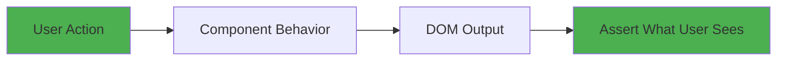
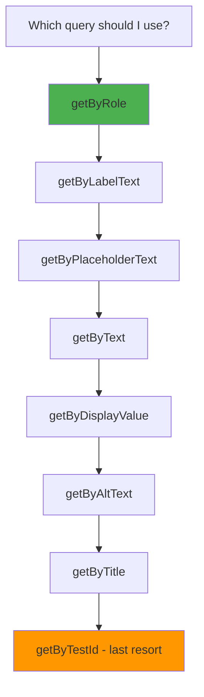
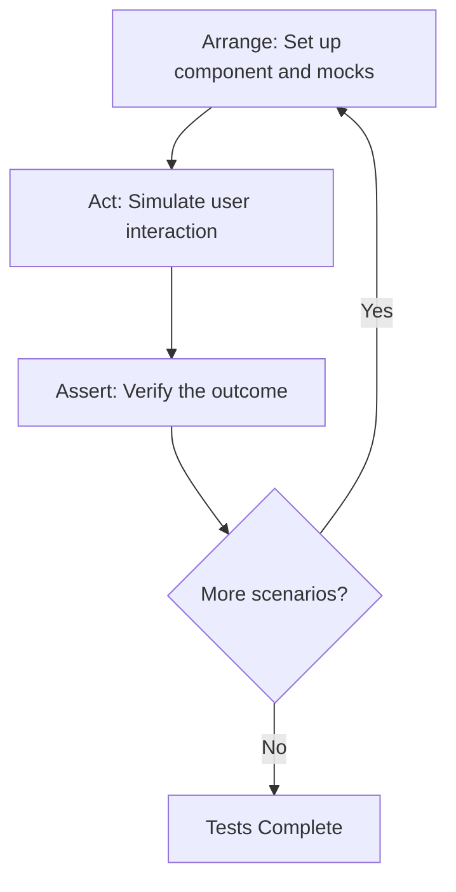

# How to Test React Components with React Testing Library

Author: [nawazdhandala](https://www.github.com/nawazdhandala)

Tags: React, Testing, React Testing Library, Jest, Frontend

Description: Learn how to write effective tests for React components using React Testing Library and Jest with best practices.

---

Testing React components should focus on how users interact with your application, not on implementation details. React Testing Library enforces this by design - it provides utilities to query the DOM the way a user would and encourages testing behavior over internals. In this guide, we will write effective tests using React Testing Library and Jest.

## Testing Philosophy



The guiding principle: **test what the user experiences, not how the component is built**.

## Setup

Install the required packages:

```bash
# Install React Testing Library and related tools
npm install --save-dev @testing-library/react @testing-library/jest-dom @testing-library/user-event jest @types/jest

# If using TypeScript, add ts-jest
npm install --save-dev ts-jest
```

Configure Jest in your project:

```javascript
// jest.config.js
module.exports = {
  testEnvironment: 'jsdom',
  setupFilesAfterSetup: ['<rootDir>/src/setupTests.ts'],
  moduleNameMapper: {
    // Handle CSS imports in tests
    '\\.(css|less|scss)$': 'identity-obj-proxy',
    // Handle image imports
    '\\.(jpg|jpeg|png|svg)$': '<rootDir>/src/__mocks__/fileMock.js',
  },
  transform: {
    '^.+\\.tsx?$': 'ts-jest',
  },
};
```

```typescript
// src/setupTests.ts
// Adds custom matchers like toBeInTheDocument(), toBeVisible(), etc.
import '@testing-library/jest-dom';
```

## Testing a Simple Component

Start with a basic component and its test:

```tsx
// src/components/Greeting.tsx
import React from 'react';

interface GreetingProps {
  name: string;
  role?: string;
}

const Greeting: React.FC<GreetingProps> = ({ name, role }) => {
  return (
    <div>
      <h1>Hello, {name}!</h1>
      {role && <p>Role: {role}</p>}
    </div>
  );
};

export default Greeting;
```

```tsx
// src/components/__tests__/Greeting.test.tsx
import React from 'react';
import { render, screen } from '@testing-library/react';
import Greeting from '../Greeting';

describe('Greeting', () => {
  it('renders the name in a heading', () => {
    // Render the component with test props
    render(<Greeting name="Alice" />);

    // Query the DOM the way a user would - by visible text
    const heading = screen.getByRole('heading', { name: /hello, alice/i });
    expect(heading).toBeInTheDocument();
  });

  it('renders the role when provided', () => {
    render(<Greeting name="Alice" role="Admin" />);

    // Check that the role text is visible
    expect(screen.getByText(/role: admin/i)).toBeInTheDocument();
  });

  it('does not render role when not provided', () => {
    render(<Greeting name="Alice" />);

    // queryBy returns null instead of throwing when the element is not found
    expect(screen.queryByText(/role:/i)).not.toBeInTheDocument();
  });
});
```

## Query Priority

React Testing Library provides several query methods. Use them in this priority order:



## Testing User Interactions

Use `userEvent` to simulate realistic user interactions:

```tsx
// src/components/LoginForm.tsx
import React, { useState } from 'react';

interface LoginFormProps {
  onSubmit: (email: string, password: string) => Promise<void>;
}

const LoginForm: React.FC<LoginFormProps> = ({ onSubmit }) => {
  const [email, setEmail] = useState('');
  const [password, setPassword] = useState('');
  const [error, setError] = useState('');
  const [loading, setLoading] = useState(false);

  const handleSubmit = async (e: React.FormEvent) => {
    e.preventDefault();
    setError('');

    // Client-side validation
    if (!email.includes('@')) {
      setError('Please enter a valid email address');
      return;
    }
    if (password.length < 8) {
      setError('Password must be at least 8 characters');
      return;
    }

    setLoading(true);
    try {
      await onSubmit(email, password);
    } catch (err) {
      setError('Login failed. Please try again.');
    } finally {
      setLoading(false);
    }
  };

  return (
    <form onSubmit={handleSubmit}>
      <div>
        <label htmlFor="email">Email</label>
        <input
          id="email"
          type="email"
          value={email}
          onChange={(e) => setEmail(e.target.value)}
          placeholder="you@example.com"
        />
      </div>

      <div>
        <label htmlFor="password">Password</label>
        <input
          id="password"
          type="password"
          value={password}
          onChange={(e) => setPassword(e.target.value)}
          placeholder="Enter your password"
        />
      </div>

      {error && <div role="alert">{error}</div>}

      <button type="submit" disabled={loading}>
        {loading ? 'Logging in...' : 'Log In'}
      </button>
    </form>
  );
};

export default LoginForm;
```

```tsx
// src/components/__tests__/LoginForm.test.tsx
import React from 'react';
import { render, screen, waitFor } from '@testing-library/react';
import userEvent from '@testing-library/user-event';
import LoginForm from '../LoginForm';

describe('LoginForm', () => {
  // Create a mock function for the onSubmit prop
  const mockOnSubmit = jest.fn();

  beforeEach(() => {
    // Reset mock between tests
    mockOnSubmit.mockReset();
    mockOnSubmit.mockResolvedValue(undefined);
  });

  it('renders the form fields and submit button', () => {
    render(<LoginForm onSubmit={mockOnSubmit} />);

    // Query by label text - the accessible way
    expect(screen.getByLabelText(/email/i)).toBeInTheDocument();
    expect(screen.getByLabelText(/password/i)).toBeInTheDocument();
    expect(screen.getByRole('button', { name: /log in/i })).toBeInTheDocument();
  });

  it('shows validation error for invalid email', async () => {
    const user = userEvent.setup();
    render(<LoginForm onSubmit={mockOnSubmit} />);

    // Type an invalid email
    await user.type(screen.getByLabelText(/email/i), 'notanemail');
    await user.type(screen.getByLabelText(/password/i), 'password123');
    await user.click(screen.getByRole('button', { name: /log in/i }));

    // Check that the error message appears
    expect(screen.getByRole('alert')).toHaveTextContent(/valid email/i);
    // onSubmit should NOT have been called
    expect(mockOnSubmit).not.toHaveBeenCalled();
  });

  it('shows validation error for short password', async () => {
    const user = userEvent.setup();
    render(<LoginForm onSubmit={mockOnSubmit} />);

    await user.type(screen.getByLabelText(/email/i), 'test@example.com');
    await user.type(screen.getByLabelText(/password/i), 'short');
    await user.click(screen.getByRole('button', { name: /log in/i }));

    expect(screen.getByRole('alert')).toHaveTextContent(/at least 8 characters/i);
    expect(mockOnSubmit).not.toHaveBeenCalled();
  });

  it('submits the form with valid data', async () => {
    const user = userEvent.setup();
    render(<LoginForm onSubmit={mockOnSubmit} />);

    await user.type(screen.getByLabelText(/email/i), 'test@example.com');
    await user.type(screen.getByLabelText(/password/i), 'password123');
    await user.click(screen.getByRole('button', { name: /log in/i }));

    // Verify onSubmit was called with the correct arguments
    expect(mockOnSubmit).toHaveBeenCalledWith('test@example.com', 'password123');
    expect(mockOnSubmit).toHaveBeenCalledTimes(1);
  });

  it('shows loading state during submission', async () => {
    // Make onSubmit take time to resolve
    mockOnSubmit.mockImplementation(
      () => new Promise((resolve) => setTimeout(resolve, 100))
    );

    const user = userEvent.setup();
    render(<LoginForm onSubmit={mockOnSubmit} />);

    await user.type(screen.getByLabelText(/email/i), 'test@example.com');
    await user.type(screen.getByLabelText(/password/i), 'password123');
    await user.click(screen.getByRole('button', { name: /log in/i }));

    // Button should show loading text
    expect(screen.getByRole('button', { name: /logging in/i })).toBeDisabled();

    // Wait for submission to complete
    await waitFor(() => {
      expect(screen.getByRole('button', { name: /log in/i })).toBeEnabled();
    });
  });

  it('shows error message when submission fails', async () => {
    // Make onSubmit reject
    mockOnSubmit.mockRejectedValue(new Error('Network error'));

    const user = userEvent.setup();
    render(<LoginForm onSubmit={mockOnSubmit} />);

    await user.type(screen.getByLabelText(/email/i), 'test@example.com');
    await user.type(screen.getByLabelText(/password/i), 'password123');
    await user.click(screen.getByRole('button', { name: /log in/i }));

    // Wait for the error message to appear
    await waitFor(() => {
      expect(screen.getByRole('alert')).toHaveTextContent(/login failed/i);
    });
  });
});
```

## Testing Async Data Loading

```tsx
// src/components/__tests__/UserProfile.test.tsx
import React from 'react';
import { render, screen, waitForElementToBeRemoved } from '@testing-library/react';
import UserProfile from '../UserProfile';

// Mock the fetch API
global.fetch = jest.fn();

describe('UserProfile', () => {
  afterEach(() => {
    jest.restoreAllMocks();
  });

  it('shows loading state, then displays user data', async () => {
    // Mock a successful API response
    (global.fetch as jest.Mock).mockResolvedValueOnce({
      ok: true,
      json: async () => ({
        id: 1,
        name: 'Alice Johnson',
        email: 'alice@example.com',
      }),
    });

    render(<UserProfile userId={1} />);

    // Initially shows loading state
    expect(screen.getByText(/loading/i)).toBeInTheDocument();

    // Wait for loading to disappear
    await waitForElementToBeRemoved(() => screen.queryByText(/loading/i));

    // User data should now be visible
    expect(screen.getByText('Alice Johnson')).toBeInTheDocument();
    expect(screen.getByText('alice@example.com')).toBeInTheDocument();
  });

  it('shows error message when fetch fails', async () => {
    (global.fetch as jest.Mock).mockRejectedValueOnce(new Error('Network error'));

    render(<UserProfile userId={1} />);

    // Wait for the error message
    await waitForElementToBeRemoved(() => screen.queryByText(/loading/i));

    expect(screen.getByRole('alert')).toHaveTextContent(/failed to load/i);
  });
});
```

## Testing with Context Providers

Wrap components with necessary providers using a custom render function:

```tsx
// src/test-utils/render.tsx
import React, { ReactElement } from 'react';
import { render, RenderOptions } from '@testing-library/react';
import { ThemeProvider } from '../contexts/ThemeContext';
import { AuthProvider } from '../contexts/AuthContext';
import { BrowserRouter } from 'react-router-dom';

/**
 * Custom render function that wraps components with all
 * required providers. Use this instead of the default render
 * so every test has the proper context.
 */
function renderWithProviders(
  ui: ReactElement,
  options?: Omit<RenderOptions, 'wrapper'>
) {
  function AllProviders({ children }: { children: React.ReactNode }) {
    return (
      <BrowserRouter>
        <AuthProvider>
          <ThemeProvider>
            {children}
          </ThemeProvider>
        </AuthProvider>
      </BrowserRouter>
    );
  }

  return render(ui, { wrapper: AllProviders, ...options });
}

// Re-export everything from testing-library
export * from '@testing-library/react';

// Override the render function with our custom one
export { renderWithProviders as render };
```

## Test Structure Flow



## Testing Accessibility

Verify your components are accessible:

```tsx
// src/components/__tests__/Modal.test.tsx
import React from 'react';
import { render, screen } from '@testing-library/react';
import userEvent from '@testing-library/user-event';
import Modal from '../Modal';

describe('Modal accessibility', () => {
  it('has the correct ARIA attributes', () => {
    render(
      <Modal isOpen={true} title="Confirm Action" onClose={jest.fn()}>
        <p>Are you sure?</p>
      </Modal>
    );

    // The modal should have the dialog role
    const dialog = screen.getByRole('dialog');
    expect(dialog).toBeInTheDocument();

    // It should have an accessible name via aria-labelledby
    expect(dialog).toHaveAttribute('aria-labelledby');

    // The title should be present
    expect(screen.getByText('Confirm Action')).toBeInTheDocument();
  });

  it('traps focus inside the modal', async () => {
    const user = userEvent.setup();
    render(
      <Modal isOpen={true} title="Test" onClose={jest.fn()}>
        <input placeholder="First input" />
        <button>Action</button>
      </Modal>
    );

    // The first focusable element should receive focus
    const firstInput = screen.getByPlaceholderText('First input');
    expect(firstInput).toHaveFocus();

    // Tab through the focusable elements
    await user.tab();
    expect(screen.getByRole('button', { name: /action/i })).toHaveFocus();

    // Tab should cycle back to the first element
    await user.tab();
    expect(screen.getByRole('button', { name: /close/i })).toHaveFocus();
  });

  it('closes when Escape is pressed', async () => {
    const handleClose = jest.fn();
    const user = userEvent.setup();

    render(
      <Modal isOpen={true} title="Test" onClose={handleClose}>
        <p>Content</p>
      </Modal>
    );

    // Press Escape to close the modal
    await user.keyboard('{Escape}');
    expect(handleClose).toHaveBeenCalledTimes(1);
  });
});
```

## Summary

React Testing Library encourages writing tests that are:

- **User-centric** - query by role, label, and text
- **Behavior-focused** - test what happens, not how it is implemented
- **Resilient** - tests do not break when you refactor internals
- **Accessible** - good tests naturally verify accessibility

Key practices:
- Prefer `getByRole` over `getByTestId`
- Use `userEvent` for realistic interaction simulation
- Use `waitFor` and `findBy` for async operations
- Create custom render functions for context providers
- Test error states and loading states

To monitor the quality and reliability of your deployed React application, [OneUptime](https://oneuptime.com) provides real-time error tracking, uptime monitoring for your APIs, and performance dashboards - ensuring the features you tested continue to work in production.
